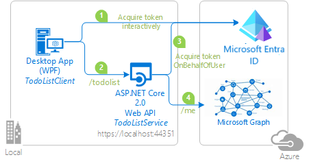
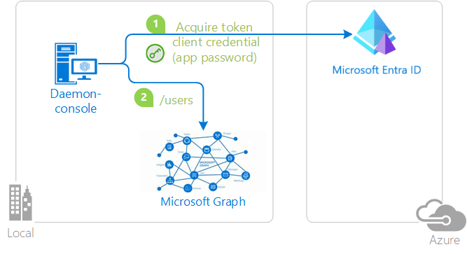
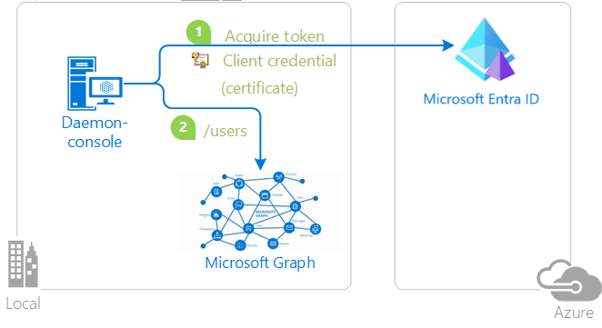

# Authentication flows

This article describes the different authentication flows provided by Microsoft Authentication Library (MSAL).  These flows can be used in a variety of different application scenarios.

| Flow | Description | Used in|  
| ---- | ----------- | ------- | 
| [Interactive](#interactive) | Gets the token through an interactive process that prompts the user for credentials through a browser or pop-up window. | [Desktop apps](scenario-desktop-overview.md), [Mobile apps](scenario-mobile-overview.md) |
| [Implicit grant](#implicit-grant) | Allows the app to get tokens without performing a back-end server credential exchange. This allows the app to sign in the user, maintain session, and get tokens to other web APIs, all within the client JavaScript code.| [Single-page applications (SPA)](scenario-spa-overview.md) |
| [Authorization code](#authorization-code) | Used in apps that are installed on a device to gain access to protected resources, such as web APIs. This allows you to add sign in and API access to your mobile and desktop apps. | [Desktop apps](scenario-desktop-overview.md), [Mobile apps](scenario-mobile-overview.md), [Web Apps](scenario-web-app-call-api-overview.md) | 
| [On-behalf-of](#on-behalf-of) | An application invokes a service or web API, which in turn needs to call another service or web API. The idea is to propagate the delegated user identity and permissions through the request chain. | [Web APIs](scenario-web-api-call-api-overview.md) |
| [Client credentials](#client-credentials) | Allows you to access web-hosted resources by using the identity of an application. Commonly used for server-to-server interactions that must run in the background, without immediate interaction with a user. | [daemon apps](scenario-daemon-overview.md) |
| [Device code](#device-code) | Allows users to sign in to input-constrained devices such as a smart TV, IoT device, or printer. | [Desktop/Mobile apps](scenario-desktop-acquire-token.md#command-line-tool-without-web-browser) |
| [Integrated Windows Authentication](scenario-desktop-acquire-token.md#integrated-windows-authentication) | Allows applications on domain or Azure Active Directory (Azure AD) joined computers to acquire a token silently (without any UI interaction from the user).| [Desktop/Mobile apps](scenario-desktop-acquire-token.md#integrated-windows-authentication) |
| [Username/password](scenario-desktop-acquire-token.md#username--password) | Allows an application to sign in the user by directly handling their password. This flow isn't recommended. | [Desktop/mobile apps](scenario-desktop-acquire-token.md#username--password) | 

## Interactive
MSAL supports the ability to interactively prompt the user for their credentials to sign in, and obtain a token using those credentials.

For more information on using MSAL.NET to interactively acquire tokens on specific platforms, see:
- [Xamarin Android](msal-net-xamarin-android-considerations.md)
- [Xamarin iOS](msal-net-xamarin-ios-considerations.md)
- [Universal Windows Platform](msal-net-uwp-considerations.md)

For more information on interactive calls in MSAL.js, see [Prompt behavior in MSAL.js interactive requests](msal-js-prompt-behavior.md).

## Implicit grant

MSAL supports the [OAuth 2 implicit grant flow](v2-oauth2-implicit-grant-flow.md), which allows the app to get tokens from Microsoft identity platform without performing a back-end server credential exchange. This allows the app to sign in the user, maintain session, and get tokens to other web APIs, all within the client JavaScript code.

Many modern web applications are built as client-side, single page applications, written by using JavaScript or an SPA framework such as Angular, Vue.js, and React.js. These applications run in a web browser, and have different authentication characteristics than traditional server-side web applications. The Microsoft identity platform enables single page applications to sign in users, and get tokens to access back-end services or web APIs, by using the implicit grant flow. The implicit flow allows the application to get ID tokens to represent the authenticated user, and also access tokens needed to call protected APIs.

This authentication flow doesn't include application scenarios that use cross-platform JavaScript frameworks such as Electron and React-Native, because they require further capabilities for interaction with the native platforms.

## Authorization code
MSAL supports the [OAuth 2 authorization code grant](v2-oauth2-auth-code-flow.md). This grant can be used in apps that are installed on a device to gain access to protected resources, such as web APIs. This allows you to add sign-in and API access to your mobile and desktop apps. 

When users sign in to web applications (web sites), the web application receives an authorization code.  The authorization code is redeemed to acquire a token to call web APIs. In ASP.NET and ASP.NET core web apps, the only goal of `AcquireTokenByAuthorizationCode` is to add a token to the token cache. The token can then be used by the application (usually in the controllers, which just get a token for an API by using `AcquireTokenSilent`).

In the preceding diagram:

1. Requests an authorization code, which is redeemed for an access token.
2. Uses the access token to call a web API.

### Considerations
- You can use the authorization code only once to redeem a token. Don't try to acquire a token multiple times with the same authorization code (it's explicitly prohibited by the protocol standard specification). If you redeem the code several times intentionally, or because you are not aware that a framework also does it for you, you'll get the following error: `AADSTS70002: Error validating credentials. AADSTS54005: OAuth2 Authorization code was already redeemed, please retry with a new valid code or use an existing refresh token.`

- If you're writing an ASP.NET or ASP.NET Core application, this might happen if you don't tell the framework that you've already redeemed the authorization code. For this, you need to call the `context.HandleCodeRedemption()` method of the `AuthorizationCodeReceived` event handler.

- Avoid sharing the access token with ASP.NET, which might prevent incremental consent happening correctly. For more information, see [issue #693](https://github.com/AzureAD/microsoft-authentication-library-for-dotnet/issues/693).

## On-behalf-of

MSAL supports the [OAuth 2 on-behalf-of authentication flow](v2-oauth2-on-behalf-of-flow.md).  This flow is used when an application invokes a service or web API, which in turn needs to call another service or web API. The idea is to propagate the delegated user identity and permissions through the request chain. For the middle-tier service to make authenticated requests to the downstream service, it needs to secure an access token from the Microsoft identity platform, on behalf of the user.

In the preceding diagram:

1. Acquires an access token for the Web API.
2. A client (web, desktop, mobile, or single-page application) calls a protected Web API, adding the access token as a bearer token in the authentication header of the HTTP request. The Web API authenticates the user.
3. When the client calls the Web API, the Web API requests another token on-behalf-of the user.  
4. The protected Web API uses this token to call a downstream Web API on-behalf-of the user.  The Web API can also later request tokens for other downstream APIs (but still on behalf of the same user).

## Client credentials

MSAL supports the [OAuth 2 client credentials flow](v2-oauth2-client-creds-grant-flow.md). This flow allows you to access web-hosted resources by using the identity of an application. This type of grant is commonly used for server-to-server interactions that must run in the background, without immediate interaction with a user. These types of applications are often referred to as daemons or service accounts. 

The client credentials grant flow permits a web service (a confidential client) to use its own credentials, instead of impersonating a user, to authenticate when calling another web service. In this scenario, the client is typically a middle-tier web service, a daemon service, or a website. For a higher level of assurance, the Microsoft identity platform also allows the calling service to use a certificate (instead of a shared secret) as a credential.

> [!NOTE]
> The confidential client flow isn't available on the mobile platforms (UWP, Xamarin.iOS, and Xamarin.Android), because these only support public client applications. Public client applications don't know how to prove the application's identity to the Identity Provider. A secure connection can be achieved on web app or web API back ends by deploying a certificate.

MSAL.NET supports two types of client credentials. These client credentials need to be registered with Azure AD. The credentials are passed in to the constructors of the confidential client application in your code.

### Application secrets 

1. Acquires a token using application secret/password credentials.
2. Uses the token to make requests of the resource.

### Certificates 

1. Acquires a token using certificate credentials.
2. Uses the token to make requests of the resource.

These client credentials need to be:
- Registered with Azure AD.
- Passed in at the construction of the confidential client application in your code.

## Device code
MSAL supports the [OAuth 2 device code flow](v2-oauth2-device-code.md), which allows users to sign in to input-constrained devices such as a smart TV, IoT device, or printer. Interactive authentication with Azure AD requires a web browser. The device code flow lets the user use another device (for instance another computer or a mobile phone) to sign in interactively where the device or operating system doesn't provide a Web browser.

By using the device code flow, the application obtains tokens through a two-step process especially designed for these devices/OS. Examples of such applications are applications running on iOT devices or Command-Line tools (CLI). 

1. Whenever user authentication is required, the app provides a code and asks the user to use another device (such as an internet-connected smartphone) to navigate to a URL (for example, https://microsoft.com/devicelogin), where the user will be prompted to enter the code. That done, the web page will lead the user through a normal authentication experience, including consent prompts and multi-factor authentication if necessary.

2. Upon successful authentication, the command-line app will receive the required tokens through a back channel and will use it to perform the web API calls it needs.

### Constraints

- Device code flow is only available on public client applications.
- The authority passed in when constructing the public client application must be:
  - tenanted (of the form `https://login.microsoftonline.com/{tenant}/` where `{tenant}` is either the GUID representing the tenant ID or a domain associated with the tenant.
  - or, any work and school accounts (`https://login.microsoftonline.com/organizations/`).
- Microsoft personal accounts are not yet supported by the Azure AD v2.0 endpoint (you cannot use the `/common` or `/consumers` tenants).

## Integrated Windows Authentication
MSAL supports Integrated Windows Authentication (IWA) for desktop or mobile applications that run on a domain joined or Azure AD joined Windows computer. Using IWA, these applications can acquire a token silently (without any UI interaction from the user). 

1. Acquires a token using Integrated Windows Authentication.
2. Uses the token to make requests of the resource.

### Constraints

IWA supports **Federated** users only.  Users created in an Active Directory and backed by Azure Active Directory. Users created directly in Azure AD, without AD backing (**managed** users) cannot use this authentication flow. This limitation does not affect the [username/password flow](#usernamepassword).

IWA is for apps written for .NET Framework, .NET Core, and Universal Windows Platform platforms.

IWA does NOT bypass MFA (multi factor authentication). If MFA is configured, IWA might fail if an MFA challenge is required because MFA requires user interaction. This one is tricky. IWA is non-interactive, but two-factor authorization (2FA) requires user interactivity. You do not control when the identity provider requests 2FA to be performed, the tenant admin does. From our observations, 2FA is required when you login from a different country, when not connected via VPN to a corporate network, and sometimes even when connected via VPN. Don’t expect a deterministic set of rules, Azure Active Directory uses AI to continuously learn if 2FA is required. You should fallback to a user prompt (https://aka.ms/msal-net-interactive) if IWA fails.

The authority passed in when constructing the public client application must be:
- tenanted (of the form `https://login.microsoftonline.com/{tenant}/` where `tenant` is either the guid representing the tenant ID or a domain associated with the tenant.
- for any work and school accounts (`https://login.microsoftonline.com/organizations/`). Microsoft personal accounts are not supported (you cannot use `/common` or `/consumers` tenants).

Because IWA is a silent flow:
- the user of your application must have previously consented to use the application. 
- or, the tenant admin must have previously consented to all users in the tenant to use the application.
- This means that:
    - either you as a developer have pressed the **Grant** button on the Azure portal for yourself, 
    - or, a tenant admin has pressed the **Grant/revoke admin consent for {tenant domain}** button in the **API permissions** tab of the registration for the application (see [Add permissions to access web APIs](quickstart-configure-app-access-web-apis.md#add-permissions-to-access-web-apis))
    - or, you have provided a way for users to consent to the application (see [Requesting individual user consent](v2-permissions-and-consent.md#requesting-individual-user-consent))
    - or, you have provided a way for the tenant admin to consent for the application (see [admin consent](v2-permissions-and-consent.md#requesting-consent-for-an-entire-tenant))

The IWA flow is enabled for .NET desktop, .NET Core, and Windows Universal Platform apps. On .NET Core only the overload taking the username is available as the .NET Core platform cannot ask the username to the OS.
  
For more information on consent, see [v2.0 permissions and consent](v2-permissions-and-consent.md).

## Username/password 
MSAL supports the [OAuth 2 resource owner password credentials grant](v2-oauth-ropc.md), which allows an application to sign in the user by directly handling their password. In your desktop application, you can use the username/password flow to acquire a token silently. No UI is required when using the application.

1. Acquires a token by sending the username and password to the identity provider.
2. Calls a web API using the token.

> [!WARNING]
> This flow is **not recommended** because it requires a high degree of trust and user exposure.  You should only use this flow when other, more secure, flows can't be used. For more information about this problem, see [this article](https://news.microsoft.com/features/whats-solution-growing-problem-passwords-says-microsoft/). 

The preferred flow for acquiring a token silently on Windows domain joined machines is [Integrated Windows Authentication](#integrated-windows-authentication). Otherwise, you can also use [Device code flow](#device-code)

Although this is useful in some cases (DevOps scenarios), if you want to use Username/password in interactive scenarios where you provide your own UI, you should really think about how to move away from it. By using username/password, you are giving-up a number of things:
- core tenants of modern identity: password gets fished, replayed. Because we have this concept of a share secret that can be intercepted.
This is incompatible with passwordless.
- users who need to do MFA won't be able to sign in (as there is no interaction)
- Users won't be able to do single sign-on

### Constraints

Apart from the [Integrated Windows Authentication constraints](#integrated-windows-authentication), the following constraints also apply:

- The username/password flow is not compatible with conditional access and multi-factor authentication: As a consequence, if your app runs in an Azure AD tenant where the tenant admin requires multi-factor authentication, you cannot use this flow. Many organizations do that.
- It works only for Work and school accounts (not MSA)
- The flow is available on .NET desktop and .NET core, but not on Universal Windows Platform.

### Azure AD B2C specifics

For more information on using MSAL.NET and Azure AD B2C, read [Using ROPC with Azure AD B2C (MSAL.NET)](msal-net-aad-b2c-considerations.md#resource-owner-password-credentials-ropc-with-azure-ad-b2c).
