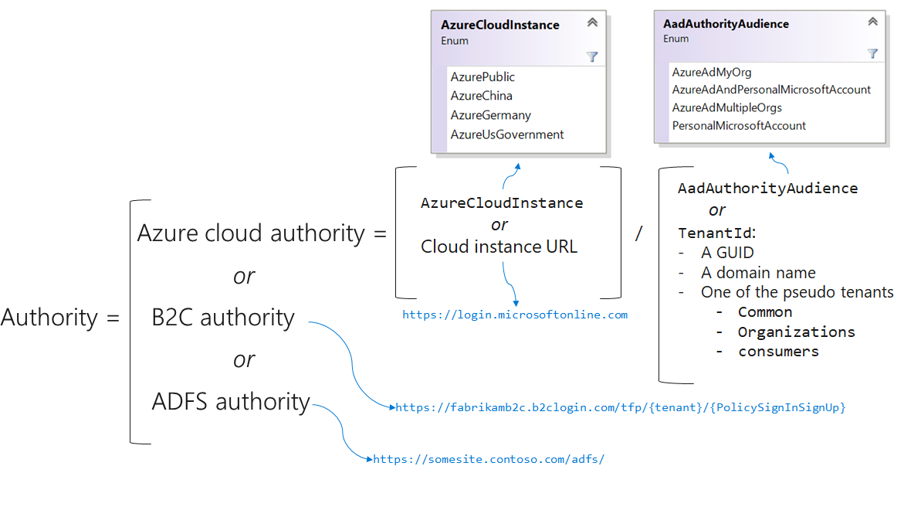
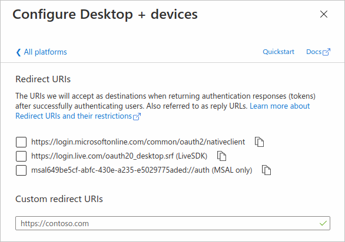

# Application configuration options

In your code, you initialize a new public or confidential client (or user-agent for MSAL.js) application to authenticate and acquire tokens.  There are a number of different configuration options that can be set when initializing the client application in MSAL. These options can be separated into two groups:

- Registration options, including:
    - [Authority](#authority) ( composed of the identity provider [instance](#cloud-instance) and sign-in [audience](#application-audience) for the application, and possibly the tenant ID).
    - [client ID](#client-id)
    - [redirect URI](#redirect-uri)
    - [client secret](#client-secret) (for confidential client applications).
- [Logging options](#logging), including log level, control of personal data, and the name of the component using the library.

### Authority
The authority is a URL indicating a directory that MSAL can request tokens from. Usual authorities are:

- https://login.microsoftonline.com/&lt;tenant&gt;/, where &lt;tenant&gt; is the tenant ID of the Azure AD tenant or a domain associated with this Azure AD tenant.  Used only to sign in users of a specific organization.
- https://login.microsoftonline.com/common/. Used to sign in users with work and school accounts or a Microsoft personal account.
- https://login.microsoftonline.com/organizations/. Used to sign in users with work and school accounts.
- https://login.microsoftonline.com/consumers/. Used to sign in users with only personal Microsoft account (live).

The authority setting must be consistent with what is declared in the application registration portal.

The authority URL is composed of the instance and the audience.

The authority can be:
- an Azure Active directory Cloud authority
- an Azure AD B2C authority. See [B2C specifics](https://github.com/AzureAD/microsoft-authentication-library-for-dotnet/wiki/AAD-B2C-specifics).
- an ADFS authority. See [ADFS support](https://aka.ms/msal-net-adfs-support).

Azure AD cloud authorities have two parts:
- the identity provider **instance**
- the sign-in **audience** for the application

The instance and audience can be concatenated and provided as the authority URL. In versions of MSAL.NET prior to MSAL 3.x, you had to compose the authority yourself depending on the cloud you wanted to target, and the sign-in audience.  The following diagram shows how the authority URL is composed.

### Cloud instance
The **instance** is used to specify if your application is signing users from the Microsoft Azure public cloud, or from national clouds. Using MSAL in your code, the Azure cloud instance can be set by using an enumeration or by passing the URL to the [national cloud instance](authentication-national-cloud.md#azure-ad-authentication-endpoints) as the `Instance` member (if you know it).

MSAL.NET will throw an explicit exception if both `Instance` and `AzureCloudInstance` are specified. 

If you don't specify an instance, your app will target the Azure public cloud instance (the instance of URL `https://login.onmicrosoftonline.com`).

### Application audience

The sign-in audience depends on the business needs for your application:
- If you are a line of business (LOB) developer, you'll probably produce a single tenant application, which will be used only in your organization. In that case, you need to specify what this organization is, either by its tenant ID (ID of your Azure Active Directory), or a domain name associated with this Azure Active Directory.
- If you are an ISV, you might want to sign in users with their work and school accounts in any organization, or some organizations (multi-tenant app), but you might also want to have users sign in with their Microsoft personal account.

#### How to specify the audience in your code/configuration
Using MSAL in your code, you specify the audience by using:
- either the Azure AD authority audience enumeration. 
- or the tenant ID, which can be:
  - a GUID, (the ID of your Azure Active Directory), for single tenant applications
  - a domain name associated with your Azure Active Directory (also for single tenant applications)
- or one of these placeholders as a tenant ID in place of the Azure AD authority audience enumeration:
    - `organizations` for a multi tenant application
    - `consumers` to sign in users only with their personal accounts
    - `common` to sign in users with their work and school account or Microsoft personal account

MSAL will throw a meaningful exception if you specify both Azure AD authority audience and the tenant ID. 

If you don't specify an audience your app will target Azure AD and personal Microsoft accounts as an audience (that is `common`).

#### Effective audience
The effective audience for your application will be the minimum (if there is an intersection) of the audience you set in your application and the audience specified in the application registration. Indeed, the application registration experience ([App Registration](https://portal.azure.com/#blade/Microsoft_AAD_IAM/ActiveDirectoryMenuBlade/RegisteredAppsPreview)) lets you specify the audience (supported account types) for the application. See [Quickstart: Register an application with the Microsoft identity platform](quickstart-register-app.md) for more information.

Currently, the only way to get an application to sign in users with only Microsoft personal accounts is to set:
- set the app registration audience to "Work and school accounts and personal accounts" and,
- and, set the audience in your code / configuration to `AadAuthorityAudience.PersonalMicrosoftAccount` (or `TenantID `="consumers")

### Client ID
The unique application (client) ID assigned to your app by Azure AD when the app was registered.

### Redirect URI
The redirect URI is the URI where the identity provider will send the security tokens back. 

#### Redirect URI for public client applications
For public client application developers using MSAL:
- You don't need to pass the ``RedirectUri`` as it's automatically computed by MSAL. This redirect URI is set to the following values depending on the platform:

- ``urn:ietf:wg:oauth:2.0:oob`` for all the Windows platforms
- ``msal{ClientId}://auth`` for Xamarin Android and iOS

However, the redirect URI needs to be configured in the [App Registration](https://portal.azure.com/#blade/Microsoft_AAD_IAM/ActiveDirectoryMenuBlade/RegisteredAppsPreview)

It is possible to override the redirect URI using the `RedirectUri` property, for instance if you use brokers. Here are some examples of redirect URIs in that case:

- `RedirectUriOnAndroid` = "msauth-5a434691-ccb2-4fd1-b97b-b64bcfbc03fc://com.microsoft.identity.client.sample";
- `RedirectUriOnIos` = $"msauth.{Bundle.ID}://auth";

For details see Android specifics and [iOS specifics](https://github.com/AzureAD/microsoft-authentication-library-for-dotnet/wiki/Leveraging-the-broker-on-iOS)

#### Redirect URI for confidential client applications
For web apps, the redirect URI (or reply URI), is the URI at which Azure AD will contact back the application with the token. This can be the URL of the Web application / Web API if the confidential is one of these.  This redirect URI needs to be registered in the app registration. This is especially important when you deploy an application that you have initially tested locally. You then need to add the reply URL of the deployed application in the application registration portal.

For daemon apps, you don't need to specify a redirect URI.

### Client secret
The client secret for the confidential client application. This secret (application password) is provided by the application registration portal, or provided to Azure AD during the application registration with PowerShell AzureAD, PowerShell AzureRM, or Azure CLI.

### Logging
The other options enable logging and troubleshooting. For more information, see the [Logging](msal-logging.md) page for more details on how to use them.

## Next steps
Learn about [instantiating client applications using MSAL.NET](msal-net-initializing-client-applications.md).

Learn about [instantiating client applications using MSAL.js](msal-js-initializing-client-applications.md).
