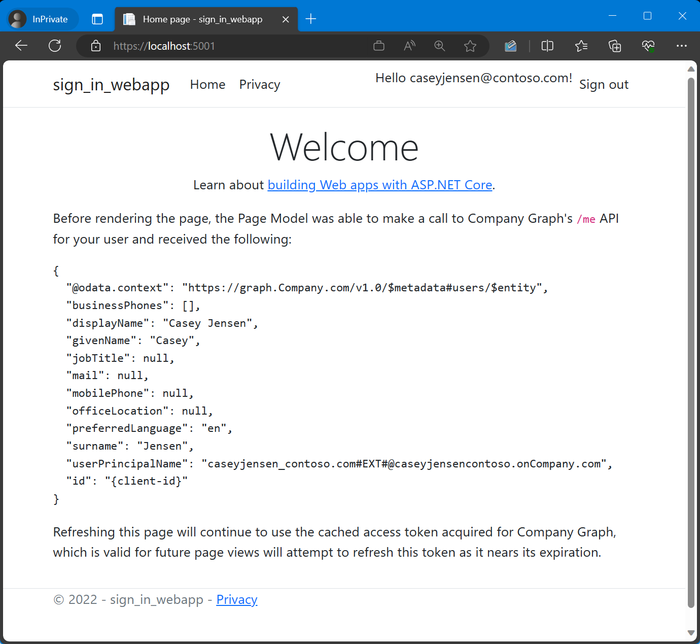

# Quickstart: Sign in users and call the Microsoft Graph API from an ASP.NET Core web app


This quickstart uses a sample ASP.NET Core web app to show you how to sign in users by using the [authorization code flow](./v2-oauth2-auth-code-flow.md) and call the Microsoft Graph API. The sample uses [Microsoft Authentication Library for .NET](/entra/msal/dotnet/) and [Microsoft Identity Web](/entra/msal/dotnet/microsoft-identity-web/) for ASP.NET to handle authentication.

In this article you register a web application in the Microsoft Entra admin center, and download a sample ASP.NET web application. You'll run the sample application, sign in with your personal Microsoft account or a work or school account, and sign out.

## Prerequisites

* An Azure account with an active subscription. If you don't already have one, [Create an account for free](https://azure.microsoft.com/free/?WT.mc_id=A261C142F).
* [.NET Core SDK 6.0+](https://dotnet.microsoft.com/download)
* [Visual Studio 2022](https://visualstudio.microsoft.com/vs/) or [Visual Studio Code](https://code.visualstudio.com/)

## Register the application in the Microsoft Entra admin center

1. Sign in to the [Microsoft Entra admin center](https://entra.microsoft.com/) as at least an [Cloud Application Administrator](~/identity/role-based-access-control/permissions-reference.md#cloud-application-administrator).
1. Browse to **Identity** > **Applications** > **App registrations**.
1. On the page that appears, select **+ New registration**.
1. When the **Register an application** page appears, enter a name for your application, such as *identity-client-app*.
1. Under **Supported account types**, select *Accounts in this organizational directory only*.
1. Select **Register**.
1. The application's **Overview** pane displays upon successful registration. Record the **Application (client) ID** and **Directory (tenant) ID** to be used in your application source code.

## Add a redirect URI

1. Under **Manage**, select **Authentication**.
1. Under **Platform configurations**, select **Add a platform**. In the pane that opens, select **Web**.
1. For **Redirect URIs**, enter `https://localhost:5001/signin-oidc`.
1. Under **Front-channel logout URL**, enter `https://localhost:5001/signout-oidc`.
1. Select **Configure** to apply the changes.

## Clone or download the sample application

To obtain the sample application, you can either clone it from GitHub or download it as a *.zip* file.
- To clone the sample, open a command prompt and navigate to where you wish to create the project, and enter the following command:
    
    ```console
    git clone https://github.com/Azure-Samples/ms-identity-docs-code-dotnet.git
    ```
- [Download the .zip file](https://github.com/Azure-Samples/ms-identity-docs-code-dotnet/archive/refs/heads/main.zip). Extract it to a file path where the length of the name is fewer than 260 characters.

## Create and upload a self-signed certificate

1. Using your terminal, use the following commands to navigate to create a self-signed certificate in the project directory.

    ```console
    cd ms-identity-docs-code-dotnet\web-app-aspnet\
    dotnet dev-certs https -ep ./certificate.crt --trust
    ```

1. Return to the Microsoft Entra admin center, and under **Manage**, select **Certificates & secrets** > **Upload certificate**.
1. Select the **Certificates (0)** tab, then select **Upload certificate**.
1. An **Upload certificate** pane appears. Use the icon to navigate to the certificate file you created in the previous step, and select **Open**.
1. Enter a description for the certificate, for example *Certificate for aspnet-web-app*, and select **Add**.
1. Record the **Thumbprint** value for use in the next step.

## Configure the project

1. In your IDE, open the project folder, *ms-identity-docs-code-dotnet\web-app-aspnet*, containing the sample.
1. Open *appsettings.json* and replace the file contents with the following snippet;

    :::code language="csharp" source="~/../ms-identity-docs-code-dotnet/web-app-aspnet/appsettings.json" :::

    * `TenantId` - The identifier of the tenant where the application is registered. Replace the text in quotes with the `Directory (tenant) ID` that was recorded earlier from the overview page of the registered application.
    * `ClientId` - The identifier of the application, also referred to as the client. Replace the text in quotes with the `Application (client) ID` value that was recorded earlier from the overview page of the registered application.
    * `ClientCertificates` - A self-signed certificate is used for authentication in the application. Replace the text of the `CertificateThumbprint` with the thumbprint of the certificate that was previously recorded.

## Run the application and sign in

1. In your project directory, use the terminal to enter the following command;

    ```console
    dotnet run
    ```

1. Copy the `https` URL that appears in the terminal, for example, `https://localhost:5001`, and paste it into a browser. We recommend using a private or incognito browser session.
1. Follow the steps and enter the necessary details to sign in with your Microsoft account. You'll be requested an email address so a one time passcode can be sent to you. Enter the code when prompted.
1. The application will request permission to maintain access to data you have given it access to, and to sign you in and read your profile. Select **Accept**.
1. The following screenshot appears, indicating that you have signed in to the application and have accessed your profile details from the Microsoft Graph API.

    

## Sign-out from the application

1. Find the **Sign out** link in the top right corner of the page, and select it.
1. You'll be prompted to pick an account to sign out from. Select the account you used to sign in.
1. A message appears indicating that you have signed out.
1. Although you have signed out, the application is still running from your terminal. To stop the application in your terminal, press **Ctrl+C**. 

## Related content

- [Quickstart: Protect an ASP.NET Core web API with the Microsoft identity platform](./quickstart-web-api-aspnet-core-protect-api.md).
- Create an ASP.NET web app from scratch with the series [Tutorial: Register an application with the Microsoft identity platform](./web-app-tutorial-01-register-application.md).
