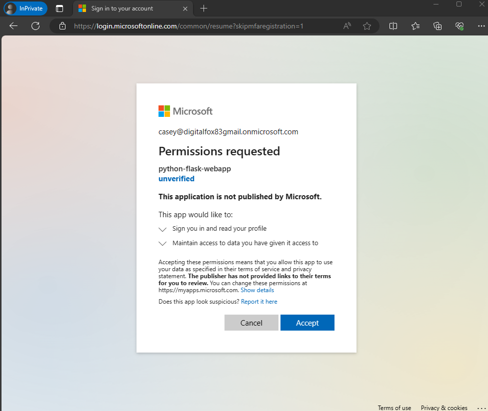
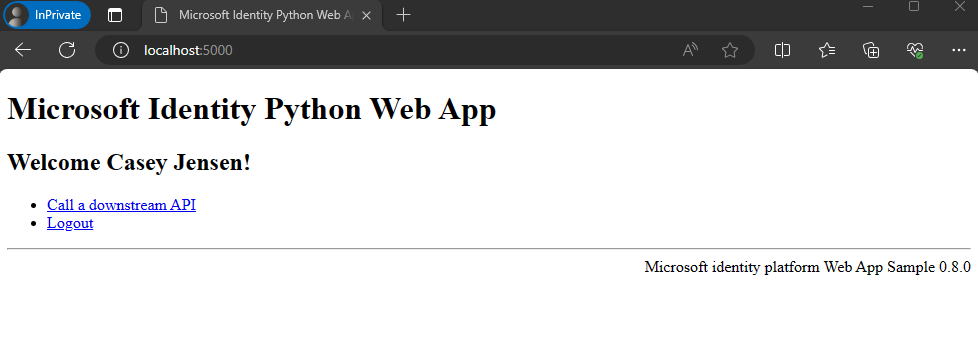

# Quickstart: Sign in users and call Microsoft Graph from a Python web app

In this quickstart, you download and run a code sample that demonstrates how a Python web app can sign in users and call the Microsoft Graph API. Users with a personal Microsoft Account or an account in any Microsoft Entra organization can sign into the application.

The following diagram displays how the sample app works:


1. The application uses the [`identity` package](https://pypi.org/project/identity/) to obtain an access token from the Microsoft identity platform.
2. The access token is used as a bearer token to authenticate the user when calling the Microsoft Graph API.

## Prerequisites

- An Azure account with an active subscription. [Create an account for free](https://azure.microsoft.com/free/?WT.mc_id=A261C142F).
- A Microsoft Entra tenant. For more information on how to get a Microsoft Entra tenant, see [how to get a Microsoft Entra tenant.](./quickstart-create-new-tenant.md)
- [Python 3.7+](https://www.python.org/downloads/)

## Step 1: Register your application

[!INCLUDE [portal updates](~/includes/portal-update.md)]

Follow these steps to register your application in the Microsoft Entra admin center:

1. Sign in to the [Microsoft Entra admin center](https://entra.microsoft.com) as at least a [Cloud Application Administrator](~/identity/role-based-access-control/permissions-reference.md#cloud-application-administrator). 
1. If you have access to multiple tenants, use the **Settings** icon :::image type="icon" source="./media/common/admin-center-settings-icon.png" border="false"::: in the top menu to switch to the tenant in which you want to register the application from the **Directories + subscriptions** menu.
1. Browse to **Identity** > **Applications** > **App registrations** and select **New registration**.
1. Enter a **Name** for your application, for example *python-webapp*. 
1. Under **Supported account types**, select **Accounts in any organizational directory and personal Microsoft accounts**.
1. Under **Redirect URIs**, select **Web** for the platform.
1. Enter a redirect URI of `http://localhost:5000/getAToken`. This can be changed later.
1. Select **Register**.

## Step 2: Add a client secret

1. On the app **Overview** page, note the **Application (client) ID** value for later use.
1. Under **Manage**, select the **Certificates & secrets** and from the **Client secrets** section, select **New client secret**.
1. Enter a description for the client secret, leave the default expiration, and select **Add**.
1. Save the **Value** of the **Client Secret** in a safe location. You'll need it to configure the code, and you can't retrieve it later.

   The sample application in this quickstart uses a client secret to identify itself as confidential client. Because the client secret is added as a plain-text to your project files, for security reasons, it is recommended that you use a certificate instead of a client secret before moving the application to a production environment. For more information on how to use a certificate, see [these instructions](./certificate-credentials.md). 

## Step 3: Add a scope

1. Under **Manage**, select **API permissions** > **Add a permission**.
1. Ensure that the **Microsoft APIs** tab is selected.
1. From the *Commonly used Microsoft APIs* section, select **Microsoft Graph**.
1. From the **Delegated permissions** section, ensure that **User.ReadBasic.All** is selected. Use the search box if necessary.
1. Select **Add permissions**.

## Step 4: Download the sample app

[Download the Python code sample](https://github.com/Azure-Samples/ms-identity-docs-code-python/tree/main/webapp/sign-in-users/flask) or clone the repository:

```powershell
git clone https://github.com/Azure-Samples/ms-identity-docs-code-python/
```

You can also use an integrated development environment to open the folder.

## Step 5: Configure the sample app

1. Go to the application folder.

1. Create an *.env* file in the root folder of the project using *.env.sample* as a guide.

    ```python
    # The following variables are required for the app to run.
    CLIENT_ID=<>
    CLIENT_SECRET=<>
    AUTHORITY=<authority url>
    ```

    * Set the value of `CLIENT_ID` to the **Application (client) ID** for the registered application, available on the overview page.
    * Set the value of `CLIENT_SECRET` to the client secret you created in **Certificates & Secrets** for the registered application.
    * Set the value of `AUTHORITY` to a URL that includes **Directory (tenant) ID** of the registered application. That ID is also available on the overview page.
    
    The environment variables are referenced in *app_config.py*, and are kept in a separate *.env* file to keep them out of source control. The provided *.gitignore* file prevents the *.env* file from being checked in.


## Step 6: Run the sample app

1. Create a virtual environment for the app:

    [!INCLUDE [Virtual environment setup](~/../azure-docs-pr/articles/app-service/includes/quickstart-python/virtual-environment-setup.md)]

1. Install the requirements using `pip`:

    ```shell
    pip install -r requirements.txt
    ```

1. Run the app from the command line, specifying the host and port to match the redirect URI:

    ```shell
    flask run --debug --host=localhost --port=5000
    ```
1. Copy the https URL that appears in the terminal, for example, https://localhost:5000, and paste it into a browser. We recommend using a private or incognito browser session.

1. Follow the steps and enter the necessary details to sign in with your Microsoft account. You're requested to provide an email address so a one time passcode can be sent to you. Enter the code when prompted.

1. The application requests permission to maintain access to data you have given it access to, and to sign you in and read your profile, as shown. Select Accept.



1. The following screenshot appears, indicating that you've successfully signed in to the application. 



## Next steps

Learn more by building an Python web app that signs in users and calls a protected web API in the following multi-part tutorial series:

> [!div class="nextstepaction"]
> [Tutorial: Web app that signs in users](tutorial-web-app-python-register-app.md)