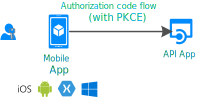

# Scenario: Mobile application that call Web APIs

Learn all you need to build a mobile app that calls Web APIs.

## Pre-requisites

[!INCLUDE [Pre-requisites](../../../includes/active-directory-develop-scenarios-prerequisites.md)]

## Scenario Overview

When building a mobile app, a personalized, seamless end user experience is essential.  Microsoft identity platform enables mobile developers to do exactly this for iOS and Android users.  Your application can sign in Azure AD, personal Microsoft account, and Azure AD B2C users and acquire tokens to call a web API on their behalf. To implement these flows, we'll use Microsoft Authentication library (MSAL) which implements the industry standard [OAuth2.0 Authorization Code flow](https://docs.microsoft.com/en-us/azure/active-directory/develop/v2-oauth2-auth-code-flow). 

Mobile app considerations:

- ***User experience is key***: Allow users to see the value of your app before asking for sign-in, and only request the permissions needed. 
- ***Support all user configurations***: Many mobile business users are under Conditional Access and device compliance policies. Be sure to support these key scenarios. 
- ***Implement SSO***: MSAL and Microsoft identity platform make enabling single sign-on simple through the device's browser or the Microsoft Authenticator (and Intune Company Portal on Android) . 

## Getting started
Create your first mobile application and try out a quickstart!

> [!div class="nextstepaction"]
> [Quickstart: Acquire a token and call Microsoft Graph API from an Android app](./quickstart-v2-android.md)
>
> [Quickstart: Acquire a token and call Microsoft Graph API from an iOS app](./quickstart-v2-ios.md)
>
> [Quickstart: Acquire a token and call Microsoft Graph API from a Xamarin iOS & Android app](https://github.com/Azure-Samples/active-directory-xamarin-native-v2)

## Specifics 

When building a mobile app on Microsoft identity platform, the end-to-end experience has a few considerations:
- Depending on the platform, signing in without any interaction may not be possible on the first sign in. iOS, for example, requires apps to show user interaction when getting SSO the first time through Microsoft Authenticator (and Intune Company Portal on Android).
- On iOS and Android, MSAL may use an external browsers (which may appear on top of your app) to sign in users. This can be customized to use in-app WebViews instead. 
- Never use a secret in a mobile application, it will be accessible to all users. 

## Next steps

> [!div class="nextstepaction"]
> [App registration](scenario-mobile-app-registration.md)
