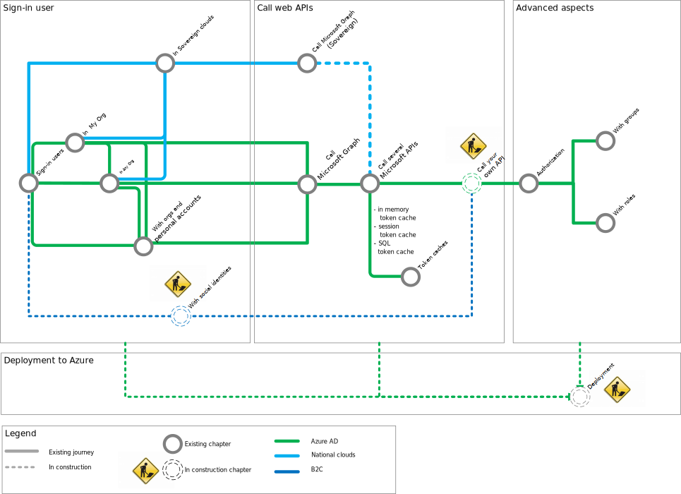

# Web app that signs-in users - move to production

## Improve your app

Now that you know how to acquire a token to call Web APIs, learn how to move it to production.

[!INCLUDE [Move to production common steps](../../../includes/active-directory-develop-scenarios-production.md)]

## Next steps

### Calling Web APIs scenario

Once your web app signs-in users, it can call Web APIs on behalf of the signed-in users. Calling Web APIs from our Web App is the object of the following scenario:

> [!div class="nextstepaction"]
> [Web app that calls web APIs](scenario-web-app-call-api-overview.md)

### Deep dive - Web App tutorial

Learn about other ways of sign-in users with the ASP.NET Core tutorial: [ms-identity-aspnetcore-webapp-tutorial](https://github.com/Azure-Samples/ms-identity-aspnetcore-webapp-tutorial). This is a progressive tutorial with production ready code for a Web app including how to add sign in.
  
  
