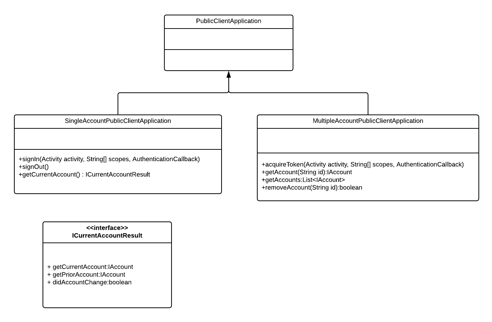

# Single Account vs Multi Account Public Client Application

## Introduction

While the Azure Active Directory Authentication Library (ADAL) modelled the server.  The Microsoft Authentication Library (MSAL) models your client client application.  In the case of Android the majority of Android applications are considered public clients.  Which are clients that are not considered capable of keeping a secret.  

In MSAL 1.0 we've specialized the API surface of PublicClientApplication to simplify/clarify the experience for developers intending to allow only one account to be used in their application at a time. We've subclassed PublicClientApplication creating SingleAccountPublicClientApplication and MultipleAccountPublicClientApplication.



## Single Account Public Client Application

This specialization allows developers to create a version of MSAL that only allows a single account to be signed in at a time.

SingleAccountPublicClientApplication has the following characteristics which differ from prior versions of the MSAL PublicClientApplication

- Current signed in account is tracked by the MSAL
  - If your app is using Broker (default in Azure Portal app registration) and installed on a device where broker is present.  MSAL will verify the account is still available on the device.
- signIn will allow you to sign in an account explicitly and separately from requesting a specific set of scopes
- acquireTokenSilent does not require you to provide an account parameter.  If you do provide an account and the account you provide does not match the current account as tracked by MSAL and MsalClientException will be thrown.
- acquireToken which you may need to call after the user is signed in to request consent or response to conditional access challenges will not allow the user to "switch accounts" in the Microsoft Identity Platform (authorize endpoint).  If the user does attempt to switch to a different account an exception will be thrown.
- getCurrentAccount will return you a result object that will provdie the following:
  - A boolean indicating whether the account changed (as a result of being removed from the device for example)
  - The prior account in case you need to do any local data cleanup when the account is removed from the device or when a new account is signed in.
  - The currentAccount.
- signOut will remove any tokens associated with your client from the device.  

>Note: When an Android Authentication broker (broker) is installed (Microsoft Authenticator or Intune Company Portal) on the device and your app is configured to use the broker signOut will not result in the account being removed from the device.  


## Single Account Scenario

The following is pseudo code illustrating each of the key operations associated with user SingleAccountPublicClientApplication.

```java
//Construct Single Account Public Client Application
ISingleAccountPublicClientApplication app = PublicClientApplication.createSingleAccountPublicClientApplication(getApplicationContext(), R.raw.msal_config);

//UI Thread
String[] scopes = {"User.Read"};
IAccount mAccount = null;
app.signIn(getActivity(), scopes new AuthenticationCallback() {

        @Override
        public void onSuccess(IAuthenticationResult authenticationResult) {
            mAccount = authenticationResult.getAccount();
        }

        @Override
        public void onError(MsalException exception) {
        }

        @Override
        public void onCancel() {
        }
    }
);

//Load Account Specific Data
getDataForAccount(account);

//Get Current Account
ICurrentAccountResult currentAccountResult = app.getCurrentAccount();
if(currentAccountResult.didAccountChange()){
    //Account Changed Clear existing account data
    clearDataForAccount(currentAccountResult.getPriorAccount());
    mAccount = currentAccountResult.getCurrentAccount();
    if(account != null){
        //load data for new account
        getDataForAccount(account);
    }
}


//Sign out
if(app.signOut()){
    clearDataForAccount(mAccount);
    mAccount = null;
}

```

## Multiple Account Public Client Application

MultipleAccountPublicClientApplication is closer to original MSAL PublicClientApplication. We're still exploring whether to add signIn or addAccount as explicit operations on MultipleAccountPublicClientApplication.

### Add Account

You can use one or more accounts in your application, by calling acquireToken one or more times.  

### Get Accounts / Get Account

- You can get a specific account by calling getAccount
- You can get a list of accounts currently known to your application by calling getAccounts

> Note: Your app will not be able to enumerate all Microsoft Identity Platform accounts on the device (from the broker).  Only the accounts that have been used by your app.  If an account used by your app is remvoed from the device then the result of this call will reflect that fact.

### Remove Account

You can remove an account by calling removeAccount and providing an account identifier.

> Note: If broker is in use by your application (your app is configured to use broker and a broker is installed on the device) the account will not be removed from the broker when you call removeAccount.  Only tokens associated with your client will be removed.
