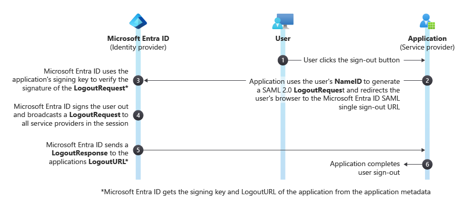

# Single Sign-Out SAML Protocol

Microsoft Entra ID supports the SAML 2.0 web browser single sign-out profile. For single sign-out to work correctly, the **LogoutURL** for the application must be explicitly registered with Microsoft Entra ID during application registration. 

If the app is [added to the Azure App Gallery](~/identity/enterprise-apps/v2-howto-app-gallery-listing.md) then this value can be set by default. Otherwise, the value must be determined and set by the person adding the app to their Microsoft Entra tenant. Microsoft Entra ID uses the **LogoutURL** to redirect users after they're signed out. Microsoft Entra ID supports redirect binding (HTTP GET), and not HTTP POST binding.

The following diagram shows the workflow of the Microsoft Entra single sign-out process.

[](./media/single-sign-out-saml-protocol/saml-single-sign-out-workflow.png#lightbox)

## LogoutRequest

The cloud service sends a `LogoutRequest` message to Microsoft Entra ID to indicate that a session has been terminated. The following excerpt shows a sample `LogoutRequest` element.

```
<samlp:LogoutRequest xmlns="urn:oasis:names:tc:SAML:2.0:metadata" ID="idaa6ebe6839094fe4abc4ebd5281ec780" Version="2.0" IssueInstant="2013-03-28T07:10:49.6004822Z" xmlns:samlp="urn:oasis:names:tc:SAML:2.0:protocol">
  <Issuer xmlns="urn:oasis:names:tc:SAML:2.0:assertion">https://www.workaad.com</Issuer>
  <NameID xmlns="urn:oasis:names:tc:SAML:2.0:assertion"> Uz2Pqz1X7pxe4XLWxV9KJQ+n59d573SepSAkuYKSde8=</NameID>
</samlp:LogoutRequest>
```

The `LogoutRequest` element sent to Microsoft Entra ID requires the following attributes:

* `ID` - This identifies the sign-out request. The value of `ID` shouldn't begin with a number. The typical practice is to append **id** to the string representation of a GUID.
* `Version` - Set the value of this element to **2.0**. This value is required.
* `IssueInstant` - This is a `DateTime` string with a Coordinate Universal Time (UTC) value and [round-trip format ("o")](/dotnet/standard/base-types/standard-date-and-time-format-strings). Microsoft Entra ID expects a value of this type, but doesn't enforce it.

Per section 3.7 of the [SAML 2.0 core specification](http://docs.oasis-open.org/security/saml/v2.0/saml-core-2.0-os.pdf), there can be multiple participants (other applications) in a session besides your application. If one of the other participants sends a `LogoutRequest` to the Microsoft identity platform (the session authority), it will send a `LogoutRequest` back to all the session participants except the participant who sent the initial `LogoutRequest`. If another participant simultaneously initiated sign-out, there would be a race to see which `LogoutRequest` reaches Microsoft identity platform first. Therefore, an application should always be prepared to handle a `LogoutRequest`.

### Issuer

The `Issuer` element in a `LogoutRequest` must exactly match one of the **ServicePrincipalNames** in the cloud service in Microsoft Entra ID. Typically, this is set to the **App ID URI** that is specified during application registration.

### NameID
The value of the `NameID` element must exactly match the `NameID` of the user that is being signed out. 

> [!NOTE]
> During SAML logout request, the `NameID` value is not considered by Microsoft Entra ID.  
> If a single user session is active, Microsoft Entra ID will automatically select that session and the SAML logout will proceed.  
> If multiple user sessions are active, Microsoft Entra ID will enumerate the active sessions for user selection. After user selection, the SAML logout will proceed.

## LogoutResponse

Microsoft Entra ID sends a `LogoutResponse` in response to a `LogoutRequest` element. The following excerpt shows a sample `LogoutResponse`.

```
<samlp:LogoutResponse ID="_f0961a83-d071-4be5-a18c-9ae7b22987a4" Version="2.0" IssueInstant="2013-03-18T08:49:24.405Z" InResponseTo="iddce91f96e56747b5ace6d2e2aa9d4f8c" xmlns:samlp="urn:oasis:names:tc:SAML:2.0:protocol">
  <Issuer xmlns="urn:oasis:names:tc:SAML:2.0:assertion">https://login.microsoftonline.com/82869000-6ad1-48f0-8171-272ed18796e9/</Issuer>
  <samlp:Status>
    <samlp:StatusCode Value="urn:oasis:names:tc:SAML:2.0:status:Success" />
  </samlp:Status>
</samlp:LogoutResponse>

```

Microsoft Entra ID sets the `ID`, `Version` and `IssueInstant` values in the `LogoutResponse` element. It also sets the `InResponseTo` element to the value of the `ID` attribute of the `LogoutRequest` that elicited the response.

### Issuer

Microsoft Entra ID sets this value to `https://login.microsoftonline.com/<TenantIdGUID>/` where \<TenantIdGUID> is the tenant ID of the Microsoft Entra tenant. 

To correctly identify the issuer element, use the value `https://login.microsoftonline.com/<TenantIdGUID>/` as shown in the sample LogoutResponse. This URL format identifies the Microsoft Entra tenant as the issuer, representing the authority responsible for issuing the response.

### Status
Microsoft Entra ID uses the `StatusCode` element in the `Status` element to indicate the success or failure of sign-out. When the sign-out attempt fails, the `StatusCode` element can also contain custom error messages.
