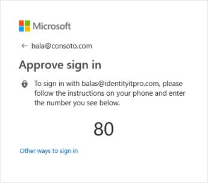

# Support passwordless authentication with FIDO2 keys in apps you develop

To ensure that the [FIDO2 passwordless authentication](../../active-directory/authentication/concept-authentication-passwordless#fido2-security-keys.md) is available to users of your applications, use these app and platform configurations.

## General app configuration

**Home-realm discovery and domain hints**

Don't use a domain hint to bypass [home-realm discovery](../../active-directory/manage-apps/configure-authentication-for-federated-users-portal#home-realm-discovery.md). This feature is meant to make sign-ins more streamlined, but the federated identity provider may not support passwordless authentication.

**Requiring specific kinds of credentials**

If you are using SAML, do not specify that a password is required [using the RequestedAuthnContext element](single-sign-on-saml-protocol.md#requestauthncontext).

The RequestedAuthnContext element is optional, so to resolve this you can remove it from your SAML authentication requests. This is a general best practice, as using this element can also prevent other authentication options like multi-factor authentication from working correctly.

**Changing from the most recently used authentication method**

The sign in method that was most recently used by a user will be presented to them first. This may cause confusion when users believe they must use the first option presented. However, they can choose another option by selecting "Other ways to sign in" as shown below.

## Platform specific guidance

**Desktop best practices**

The recommended options for implementing authentication are, in order:

- .NET desktop applications that are using the Microsoft Authentication Library (MSAL) should use the Windows Authentication Manager (WAM). This integration and its benefits are [documented on GitHub](https://github.com/AzureAD/microsoft-authentication-library-for-dotnet/wiki/wam).
- Use [WebView2](https://docs.microsoft.com/microsoft-edge/webview2/) to support FIDO2 in an embedded browser.
- Use the system browser. The MSAL libraries for desktop platforms use this method by default. You can consult our page on FIDO2 browser compatibility to ensure the browser you use supports FIDO2 authentication.

**Mobile best practices**

As of February 2020, FIDO2 is not currently supported for native iOS or Android apps, but it is in development.

To prepare applications for its availability, and as a general best practice, iOS and Android applications should use MSAL with its default configuration of using the system web browser.

If you are not using MSAL, you should still use the system web browser for authentication. Features such as single sign-on and conditional access rely on a shared web surface provided by the system web browser. This means using [Chrome Custom Tabs](https://developer.chrome.com/docs/multidevice/android/customtabs/) (Android) or [Authenticating a User Through a Web Service | Apple Developer Documentation](https://developer.apple.com/documentation/authenticationservices/authenticating_a_user_through_a_web_service) (iOS).

**Web App and SPA best practices**

The availability of FIDO2 passwordless authentication for applications that run in a web browser will depending on the combination of browser and platform. You can consult or FIDO2 compatibility matrix to check if the combination your users will encounter is supported.

## Next steps

[Passwordless authentication options for Azure Active Directory](https://docs.microsoft.com/azure/active-directory/authentication/concept-authentication-passwordless)
