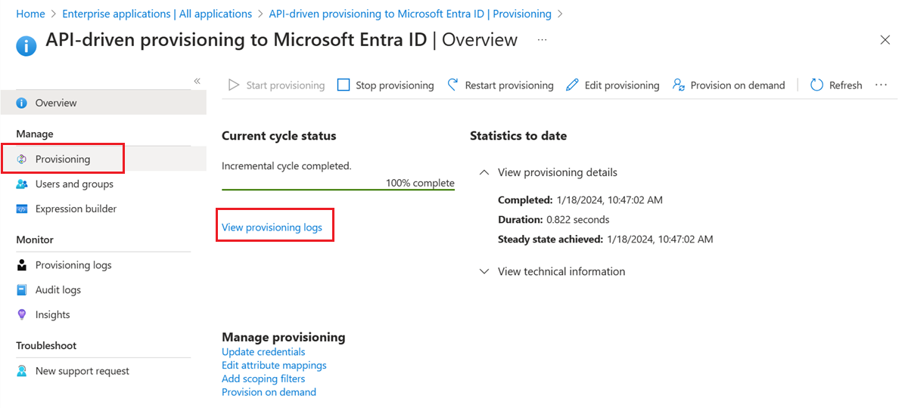

# Quickstart API-driven inbound provisioning with cURL (Public preview)

## Introduction

[cURL](https://curl.se/) is a popular, free, open-source, command-line tool used by API developers, and it's [available by default on Windows 10/11](https://curl.se/windows/microsoft.html). This tutorial describes how you can quickly test [API-driven inbound provisioning](inbound-provisioning-api-concepts.md) with cURL. 

## Pre-requisites

* You have configured [API-driven inbound provisioning app](inbound-provisioning-api-configure-app.md). 
* You have [configured a service principal and it has access](inbound-provisioning-api-grant-access.md) to the inbound provisioning API. Make note of the `ClientId` and `ClientSecret` of your service principal app for use in this tutorial. 

## Upload user data to the inbound provisioning API

1. Retrieve the **client_id** and **client_secret** of the service principal that has access to the inbound provisioning API. 
1. Use OAuth **client_credentials** grant flow to get an access token. Replace the variables `[yourClientId]`, `[yourClientSecret]` and `[yourTenantId]` with values applicable to your setup and run the following cURL command. Copy the access token value generated 
     ```
     curl -X POST -H "Content-Type: application/x-www-form-urlencoded" -d "client_id=[yourClientId]&scope=https%3A%2F%2Fgraph.microsoft.com%2F.default&client_secret=[yourClientSecret]&grant_type=client_credentials" "https://login.microsoftonline.com/[yourTenantId]/oauth2/v2.0/token"
     ```
1. Copy the [bulk request with SCIM Enterprise User Schema](#bulk-request-with-scim-enterprise-user-schema) and save the contents in a file called `scim-bulk-upload-users.json`.
1. Replace the variable `[InboundProvisioningAPIEndpoint]` with the provisioning API endpoint associated with your provisioning app. Use the `[AccessToken]` value from the previous step and run the following curl command to upload the bulk request to the provisioning API endpoint. 
     ```
     curl -v "[InboundProvisioningAPIEndpoint]" -d @scim-bulk-upload-users.json -H "Authorization: Bearer [AccessToken]" -H "Content-Type: application/scim+json"
     ```
1. Upon successful upload, you'll receive HTTP 202 Accepted response code. 
1. The provisioning service starts processing the bulk request payload immediately and you can see the provisioning details by accessing the provisioning logs of the inbound provisioning app. 

## Verify processing of the bulk request payload

1. Log in to [Microsoft Entra admin center](https://entra.microsoft.com) as at least an [Application Administrator](https://go.microsoft.com/fwlink/?linkid=2247823).
1. Browse to **Microsoft Entra ID -> Applications -> Enterprise applications**.
1. Under all applications, use the search filter text box to find and open your API-driven provisioning application.
1. Open the Provisioning blade. The landing page displays the status of the last run.
1. Click on **View provisioning logs** to open the provisioning logs blade. Alternatively, you can click on the menu option **Monitor -> Provisioning logs**.

      [](media/inbound-provisioning-api-curl-tutorial/access-provisioning-logs.png#lightbox)

1. Click on any record in the provisioning logs to view more processing details.
1. The provisioning log details screen displays all the steps executed for a specific user. 
      * Under the **Import from API** step, see details of user data extracted from the bulk request.
      * The **Match user** step shows details of any user match based on the matching identifier. If a user match happens, then the provisioning service performs an update operation. If there is no user match, then the provisioning service performs a create operation.
      * The **Determine if User is in scope** step shows details of scoping filter evaluation. By default, all users are processed. If you have set a scoping filter (example, process only users belonging to the Sales department), the evaluation details of the scoping filter displays in this step.
      * The **Provision User** step calls out the final processing step and changes applied to the user account.
      * Use the **Modified properties** tab to view attribute updates.

## Appendix

View this section for information on the bulk request with SCIM Enterprise User Schema. 

### Bulk request with SCIM Enterprise User Schema
The bulk request shown below uses the SCIM standard Core User and Enterprise User Schema. 

**Request body**

```http
{
    "schemas": ["urn:ietf:params:scim:api:messages:2.0:BulkRequest"],
    "Operations": [
    {
        "method": "POST",
        "bulkId": "897401c2-2de4-4b87-a97f-c02de3bcfc61",
        "path": "/Users",
        "data": {
            "schemas": ["urn:ietf:params:scim:schemas:core:2.0:User",
            "urn:ietf:params:scim:schemas:extension:enterprise:2.0:User"],
            "externalId": "701984",
            "userName": "bjensen@example.com",
            "name": {
                "formatted": "Ms. Barbara J Jensen, III",
                "familyName": "Jensen",
                "givenName": "Barbara",
                "middleName": "Jane",
                "honorificPrefix": "Ms.",
                "honorificSuffix": "III"
            },
            "displayName": "Babs Jensen",
            "nickName": "Babs",
            "emails": [
            {
              "value": "bjensen@example.com",
              "type": "work",
              "primary": true
            }
            ],
            "addresses": [
            {
              "type": "work",
              "streetAddress": "100 Universal City Plaza",
              "locality": "Hollywood",
              "region": "CA",
              "postalCode": "91608",
              "country": "USA",
              "formatted": "100 Universal City Plaza\nHollywood, CA 91608 USA",
              "primary": true
            }
            ],
            "phoneNumbers": [
            {
              "value": "555-555-5555",
              "type": "work"
            }
            ],
            "userType": "Employee",
            "title": "Tour Guide",
            "preferredLanguage": "en-US",
            "locale": "en-US",
            "timezone": "America/Los_Angeles",
            "active":true,
            "urn:ietf:params:scim:schemas:extension:enterprise:2.0:User": {
                 "employeeNumber": "701984",
                 "costCenter": "4130",
                 "organization": "Universal Studios",
                 "division": "Theme Park",
                 "department": "Tour Operations",
                 "manager": {
                     "value": "89607",
                     "displayName": "John Smith"
                 }
            }
        }
    },
    {
        "method": "POST",
        "bulkId": "897401c2-2de4-4b87-a97f-c02de3bcfc61",
        "path": "/Users",
        "data": {
            "schemas": ["urn:ietf:params:scim:schemas:core:2.0:User",
            "urn:ietf:params:scim:schemas:extension:enterprise:2.0:User"],
            "externalId": "701985",
            "userName": "Kjensen@example.com",
            "name": {
                "formatted": "Ms. Kathy J Jensen, III",
                "familyName": "Jensen",
                "givenName": "Kathy",
                "middleName": "Jane",
                "honorificPrefix": "Ms.",
                "honorificSuffix": "III"
            },
            "displayName": "Kathy Jensen",
            "nickName": "Kathy",
            "emails": [
            {
              "value": "kjensen@example.com",
              "type": "work",
              "primary": true
            }
            ],
            "addresses": [
            {
              "type": "work",
              "streetAddress": "100 Oracle City Plaza",
              "locality": "Hollywood",
              "region": "CA",
              "postalCode": "91618",
              "country": "USA",
              "formatted": "100 Oracle City Plaza\nHollywood, CA 91618 USA",
              "primary": true
            }
            ],
            "phoneNumbers": [
            {
              "value": "555-555-5545",
              "type": "work"
            }
            ],
            "userType": "Employee",
            "title": "Tour Lead",
            "preferredLanguage": "en-US",
            "locale": "en-US",
            "timezone": "America/Los_Angeles",
            "active":true,
            "urn:ietf:params:scim:schemas:extension:enterprise:2.0:User": {
                 "employeeNumber": "701985",
                 "costCenter": "4130",
                 "organization": "Universal Studios",
                 "division": "Theme Park",
                 "department": "Tour Operations",
                 "manager": {
                     "value": "701984",
                     "displayName": "Barbara Jensen"
                 }
            }
        }
    }
],
    "failOnErrors": null
}
```

## Next steps
- [Troubleshoot issues with the inbound provisioning API](inbound-provisioning-api-issues.md)
- [Frequently asked questions about API-driven inbound provisioning](inbound-provisioning-api-faqs.md)
- [Quick start using PowerShell](inbound-provisioning-api-powershell.md)
- [Quick start using Azure Logic Apps](inbound-provisioning-api-logic-apps.md)
