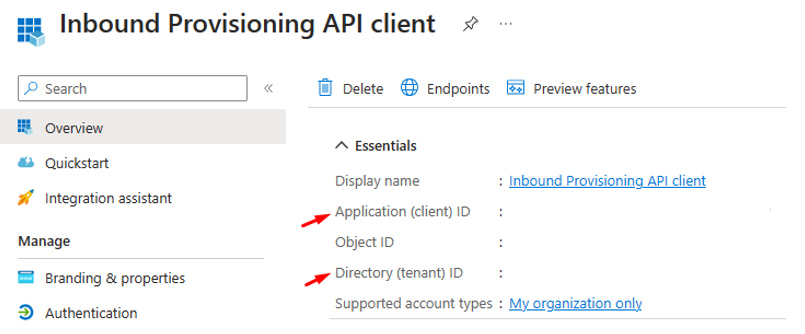
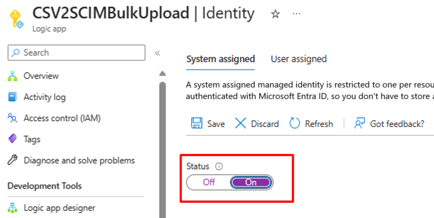
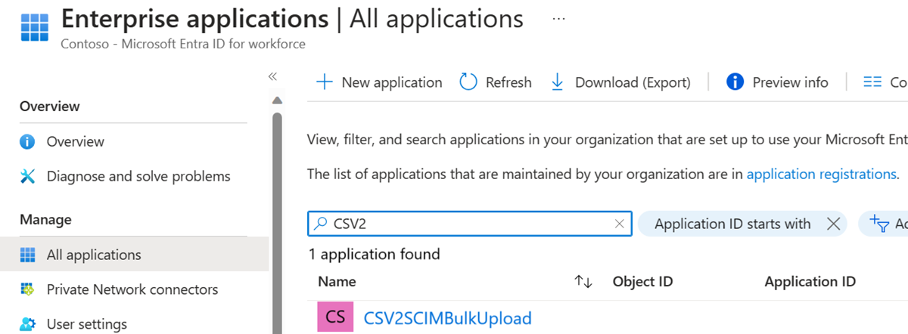

# Grant access to the inbound provisioning API (Public preview)

## Introduction

After you've configured [API-driven inbound provisioning app](inbound-provisioning-api-configure-app.md), you need to grant access permissions so that API clients can send requests to the provisioning [/bulkUpload](/graph/api/synchronization-synchronizationjob-post-bulkupload) API and query the [provisioning logs API](/graph/api/resources/provisioningobjectsummary). This tutorial walks you through the steps to configure these permissions. 

Depending on how your API client authenticates with Microsoft Entra ID, you can select between two configuration options: 

* [Configure a service principal](#configure-a-service-principal): Follow these instructions if your API client plans to use a service principal of an [Microsoft Entra registered app](~/identity-platform/howto-create-service-principal-portal.md) and authenticate using OAuth client credentials grant flow. 
* [Configure a managed identity](#configure-a-managed-identity): Follow these instructions if your API client plans to use a Microsoft Entra [managed identity](~/identity/managed-identities-azure-resources/overview.md).

## Configure a service principal 
This configuration registers an app in Microsoft Entra ID that represents the external API client and grants it permission to invoke the inbound provisioning API. The service principal client ID and client secret can be used in the OAuth client credentials grant flow. 

1. Log in to Microsoft Entra admin center (https://entra.microsoft.com) with at least [Application Administrator](https://go.microsoft.com/fwlink/?linkid=2247823) login credentials. 
1. Browse to **Microsoft Entra ID** -> **Applications** -> **App registrations**.
1. Click on the option **New registration**.
1. Provide an app name, select the default options, and click on **Register**.
      [](media/inbound-provisioning-api-grant-access/register-app.png#lightbox)
1. Copy the **Application (client) ID** and **Directory (tenant) ID** values from the Overview blade and save it for later use in your API client. 
      [](media/inbound-provisioning-api-grant-access/app-client-id.png#lightbox)  
1. In the context menu of the app, select **Certificates & secrets** option. 
1. Create a new client secret. Provide a description for the secret and expiry date. 
1. Copy the generated value of the client secret and save it for later use in your API client. 
1. From the context menu **API permissions**, select the option **Add a permission**. 
1. Under **Request API permissions**, select **Microsoft Graph**. 
1. Select **Application permissions**.
1. Search and select permission **AuditLog.Read.All** and **SynchronizationData-User.Upload**.
1. Click on **Grant admin consent** on the next screen to complete the permission assignment. Click Yes on the confirmation dialog. Your app should have the following permission sets.
      [](media/inbound-provisioning-api-grant-access/api-client-permissions.png#lightbox)  
1. You're now ready to use the service principal with your API client.
1. For production workloads, we recommend using [client certificate-based authentication](~/identity-platform/howto-authenticate-service-principal-powershell.md) with the service principal or managed identities. 

## Configure a managed identity

This section describes how you can assign the necessary permissions to a managed identity. 

1. Configure a [managed identity](~/identity/managed-identities-azure-resources/overview.md) for use with your Azure resource. 
1. Copy the name of your managed identity from the Microsoft Entra admin center. For example: The screenshot below shows the name of a system assigned managed identity associated with an Azure Logic Apps workflow called "CSV2SCIMBulkUpload". 

      [](media/inbound-provisioning-api-grant-access/managed-identity-name.png#lightbox) 

1. Run the following PowerShell script to assign permissions to your managed identity.

      ```powershell
      Install-Module Microsoft.Graph -Scope CurrentUser

      Connect-MgGraph -Scopes "Application.Read.All","AppRoleAssignment.ReadWrite.All,RoleManagement.ReadWrite.Directory"
      Select-MgProfile Beta
      $graphApp = Get-MgServicePrincipal -Filter "AppId eq '00000003-0000-0000-c000-000000000000'"
  
      $PermissionName = "SynchronizationData-User.Upload"
      $AppRole = $graphApp.AppRoles | `
      Where-Object {$_.Value -eq $PermissionName -and $_.AllowedMemberTypes -contains "Application"}
      $managedID = Get-MgServicePrincipal -Filter "DisplayName eq 'CSV2SCIMBulkUpload'"
      New-MgServicePrincipalAppRoleAssignment -PrincipalId $managedID.Id -ServicePrincipalId $managedID.Id -ResourceId $graphApp.Id -AppRoleId $AppRole.Id

      $PermissionName = "AuditLog.Read.All"
      $AppRole = $graphApp.AppRoles | `
      Where-Object {$_.Value -eq $PermissionName -and $_.AllowedMemberTypes -contains "Application"}
      $managedID = Get-MgServicePrincipal -Filter "DisplayName eq 'CSV2SCIMBulkUpload'"
      New-MgServicePrincipalAppRoleAssignment -PrincipalId $managedID.Id -ServicePrincipalId $managedID.Id -ResourceId $graphApp.Id -AppRoleId $AppRole.Id
      ```
1. To confirm that the permission was applied, find the managed identity service principal under **Enterprise Applications** in Microsoft Entra ID. Remove the **Application type** filter to see all service principals.
      [](media/inbound-provisioning-api-grant-access/managed-identity-principal.png#lightbox) 
1. Click on the **Permissions** blade under **Security**. Ensure the permission is set. 
      [](media/inbound-provisioning-api-grant-access/managed-identity-permissions.png#lightbox) 
1. You're now ready to use the managed identity with your API client. 


## Next steps
- [Quick start using cURL](inbound-provisioning-api-curl-tutorial.md)
- [Quick start using Postman](inbound-provisioning-api-postman.md)
- [Quick start using Graph Explorer](inbound-provisioning-api-graph-explorer.md)
- [Frequently asked questions about API-driven inbound provisioning](inbound-provisioning-api-faqs.md)
