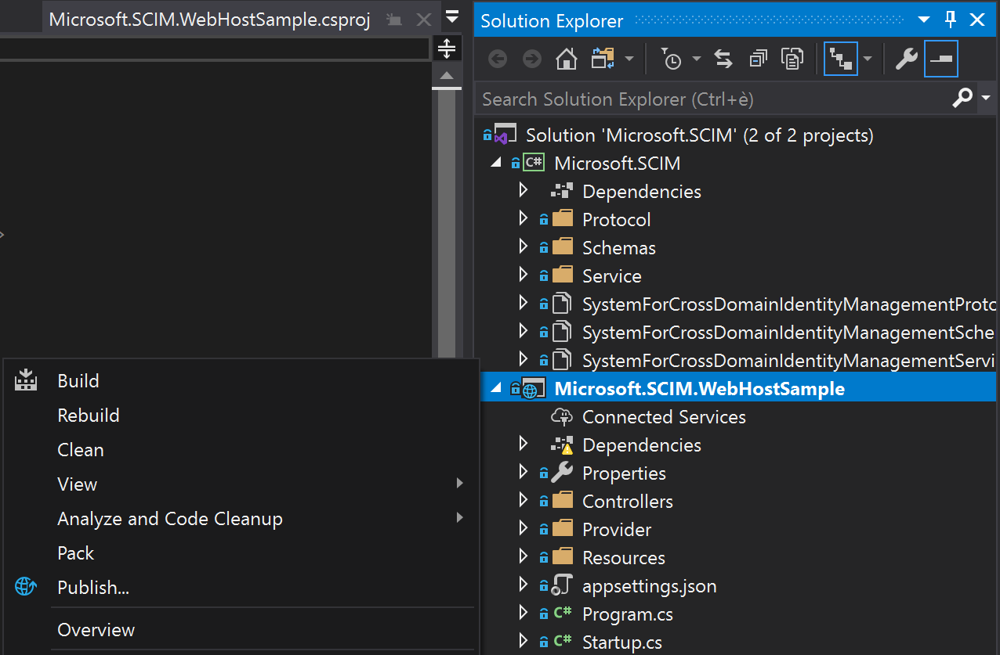
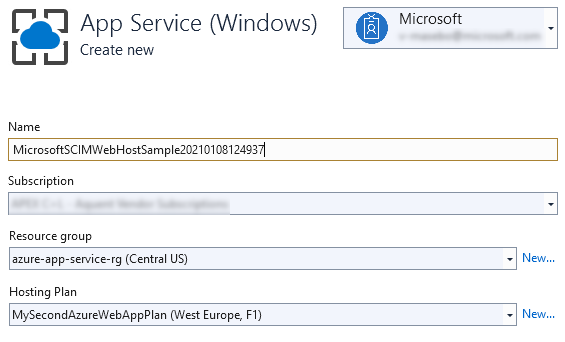

# Tutorial: Develop a sample SCIM endpoint

This tutorial descibes how to build a [SCIM](https://docs.microsoft.com/azure/active-directory/manage-apps/use-scim-to-provision-users-and-groups) endpoint with guidance on how to implement CRUD operations to support a user and group object. Also discussed are optional features such as filtering and pagination.

> [!div class="checklist"]
> * Download the reference code
> * Deploy your SCIM endpoint in Azure
> * Test your SCIM endpoint

Endpoint capabilities, include:

|Endpoint|Description|
|---|---|
|`/User`|Perform CRUD operations on a user resource: **Create**, **Update**, **Delete**, **Get**, **List**, **Filter**|
|`/Group`|Perform CRUD operations on a group resource: **Create**, **Update**, **Delete**, **Get**, **List**, **Filter**|
|`/Schemas`|Retrieve one or more supported schemas.<br/>The set of attributes of a resource supported by each service provider can vary, e.g. Service Provider A supports “name”, “title”, and “emails” while Service Provider B supports “name”, “title”, and “phoneNumbers” for users.|
|`/ResourceTypes`|Retrieve supported resource types.<br/>The number and types of resources supported by each service provider can vary, e.g. Service Provider A supports users while Service Provider B supports users and groups.|
|`/ServiceProviderConfig`|Retrieve service provider's SCIM configuration<br/>The SCIM features supported by each service provider can vary, e.g. Service Provider A supports Patch operations while Service Provider B supports Patch Operations and Schema Discovery.|

## Download the reference code

Download the [reference code](https://github.com/AzureAD/SCIMReferenceCode) that includes:

- **Microsoft.SystemForCrossDomainIdentityManagement** project, a .NET Core MVC web API, to build and provision a SCIM API
- **Microsoft.SCIM.WebHostSample** project, a working example

The projects contain the following folders:

| File/folder       | Description                                |
|-------------------|--------------------------------------------|
| **Schemas** folder |  The models for the User and Group resources along with some abstract classes like Schematized for shared functionality.<br/> An Attributes folder which contains the class definitions for complex attributes of Users and Groups such as addresses.|
| **Service** folder | Contains logic for actions relating to the way resources are queried and updated.<br/> The reference code has services to return users and groups.<br/>The **controllers** folder contains the various SCIM endpoints. Resource controllers include HTTP verbs to perform CRUD operations on the resource (GET, POST, PUT, PATCH, DELETE). Controllers rely on services to perform the actions. |
| **Protocol** folder | Contains logic for actions relating to the way resources are returned according to the SCIM RFC such as:<br/>
Returning multiple resources as a list.<br/>
Returning only specific resources based on a filter.<br/>
Turning a query into a list of linked lists of single filters.<br/>
Turning a PATCH request into an operation with attributes pertaining to the value path. <br/>
Defining the type of operation that can be used to apply changes to resource objects.|
| `Microsoft.SystemForCrossDomainIdentityManagement`| Sample source code.|
| `Microsoft.SCIM.WebHostSample`| Sample implementation of the SCIM library.|
| .gitignore      | Define what to ignore at commit time.      |
| *CHANGELOG.md*    | List of changes to the sample.             |
| *CONTRIBUTING.md* | Guidelines for contributing to the sample. |
| *README.md*       | This README file.                          |
| *LICENSE*         | The license for the sample.                |

> [!NOTE]
> This code is intended to help you get started building your SCIM endpoint and is provided "AS IS". It's intended as a reference with no guarantee of active maintainence or support. Community [contributions](https://github.com/AzureAD/SCIMReferenceCode/wiki/Contributing-Overview) are welcome to help build and maintain the repo. Like other open-source contributions, you must agree to a Contributor License Agreement (CLA) declaring that you have and grant the rights to use your contribution. For details, visit [Microsoft Open Source](https://cla.opensource.microsoft.com).
>
> This project has adopted the [Microsoft Open Source Code of Conduct](https://opensource.microsoft.com/codeofconduct/). For more information see the [Code of Conduct FAQ](https://opensource.microsoft.com/codeofconduct/faq/) or contact [opencode@microsoft.com](mailto:opencode@microsoft.com) with any additional questions or comments.

###  Use multiple environments

The SCIM reference code uses the ASP.NET Core environment to control the authorization used in development and after deployment, see [Use multiple environments in ASP.NET Core](https://docs.microsoft.com/aspnet/core/fundamentals/environments?view=aspnetcore-3.1).

```csharp
private readonly IWebHostEnvironment _env;
...

public void ConfigureServices(IServiceCollection services)
{
    if (_env.IsDevelopment())
    {
        ...
    }
    else
    {
        ...
    }
```

## Deploy your SCIM endpoint in Azure

The SCIM reference code can be deployed locally, hosted by a on-premise server, or in a service such as Azure App Services. This tutorial provides steps to host the SCIM endpoint in the cloud using [Visual Studio 2019](https://visualstudio.microsoft.com/downloads/) and [Azure App Services](https://docs.microsoft.com/azure/app-service/).

To deploy to Azure App Service:

There's a section later on for "Run the Solution Locally" that contains the steps to get the code into visualstudio.
1. Select **Clone or download**, next either:
   - Select **Open in Desktop**
   - Copy the link, open Visual Studio, and select **Clone or check out code**. Use the copied GitHub link to make a local copy of all files.

1. With **Solution Explorer** open, navigate to *Microsoft.SCIM.sln* and double-click.

1. Open Visual Studio and sign into the account that has access to your hosting resources.

1. In **Solution Explorer**, open *Microsoft.SCIM.sln* and right-click the *Microsoft.SCIM.WebHostSample* file. Select **Publish**.

    

    > [!NOTE]
    > To run the solution locally, double-click the project and select **IIS Express** to launch the project as a web page with a local host URL.

1. Select **Create profile**. Make sure **App Service** and **Create new** are selected.

	

1. Walk through the dialog options. Rename the app to a name of your choice. The name is used in both the app and the SCIM endpoint URL.

	

1. Select the resource group to use and choose **Publish**.

1. Navigate to the application in **Azure App Services** > **Configuration** and select **New application setting** to add the *Token__TokenIssuer* setting with the value `https://sts.windows.net/<tenant_id>/`, and replace `<tenant_id>` with your Azure AD tenant_id. If you're looking to test the SCIM endpoint with [Postman](https://github.com/AzureAD/SCIMReferenceCode/wiki/Test-Your-SCIM-Endpoint), also add a *ASPNETCORE_ENVIRONMENT* setting with the value `Development`. 

   When testing your endpoint with an Enterprise Application in the Azure Portal, choose to keep the environment as `Development` and provide the token generated from the `/scim/token` endpoint for testing or change the environment to `Production` and leave the token field empty in the enterprise application in the [Azure Portal](https://docs.microsoft.com/azure/active-directory/app-provisioning/use-scim-to-provision-users-and-groups#step-4-integrate-your-scim-endpoint-with-the-azure-ad-scim-client). 

	

That's it! Your SCIM endpoint is now published and allows use of the Azure App Service URL to test the SCIM endpoint.

## Test your SCIM endpoint

A request to a SCIM endpoints requires authorization and the SCIM standard leaves multiple options for authentication and authorization open, such as cookies, basic authentication, TLS client authentication, or any of the methods listed in [RFC 7644](https://tools.ietf.org/html/rfc7644#section-2).

Be careful to avoid insecure methods, such as username/password, in favor of more a secure method such as OAuth. Azure AD supports long-lived bearer tokens (for gallery and non-gallery applications) and the OAuth authorization grant (for applications published in the app gallery).

> [!NOTE]
> The authorization methods provided in the repo are for testing only. When integrating with Azure AD, review the authorization guidance, see [Plan provisioning for a SCIM endpoint](https://docs.microsoft.com/azure/active-directory/app-provisioning/use-scim-to-provision-users-and-groups#authorization-for-provisioning-connectors-in-the-application-gallery). 

### Development Environment

The development environment enables features unsafe for production, such as reference code to control the behavior of the security token validation. The token validation code is configured to use a self signed security token and the signing key is stored in the configuration file, see the `Token:IssuerSigningKey` parameter in the *appsettings.Development.json* file.

```json
"Token": {
    "TokenAudience": "Microsoft.Security.Bearer",
    "TokenIssuer": "Microsoft.Security.Bearer",
    "IssuerSigningKey": "A1B2C3D4E5F6A1B2C3D4E5F6",
    "TokenLifetimeInMins": "120"
}
```

> [!NOTE]
> By sending a GET request to the `/scim/token` endpoint, a token is issued using the configured key and can be used as bearer token for subsequent authorization.

The default token validation code is configured to use a token issued by Azure Active Directory,, and requires the issuing tenant be configured using the `Token:TokenIssuer` parameter in the *appsettings.json* file.

``` json
"Token": {
    "TokenAudience": "8adf8e6e-67b2-4cf2-a259-e3dc5476c621",
    "TokenIssuer": "https://sts.windows.net/<tenant_id>/"
}
```

> [!NOTE]
> To deploy to Azure App Service, use **Application settings** under **Settings** > **Configuration** to configure the ***TokenIssuer***. No modification to the code is needed.


### Use Postman to test endpoints

With the SCIM endpoint deployed, you can test to ensure it's compliant with the SCIM RFC. This tutorial provides a set of Postman tests to verify CRUD operations on users and groups, filtering, updates to group membership, and disabling and/or soft deleting users.

The endpoints are located in the `{host}/scim/` directory and can be interacted with using standard HTTP requests. To modify the `/scim/` route, view *ControllerConstant.cs* in **AzureADProvisioningSCIMreference** > **ScimReferenceApi** > **Controllers**.

> [!NOTE]
> Use http endpoints for local tests, but the Azure AD provisioning service requires your endpoint support HTTPS.

To setup and run tests:

1. Download [Postman](https://www.getpostman.com/downloads/) and start application.
1. Copy the link [https://aka.ms/ProvisioningPostman](https://aka.ms/ProvisioningPostman) and paste it into Postman to import the test collection.

	

1. Create a test environment with the variables below:
    * **If running the project locally using IIS Express**:
        |Variable|Value|
        |---|---|
        |Server|localhost|
        |Port|:44359 (* Don't forget the ':')|
        |Api|scim|
    * **If running the project locally using Kestrel**:
        |Variable|Value|
        |---|---|
        |Server|localhost|
        |Port|:5001 (* Don't forget the ':')|
        |Api|scim|
    * **If hosting the endpoint in Azure**:
        |Variable|Value|
        |---|---|
        |Server|(Input your SCIM URL)|
        |Port|(* leave it blank)|
        |Api|scim|

To make a SCIM endpoints secure, you need a security token before connecting, and the tutorial uses the `{host}/scim/token` endpoint to generate a self-signed token. Use **Get Key** from the Postman Collection to send a `GET` request to the token endpoint and retrieve a security token to be stored in the **token** variable for subsequent requests.


## Next Steps

To develop a SCIM compliant user and group endpoint with interoperability for any [SCIM client](http://www.simplecloud.info/#Implementations2), see [Azure AD SCIM client](https://docs.microsoft.com/azure/active-directory/app-provisioning/use-scim-to-provision-users-and-groups).

> [!div class="nextstepaction"]
> [Tutorial: Develop and plan provisioning for a SCIM endpoint](use-scim-to-provision-users-and-groups.md)
> [Tutorial: Configure provisioning for a gallery app](configure-automatic-user-provisioning-portal.md)