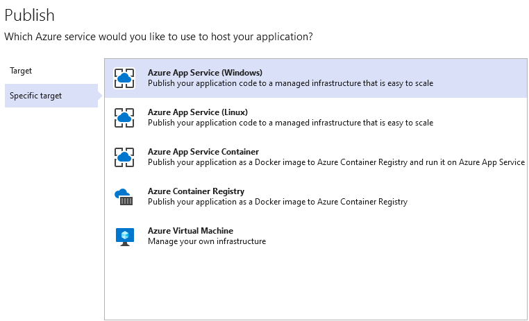
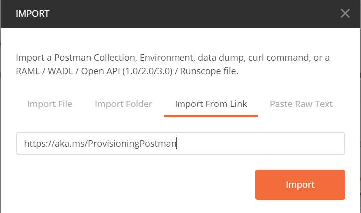
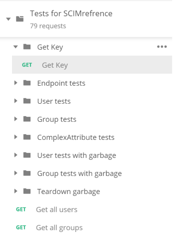

# Tutorial: Develop a sample SCIM endpoint

This tutorial descibes how to build a [SCIM](https://docs.microsoft.com/azure/active-directory/manage-apps/use-scim-to-provision-users-and-groups) endpoint and offers guidance on how to implement CRUD operations.  The example includes support for a user and group object and optional features such as filtering and pagination.

In this tutorial, you'll see how to:

> [!div class="checklist"]
> * Download the reference code
> * Deploy your SCIM endpoint in Azure
> * Test your SCIM endpoint

The endpoint capabilities, included are:

|Endpoint|Description|
|---|---|
|`/User`|Perform CRUD operations on a user resource: **Create**, **Update**, **Delete**, **Get**, **List**, **Filter**|
|`/Group`|Perform CRUD operations on a group resource: **Create**, **Update**, **Delete**, **Get**, **List**, **Filter**|
|`/Schemas`|Retrieve one or more supported schemas.<br/><br/>The set of attributes of a resource supported by each service provider can vary, e.g. Service Provider A supports “name”, “title”, and “emails” while Service Provider B supports “name”, “title”, and “phoneNumbers” for users.|
|`/ResourceTypes`|Retrieve supported resource types.<br/><br/>The number and types of resources supported by each service provider can vary, e.g. Service Provider A supports users while Service Provider B supports users and groups.|
|`/ServiceProviderConfig`|Retrieve service provider's SCIM configuration<br/><br/>The SCIM features supported by each service provider can vary, e.g. Service Provider A supports Patch operations while Service Provider B supports Patch Operations and Schema Discovery.|

## Download the reference code

The [reference code](https://github.com/AzureAD/SCIMReferenceCode) to be downloaded includes the following projects:

- **Microsoft.SystemForCrossDomainIdentityManagement**, the .NET Core MVC web API to build and provision a SCIM API
- **Microsoft.SCIM.WebHostSample**, a working example of a SCIM endpoint

The projects contain the following folders and files:

|File/folder|Description|
|-|-|
|**Schemas** folder| The models for the **User** and **Group** resources along with some abstract classes like Schematized for shared functionality.<br/><br/> An **Attributes** folder which contains the class definitions for complex attributes of **Users** and **Groups** such as addresses.|
|**Service** folder | Contains logic for actions relating to the way resources are queried and updated.<br/><br/> The reference code has services to return users and groups.<br/><br/>The **controllers** folder contains the various SCIM endpoints. Resource controllers include HTTP verbs to perform CRUD operations on the resource (**GET**, **POST**, **PUT**, **PATCH**, **DELETE**). Controllers rely on services to perform the actions.|
|**Protocol** folder|Contains logic for actions relating to the way resources are returned according to the SCIM RFC such as:<br/><br/><ul><li>Returning multiple resources as a list.</li><li>Returning only specific resources based on a filter.</li><li>Turning a query into a list of linked lists of single filters.</li><li>Turning a PATCH request into an operation with attributes pertaining to the value path.</li></li>Defining the type of operation that can be used to apply changes to resource objects.</li></ul>|
|`Microsoft.SystemForCrossDomainIdentityManagement`| Sample source code.|
|`Microsoft.SCIM.WebHostSample`| Sample implementation of the SCIM library.|
|*.gitignore*|Define what to ignore at commit time.|
|*CHANGELOG.md*|List of changes to the sample.|
|*CONTRIBUTING.md*|Guidelines for contributing to the sample.|
|*README.md*|This **README** file.|
|*LICENSE*|The license for the sample.|

> [!NOTE]
> This code is intended to help start build a SCIM endpoint and is provided **AS IS**. The references included have no guarantee of active maintainence or support.
>
> This project has adopted the [Microsoft Open Source Code of Conduct](https://opensource.microsoft.com/codeofconduct/). As such [contributions](https://github.com/AzureAD/SCIMReferenceCode/wiki/Contributing-Overview) from the community are welcome to help build and maintain the repo, and like other open-source contributions, you will agree to a Contributor License Agreement (CLA). This agreement declares that you have and grant the rights to use your contribution, for details, see [Microsoft Open Source](https://cla.opensource.microsoft.com).
>
> For more information, see the [Code of Conduct FAQ](https://opensource.microsoft.com/codeofconduct/faq/) or contact [opencode@microsoft.com](mailto:opencode@microsoft.com) with any additional questions or comments.

###  Use multiple environments

The included SCIM code uses an ASP.NET Core environment to control it's authorization for use in development and after deployment, see [Use multiple environments in ASP.NET Core](https://docs.microsoft.com/aspnet/core/fundamentals/environments?view=aspnetcore-3.1).

```csharp
private readonly IWebHostEnvironment _env;
...

public void ConfigureServices(IServiceCollection services)
{
    if (_env.IsDevelopment())
    {
        ...
    }
    else
    {
        ...
    }
```

## Deploy your SCIM endpoint in Azure

The SCIM reference code can be run locally, hosted by a on-premises server, or deployed to a service. The steps provided here deploy the SCIM endpoint to an external service using [Visual Studio 2019](https://visualstudio.microsoft.com/downloads/) and [Azure App Services](https://docs.microsoft.com/azure/app-service/).

### Open solution and deploy to Azure App Service

1. Download the [reference code](https://github.com/AzureAD/SCIMReferenceCode) from GitHub. Select **Clone or download**, thne either:
   - Select **Open in Desktop**
   - Copy the link, open **Visual Studio**, and select **Clone or check out code** to enter copied link to make a local copy.

1. In **Visual Studio**, be sure to sign into the account that has access to your hosting resources.

1. In **Solution Explorer**, open *Microsoft.SCIM.sln* and right-click the *Microsoft.SCIM.WebHostSample* file. Select **Publish**.

    

    > [!NOTE]
    > To run this solution locally, double-click the project and select **IIS Express** to launch the project as a web page with a local host URL.

1. Select **Create profile** and make sure **App Service** and **Create new** are selected.

	

1. Step through the dialog options and rename the app to a name of your choice. This name is used in both the app and the SCIM endpoint URL.

	

1. Select the resource group to use and choose **Publish**.

1. Navigate to the application in **Azure App Services** > **Configuration** and select **New application setting** to add the *Token__TokenIssuer* setting with the value `https://sts.windows.net/<tenant_id>/`. Replace `<tenant_id>` with your Azure AD tenant_id and if you're looking to test the SCIM endpoint using [Postman](https://github.com/AzureAD/SCIMReferenceCode/wiki/Test-Your-SCIM-Endpoint), also add a *ASPNETCORE_ENVIRONMENT* setting with the value `Development`. 

   When testing your endpoint with an Enterprise Application in the Azure Portal, choose to keep the environment as `Development` and provide the token generated from the `/scim/token` endpoint for testing or change the environment to `Production` and leave the token field empty in the enterprise application in the [Azure Portal](https://docs.microsoft.com/azure/active-directory/app-provisioning/use-scim-to-provision-users-and-groups#step-4-integrate-your-scim-endpoint-with-the-azure-ad-scim-client). 

	

That's it! Your SCIM endpoint is now published and allows you to use the Azure App Service URL to test the SCIM endpoint.

## Test your SCIM endpoint

The requests to a SCIM endpoint requires authorization and the SCIM standard leaves multiple options for authentication and authorization, such as cookies, basic authentication, TLS client authentication, or any of the methods listed in [RFC 7644](https://tools.ietf.org/html/rfc7644#section-2).

Be sure to avoid insecure methods, such as username/password, in favor of a more secure method such as OAuth. Azure AD supports long-lived bearer tokens (for gallery and non-gallery applications) and the OAuth authorization grant (for applications published in the app gallery).

> [!NOTE]
> The authorization methods provided in the repo are for testing only. When integrating with Azure AD, you can review the authorization guidance, see [Plan provisioning for a SCIM endpoint](https://docs.microsoft.com/azure/active-directory/app-provisioning/use-scim-to-provision-users-and-groups#authorization-for-provisioning-connectors-in-the-application-gallery). 

The development environment enables features unsafe for production, such as reference code to control the behavior of the security token validation. The token validation code is configured to use a self signed security token and the signing key is stored in the configuration file, see the **Token:IssuerSigningKey** parameter in the *appsettings.Development.json* file.

```json
"Token": {
    "TokenAudience": "Microsoft.Security.Bearer",
    "TokenIssuer": "Microsoft.Security.Bearer",
    "IssuerSigningKey": "A1B2C3D4E5F6A1B2C3D4E5F6",
    "TokenLifetimeInMins": "120"
}
```

> [!NOTE]
> By sending a **GET** request to the `/scim/token` endpoint, a token is issued using the configured key and can be used as bearer token for subsequent authorization.

The default token validation code is configured to use a token issued by Azure Active Directory and requires the issuing tenant be configured using the **Token:TokenIssuer** parameter in the *appsettings.json* file.

``` json
"Token": {
    "TokenAudience": "8adf8e6e-67b2-4cf2-a259-e3dc5476c621",
    "TokenIssuer": "https://sts.windows.net/<tenant_id>/"
}
```

### Use Postman to test endpoints

After the SCIM endpoint is deployed, you can test to ensure it's SCIM RFC compliant. This example provides a set of tests in **Postman** to validate CRUD operations on users and groups, filtering, updates to group membership, and disabling users.

The endpoints are located in the `{host}/scim/` directory and can be interacted with using standard HTTP requests. To modify the `/scim/` route, see *ControllerConstant.cs* in **AzureADProvisioningSCIMreference** > **ScimReferenceApi** > **Controllers**.

> [!NOTE]
> You can only use HTTP endpoints for local tests as the Azure AD provisioning service requires your endpoint support HTTPS.

#### Open Postman and run tests

1. Download [Postman](https://www.getpostman.com/downloads/) and start application.
1. Copy the link [https://aka.ms/ProvisioningPostman](https://aka.ms/ProvisioningPostman) and paste into Postman to import the test collection.

	

1. Create a test environment with the variables below:

   |Environment|Variable|Value|
   |-|-|-|
   |Run project locally using IIS Express|||
   ||**Server**|localhost|
   ||**Port**|:44359 *(don't forget the `:`)*|
   ||**Api**|scim|
   |Run project locally using Kestrel|||
   ||**Server**|localhost|
   ||**Port**|:5001 *(don't forget the `:`)*|
   ||**Api**|scim|
   |Hosting the endpoint in Azure|||
   ||**Server**|*(input your SCIM URL)*|
   ||**Port**|*(leave blank)*|
   ||**Api**|scim|

1. Use **Get Key** from the Postman Collection to send a **GET** request to the token endpoint and retrieve a security token to be stored in the **token** variable for subsequent requests. 

   

   > [!NOTE]
   > To make a SCIM endpoints secure, you need a security token before connecting, and the tutorial uses the `{host}/scim/token` endpoint to generate a self-signed token.

That's it! You can now run the **Postman** collection to test the SCIM endpoint functionality.

## Next Steps

To develop a SCIM compliant user and group endpoint with interoperability for any [SCIM client](http://www.simplecloud.info/#Implementations2), see [Azure AD SCIM client](https://docs.microsoft.com/azure/active-directory/app-provisioning/use-scim-to-provision-users-and-groups).

> [!div class="nextstepaction"]
> [Tutorial: Develop and plan provisioning for a SCIM endpoint](use-scim-to-provision-users-and-groups.md)
> [Tutorial: Configure provisioning for a gallery app](configure-automatic-user-provisioning-portal.md)