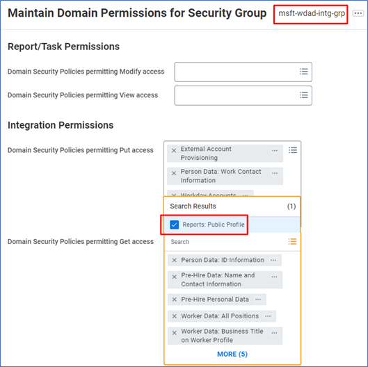
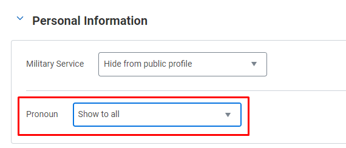
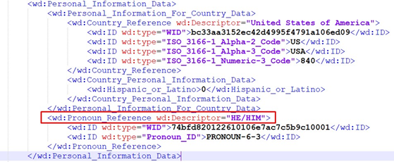

# Configure Microsoft Entra provisioning to retrieve pronoun information from Workday
This article describes how you can customize the following two HR-driven provisioning apps to fetch pronoun information from Workday.

* [Workday to on-premises Active Directory user provisioning](~/identity/saas-apps/workday-inbound-tutorial.md)
* [Workday to Microsoft Entra user provisioning](~/identity/saas-apps/workday-inbound-cloud-only-tutorial.md)

## About pronoun information in Workday
Workday introduced the ability for workers to [display pronoun information](https://community.workday.com/node/731178) in their worker profile in Workday 2021 R1 release. The ability to fetch pronoun data using Workday Web Services (WWS) API call was introduced in [Get_Workers API version 38.1](https://community.workday.com/sites/default/files/file-hosting/productionapi/Human_Resources/v38.1/Get_Workers.html) in Workday 2022 R1 release. 

>[!NOTE]
>Links to certain Workday community notes and documents in this article require Workday community account credentials. Please check with your Workday administrator or partner to get the required access.

## Enabling pronoun data in Workday
This section describes the steps required to enable pronoun data in Workday. We recommend engaging your Workday administrator to complete the steps listed. 
1. Ensure that pronoun display and sharing preferences are enabled as per Workday guidelines. Refer to the Workday documents:
   - [Steps: Set Up Gender Pronouns to Display on a Worker Profile * Human Capital Management * Reader * Administrator Guide (workday.com)](https://doc.workday.com/r/gJQvxHUyQOZv_31Vknf~3w/7gZPvVfbRhLiPissprv6lQ)
   - [Steps: Set Up Public Profile Preferences * Human Capital Management * Reader * Administrator Guide (workday.com)](https://doc.workday.com/r/gJQvxHUyQOZv_31Vknf~3w/FuENV1VTRTHWo_h93KIjJA)
1. Use Workday **Maintain Pronouns** task to define preferred pronoun data (HE/HIM, SHE/HER, and THEY/THEM) in your Workday tenant.
1. Use Workday **Maintain Localization Settings task -> Personal Information** area to activate pronoun data for different countries/regions. 
1. Select the Workday Integration System Security Group used with your Microsoft Entra integration. Update the [domain permissions for the security group](~/identity/saas-apps/workday-inbound-tutorial.md#configuring-domain-security-policy-permissions), so it has GET access for the Workday domain **Reports: Public Profile**.
    >[!div class="mx-imgBorder"] 
    >
1. Activate Pending Security Policy changes.
1. Select a worker in your Workday tenant for testing purposes. Set pronoun information for this worker using the **Edit Personal Information** task. Ensure that the worker has enabled pronoun display to all in their public profile preference. 

    >[!div class="mx-imgBorder"] 
    >

1. Use Workday Studio or Postman to invoke [Get_Workers API version 38.1](https://community.workday.com/sites/default/files/file-hosting/productionapi/Human_Resources/v38.1/Get_Workers.html) for the test user using the Workday Microsoft Entra integration system user. In the SOAP request header, specify the option Include_Reference_Descriptors_In_Response. 
    ```
      <bsvc:Workday_Common_Header>
         <bsvc:Include_Reference_Descriptors_In_Response>true</bsvc:Include_Reference_Descriptors_In_Response>
      </bsvc:Workday_Common_Header> 
    ```
1. In the Get_Workers response, view the pronoun information. 

    >[!div class="mx-imgBorder"] 
    >

>[!NOTE]
>If you are not able to retrieve pronoun data in the *Get_Workers* response, then troubleshoot Workday domain security permissions. Ensure your integration security group has permission to the segmented security group that grants access to the pronoun data. 

Once you confirm that pronoun data is available in the *Get_Workers* response, go to the next step of updating your Microsoft Entra provisioning app configuration. 
 
<a name='updating-azure-ad-provisioning-app-to-retrieve-pronouns'></a>

To retrieve pronouns from Workday, update your Microsoft Entra provisioning app to query Workday using v38.1 of the Workday Web Services. We recommend testing this configuration first in your test/sandbox environment before implementing the change in production.

1. Sign in to the [Microsoft Entra admin center](https://entra.microsoft.com) as at least a [Application Administrator](~/identity/role-based-access-control/permissions-reference.md#application-administrator).
1. Browse to **Identity** > **Applications** > **Enterprise applications**.
1. Select your Workday to Active Directory / Microsoft Entra user provisioning application and go to **Provisioning** .
1. In the **Admin Credentials** section, update the **Tenant URL** to include the Workday Web Service version v38.1 as shown.

     >[!div class="mx-imgBorder"] 
     >

1. Open the **Attribute mappings** blade. Scroll down and click **Show advanced options**. Click on **Edit attribute list for Workday**.
1. If your provisioning app is configured to use the default WWS API version v21.1, then [reference this article to review and update the XPATHs for each attribute](workday-attribute-reference.md#xpath-values-for-workday-web-services-wws-api-v30).
1. Add a new attribute called **PreferredPronoun** with XPATH 

     `/wd:Worker/wd:Worker_Data/wd:Personal_Data/wd:Personal_Information_Data/wd:Pronoun_Reference/@wd:Descriptor`

1. Save your changes. 
1. You can now add a new attribute mapping to flow the Workday attribute **PreferredPronoun** to any attribute in AD/Microsoft Entra ID.
1. If you want to incorporate pronoun information as part of display name, you can update the attribute mapping for displayName attribute to use the expression. 

     `Switch([PreferredPronoun], Join("", [PreferredNameData], " (", [PreferredPronoun], ")"), "", [PreferredNameData])`

1. If worker *Aaron Hall* has set his pronoun information in Workday as `HE/HIM`, the above expression sets the display name in Microsoft Entra ID as: *Aaron Hall (HE/HIM)*
1. Save your changes. 
1. Test the configuration for one user with provisioning on demand. 
 
## Next steps

* [Learn how to configure Workday to Active Directory provisioning](~/identity/saas-apps/workday-inbound-tutorial.md)
* [Learn how to configure write back to Workday](~/identity/saas-apps/workday-writeback-tutorial.md)
* [Learn more about supported Workday Attributes for inbound provisioning](workday-attribute-reference.md)
