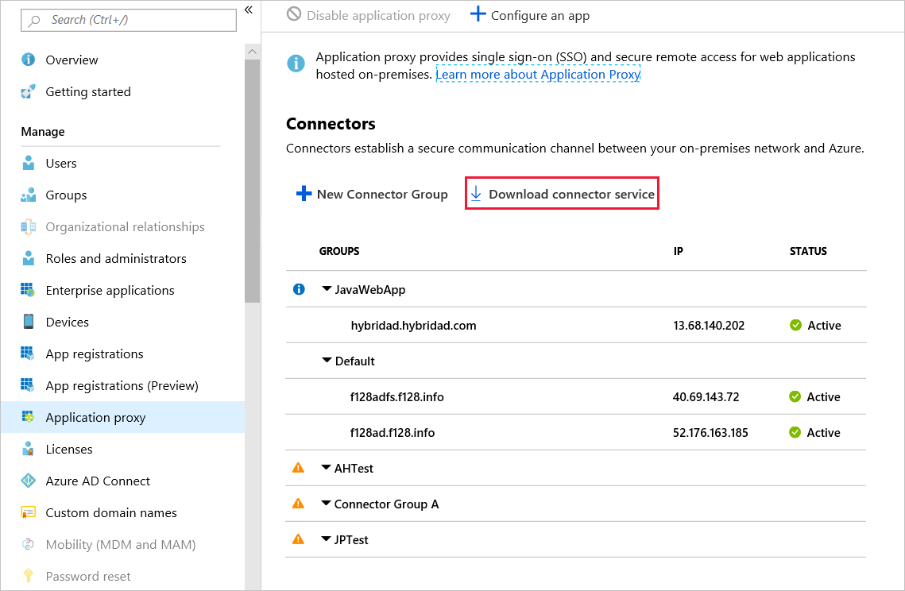
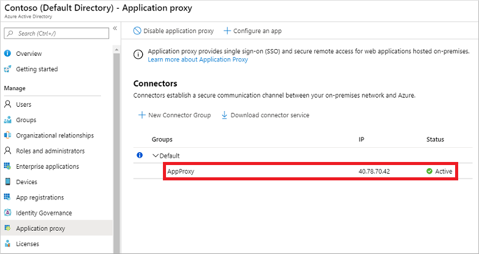
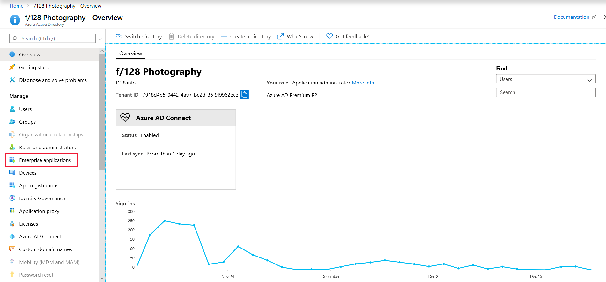

# Integrate with Microsoft Entra application proxy on a Network Device Enrollment Service (NDES) server

Microsoft Entra application proxy lets you publish applications inside your network. These applications are ones such as SharePoint sites, Microsoft Outlook Web App, and other web applications. It also provides secure access to users outside your network via Azure.

If you're new to Microsoft Entra application proxy and want to learn more, see [Remote access to on-premises applications through Microsoft Entra application proxy](application-proxy.md).

Microsoft Entra application proxy is built on Azure. It gives you a massive amount of network bandwidth and server infrastructure for better protection against distributed denial-of-service (DDOS) attacks and superb availability. Furthermore, there's no need to open external firewall ports to your on-premises network and no DMZ server is required. All traffic is originated inbound. For a complete list of outbound ports, see [Tutorial: Add an on-premises application for remote access through Application Proxy in Microsoft Entra ID](./application-proxy-add-on-premises-application.md#prepare-your-on-premises-environment).

> Microsoft Entra application proxy is a feature that is available only if you are using the Premium or Basic editions of Microsoft Entra ID. For more information, see [Microsoft Entra pricing](https://www.microsoft.com/security/business/identity-access-management/azure-ad-pricing). 
> If you have Enterprise Mobility Suite (EMS) licenses, you are eligible to use this solution.
> The Microsoft Entra application proxy connector only installs on Windows Server 2012 R2 or later. This is also a requirement of the NDES server.

## Install and register the connector on the NDES server

[!INCLUDE [portal updates](~/articles/active-directory/includes/portal-update.md)]

1. Sign in to the [Microsoft Entra admin center](https://entra.microsoft.com) as at least a [Application Administrator](~/identity/role-based-access-control/permissions-reference.md#application-administrator).
1. Select your username in the upper-right corner. Verify you're signed in to a directory that uses Application Proxy. If you need to change directories, select **Switch directory** and choose a directory that uses Application Proxy.
1. Browse to **Identity** > **Applications** > **Enterprise applications** > **Application proxy**.
1. Select **Download connector service**.

    

1. Read the Terms of Service. When you're ready, select **Accept terms & Download**.
1. Copy the Microsoft Entra application proxy connector setup file to your NDES server. 
   > You can install the connector on any server within your corporate network with access to NDES. You don't have to install it on the NDES server itself.
1. Run the setup file, such as *AADApplicationProxyConnectorInstaller.exe*. Accept the software license terms.
1. During the install, you're prompted to register the connector with the Application Proxy in your Microsoft Entra directory.
   * Provide the credentials for a global or application administrator in your Microsoft Entra directory. The Microsoft Entra global or application administrator credentials may be different from your Azure credentials in the portal.

        > [!NOTE]
        > The global or application administrator account used to register the connector must belong to the same directory where you enable the Application Proxy service.
        >
        > For example, if the Microsoft Entra domain is *contoso.com*, the global/application administrator should be `admin@contoso.com` or another valid alias on that domain.

   * If Internet Explorer Enhanced Security Configuration is turned on for the server where you install the connector, the registration screen might be blocked. To allow access, follow the instructions in the error message, or turn off Internet Explorer Enhanced Security during the install process.
   * If connector registration fails, see [Troubleshoot Application Proxy](application-proxy-troubleshoot.md).
1. At the end of the setup, a note is shown for environments with an outbound proxy. To configure the Microsoft Entra application proxy connector to work through the outbound proxy, run the provided script, such as `C:\Program Files\Microsoft AAD App Proxy connector\ConfigureOutBoundProxy.ps1`.
1. On the Application proxy page in the Microsoft Entra admin center, the new connector is listed with a status of *Active*, as shown in the following example:

    

    > [!NOTE]
    > To provide high availability for applications authenticating through the Microsoft Entra application proxy, you can install connectors on multiple VMs. Repeat the same steps listed in the previous section to install the connector on other servers joined to the Microsoft Entra Domain Services managed domain.

1. After successful installation, go back to the Microsoft Entra admin center.

1. Select **Enterprise applications**.

   

1. Select **+New Application**, and then select **On-premises application**. 

1. On the **Add your own on-premises application**, configure the following fields:

   * **Name**: Enter a name for the application.
   * **Internal Url**: Enter the internal URL/FQDN of your NDES server on which you installed the connector.
   * **Pre Authentication**: Select **Passthrough**. It’s not possible to use any form of pre authentication. The protocol used for Certificate Requests (SCEP) doesn't provide such option.
   * Copy the provided **External URL** to your clipboard.

1. Select **+Add** to save your application.

1. Test whether you can access your NDES server via the Microsoft Entra application proxy by pasting the link you copied in step 15 into a browser. You should see a default IIS welcome page.
1. As a final test, add the *mscep.dll* path to the existing URL you pasted in the previous step:
    `https://scep-test93635307549127448334.msappproxy.net/certsrv/mscep/mscep.dll`
1. You should see an **HTTP Error 403 – Forbidden** response.
1. Change the NDES URL provided (via Microsoft Intune) to devices. This change could either be in Microsoft Configuration Manager or the Microsoft Intune admin center.
    - For Configuration Manager, go to the certificate registration point and adjust the URL. This URL is what devices call out to and present their challenge.
    - For Intune standalone, either edit or create a new SCEP policy and add the new URL.

## Next steps

With the Microsoft Entra application proxy integrated with NDES, publish applications for users to access. For more information, see [publish applications using Microsoft Entra application proxy](./application-proxy-add-on-premises-application.md).
