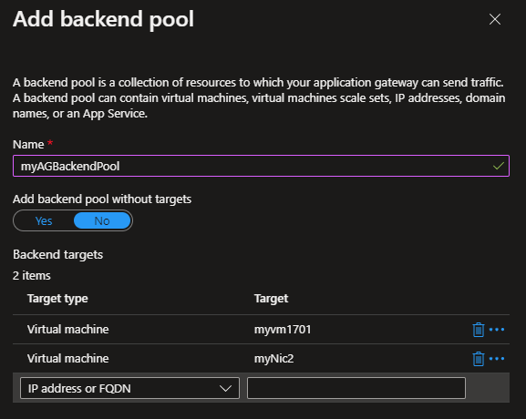
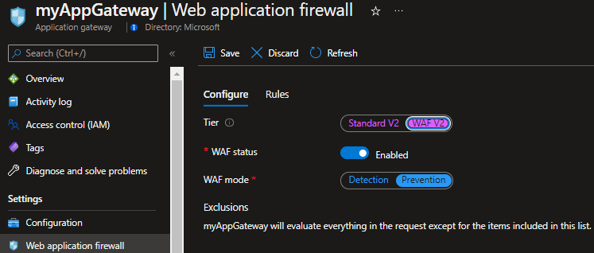

# Using Application Gateway WAF to protect your application

When using Azure Active Directory (Azure AD) Application Proxy to expose applications deployed on-premises, on sealed Azure Virtual Networks, or in other public clouds, you can integrate a Web Application Firewall (WAF) in the data flow in order to protect your application from malicious attacks.

## What is Azure Web Application Firewall?

Azure Web Application Firewall (WAF) on Azure Application Gateway provides centralized protection of your web applications from common exploits and vulnerabilities. Web applications are increasingly targeted by malicious attacks that exploit commonly known vulnerabilities. SQL injection and cross-site scripting are among the most common attacks. For more information about Azure WAF on Application Gateway, see [What is Azure Web Application Firewall on Azure Application Gateway?][waf-overview].

## Deployment steps

This article guides you through the steps to securely expose a web application on the Internet, by integrating the Azure AD Application Proxy with Azure WAF on Application Gateway. In this guide we'll be using the Azure portal. The reference architecture for this deployment is represented below.   

### Configure Azure Application Gateway to send traffic to your internal application.

Some steps of the Application Gateway configuration will be omitted in this article. For a detailed guide on how to create and configure an Application Gateway, see [Quickstart: Direct web traffic with Azure Application Gateway - Azure portal][appgw_quick].

1. Create a private-facing HTTPS listener.

This will allow users to access the web application privately when connected to the corporate network.

2. Create a backend pool with the web servers.

In this example, the backend servers have Internet Information Services (IIS) installed. 

3. Create a backend setting. 

This will determine how requests will reach the backend pool servers.

 
 4. Create a routing rule that ties the listener, the backend pool, and the backend setting created in the previous steps.
 
 
 
 
 5. Enable the WAF in the Application Gateway and set it to Prevention mode.
 
 
 
 ### Configure your application to be remotely accessed through Application Proxy in Azure AD.
 
As represented in the diagram above, both connector VMs, the Application Gateway, and the backend servers were deployed in the same VNET in Azure. This setup also applies to applications and connectors deployed on-premises. 

For a detailed guide on how to add your application to Application Proxy in Azure AD, see [Tutorial: Add an on-premises application for remote access through Application Proxy in Azure Active Directory][appproxy-add-app]. For more information about performance considerations concerning the Application Proxy connectors, see [Optimize traffic flow with Azure Active Directory Application Proxy][appproxy-optimize]. 
 

In this example, the same URL was configured as the internal and external URL. Remote clients will access the application over the Internet on port 443, through the Application Proxy, whereas clients connected to the corporate network will access the application privately through the Application Gateway directly, also on port 443. For a detailed step on how to configure custom domains in Application Proxy, see [Configure custom domains with Azure AD Application Proxy][appproxy-custom-domain].

To ensure the connector VMs send requests to the Application Gateway, an [Azure Private DNS zone][private-dns] was created with an A record pointing www.fabrikam.one to the private frontend IP of the Application Gateway.

### Test the application.

After [adding a user for testing][appproxy-add-user], you can test the application by accessing https://www.fabrikam.one.

![add authentication image]
![add server response image]

### Simulate an attack.

To test if the WAF is blocking malicious requests, you can simulate an attack by using a basic SQL injection signature. For example, "https://www.fabrikam.one/api/sqlquery?query=x%22%20or%201%3D1%20--".

![waf403 image]

An HTTP 403 response confirms that the request was blocked by the WAF.

The Application Gateway [Firewall logs][waf-logs] provide more details about the request and why it was blocked by the WAF.

![waflog image]

## Next steps

Configure custom WAF rules?

[appgw-quick]: /azure/application-gateway/quick-create-portal
[waf-overview]: /azure/web-application-firewall/ag/ag-overview
[waf-create]: /azure/web-application-firewall/ag/application-gateway-web-application-firewall-portal
[waf-logs]: /azure/application-gateway/application-gateway-diagnostics#firewall-log
[appproxy-create]: /azure/active-directory/app-proxy/application-proxy-add-on-premises-application
[appproxy-add-app]: /azure/active-directory/app-proxy/application-proxy-add-on-premises-application
[appproxy-add-user]: /azure/active-directory/app-proxy/application-proxy-add-on-premises-application#add-a-user-for-testing
[appproxy-custom-domain]: /azure/active-directory/app-proxy/application-proxy-configure-custom-domain
[appproxy-optimize]: /azure/active-directory/app-proxy/application-proxy-network-topology
[private-dns]: /azure/dns/private-dns-getstarted-portal
