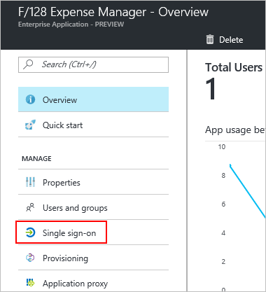

# Password vaulting for single sign-on with Application Proxy

Microsoft Entra application proxy helps you improve productivity by publishing on-premises applications so that remote employees can securely access them, too. In the Microsoft Entra admin center, you can also set up single sign-on (SSO) to these apps. Your users only need to authenticate with Microsoft Entra ID, and they can access your enterprise application without having to sign in again.

Application Proxy supports several [single sign-on modes](~/identity/enterprise-apps/plan-sso-deployment.md#choosing-a-single-sign-on-method). Password-based sign-on is intended for applications that use a username/password combination for authentication. When you configure password-based sign-on for your application, your users have to sign in to the on-premises application once. After that, Microsoft Entra ID stores the sign-in information and automatically provides it to the application when your users access it remotely.

You should already have published and tested your app with Application Proxy. If not, follow the steps in [Publish applications using Microsoft Entra application proxy](application-proxy-add-on-premises-application.md) then come back here.

## Set up password vaulting for your application

[!INCLUDE [portal updates](~/includes/portal-update.md)]

1. Sign in to the [Microsoft Entra admin center](https://entra.microsoft.com) as at least a [Application Administrator](~/identity/role-based-access-control/permissions-reference.md#application-administrator).
1. Browse to **Identity** > **Applications** > **Enterprise applications** > **All applications**.
1. From the list, select the app that you want to set up with SSO.  
1. Select **Application Proxy**. 
1. Change the **Pre Authentication type** to **Passthrough** and select **Save**. Later you can switch back to **Microsoft Entra ID** type again! 
1. Select **Single sign-on**.

   

1. For the SSO mode, choose **Password-based Sign-on**.
1. For the Sign-on URL, enter the URL for the page where users enter their username and password to sign in to your app outside of the corporate network. This may be the External URL that you created when you published the app through Application Proxy.

   

1. Select **Save**.
1. Select **Application Proxy**. 
1. Change the **Pre Authentication type** to **Microsoft Entra ID** and select **Save**. 
1. Select **Users and Groups**.
1. Assign users to the application with selecting **Add user**. 
1. If you want to predefine credentials for a user, check the box front of the user name and select **Update credentials**.
1. Browse to **Identity** > **Applications** > **App registrations** > **All applications**.
1. From the list, select the app that you configured with Password SSO.
1. Select **Branding**. 
1. Update the **Home page URL** with the **Sign on URL** from the Password SSO page and select **Save**.  

<!-- Need to repro?
7. The page should tell you that a sign-in form was successfully detected at the provided URL. If it doesn't, select **Configure [your app name] Password Single Sign-on Settings** and choose **Manually detect sign-in fields**. Follow the instructions to point out where the sign-in credentials go. 
-->

## Test your app

Go to the My Apps portal. Sign in with your credentials (or the credentials for a test account that you set up with access). Once you signed in successfully, click on the icon of the app. This might trigger the installation of the My Apps Secure Sign-in browser extension. If your user had predefined credentials the authentication to the app should happen automatically, otherwise you must specify the user name or password for the first time. 

## Next steps

- Read about other ways to implement [Single sign-on](~/identity/enterprise-apps/what-is-single-sign-on.md)
- Learn about [Security considerations for accessing apps remotely with Microsoft Entra application proxy](application-proxy-security.md)
