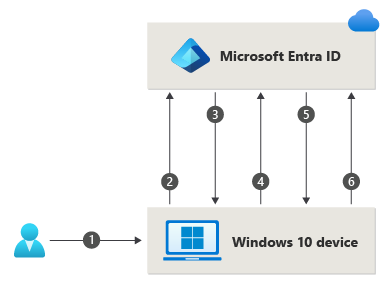

# Windows Hello for Business authentication in Microsoft Entra ID

Windows Hello for Business is ideal for information workers that have their own designated Windows PC. The biometric and PIN credentials are directly tied to the user's PC, which prevents access from anyone other than the owner. With public key infrastructure (PKI) integration and built-in support for single sign-on (SSO), Windows Hello for Business provides a convenient method for seamlessly accessing corporate resources on-premises and in the cloud.

The following steps show how the sign-in process works with Microsoft Entra ID:

1. A user signs into Windows using biometric or PIN gesture. The gesture unlocks the Windows Hello for Business private key and is sent to the Cloud Authentication security support provider, referred to as the *Cloud AP provider*.
1. The Cloud AP provider requests a nonce (a random arbitrary number that can be used just once) from Microsoft Entra ID.
1. Microsoft Entra ID returns a nonce that's valid for 5 minutes.
1. The Cloud AP provider signs the nonce using the user's private key and returns the signed nonce to the Microsoft Entra ID.
1. Microsoft Entra ID validates the signed nonce using the user's securely registered public key against the nonce signature.  Microsoft Entra ID validates the signature and then validates the returned signed nonce. When the nonce is validated, Microsoft Entra ID creates a primary refresh token (PRT) with session key that is encrypted to the device's transport key and returns it to the Cloud AP provider.
1. The Cloud AP provider receives the encrypted PRT with session key. The Cloud AP provider uses the device's private transport key to decrypt the session key and protects the session key using the device's Trusted Platform Module (TPM).
1. The Cloud AP provider returns a successful authentication response to Windows. The user is then able to access Windows as well as cloud and on-premises applications without the need to authenticate again (SSO).

The Windows Hello for Business [planning guide](/windows/security/identity-protection/hello-for-business/hello-planning-guide) can be used to help you make decisions on the type of Windows Hello for Business deployment and the options you'll need to consider.

## Next steps

- [Passwordless authentication options for Microsoft Entra ID](concept-authentication-passwordless.md)

