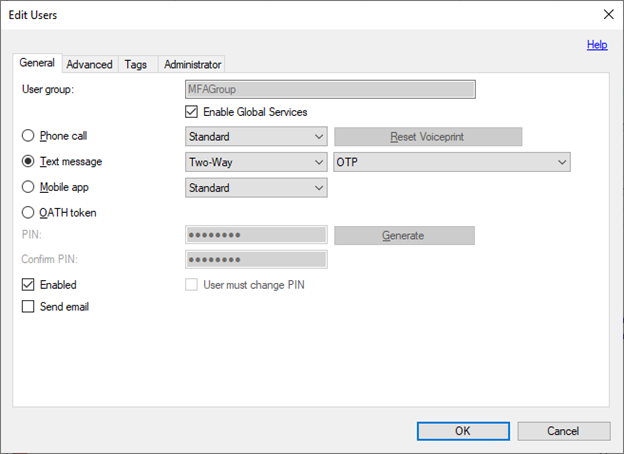

# Two-way SMS unsupported

Two-way SMS for Azure Multi-Factor Authentication Server was originally deprecated in 2018, and no longer supported after February 24, 2021, except for organizations that received a support extension until August 2, 2021. Administrators should enable another method for users who still use two-way SMS.

Email notifications and Service Health notifications (portal toasts) were sent to affected admins on December 8, 2020 and January 28, 2021. The alerts went to the Owner, Co-Owner, Admin, and Service Admin RBAC roles tied to the subscriptions. If you've already completed the following steps, no action is necessary.

## Required actions

1. Enable the mobile app for your users, if you haven't done so already. For more information, see [Enable mobile app authentication with MFA Server](howto-mfaserver-deploy-mobileapp.md).
1. Notify your end users to visit your MFA Server [User portal](howto-mfaserver-deploy-userportal.md) to activate the mobile app. The [Microsoft Authenticator app](https://www.microsoft.com/en-us/account/authenticator) is the recommended verification option since it is more secure than two-way SMS. For more information, see please see [It's Time to Hang Up on Phone Transports for Authentication](https://techcommunity.microsoft.com/t5/azure-active-directory-identity/it-s-time-to-hang-up-on-phone-transports-for-authentication/ba-p/1751752).
1. Change the user settings from two-way text message to mobile app as the default method.

## FAQ

### What if I don't change the default method from two-way SMS to the mobile app?
Two-way SMS fails after February 24, 2021. Users will see an error when they try to sign in and pass MFA.

### How do I change the user settings from two-way text message to mobile app?

You should change the user settings by following these steps:

1. In MFA Server, filter the user list for two-way text message.
1. Select all users.
1. Open the Edit Users dialog.
1. Change users from Text message to Mobile app.

   

### Do my users need to take any action? If yes, how?
Yes. Your end users need to visit your specific MFA Server User portal to activate the mobile app, if they haven't done so already. After you've done Step 3, any users that didn't visit the User Portal to set up the mobile app will start failing sign in until they visit the User portal to re-register.

### What if my users can't install the mobile app? What other options do they have?
The alternative to two-way SMS or the mobile app is a phone call. However, the Microsoft Authenticator app is the recommended verification method.

### Will one-way SMS be deprecated as well?
No, just two-way SMS is being deprecated. For MFA Server, one-way SMS works for a subset of scenarios:

- AD FS Adapter
- IIS Authentication (requires User Portal and configuration)
- RADIUS (requires that RADIUS clients support access challenge and that PAP protocol is used)

There are limitations to when one-way SMS can be used that make the mobile app a better alternative because it doesn’t require the verification code prompt.
If you still want to use one-way SMS in some scenarios, then you could leave these checked, but change the **Company Settings** section, **General** tab **User Defaults Text Message** to **One-Way** instead of **Two-Way**. Lastly, if you use Directory Synchronization that defaults to SMS, you’d need to change it to One-Way instead of Two-Way.

### How can I check which users are still using two-way SMS?
To list these users, start **MFA Server**, select the **Users** section, click **Filter User List**, and filter for **Text Message Two-Way**.

### How do we hide two-way SMS as an option in the MFA portal to prevent users from selecting it in the future?
In MFA Server User portal, click **Settings**, you can clear **Text Message** so that it is not available. 
The same is true in the **AD FS** section if you are using AD FS for user enrollment.
