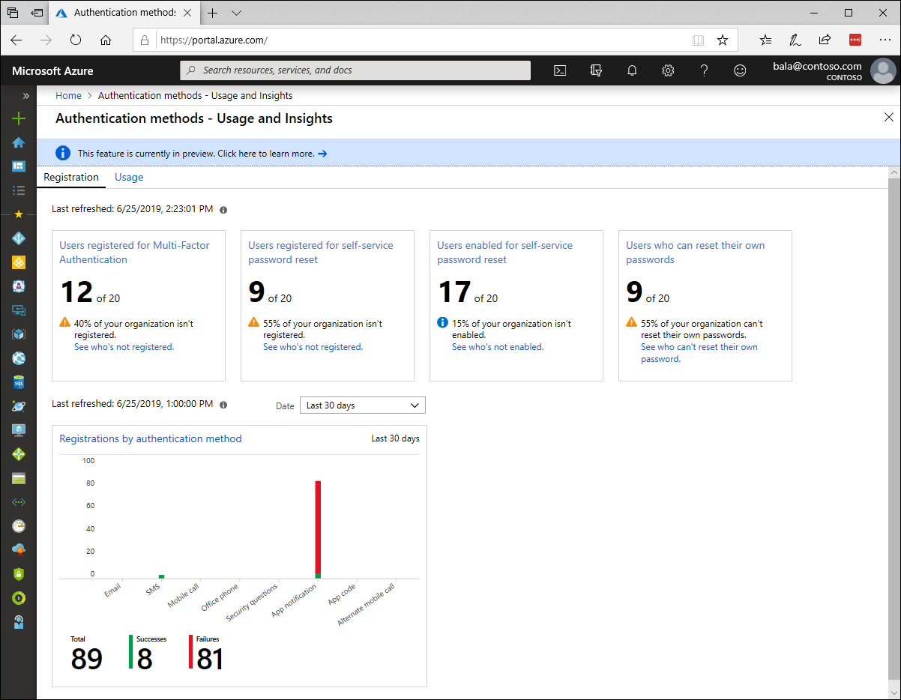

# Authentication methods usage & insights (preview)

Usage & insights enables you to understand how authentication methods for features like Azure AD Multi-Factor Authentication and self-service password reset are working in your organization. This reporting capability provides your organization with the means to understand what methods are being registered and how they are being used.

## Permissions and licenses

The following roles can access usage and insights:

- Global Administrator
- Security Reader
- Security Administrator
- Reports Reader

 A P1 or P2 license is required to access usage and insights. Azure AD Multi-Factor Authentication and self-service password reset (SSPR) licensing information can be found on the [Azure Active Directory pricing site](https://azure.microsoft.com/pricing/details/active-directory/).

## How it works

To access authentication method usage and insights:

1. Browse to the [Azure portal](https://portal.azure.com).
1. Browse to **Azure Active Directory** > **Password reset** > **Usage & insights**.
1. From the **Registration** or **Usage** overviews, you can choose to open the pre-filtered reports to filter based on your needs.

To access usage & insights directly, go to [https://portal.azure.com/#blade/Microsoft_AAD_IAM/AuthMethodsOverviewBlade](https://portal.azure.com/#blade/Microsoft_AAD_IAM/AuthMethodsOverviewBlade). This link will bring you to the registration overview.

The Users registered, Users enabled, and Users capable tiles show the following registration data for your users:

- Registered: A user is considered registered if they (or an admin) have registered enough authentication methods to meet your organization's SSPR or Multi-Factor Authentication policy.
- Enabled: A user is considered enabled if they are in scope for the SSPR policy. If SSPR is enabled for a group, then the user is considered enabled if they are in that group. If SSPR is enabled for all users, then all users in the tenant (excluding guests) are considered enabled.
- Capable: A user is considered capable if they are both registered and enabled. This status means that they can perform SSPR at any time if needed.

Clicking on any of these tiles or the insights shown in them will bring you to a pre-filtered list of registration details.

The **Registrations** chart on the **Registration** tab shows the number of successful and failed authentication method registrations by authentication method. The **Resets** chart on the **Usage** tab shows the number of successful and failed authentications during the password reset flow by authentication method.

Clicking on either of the charts will bring you to a pre-filtered list of registration or reset events.

Using the control in the upper, right-hand corner, you can change the date range for the audit data shown in the Registrations and Resets charts to 24 hours, 7 days, or 30 days.

### Registration details

Clicking on the **Users registered**, **Users enabled**, or **Users capable** tiles or insights will bring you to the registration details.

The registration details report shows the following information for each user:

- Name
- User name
- Registration status (All, Registered, Not registered)
- Enabled status (All, Enabled, Not enabled)
- Capable status (All, Capable, Not capable)
- Methods (App notification, App code, Phone call, SMS, Email, Security questions)

Using the controls at the top of the list, you can search for a user and filter the list of users based on the columns shown.

### Reset details

Clicking on the Registrations or Resets charts will bring you to the reset details.

The reset details report shows registration and reset events from the last 30 days including:

- Name
- User name
- Feature (All, Registration, Reset)
- Authentication method (App notification, App code, Phone call, Office call, SMS, Email, Security questions)
- Status (All, Success, Failure)

Using the controls at the top of the list, you can search for a user and filter the list of users based on the columns shown.

## Limitations

The data shown in these reports will be delayed by up to 60 minutes. A "Last refreshed" field exists in the Azure portal to identify how recent your data is.

Usage and insights data is not a replacement for the Azure AD Multi-Factor Authentication activity reports or information contained in the Azure AD sign-ins report.

Report can't currently be filtered to exclude external users.

## Next steps

- [Working with the authentication methods usage report API](/graph/api/resources/authenticationmethods-usage-insights-overview?view=graph-rest-beta)
- [Choosing authentication methods for your organization](concept-authentication-methods.md)
- [Combined registration experience](concept-registration-mfa-sspr-combined.md)