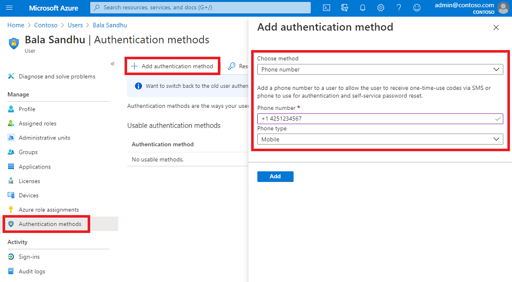

# Configure and enable users for SMS-based authentication using Azure Active Directory (preview)

To reduce the complexity and security risks for users to sign in to applications and services, Azure Active Directory (Azure AD) provides multiple authentication options. SMS-based authentication, currently in preview, lets users sign in without needing provide, or even know, their username or password. After their account is created by an identity administrator, they can enter their phone number at the sign-in prompt, and then provide an authentication code that's sent to them via text message. This authentication method simplifies access to applications and services, especially for front line workers.

This article shows you how to enable SMS-based authentication for select users or groups in Azure AD.

|     |
| --- |
| SMS-based authentication for users is a public preview feature of Azure Active Directory. For more information about previews, see [Supplemental Terms of Use for Microsoft Azure Previews](https://azure.microsoft.com/support/legal/preview-supplemental-terms/)|
|     |

## Before you begin

To complete this article, you need the following resources and privileges:

* An active Azure subscription.
    * If you don't have an Azure subscription, [create an account](https://azure.microsoft.com/free/?WT.mc_id=A261C142F).
* An Azure Active Directory tenant associated with your subscription.
    * If needed, [create an Azure Active Directory tenant][create-azure-ad-tenant] or [associate an Azure subscription with your account][associate-azure-ad-tenant].
* You need *global administrator* privileges in your Azure AD tenant to enable SMS-based authentication.

## Limitations

During the public preview of SMS-based authentication, the following limitations apply:

* SMS-based authentication isn't currently compatible with Azure Multi-Factor Authentication.
* SMS-based authentication isn't currently compatible with Azure AD self-service password reset (SSPR).
* Setting or deleting phone numbers may take up to 30 seconds to propagate through your Azure AD tenant.
* With the exception of Teams, SMS-based authentication isn't currently compatible with Office applications.

## Enable the SMS-based authentication method

There are three main steps to enable and use SMS-based authentication in your organization:

* Enable the authentication method policy.
* Select users or groups that can use the SMS-based authentication method.
* Assign a phone number for each user account.

First, let's enable SMS-based authentication for your Azure AD tenant.

1. Sign in to the [Azure portal][azure-portal] as a *global administrator*.
1. Search for and select **Azure Active Directory**.
1. From the navigation menu on the left-hand side of the Azure Active Directory window, select **Security > Authentication methods > Authentication method policy (preview)**.

    [ window in the Azure portal")](media/howto-authentication-sms-signin/authentication-method-policy.png#lightbox)

1. From the list of available authentication methods, select **Text message**.
1. Set **Enable** to *Yes*.

    

    You can choose to enable SMS-based authentication for *All users* or *Select users* and groups. In the next section, you enable SMS-based authentication for a test user.

## Assign the authentication method to users and groups

With SMS-based authentication enabled in your Azure AD tenant, now select some users or groups to be allowed to use this authentication method.

1. In the text message authentication policy window, set **Target** to *Select users*.
1. Choose to **Add users or groups**, then select a test user or group, such as *Contoso User* or *Contoso SMS Users*.

    

1. When you've selected your users or groups, choose **Select**, then **Save** the updated authentication method policy.

## Set a phone number for user accounts

Users are now enabled for SMS-based authentication, but their phone number must be associated with the user profile in Azure AD before they can sign in. The user can set this phone number themselves in their My Profile, or you can assign the phone number using the Azure portal.

1. Search for and select **Azure Active Directory**.
1. From the navigation menu on the left-hand side of the Azure Active Directory window, select **Users**.
1. Select the user you enabled for SMS-based authentication in the previous section, such as *Contoso User*, then select **Authentication methods**.
1. Enter the user's phone number including the country code, such as *+1 xxxxxxxxx*. The Azure portal validates the phone number is in the correct format.

    

1. To apply the phone number to a user's account, select **Save**.

## Next steps

For additional ways to sign in to Azure AD without a password, such as the Microsoft Authenticator App or FIDO2 security keys, see [Passwordless authentication options for Azure AD][concepts-passwordless].

<!-- INTERNAL LINKS -->
[tutorial-create-instance-advanced]: tutorial-create-instance-advanced.md
[create-azure-ad-tenant]: ../active-directory/fundamentals/sign-up-organization.md
[associate-azure-ad-tenant]: ../active-directory/fundamentals/active-directory-how-subscriptions-associated-directory.md
[network-considerations]: network-considerations.md
[concepts-passwordless]: concept-authentication-passwordless.md

<!-- EXTERNAL LINKS -->
[azure-portal]: https://portal.azure.com
