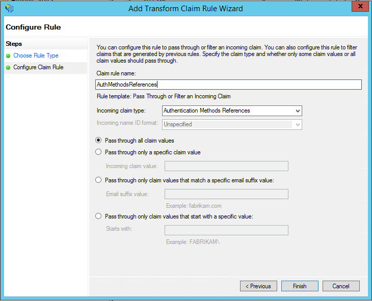
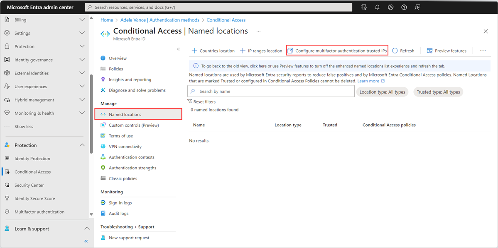

# Securing cloud resources with Azure Multi-Factor Authentication and AD FS
If your organization is federated with Azure Active Directory, use Azure Multi-Factor Authentication or Active Directory Federation Services (AD FS) to secure resources that are accessed by Azure AD. Use the following procedures to secure Azure Active Directory resources with either Azure Multi-Factor Authentication or Active Directory Federation Services.

## Secure Azure AD resources using AD FS
To secure your cloud resource, set up a claims rule so that Active Directory Federation Services emits the multipleauthn claim when a user performs two-step verification successfully. This claim is passed on to Azure AD. Follow this procedure to walk through the steps:

1. Open AD FS Management.
2. On the left, select **Relying Party Trusts**.
3. Right-click on **Microsoft Office 365 Identity Platform** and select **Edit Claim Rules**.

   

4. On Issuance Transform Rules, click **Add Rule**.

   

5. On the Add Transform Claim Rule Wizard, select **Pass Through or Filter an Incoming Claim** from the drop-down and click **Next**.

   

6. Give your rule a name. 
7. Select **Authentication Methods References** as the Incoming claim type.
8. Select **Pass through all claim values**.
    
9. Click **Finish**. Close the AD FS Management console.

## Trusted IPs for federated users
Trusted IPs allow administrators to by-pass two-step verification for specific IP addresses, or for federated users that have requests originating from within their own intranet. The following sections describe how to configure Azure Multi-Factor Authentication Trusted IPs with federated users and by-pass two-step verification when a request originates from within a federated users intranet. This is achieved by configuring AD FS to use a pass-through or filter an incoming claim template with the Inside Corporate Network claim type.

This example uses Office 365 for our Relying Party Trusts.

### Configure the AD FS claims rules
The first thing we need to do is to configure the AD FS claims. Create two claims rules, one for the Inside Corporate Network claim type and an additional one for keeping our users signed in.

1. Open AD FS Management.
2. On the left, select **Relying Party Trusts**.
3. Right-click on **Microsoft Office 365 Identity Platform** and select **Edit Claim Rules…**
   
4. On Issuance Transform Rules, click **Add Rule.**
   
5. On the Add Transform Claim Rule Wizard, select **Pass Through or Filter an Incoming Claim** from the drop-down and click **Next**.
   
6. In the box next to Claim rule name, give your rule a name. For example: InsideCorpNet.
7. From the drop-down, next to Incoming claim type, select **Inside Corporate Network**.
   
8. Click **Finish**.
9. On Issuance Transform Rules, click **Add Rule**.
10. On the Add Transform Claim Rule Wizard, select **Send Claims Using a Custom Rule** from the drop-down and click **Next**.
11. In the box under Claim rule name: enter *Keep Users Signed In*.
12. In the Custom rule box, enter:

        c:[Type == "http://schemas.microsoft.com/2014/03/psso"]
            => issue(claim = c);
    
13. Click **Finish**.
14. Click **Apply**.
15. Click **Ok**.
16. Close AD FS Management.

### Configure Azure Multi-Factor Authentication Trusted IPs with Federated Users
Now that the claims are in place, we can configure trusted IPs.

1. Sign in to the [Azure portal](https://portal.com).
2. Select **Azure Active Directory** > **Conditional access** > **Named locations**.
3. From the **Conditional access - Named locations** blade, select **Configure MFA trusted IPs**

   

4. On the Service Settings page, under **trusted IPs**, select **Skip multi-factor-authentication for requests from federated users on my intranet**.  
5. Click **save**.

That’s it! At this point, federated Office 365 users should only have to use MFA when a claim originates from outside the corporate intranet.
