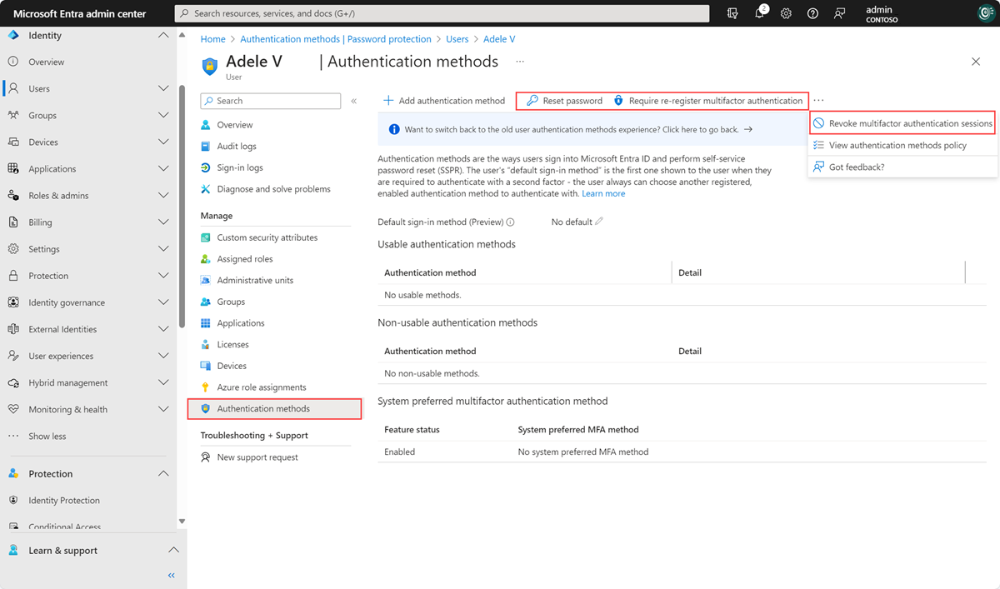
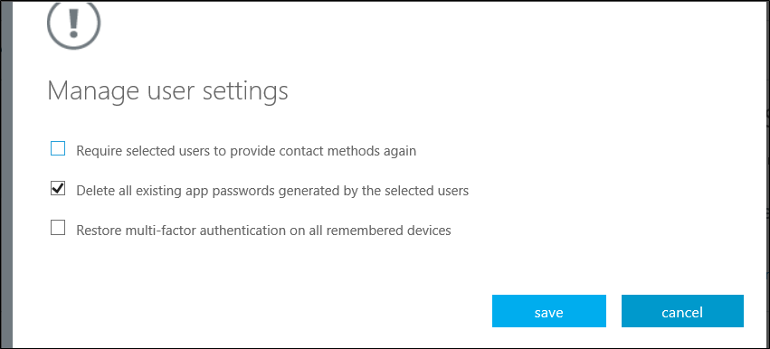

# Manage user settings for Azure Multi-Factor Authentication

As an administrator, you can manage the following user and device settings:

* Require users to provide contact methods again
* Delete app passwords
* Require MFA on all trusted devices

## Manage user authentication options

If you're assigned the *Authentication Administrator* role you can require users to reset their password, re-register for MFA, or revoke existing MFA sessions from their user object. These actions may be necessary if you need to provide assistance to a user, or want to reset their security status.

To manage user settings, complete the following steps:

1. Sign in to the [Azure portal](https://portal.azure.com).
1. On the left, select **Azure Active Directory** > **Users** > **All users**.
1. Choose the user you wish to perform an action on and select **Authentication methods**. At the top of the window, then choose one of the following options for the user:
   - **Reset Password** resets the user's password and assigns a temporary password that must be changed on the next sign-in.
   - **Require Re-register MFA** makes it so that when the user signs in next time, they're requested to set up a new MFA authentication method.
   - **Revoke MFA Sessions** clears the user's remembered MFA sessions and requires them to perform MFA the next time it's required by the policy on the device.

   

## Delete users existing app passwords

If needed, you can delete all of the app passwords that a user has created. Non-browser apps that were associated with these app passwords stop working until a new app password is created. *Global administrator* permissions are required to perform this action.

To delete a user's app passwords, complete the following steps:

1. Sign in to the [Azure portal](https://portal.azure.com).
1. On the left-hand side, select **Azure Active Directory** > **Users** > **All users**.
1. Select **Multi-Factor Authentication**. You may need to scroll to the right to see this menu option. Select the example screenshot below to see the full Azure portal window and menu location:
    
1. Check the box next to the user or users that you wish to manage. A list of quick step options appears on the right.
1. Select **Manage user settings**, then check the box for **Delete all existing app passwords generated by the selected users**, as shown in the following example:
   
1. Select **save**, then **close**.

## Next steps

This article helped configure individual user settings. To configure Azure Multi-Factor Authentication service settings, see [Configure Azure Multi-Factor Authentication settings](howto-mfa-mfasettings.md)

If your users need help, see the [User guide for Azure Multi-Factor Authentication](../user-help/multi-factor-authentication-end-user.md).
