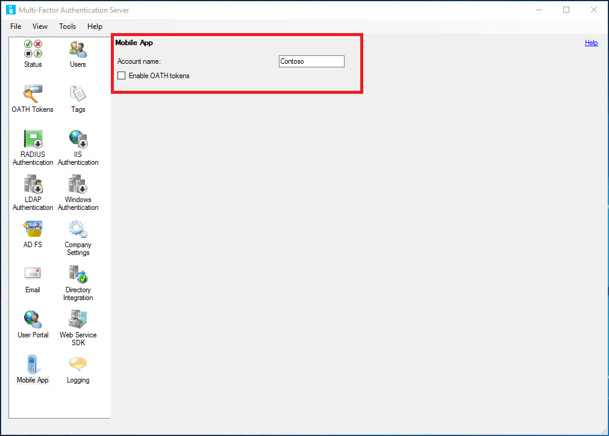

# Enable mobile app authentication with Azure Multi-Factor Authentication Server

The Microsoft Authenticator app offers an additional out-of-band verification option. Instead of placing an automated phone call or SMS to the user during login, Azure Multi-Factor Authentication pushes a notification to the Microsoft Authenticator app on the user’s smartphone or tablet. The user simply taps **Verify** (or enters a PIN and taps “Authenticate”) in the app to complete their sign-in.

Using a mobile app for two-step verification is preferred when phone reception is unreliable. If you use the app as an OATH token generator, it doesn't require any network or internet connection.

> [IMPORTANT]
> As of July 1, 2019, Microsoft will no longer offer MFA Server for new deployments. New customers who would like to require multi-factor authentication from their users should use cloud-based Azure Multi-Factor Authentication. Existing customers who have activated MFA Server prior to July 1 will be able to download the latest version, future updates and generate activation credentials as usual.

> [!IMPORTANT]
> If you have installed Azure Multi-Factor Authentication Server v8.x or higher, most of the steps below are not required. Mobile app authentication can be set up by following the steps under [Configure the mobile app](#configure-the-mobile-app-settings-in-the-azure-multi-factor-authentication-server).

## Requirements

To use the Microsoft Authenticator app, you must be running Azure Multi-Factor Authentication Server v8.x or higher

## Configure the mobile app settings in the Azure Multi-Factor Authentication Server

1. In the Multi-Factor Authentication Server console, click the User Portal icon. If users are allowed to control their authentication methods, check **Mobile App** on the Settings tab, under **Allow users to select method**. Without this feature enabled, end users are required to contact your Help Desk to complete activation for the Mobile App.
2. Check the **Allow users to activate Mobile App** box.
3. Check the **Allow User Enrollment** box.
4. Click the **Mobile App** icon.
5. Populate the **Account name** field with the company or organization name to display in the mobile application for this account.
   

## Next steps

- [Advanced scenarios with Azure Multi-Factor Authentication and third-party VPNs](howto-mfaserver-nps-vpn.md).
