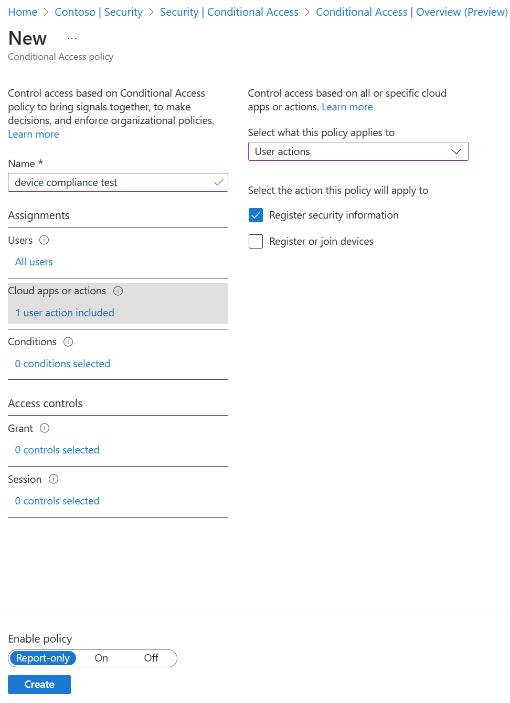

# Enable combined security information registration in Azure Active Directory

Before combined registration, users registered authentication methods for Azure Multi-Factor Authentication and self-service password reset (SSPR) separately. People were confused that similar methods were used for Azure Multi-Factor Authentication and SSPR but they had to register for both features. Now, with combined registration, users can register once and get the benefits of both Azure Multi-Factor Authentication and SSPR.

Before enabling the new experience, review the article [Combined security information registration](concept-registration-mfa-sspr-combined.md) to ensure you understand the functionality and effects of this feature.

## Enable combined registration

Complete these steps to enable combined registration:

1. Sign in to the Azure portal as a user administrator or global administrator.
2. Go to **Azure Active Directory** > **User settings** > **Manage user feature preview settings**.
3. Under **Users can use the combined security information registration experience**, choose to enable for a **Selected** group of users or for **All** users.

   

> [!NOTE]
> After you enable combined registration, users who register or confirm their phone number or mobile app through the new experience can use them for Azure Multi-Factor Authentication and SSPR, if those methods are enabled in the Azure Multi-Factor Authentication and SSPR policies. If you then disable this experience, users who go to the previous SSPR registration page at `https://aka.ms/ssprsetup` will be required to perform multi-factor authentication before they can access the page.

If you have configured the Site to Zone Assignment List in Internet Explorer, the following sites have to be in the same zone:

* [https://login.microsoftonline.com](https://login.microsoftonline.com)
* [https://mysignins.microsoft.com](https://mysignins.microsoft.com)
* [https://account.activedirectory.windowsazure.com](https://account.activedirectory.windowsazure.com)

## Conditional Access policies for combined registration

Securing when and how users register for Azure Multi-Factor Authentication and self-service password reset is now possible with user actions in Conditional Access policy. This feature is available to organizations who have enabled the [combined registration feature](../authentication/concept-registration-mfa-sspr-combined.md). This functionality may be enabled in organizations where they want users to register for Azure Multi-Factor Authentication and SSPR from a central location such as a trusted network location during HR onboarding.

> [!NOTE]
> This policy will only apply when a user navigates to a combined registration page.  This policy will not enforce MFA enrollment when accessing other applications.  You can create an MFA registration policy utilizing Azure Identity Protection [Azure Identity Protection - Configure MFA Policy](https://docs.microsoft.com/en-us/azure/active-directory/identity-protection/howto-identity-protection-configure-mfa-policy)

For more information about creating trusted locations in Conditional Access, see the article [What is the location condition in Azure Active Directory Conditional Access?](../conditional-access/location-condition.md#named-locations)

### Create a policy to require registration from a trusted location

The following policy applies to all selected users that attempt to register using the combined registration experience, and blocks access unless they are connecting from a location marked as trusted network.

1. In the **Azure portal**, browse to **Azure Active Directory** > **Security** > **Conditional Access**.
1. Select **+ New policy**.
1. Enter a name for this policy, such as *Combined Security Info Registration on Trusted Networks*.
1. Under **Assignments**, select **Users and groups**. Choose the users and groups you want this policy to apply to, then select **Done**.

   > [!WARNING]
   > Users must be enabled for combined registration.

1. Under **Cloud apps or actions**, select **User actions**. Check **Register security information**, then select **Done**.

    

1. Under **Conditions** > **Locations**, configure the following options:
   1. Configure **Yes**.
   1. Include **Any location**.
   1. Exclude **All trusted locations**.
1. Select **Done** on the *Locations* window, then select **Done** on the *Conditions* window.
1. Under **Access controls** > **Grant**, choose **Block access**, then **Select**.
1. Set **Enable policy** to **On**.
1. To finalize the policy, select **Create**.

## Next steps

If you need help, see how to [troubleshoot combined security info registration](howto-registration-mfa-sspr-combined-troubleshoot.md) or learn [What is the location condition in Azure Active Directory Conditional Access?](../conditional-access/location-condition.md)

To enable the features in your Azure AD tenant, see the tutorials to [enable self-service password reset](tutorial-enable-sspr.md) and [enable Azure Multi-Factor Authentication](tutorial-enable-azure-mfa.md).

Learn how to [force users to re-register authentication methods](howto-mfa-userdevicesettings.md#manage-user-authentication-options).

You can also review the [available methods for Azure Multi-Factor Authentication and SSPR](concept-authentication-methods.md).
