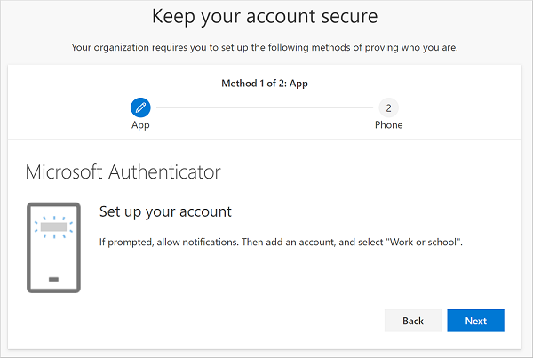
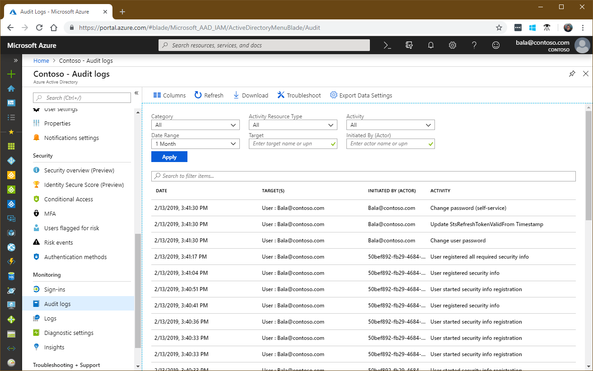

# Enable combined security information registration (preview)

Before enabling the new experience, review the article [Combined security information registration (preview)](concept-registration-mfa-sspr-combined.md) to ensure you understand the functionality and impact of this feature.

|     |
| --- |
| Combined security information registration for Azure Multi-Factor Authentication and Azure AD self-service password reset is a public preview feature of Azure Active Directory. For more information about previews, see  [Supplemental Terms of Use for Microsoft Azure Previews](https://azure.microsoft.com/support/legal/preview-supplemental-terms/)|
|     |

To enable converged registration, complete the following steps:

1. Sign in to the Azure portal as a global administrator.
2. Browse to **Azure Active Directory** > **User settings** > **Manage settings for access panel preview features**.
3. Under **Users can use preview features for registering and managing security info - refresh**, choose to enable for a **Selected** group of users or for **All** users.

> [!IMPORTANT]
> If a user is enabled for both the non-refreshed and refreshed combined registration experience, they will see the new experience. Users who are enabled for both experiences will only see the new My Profile experience. The new My Profile aligns with the look and feel of combined registration and provides a seamless experience for users. Users can see My Profile by going to [https://aka.ms/mysecurityinfo](https://aka.ms/mysecurityinfo).

> [!NOTE]
> Once you enable combined registration, users who register or confirm their phone number or mobile app through the new experience can use them for MFA and SSPR, if those methods are enabled in the MFA and SSPR policies. If you then disable this experience, users who go to the previous SSPR registration page at [https:/aka.ms/ssprsetup](https:/aka.ms/ssprsetup) will be required to perform multi-factor authentication before they can access the page.

## Troubleshooting combined security information registration

### Audit logs

The events logged for combined registration are under the “Authentication Methods” category in the Azure AD audit logs.

The following lists all audit events generated by combined registration:

| Activity | Status | Reason | Description |
| --- | --- | --- | --- |
| User registered all required security info | Success | User registered all required security info. | This event occurs when a user has successfully completed registration.|
| User registered all required security info | Failure | User canceled security info registration. | This event occurs when a user cancels registration from interrupt mode.|
| User registered security info | Success | User registered "method". | This event occurs when a user registers an individual method. "Method" can be Authenticator app, Phone, Email, Security questions, App password, Alternate phone, etc.| 
| User reviewed security info | Success | User successfully reviewed security info. | This event occurs when a user clicks "Looks good" on the security info review page.|
| User reviewed security info | Failure | User failed to review security info. | This event occurs when a user clicks “Looks good” on the security info review page but something fails in the backend.|
| User deleted security info | Success | User deleted "method". | This event occurs when a user deletes an individual method. "Method" can be Authenticator app, Phone, Email, Security questions, App password, Alternate phone, etc.|
| User deleted security info | Failure | User failed to delete "method". | This event occurs when a user tries to delete a method but it fails for some reason. "Method" can be Authenticator app, Phone, Email, Security questions, App password, Alternate phone, etc.|
| User changed default security info | Success | User changed default security info to "method". | This event occurs when a user changes their default method. "Method" can be Authenticator app notification, code from my authenticator app or token, Call +X XXXXXXXXXX, Text a code to +X XXXXXXXXX, etc.|
| User changed default security info | Failure | User failed to change default security info to "method". | This event occurs when a user tries to change their default method but it fails for some reason. "Method" can be Authenticator app notification, a code from my authenticator app or token, Call +X XXXXXXXXXX, Text a code to +X XXXXXXXXX, etc.|

### Troubleshooting interrupt mode

| Symptom | Troubleshooting steps |
| --- | --- |
| I’m not seeing the methods I expected to see. | 1. Check if the user has an Azure AD administrator role. If yes, review the SSPR administrator policy differences.   2. Determine whether the user is being interrupted due to MFA registration enforcement or SSPR registration enforcement. Review the flowchart under Converged Registration Modes to determine which methods should be shown.   3. Determine how recently the MFA or SSPR policy was changed. If the change was recent, it may take some time for the updated policy to propagate.|

### Troubleshooting manage mode

| Symptom | Troubleshooting steps |
| --- | --- |
| I don’t have the option to add a particular method. | 1. Determine whether the method is enabled for MFA or for SSPR.   2. If the method is enabled, resave the policies and wait 1-2 hours before testing again.   3. If the method is enabled, ensure that the user hasn’t already set up the maximum number of that method that they're allowed to set up.|

## Next steps

[Available methods for MFA and SSPR](concept-authentication-methods.md)

[Configure self-service password reset](howto-sspr-deployment.md)

[Configure Azure Multi-Factor Authentication](howto-mfa-getstarted.md)
