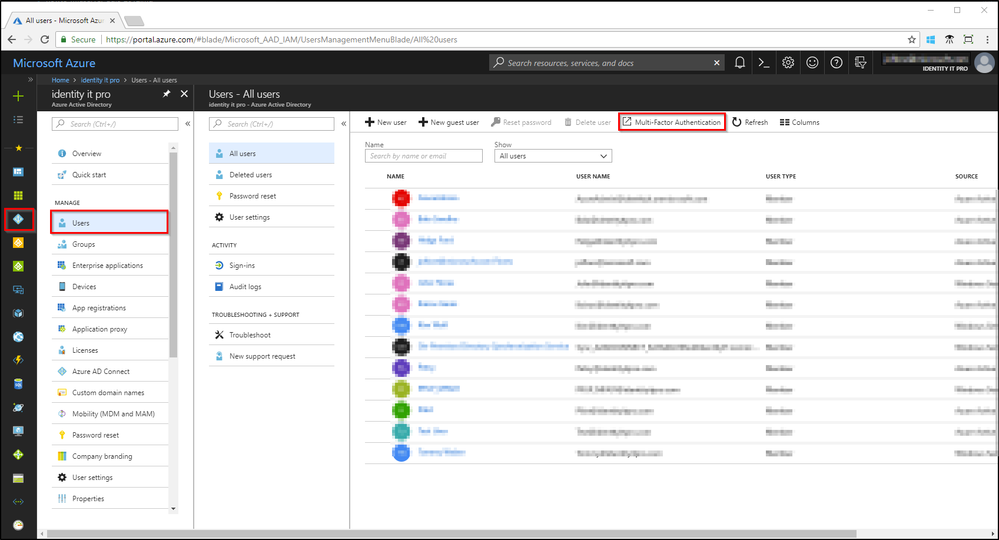
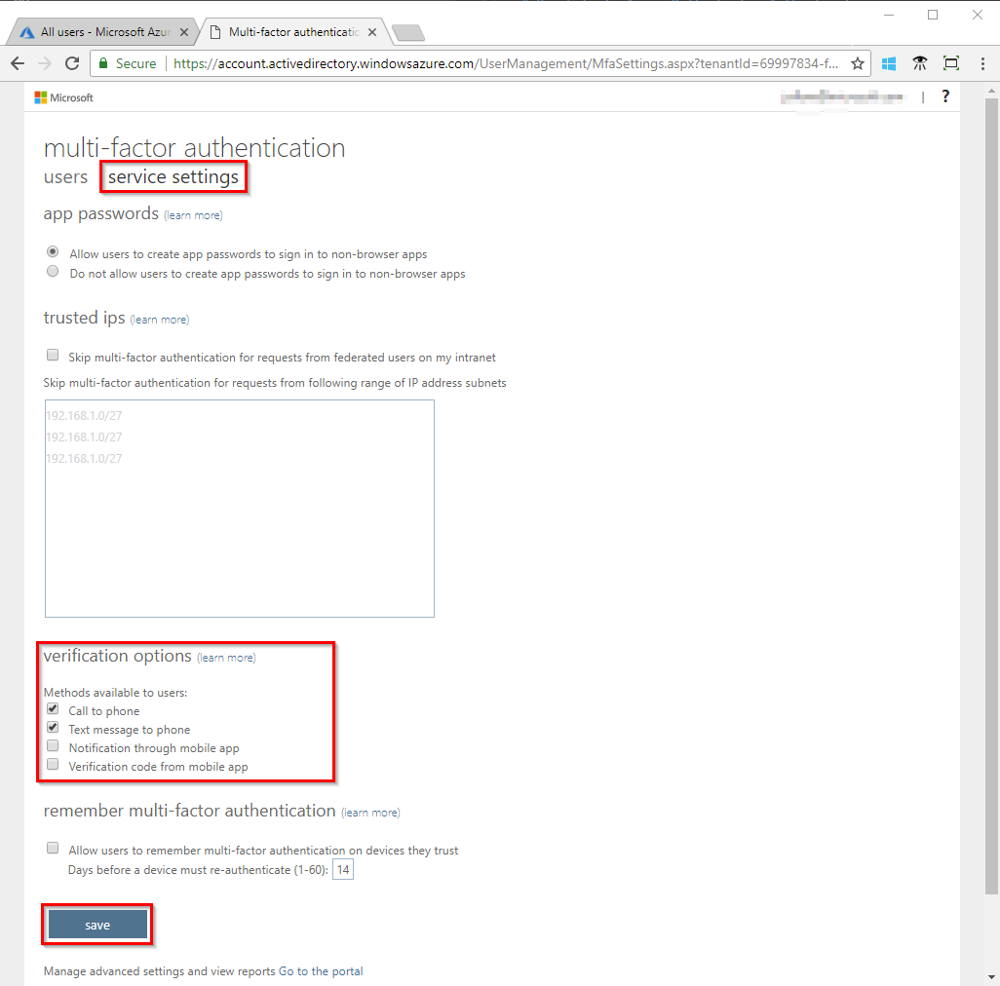

# Quickstart: Enable Azure Multi-Factor Authentication

In this quickstart, you walk you through configuring a conditional access policy enabling Azure Multi-Factor Authentication (Azure MFA) when logging in to the Azure portal. The policy is deployed to and tested on a specific group of pilot users. Deployment of Azure MFA using conditional access provides significant flexibility for organizations and administrators compared to the traditional enforced method.

## Prerequisites

* A working Azure AD tenant with at least a trial license enabled.
* An account with Global Administrator privileges.
* A non-administrator test user with a password you know for testing, if you need to create a user see the article [Quickstart: Add new users to Azure Active Directory](../add-users-azure-active-directory.md).
* A pilot group to test with that the non-administrator user is a member of, if you need to create a group see the article [Create a group and add members in Azure Active Directory](../active-directory-groups-create-azure-portal.md).

## Sign in to Azure

Sign in to the [Azure portal](https://portal.azure.com) using a Global Administrator account.

## Choose verification options

Before enabling Azure Multi-Factor Authentication, your organization must determine what verification options they allow. For the purpose of this quickstart, you enable call to phone and text message to phone as they are generic options that most are able to use.

1. Browse to **Azure Active Directory**, **Users**, **Multi-Factor Authentication**
    
2. In the new tab that opens browse to **service settings**
3. Under **verification options**, check the following boxes for methods available to users
   * Call to phone
   * Text message to phone

   

4. Click on **Save**
5. Close the **service settings** tab

## Create conditional access policy

1. Browse to **Azure Active Directory**, **Conditional access**
1. Select **New policy**
1. Name your policy **MFA Pilot**
1. Under **users and groups**, select the **Select users and groups** radio button
    * Select your pilot group created as part of the prerequisites section of this article
    * Click **Done**
1. Under **Cloud apps**, select the **Select apps** radio button
    * The cloud app for the Azure portal is **Microsoft Azure Management** 
    * Click **Select**
    * Click **Done**
1. Skip the **Conditions** section
1. Under **Grant**, make sure the **Grant access** radio button is selected
    * Check the box for **Require multi-factor authentication**
    * Click **Select**
1. Skip the **Session** section
1. Set the **Enable policy** toggle to **On**
1. Click **Create**

## Test Azure Multi-Factor Authentication

To prove that your conditional access policy works, you test logging in to a resource that should not require MFA and then to the Azure portal that requires MFA.

1. Open a new browser window in InPrivate mode and browse to [https://account.activedirectory.windowsazure.com](https://account.activedirectory.windowsazure.com).
   * Log in with the test user created as part of the prerequisites section of this article and note that it should not ask you to complete MFA.
   * Close the browser window
2. Open a new browser window in InPrivate mode and browse to [https://portal.azure.com](https://portal.azure.com).
   * Log in with the test user created as part of the prerequisites section of this article and note that you should now be required to register for and use Azure Multi-Factor Authentication.
   * Close the browser window

## Clean up resources

If you have completed your pilot, you can choose to keep the resources you created or clean up the resources used in this quickstart by completing the following tasks:

* Delete test user
* Delete pilot group
* Delete the **MFA Pilot** conditional access policy

## Next steps

If you are ready to get started with Azure MFA our series of tutorials build on each other and walk you through all of the steps to a successful deployment.

> [!div class="nextstepaction"]
> [Azure MFA detailed tutorial](howto-mfa-getstarted.md)