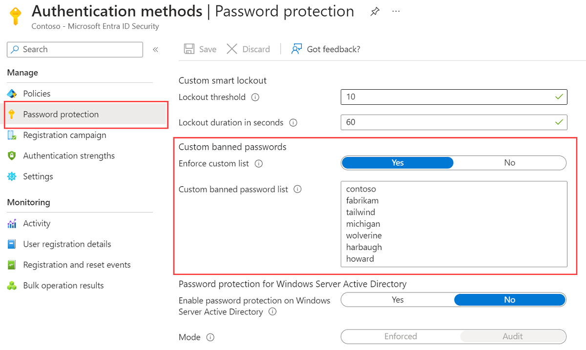
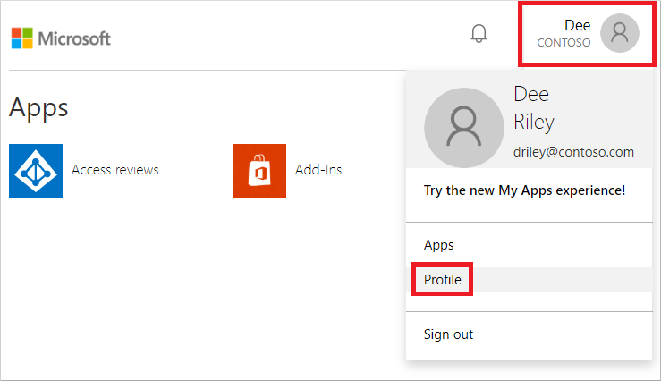
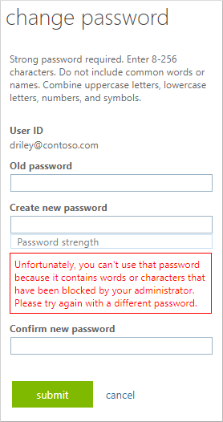

# Tutorial: Configure custom banned passwords for Microsoft Entra password protection

Users often create passwords that use common local words such as a school, sports team, or famous person. These passwords are easy to guess, and weak against dictionary-based attacks. To enforce strong passwords in your organization, the Microsoft Entra custom banned password list let you add specific strings to evaluate and block. A password change request fails if there's a match in the custom banned password list.

In this tutorial you learn how to:

> [!div class="checklist"]
> * Enable custom banned passwords
> * Add entries to the custom banned password list
> * Test password changes with a banned password

## Prerequisites

To complete this tutorial, you need the following resources and privileges:

* A working Microsoft Entra tenant with at least a Microsoft Entra ID P1 or trial license enabled.
    * If needed, [create one for free](https://azure.microsoft.com/free/?WT.mc_id=A261C142F).
* An account with *global administrator* privileges.
* A non-administrator user with a password you know, such as *testuser*. You test a password change event using this account in this tutorial.
    * If you need to create a user, see [Quickstart: Add new users to Microsoft Entra ID](~/fundamentals/add-users.md).
    * To test the password change operation using a banned password, the Microsoft Entra tenant must be [configured for self-service password reset](tutorial-enable-sspr.md).

## What are banned password lists?

Microsoft Entra ID includes a global banned password list. The contents of the global banned password list isn't based on any external data source. Instead, the global banned password list is based on the ongoing results of Microsoft Entra security telemetry and analysis. When a user or administrator tries to change or reset their credentials, the desired password is checked against the list of banned passwords. The password change request fails if there's a match in the global banned password list. You can't edit this default global banned password list.

To give you flexibility in what passwords are allowed, you can also define a custom banned password list. The custom banned password list works alongside the global banned password list to enforce strong passwords in your organization. Organizational-specific terms can be added to the custom banned password list, such as the following examples:

* Brand names
* Product names
* Locations, such as company headquarters
* Company-specific internal terms
* Abbreviations that have specific company meaning
* Months and weekdays with your company's local languages

When a user attempts to reset a password to something that's on the global or custom banned password list, they see one of the following error messages:

* *Unfortunately, your password contains a word, phrase, or pattern that makes your password easily guessable. Please try again with a different password.*
* *Unfortunately, you can't use that password because it contains words or characters that have been blocked by your administrator. Please try again with a different password.*

The custom banned password list is limited to a maximum of 1000 terms. It's not designed for blocking large lists of passwords. To maximize the benefits of the custom banned password list, review the [custom banned password list concepts](concept-password-ban-bad.md#custom-banned-password-list) and [password evaluation algorithm overview](concept-password-ban-bad.md#how-are-passwords-evaluated).

## Configure custom banned passwords

[!INCLUDE [portal updates](~/includes/portal-update.md)]

Let's enable the custom banned password list and add some entries. You can add additional entries to the custom banned password list at any time.

To enable the custom banned password list and add entries to it, complete the following steps:

1. Sign in to the [Microsoft Entra admin center](https://entra.microsoft.com) as at least an [Authentication Policy Administrator](~/identity/role-based-access-control/permissions-reference.md#authentication-policy-administrator).
1. Browse to **Protection** > **Authentication methods**, then **Password protection**.
1. Set the option for **Enforce custom list** to *Yes*.
1. Add strings to the **Custom banned password list**, one string per line. The following considerations and limitations apply to the custom banned password list:

    * The custom banned password list can contain up to 1000 terms.
    * The custom banned password list is case-insensitive.
    * The custom banned password list considers common character substitution, such as "o" and "0", or "a" and "\@".
    * The minimum string length is four characters, and the maximum is 16 characters.

    Specify your own custom passwords to ban, as shown in the following example

    

1. Leave the option for **Enable password protection on Windows Server Active Directory** to *No*.
1. To enable the custom banned passwords and your entries, select **Save**.

It may take several hours for updates to the custom banned password list to be applied.

For a hybrid environment, you can also [deploy Microsoft Entra password protection to an on-premises environment](howto-password-ban-bad-on-premises-deploy.md). The same global and custom banned password lists are used for both cloud and on-prem password change requests.

## Test custom banned password list

To see the custom banned password list in action, try to change the password to a variation of one that you added in the previous section. When Microsoft Entra ID tries to process the password change, the password is matched against an entry in the custom banned password list. An error is then displayed to the user.

> [!NOTE]
> Before a user can reset their password in the web-based portal, the Microsoft Entra tenant must be [configured for self-service password reset](tutorial-enable-sspr.md). If needed, the user can then [register for SSPR at https://aka.ms/ssprsetup](https://aka.ms/ssprsetup).

1. Go to the **My Apps** page at [https://myapps.microsoft.com](https://myapps.microsoft.com).
1. In the top-right corner, select your name, then choose **Profile** from the drop-down menu.

    

1. On the **Profile** page, select **Change password**.
1. On the **Change password** page, enter the existing (old) password. Enter and confirm a new password that's on the custom banned password list you defined in the previous section, then select **Submit**.
1. An error message is returned that tells you the password has been blocked by the administrator, as shown in the following example:

    

## Clean up resources

If you no longer want to use the custom banned password list you have configured as part of this tutorial, complete the following steps:

1. Sign in to the [Microsoft Entra admin center](https://entra.microsoft.com) as at least an [Authentication Policy Administrator](~/identity/role-based-access-control/permissions-reference.md#authentication-policy-administrator).
1. Browse to **Protection** > **Authentication methods**, then **Password protection**.
1. Set the option for **Enforce custom list** to *No*.
1. To update the custom banned password configuration, select **Save**.

## Next steps

In this tutorial, you enabled and configured custom password protection lists for Microsoft Entra ID. You learned how to:

> [!div class="checklist"]
> * Enable custom banned passwords
> * Add entries to the custom banned password list
> * Test password changes with a banned password

> [!div class="nextstepaction"]
> [Enable risk-based Microsoft Entra multifactor authentication](./tutorial-enable-azure-mfa.md)
