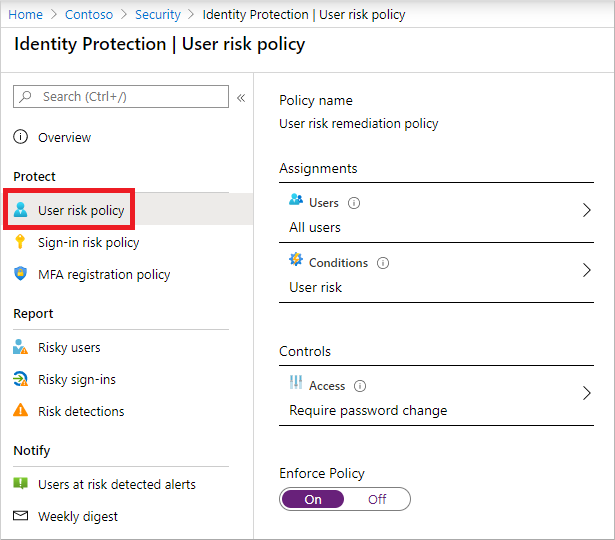
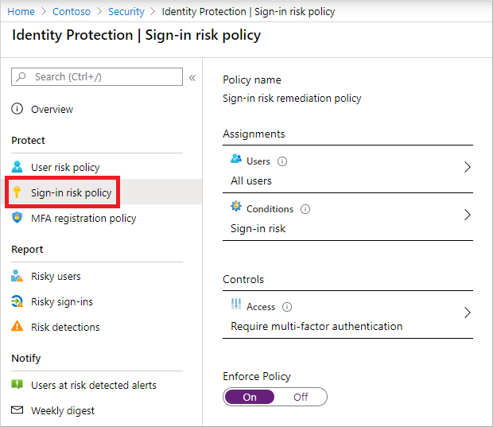

# Tutorial: Use risk detections for user sign-ins to trigger Azure Multi-Factor Authentication or password changes

To protect your users, you can configure risk-based policies in Azure Active Directory (Azure AD) that automatically respond to risky behaviors. Azure AD Identity Protection policies can automatically block a sign-in attempt or require additional action, such as require a password change or prompt for Azure Multi-Factor Authentication. These policies work with existing Azure AD Conditional Access policies as an extra layer of protection for org organization. Users may never trigger a risky behavior in one of these policies, but your organization is protected if an attempt to compromise your security is made.

In this tutorial, you learn how to:

> [!div class="checklist"]
> * Understand the available policies for Azure AD Identity Protection
> * Enable Azure Multi-Factor Authentication registration
> * Enable risk-based password changes
> * Enable risk-based Multi-Factor Authentication
> * Test risk-based policies for user sign-in attempts

## Prerequisites

To complete this tutorial, you need the following resources and privileges:

* A working Azure AD tenant with at least an Azure AD Premium P2 trial license enabled.
    * If needed, [create one for free](https://azure.microsoft.com/free/?WT.mc_id=A261C142F).
* An account with *Global Administrator* privileges.
* Azure AD configured for self-service password reset and Azure Multi-Factor Authentication
    * If needed, [complete the tutorial to enable Azure AD SSPR](tutorial-enable-sspr.md).
    * If needed, [complete the tutorial to enable Azure Multi-Factor Authentication](tutorial-enable-azure-mfa.md).

## Overview of Azure AD Identity Protection

Each day, Microsoft collects and analyses trillions of anonymized signals as part of user sign-in attempts. These signals help build patterns of good user sign-in behavior, and identify potential risky sign-in attempts. Azure AD Identity Protection can review user sign-in attempts and take additional action if there's suspicious behavior.

Some of the following actions may trigger Azure AD Identity Protection risk detection:

* Users with leaked credentials.
* Sign-ins from anonymous IP addresses.
* Impossible travel to atypical locations.
* Sign-ins from infected devices.
* Sign-ins from IP addresses with suspicious activity.
* Sign-ins from unfamiliar locations.

The following three policies are available in Azure AD Identity Protection to protect users and respond to suspicious activity. You can choose to turn the policy enforcement on or off, select users or groups for the policy to apply to, and if you want to block access at sign-in or prompt for additional action.

* User risk policy
    * Identifies and responds to user accounts that may have compromised credentials. Can prompt the user to create a new password.
* Sign in risk policy
    * Identifies and responds to suspicious sign-in attempts. Can prompt the user to provide additional forms of verification using Azure Multi-Factor Authentication.
* MFA registration policy
    * Makes sure users are registered for Azure Multi-Factor Authentication. If a sign-in risk policy prompts for MFA, the user must already be registered for Azure Multi-Factor Authentication.

When you enable a policy user or sign in risk policy, you can also choose the threshold for risk level - low and above, medium and above, or high. This flexibility lets you decide how aggressive you want to be in enforcing any controls for suspicious sign-in events.

For more information about Azure AD Identity Protection, see [What is Azure AD Identity Protection](../identity-protection/overview-identity-protection.md)

## Enable MFA registration policy

Azure AD Identity Protection includes a default policy that can help get users registered for Azure Multi-Factor Authentication. If you use additional policies to protect sign-in events, you would need users to have already registered for MFA. When you enable this policy, it doesn't require users to perform MFA at each sign-in event. The policy only checks the registration status for a user and asks them to pre-register if needed.

It's recommended to enable the MFA registration policy for users that are to be enabled for additional Azure AD Identity Protection policies. To enable this policy, complete the following steps:

1. Sign in to the [Azure portal](https://portal.azure.com) using a global administrator account.
1. Search for and select **Azure Active Directory**, select **Security**, then under the *Protect* menu heading choose **Identity Protection**.
1. Select the **MFA registration policy** from the menu on the left-hand side.
1. By default, the policy applies to *All users*. If desired, select **Assignments**, then choose the users or groups to apply the policy on.
1. Under *Controls*, select **Access**. Make sure the option for *Require Azure MFA registration* is checked, then choose **Select**.
1. Set **Enforce Policy** to *On*, then select **Save**.

    

## Enable user risk policy for password change

Microsoft works with researchers, law enforcement, various security teams at Microsoft, and other trusted sources to find username and password pairs. When one of these pairs matches an account in your environment, a risk-based password change can be requested. This policy and action makes the user update their password before they can sign in to make sure any previously exposed credentials no longer work.

To enable this policy, complete the following steps:

1. Select the **User risk policy** from the menu on the left-hand side.
1. By default, the policy applies to *All users*. If desired, select **Assignments**, then choose the users or groups to apply the policy on.
1. Under *Conditions*, choose  **Select conditions > Select a risk level**, then choose **Medium and above**.
1. Choose **Select**, then **Done**.
1. Under *Access*, select **Access**. Make sure the option for **Allow access** and *Require password change* is checked, then choose **Select**.
1. Set **Enforce Policy** to *On*, then select **Save**.

    

## Enable sign-in risk policy for MFA

Most users have a normal behavior that can be tracked. When they fall outside of this norm, it could be risky to allow them to successfully sign in. Instead, you may want to block that user, or ask them to perform a multi-factor authentication. If the user successfully completes the MFA challenge, you can consider it a valid sign-in attempt and grant access to the application or service.

To enable this policy, complete the following steps:

1. Select the **Sign-in risk policy** from the menu on the left-hand side.
1. By default, the policy applies to *All users*. If desired, select **Assignments**, then choose the users or groups to apply the policy on.
1. Under *Conditions*, choose  **Select conditions > Select a risk level**, then choose **Medium and above**.
1. Choose **Select**, then **Done**.
1. Under *Access*, choose **Select a control**. Make sure the option for **Allow access** and *Require multi-factor authentication* is checked, then choose **Select**.
1. Set **Enforce Policy** to *On*, then select **Save**.

    

## Test risky sign events

Most user sign-in events won't trigger the risk-based policies configured in the previous steps. A user may never see a prompt for additional MFA or to reset their password. If their credentials remain secure and their behavior consistent, their sign-in events would be successful.

To test the Azure AD Identity Protection policies created in the previous steps, you need a way to simulate risky behavior or potential attacks. The steps to do these tests vary based on the Azure AD Identity Protection policy you want to validate. For more information on scenarios and steps, see [Simulate risk detections in Azure AD Identity Protection](../identity-protection/howto-identity-protection-simulate-risk.md).

## Clean up resources

If you have completed tests and no longer want to have the risk-based policies enabled, return to each policy you want to disable and set *Enforce Policy* to **Off**.

## Next steps

In this tutorial, you enabled risk-based user policies for Azure AD Identity Protection. You learned how to:

> [!div class="checklist"]
> * Understand the available policies for Azure AD Identity Protection
> * Enable Azure Multi-Factor Authentication registration
> * Enable risk-based password changes
> * Enable risk-based Multi-Factor Authentication
> * Test risk-based policies for user sign-in attempts

> [!div class="nextstepaction"]
> [Learn more about Azure AD Identity Protection](../identity-protection/overview-identity-protection.md
