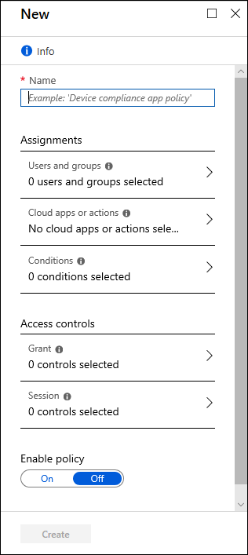

# Building a Conditional Access policy

As explained in the article [What is Conditional Access](overview.md), a Conditional Access policy is an if-then statement, of **Assignments** and **Access controls that bring signals together, to make decisions, and enforce organizational policies.

How does an organization create these policies? What is required?

## Assignments

The assignments portion controls the who, what, and where of the Conditional Access policy.

### Users and groups

Users and groups assign who the policy will include or exclude. This assignment can include all users, specific groups of users, directory roles, or external guest users. 

### Cloud apps or actions

Cloud apps or actions can include or exclude cloud applications or user actions that will be subject to the policy.

### Conditions

A policy can contain multiple conditions.

#### Sign-in risk

For organizations with [Azure AD Identity Protection](../identity-protection/overview.md), the risk detections generated there can influence your Conditional Access policies.

#### Device platforms

Organizations with multiple device operating system platforms may wish to enforce specific policies on different platforms. 

The information used to calculate the device platform comes from unverified sources such as user agent strings that can be changed.

#### Locations

Location data is provided by IP geolocation data. Administrators can choose to define locations and choose to mark some as trusted like those for their organization's network locations.

#### Client apps

By default Conditional Access policies apply to browser apps, mobile apps, and desktop clients that support modern authentication. 

This assignment condition allows Conditional Access policies to target specific client applications not using modern authentication. These applications include Exchange ActiveSync clients, older Office applications that do not use modern authentication, and mail protocols like IMAP, MAPI, POP, and SMTP.

#### Device state

This control is used to exclude devices that are hybrid Azure AD joined, or marked a compliant in Intune. This exclusion can be done to block unmanaged devices. 

## Access controls

The access controls portion of the Conditional Access policy controls how a policy is enforced.

### Grant

#### Block access

Block access does just that, it will block access under the specified assignments. The block control is powerful and should be wielded with the appropriate knowledge.

#### Grant access

The grant control can trigger enforcement of one or more controls. 

- Require multi-factor authentication (Azure Multi-Factor Authentication)
- Require device to be marked as compliant (Intune)
- Require Hybrid Azure AD joined device
- Require approved client app
- Require app protection policy

Administrators can choose to require one of the previous controls or all selected controls using the following options. The default for multiple controls is to require all.

- Require all the selected controls (control and control)
- Require one of the selected controls (control or control)

### Session

Session controls can limit the experience 

- Use app enforced restrictions
- Use Conditional Access App Control
   - Do things like: 
      - Block download, cut, copy, and print of sensitive documents
      - Monitor risky session behavior
      - Require labeling of sensitive files
- Sign-in frequency
- Persistent browser session

## Simple policies

A Conditional Access policy must contain at minimum the following to be enforced:

- **Name** of the policy.
- **Assignments**
   - **Users and/or groups** to apply the policy to.
   - **Cloud apps or actions** to apply the policy to.
- **Access controls**
   - **Grant** or **Block** controls

## Next steps

[Simulate sign in behavior using the Conditional Access What If tool](troubleshoot-conditional-access-what-if.md)

[Commonly Conditional Access policies](concept-conditional-access-policy-common.md)

[Planning a cloud-based Azure Multi-Factor Authentication deployment](../authentication/howto-mfa-getstarted.md)

[Managing device compliance with Intune](https://docs.microsoft.com/intune/device-compliance-get-started)

[Microsoft Cloud App Security and Conditional Access](https://docs.microsoft.com/cloud-app-security/proxy-intro-aad)
