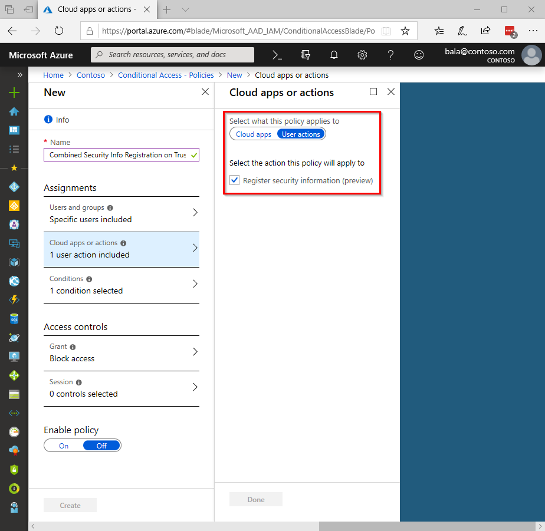

# Conditional access policies for combined registration

Securing when and how users register for Azure Multi-Factor Authentication and self-service password reset is now possible with user actions in conditional access policy. This preview feature is available to organizations who have enabled the [combined registration preview](../authentication/concept-registration-mfa-sspr-combined.md). This functionality may be enabled in organizations where they want users to register for Azure Multi-Factor Authentication and SSPR from a central location such as a trusted network location during HR onboarding.

The combined registration preview must be enabled first before this policy will apply to users in scope for the policy. To enable this functionality, see the article [Enable combined security information registration (preview)](../authentication/howto-registration-mfa-sspr-combined.md).

## Creating A Policy To Require Registration From Trusted Networks

The following policy applies to all selected users, who attempt to register using the combined registration experience, and blocks access unless they are connecting from a location marked as trusted network.

1. In the **Azure portal**, browse to **Azure Active Directory** > **Conditional access**.
1. Select **New policy**.
1. In Name, Enter a Name for this policy. For example, **Combined Security Info Registration on Trusted Networks**.
1. Under **Assignments**, click **Users and groups**, and select the users and groups you want this policy to apply to.

   > [!WARNING]
   > Users must be enabled for the [combined registration preview](../authentication/howto-registration-mfa-sspr-combined.md).

1. Under **Cloud apps or actions**, select **User actions**, check **Register security information (preview)**.
1. Under **Conditions** > **Locations**
   1. Configure **Yes**
   1. Include **Any location**
   1. Exclude **All trusted locations**
1. Click **Done** and **Done** on the Conditions blade
1. Under **Access controls** > **Grant**
   1. Click **Block access**
   1. Then Click Select
1. Set **Enable policy** to **On**
1. Then click **Create**
