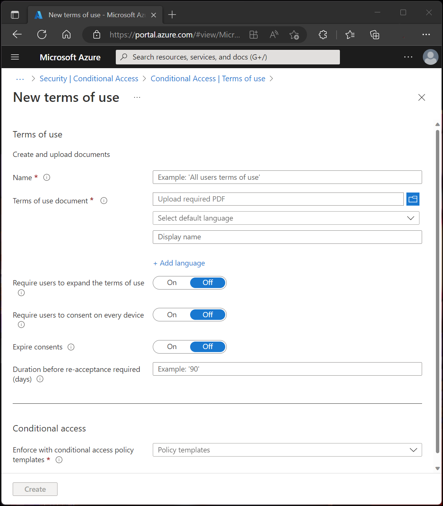
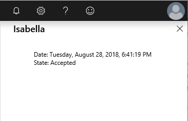
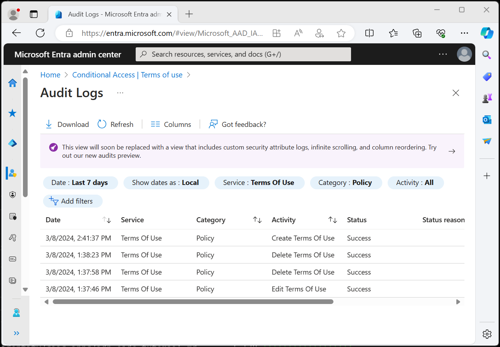
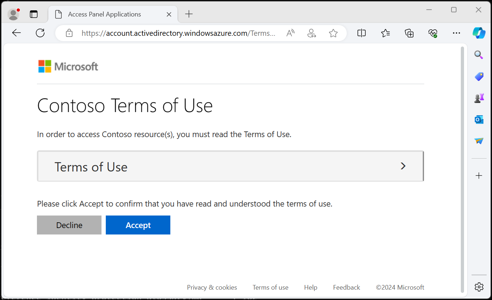
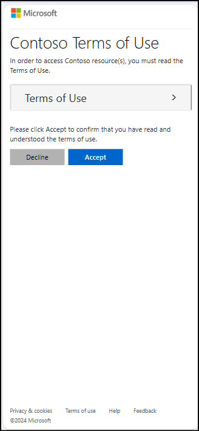
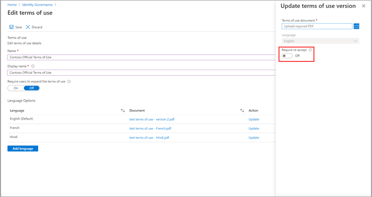
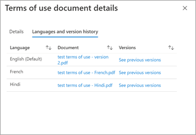
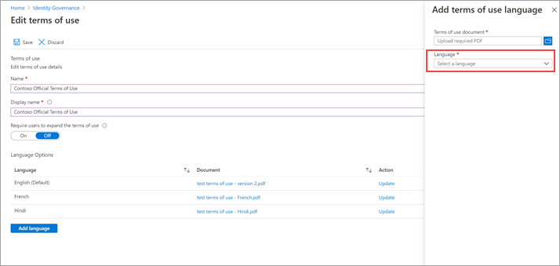
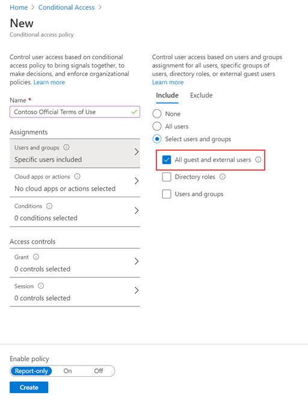
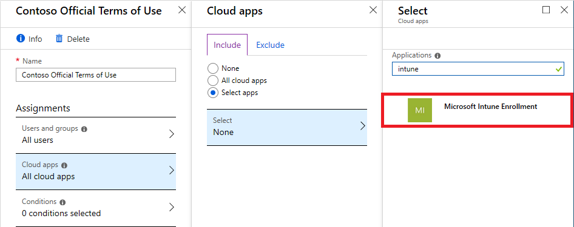

# Microsoft Entra terms of use

Microsoft Entra terms of use policies provide a simple method that organizations can use to present information to end users. This presentation ensures users see relevant disclaimers for legal or compliance requirements. This article describes how to get started with terms of use (ToU) policies.

[!INCLUDE [GDPR-related guidance](~/../azure-docs-pr/includes/gdpr-intro-sentence.md)]

## Overview videos

The following video provides a quick overview of ToU policies.

>[!VIDEO https://www.youtube.com/embed/tj-LK0abNao]

For more videos, see:
- [How to deploy a terms of use policy in Microsoft Entra ID](https://www.youtube.com/embed/N4vgqHO2tgY)
- [How to roll out a terms of use policy in Microsoft Entra ID](https://www.youtube.com/embed/t_hA4y9luCY)

## What can I do with terms of use?

Organizations can use terms of use along with Conditional Access policies to require employees or guests to accept your terms of use policy before getting access. These terms of use statements can be generalized or specific to groups or users and provided in multiple languages. Administrators can determine who has or hasn't accepted terms of use with the provided logs or APIs.

## Prerequisites

To use and configure Microsoft Entra terms of use policies, you must have:

* A working Microsoft Entra tenant with Microsoft Entra ID P1, or trial license enabled. If needed, [create one for free](https://azure.microsoft.com/free/?WT.mc_id=A261C142F).
* Administrators who interact with terms of use must have one or more of the following role assignments depending on the tasks they're performing. To follow the [Zero Trust principle of least privilege](/security/zero-trust/), consider using [Privileged Identity Management (PIM)](~/id-governance/privileged-identity-management/pim-configure.md) to just-in-time activate privileged role assignments.
   * Read terms of use configuration and Conditional Access policies 
      * [Security Reader](~/identity/role-based-access-control/permissions-reference.md#security-reader)
      * [Global Reader](~/identity/role-based-access-control/permissions-reference.md#global-reader)
   * Create or modify terms of use and Conditional Access policies 
      * [Conditional Access Administrator](~/identity/role-based-access-control/permissions-reference.md#conditional-access-administrator)
      * [Security Administrator](~/identity/role-based-access-control/permissions-reference.md#security-administrator)

## Terms of use document

Microsoft Entra terms of use policies use the PDF format to present content. The PDF file can be any content, such as existing contract documents, allowing you to collect end-user agreements during user sign-in. To support users on mobile devices, the recommended font size in the PDF is 24 point.

## Add terms of use

Once you've completed your terms of use policy document, use the following procedure to add it.

1. Sign in to the [Microsoft Entra admin center](https://entra.microsoft.com) as at least a [Conditional Access Administrator](~/identity/role-based-access-control/permissions-reference.md#conditional-access-administrator).
1. Browse to **Protection** > **Conditional Access** > **Terms of use**.
1. Select, **New terms**.
 
    

1. In the **Name** box, enter a name for the terms of use policy.
1. For **Terms of use document**, browse to your finalized terms of use policy PDF and select it.
1. Select the language for your terms of use policy document. The language option allows you to upload multiple terms of use policies, each with a different language. The version of the terms of use policy that an end user sees is based on their browser preferences.
1. In the **Display name** box, enter a title that users see when they sign in.
1. To require end users to view the terms of use policy before accepting them, set **Require users to expand the terms of use** to **On**.
1. To require end users to accept your terms of use policy on every device they're accessing from, set **Require users to consent on every device** to **On**. Users may be required to install other applications if this option is enabled. For more information, see [Per-device terms of use](#per-device-terms-of-use).
1. If you want to expire terms of use policy consents on a schedule, set **Expire consents** to **On**. When set to On, two more schedule settings are displayed.

    

1. Use the **Expire starting on** and **Frequency** settings to specify the schedule for terms of use policy expirations. The following table shows the result for a couple of example settings:

   | Expire starting on | Frequency | Result |
   | --- | --- | --- |
   | Today's date  | Monthly | Starting today, users must accept the terms of use policy and then reaccept every month. |
   | Date in the future  | Monthly | Starting today, users must accept the terms of use policy. When the future date occurs, consents expire, and then users must reaccept every month.  |

   For example, if you set the expire starting on date to **Jan 1** and frequency to **Monthly**, this is how expirations might occur for two users:

   | User | First accept date | First expire date | Second expire date | Third expire date |
   | --- | --- | --- | --- | --- |
   | Alice | Jan 1 | Feb 1 | Mar 1 | Apr 1 |
   | Bob | Jan 15 | Feb 1 | Mar 1 | Apr 1 |

1. Use the **Duration before re-acceptance required (days)** setting to specify the number of days before the user must reaccept the terms of use policy. This option allows users to follow their own schedule. For example, if you set the duration to **30** days, this is how expirations might occur for two users:

   | User | First accept date | First expire date | Second expire date | Third expire date |
   | --- | --- | --- | --- | --- |
   | Alice | Jan 1 | Jan 31 | Mar 2 | Apr 1 |
   | Bob | Jan 15 | Feb 14 | Mar 16 | Apr 15 |

   It's possible to use the **Expire consents** and **Duration before re-acceptance required (days)** settings together, but typically you use one or the other.
   
   > [!IMPORTANT]
   > Users whose consent has expired (regardless of the setting used, **Expire consents** or **Duration before re-acceptance required (days)**) will only be prompted to re-accept the terms if their session has expired.

1. Under **Conditional Access**, use the **Enforce with Conditional Access policy template** list to select the template to enforce the terms of use policy.

   | Template | Description |
   | --- | --- |
   | **Custom policy** | Select the users, groups, and apps that this terms of use policy is applied to. |
   | **Create Conditional Access policy later** | This terms of use policy appears in the grant control list when creating a Conditional Access policy. |

   > [!IMPORTANT]
   > Conditional Access policy controls (including terms of use policies) do not support enforcement on service accounts. We recommend excluding all service accounts from the Conditional Access policy.

    Custom Conditional Access policies enable granular terms of use policies, down to a specific cloud application or group of users. For more information, see [Quickstart: Require terms of use to be accepted before accessing cloud apps](require-tou.md).

1. Select **Create**.

    If you selected a custom Conditional Access template, then a new screen appears that allows you to create the custom Conditional Access policy.

   

   You should now see your new terms of use policies.

## View report of who has accepted and declined

The Terms of use blade shows a count of the users who have accepted and declined. These counts and who accepted/declined are stored for the life of the terms of use policy.

1. Sign in to the [Microsoft Entra admin center](https://entra.microsoft.com) as at least a [Conditional Access Administrator](~/identity/role-based-access-control/permissions-reference.md#conditional-access-administrator).
1. Browse to **Protection** > **Conditional Access** > **Terms of use**.

    

1. For a terms of use policy, select the numbers under **Accepted** or **Declined** to view the current state for users.

    

1. To view the history for an individual user, select the ellipsis (**...**) and then **View History**.

    

   In the view history pane, you see a history of all the accepts, declines, and expirations.

   

## View Microsoft Entra audit logs

If you want to view more activity, Microsoft Entra terms of use policies include audit logs. Each user consent triggers an event in the audit logs that is stored for **30 days**. You can view these logs in the portal or download as a .csv file.

To get started with Microsoft Entra audit logs, use the following procedure:

1. Sign in to the [Microsoft Entra admin center](https://entra.microsoft.com) as at least a [Conditional Access Administrator](~/identity/role-based-access-control/permissions-reference.md#conditional-access-administrator).
1. Browse to **Protection** > **Conditional Access** > **Terms of use**.
1. Select a terms of use policy.
1. Select **View audit logs**.
1. On the Microsoft Entra audit logs screen, you can filter the information using the provided lists to target specific audit log information.

    You can also select **Download** to download the information in a .csv file for use locally.

   

   If you select a log, a pane appears with more activity details.

   

## What terms of use looks like for users

Once a ToU policy is created and enforced, users, who are in scope, see the following screen during sign-in.

Users can view the terms of use policy and, if necessary, use buttons to zoom in and out.

The following screen shows how a ToU policy looks on mobile devices.

Users are only required to accept the terms of use policy once, and they won't see the terms of use policy again on later sign-ins.

### How users can review their terms of use

Users can review and see the terms of use policies that they've accepted by using the following procedure.

1. Sign in to [https://myaccount.microsoft.com/](https://myaccount.microsoft.com/).
1. Select **Settings & Privacy**.
1. Select **Privacy**.
1. Under **Organization's notice**, select **View** next to the terms of use statement you want to review.

## Edit terms of use details

You can edit some details of terms of use policies, but you can't modify an existing document. The following procedure describes how to edit the details.

1. Sign in to the [Microsoft Entra admin center](https://entra.microsoft.com) as at least a [Conditional Access Administrator](~/identity/role-based-access-control/permissions-reference.md#conditional-access-administrator).
1. Browse to **Protection** > **Conditional Access** > **Terms of use**.
1. Select the terms of use policy you want to edit.
1. Select **Edit terms**.
1. In the Edit terms of use pane, you can change the following options:
    - **Name** – the internal name of the ToU that isn't shared with end users
    - **Display name** – the name that end users can see when viewing the ToU
    - **Require users to expand the terms of use** – Setting this option to **On** forces the end user to expand the terms of use policy document before accepting it.
    - (Preview) You can **update an existing terms of use** document
    - You can add a language to an existing ToU

   If there are other settings you would like to change, such as PDF document, require users to consent on every device, expire consents, duration before reacceptance, or Conditional Access policy, you must create a new ToU policy.

    

1. Once you're done, select **Save** to save your changes.

## Update the version or pdf of an existing terms of use

1. Sign in to the [Microsoft Entra admin center](https://entra.microsoft.com) as at least a [Conditional Access Administrator](~/identity/role-based-access-control/permissions-reference.md#conditional-access-administrator).
1. Browse to **Protection** > **Conditional Access** > **Terms of use**.
1. Select the terms of use policy you want to edit.
1. Select **Edit terms**.
1. For the language that you would like to update a new version, select **Update** under the action column

    

1. In the pane on the right, upload the pdf for the new version
1. There's also a toggle option here **Require reaccept** if you want to require your users to accept this new version the next time they sign in. If you require your users to reaccept, next time they try to access the resource defined in your Conditional Access policy they'll be prompted to accept this new version. If you don’t require your users to reaccept, their previous consent stays current and only new users who haven't consented before or whose consent expires see the new version. Until the session expires, **Require reaccept** does not require users to accept the new TOU. If you want to ensure reaccept, delete and recreate or create a new TOU for this case.

    

1. Once you've uploaded your new pdf and decided on reaccept, select Add at the bottom of the pane.
1. You see the most recent version under the Document column.

## View previous versions of a ToU

1. Sign in to the [Microsoft Entra admin center](https://entra.microsoft.com) as at least a [Conditional Access Administrator](~/identity/role-based-access-control/permissions-reference.md#conditional-access-administrator).
1. Browse to **Protection** > **Conditional Access** > **Terms of use**.
1. Select the terms of use policy for which you want to view a version history.
1. Select **Languages and version history**
1. Select **See previous versions.**

    

1. You can select the name of the document to download that version

## See who has accepted each version

1. Sign in to the [Microsoft Entra admin center](https://entra.microsoft.com) as at least a [Conditional Access Administrator](~/identity/role-based-access-control/permissions-reference.md#conditional-access-administrator).
1. Browse to **Protection** > **Conditional Access** > **Terms of use**.
1. To see who has currently accepted the ToU, select the number under the **Accepted** column for the ToU you want.
1. By default, the next page will show you the current state of each user's acceptance to the ToU
1. If you would like to see the previous consent events, you can select **All** from the **Current State** drop-down. Now you can see each user's events in details about each version and what happened.
1. Alternatively, you can select a specific version from the **Version**  drop-down to see who has accepted that specific version.

## Add a ToU language

The following procedure describes how to add a ToU language.

1. Sign in to the [Microsoft Entra admin center](https://entra.microsoft.com) as at least a [Conditional Access Administrator](~/identity/role-based-access-control/permissions-reference.md#conditional-access-administrator).
1. Browse to **Protection** > **Conditional Access** > **Terms of use**.
1. Select the terms of use policy you want to edit.
1. Select **Edit Terms**
1. Select **Add language** at the bottom of the page.
1. In the Add terms of use language pane, upload your localized PDF, and select the language.

    

1. Select **Add language**.
1. Select **Save**

1. Select **Add** to add the language.

## Per-device terms of use

The **Require users to consent on every device** setting enables you to require end users to accept your terms of use policy on every device they're accessing from. The end user's device must be registered in Microsoft Entra ID. When the device is registered, the device ID is used to enforce the terms of use policy on each device. Their experience is dependent on permissions to join devices as well as the platform and software used, for more information see, [device identity in Microsoft Entra ID](~/identity/devices/overview.md).

Per-device terms of use have the following constraints:

- The Microsoft Intune Enrollment app `Application ID: d4ebce55-015a-49b5-a083-c84d1797ae8c` isn't supported. Ensure that it's excluded from any Conditional Access policy requiring Terms of Use policy.
- Microsoft Entra B2B users aren't supported.

## Delete terms of use

You can delete old terms of use policies using the following procedure.

1. Sign in to the [Microsoft Entra admin center](https://entra.microsoft.com) as at least a [Conditional Access Administrator](~/identity/role-based-access-control/permissions-reference.md#conditional-access-administrator).
1. Browse to **Protection** > **Conditional Access** > **Terms of use**.
1. Select the terms of use policy you want to remove.
1. Select **Delete terms**.
1. In the message that appears asking if you want to continue, select **Yes**.

    

   You should no longer see your terms of use policy.

## Service limits

You can add no more than 40 terms per tenant.

## User acceptance record deletion

User acceptance records are deleted:

- When the admin explicitly deletes the ToU. When this change happens, all the acceptance records associated with that specific ToU are also deleted.
- When the tenant loses its Microsoft Entra ID P1 or P2 license.
- When the tenant is deleted.

## Policy changes

Conditional Access policies take effect immediately. When this happens, the administrator starts to see “sad clouds” or "Microsoft Entra token issues". The administrator must sign out and sign in to satisfy the new policy.

> [!IMPORTANT]
> Users in scope will need to sign-out and sign-in in order to satisfy a new policy if:
>
> - a Conditional Access policy is enabled on a terms of use policy
> - or a second terms of use policy is created

## B2B guests

Most organizations have a process in place for their employees to consent to their organization's terms of use policy and privacy statements. But how can you enforce the same consents for Microsoft Entra business-to-business (B2B) guests when they're added via SharePoint or Teams? Using Conditional Access and terms of use policies, you can enforce a policy directly towards B2B guest users. During the invitation redemption flow, the user is presented with the terms of use policy. 

Terms of use policies will only be displayed when the user has a guest account in Microsoft Entra ID. SharePoint Online currently has an [ad hoc external sharing recipient experience](/sharepoint/what-s-new-in-sharing-in-targeted-release) to share a document or a folder that doesn't require the user to have a guest account. In this case, a terms of use policy isn't displayed.

## Support for cloud apps

Terms of use policies can be used for different cloud apps, such as Azure Information Protection and Microsoft Intune. This support is currently in preview.

### Azure Information Protection

You can configure a Conditional Access policy for the Azure Information Protection app and require a terms of use policy when a user accesses a protected document. This configuration triggers a terms of use policy before a user accessing a protected document for the first time.

### Microsoft Intune Enrollment

You can configure a Conditional Access policy for the Microsoft Intune Enrollment app and require a terms of use policy before enrollment of a device in Intune. For more information, see the Read [Choosing the right Terms solution for your organization blog post](https://go.microsoft.com/fwlink/?linkid=2010506&clcid=0x409).

> [!NOTE]
> The Intune Enrollment app is not supported for [Per-device terms of use](#per-device-terms-of-use).

> [!NOTE]
> For iOS/iPadOS Automated device enrollment, adding a custom URL to the Microsoft Entra Terms of Use policy doesn't allow for users to open the policy from the URL in Setup Assistant to read it. The policy can be read by the user after Setup Assistant is completed from the Company Portal website, or in the Company Portal app. 

## Frequently asked questions

**Q: I cannot sign in using PowerShell when terms of use is enabled.** 
A: Terms of use can only be accepted when authenticating interactively.

**Q: How do I see when/if a user has accepted a terms of use?** 
A: On the Terms of use blade, select the number under **Accepted**. You can also view or search the accept activity in the Microsoft Entra audit logs. For more information, see View report of who has accepted and declined and [View Microsoft Entra audit logs](#view-azure-ad-audit-logs).

**Q: How long is information stored?** 
A: The user counts in the terms of use report and who accepted/declined are stored for the life of the terms of use. The Microsoft Entra audit logs are stored for 30 days.

**Q: Why do I see a different number of consents in the terms of use details overview versus the Microsoft Entra audit logs?** 
A: The terms of use details overview data is stored for the lifetime of that terms of use policy, while the Microsoft Entra audit logs are stored for 30 days.

**Q: Why do I see a different number of consents in the terms of use details overview versus the exported CSV report?** 
A: The terms of use details overview reflect aggregated acceptances of the current version of the policy (updated once every day).  If expiration is enabled or a TOU agreement is updated (with reacceptance required), the count on the details overview is reset since the acceptances are expired, thereby showing the count of the current version. All acceptance history is still captured in the CSV report.

**Q: If hyperlinks are in the terms of use policy PDF document, will end users be able to click them?** 
A: Yes, end users are able to select hyperlinks to other pages but links to sections within the document aren't supported. Also, hyperlinks in terms of use policy PDFs don't work when accessed from the Microsoft Entra My Apps/MyAccount portal.

**Q: Can a terms of use policy support multiple languages?** 
A: Yes. Currently there are 108 different languages an administrator can configure for a single terms of use policy. An administrator can upload multiple PDF documents and tag those documents with a corresponding language (up to 108). When end users sign in, we look at their browser language preference and display the matching document. If there's no match, we display the default document, which is the first document that is uploaded.

**Q: When is the terms of use policy triggered?** 
A: The terms of use policy is triggered during the sign-in experience.

**Q: What applications can I target a terms of use policy to?** 
A: You can create a Conditional Access policy on the enterprise applications using modern authentication. For more information, see [enterprise applications](~/identity/enterprise-apps/view-applications-portal.md).

**Q: Can I add multiple terms of use policies to a given user or app?** 
A: Yes, by creating multiple Conditional Access policies targeting those groups or applications. If a user falls in scope of multiple terms of use policies, they accept one terms of use policy at a time.

**Q: What happens if a user declines the terms of use policy?** 
A: The user is blocked from getting access to the application. The user would have to sign in again and accept the terms to get access.

**Q: Is it possible to unaccept a terms of use policy that was previously accepted?** 
A: You can [review previously accepted terms of use policies](#how-users-can-review-their-terms-of-use), but currently there isn't a way to unaccept.

**Q: What happens if I'm also using Intune terms and conditions?** 
A: If you've configured both Microsoft Entra terms of use and [Intune terms and conditions](/mem/intune/enrollment/terms-and-conditions-create), the user is required to accept both. For more information, see the [Choosing the right Terms solution for your organization blog post](https://go.microsoft.com/fwlink/?linkid=2010506&clcid=0x409).

**Q: What endpoints does the terms of use service use for authentication?** 
A: Terms of use utilize the following endpoints for authentication: https://tokenprovider.termsofuse.identitygovernance.azure.com, https://myaccount.microsoft.com and https://account.activedirectory.windowsazure.com. If your organization has an allowlist of URLs for enrollment, you need to add these endpoints to your allowlist, along with the Microsoft Entra endpoints for sign-in.

## Next steps

- [Quickstart: Require terms of use to be accepted before accessing cloud apps](require-tou.md)
