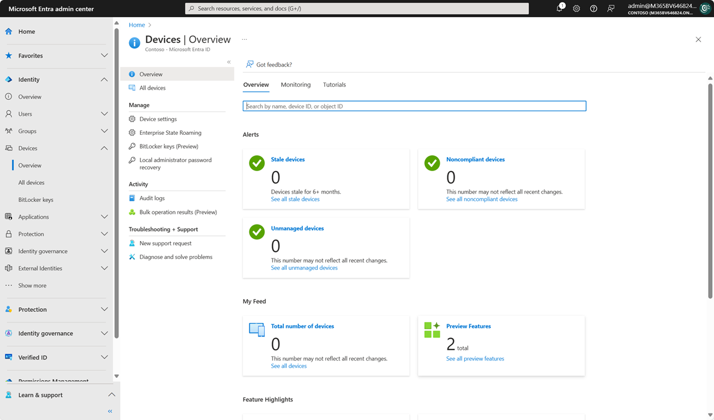
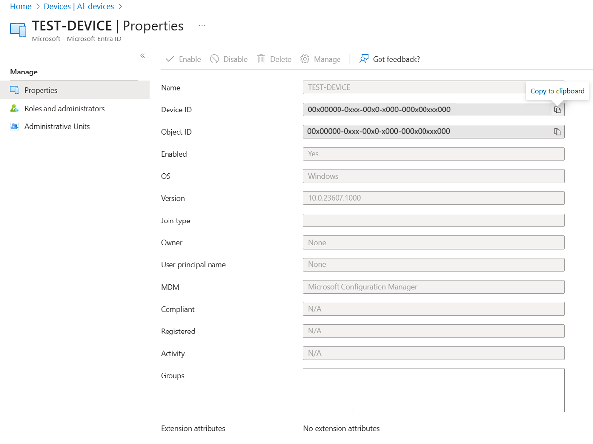
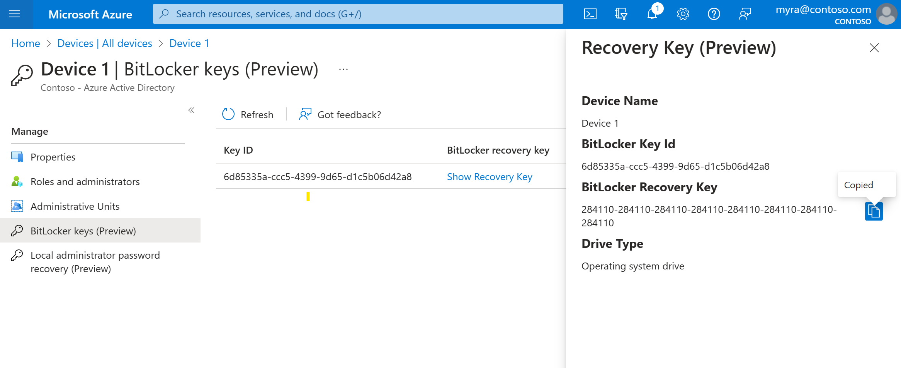

# Manage device identities using the Microsoft Entra admin center

Microsoft Entra ID provides a central place to manage device identities and monitor related event information.

You can access the devices overview by completing these steps:

1. Sign in to the [Microsoft Entra admin center](https://entra.microsoft.com) as at least a [Global Reader](../roles/permissions-reference.md#global-reader).
1. Go to **Identity** > **Devices** > **Overview**.

In the devices overview, you can view the number of total devices, stale devices, noncompliant devices, and unmanaged devices. It provides links to Intune, Conditional Access, BitLocker keys, and basic monitoring. 

Device counts on the overview page don't update in real time. Changes should be reflected every few hours.

From there, you can go to **All devices** to:

- Identify devices, including:
   - Devices that have been joined or registered in Microsoft Entra ID.
   - Devices deployed via [Windows Autopilot](/autopilot/windows-autopilot).
   - Printers that use [Universal Print](/universal-print/fundamentals/universal-print-getting-started).
- Complete device identity management tasks like enable, disable, delete, and manage.
   - The management options for [Printers](/universal-print/fundamentals/) and [Windows Autopilot](/autopilot/windows-autopilot) are limited in Microsoft Entra ID. These devices must be managed from their respective admin interfaces.
- Configure your device identity settings.
- Enable or disable enterprise state roaming.
- Review device-related audit logs.
- Download devices.

> [!TIP]
> - Microsoft Entra hybrid joined Windows 10 or newer devices don't have an owner unless the primary user is set in Microsoft Intune. If you're looking for a device by owner and don't find it, search by the device ID.
>
> - If you see a device that's **Microsoft Entra hybrid joined** with a state of **Pending** in the **Registered** column, the device has been synchronized from Microsoft Entra Connect and is waiting to complete registration from the client. See [How to plan your Microsoft Entra hybrid join implementation](hybrid-join-plan.md). For more information, see [Device management frequently asked questions](faq.yml).
>
> - For some iOS devices, device names that contain apostrophes can use different characters that look like apostrophes. So searching for such devices is a little tricky. If don't see correct search results, be sure the search string contains the matching apostrophe character.

## Manage an Intune device

If you have rights to manage devices in Intune, you can manage devices for which mobile device management is listed as **Microsoft Intune**. If the device isn't enrolled with Microsoft Intune, the **Manage** option isn't available.

## Enable or disable a Microsoft Entra device

There are two ways to enable or disable devices:

- The toolbar on the **All devices** page, after you select one or more devices.
- The toolbar, after you drill down for a specific device.

> [!IMPORTANT]
> - You must be a Global Administrator, Intune Administrator, or Cloud Device Administrator in Microsoft Entra ID to enable or disable a device. 
> - Disabling a device prevents it from authenticating via Microsoft Entra ID. This prevents it from accessing your Microsoft Entra resources that are protected by device-based Conditional Access and from using Windows Hello for Business credentials.
> - Disabling a device revokes the Primary Refresh Token (PRT) and any refresh tokens on the device.
> - Printers can't be enabled or disabled in Microsoft Entra ID.

## Delete a Microsoft Entra device

There are two ways to delete a device:

- The toolbar on the **All devices** page, after you select one or more devices.
- The toolbar, after you drill down for a specific device.

> [!IMPORTANT]
> - You must be a Cloud Device Administrator, Intune Administrator, Windows 365 Administrator or Global Administrator in Microsoft Entra ID to delete a device.
> - Printers and Windows Autopilot devices can't be deleted in Microsoft Entra ID.
> - Deleting a device:
>    - Prevents it from accessing your Microsoft Entra resources.
>    - Removes all details attached to the device. For example, BitLocker keys for Windows devices.  
>    - Is a nonrecoverable activity. We don't recommended it unless it's required.

If a device is managed in another management authority, like Microsoft Intune, be sure it's wiped or retired before you delete it. See [How to manage stale devices](manage-stale-devices.md) before you delete a device.

## View or copy a device ID

You can use a device ID to verify the device ID details on the device or to troubleshoot via PowerShell. To access the copy option, select the device.

  
## View or copy BitLocker keys

You can view and copy BitLocker keys to allow users to recover encrypted drives. These keys are available only for Windows devices that are encrypted and store their keys in Microsoft Entra ID. You can find these keys when you view a device's details by selecting **Show Recovery Key**. Selecting **Show Recovery Key** generates an audit log entry, which you can find in the `KeyManagement` category.

To view or copy BitLocker keys, you need to be the owner of the device or have one of these roles:

- Cloud Device Administrator
- Global Administrator
- Helpdesk Administrator
- Intune Service Administrator
- Security Administrator
- Security Reader

## View and filter your devices

You can filter the device list by these attributes:

- Enabled state
- Compliant state
- Join type (Microsoft Entra joined, Microsoft Entra hybrid joined, Microsoft Entra registered)
- Activity timestamp
- OS type and OS version
   - Windows is displayed for Windows 11 and Windows 10 devices (with KB5006738).
   - Windows Server is displayed for [supported versions managed with Microsoft Defender for Endpoint](/mem/intune/protect/mde-security-integration#supported-platforms).
- Device type (printer, secure VM, shared device, registered device)
- MDM
- Autopilot
- Extension attributes
- Administrative unit
- Owner

## Download devices

Global readers, Cloud Device Administrators, Intune Administrators, and Global Administrators can use the **Download devices** option to export a CSV file that lists devices. You can apply filters to determine which devices to list. If you don't apply any filters, all devices are listed. An export task might run for as long as an hour, depending on your selections. If the export task exceeds 1 hour, it fails, and no file is output.

The exported list includes these device identity attributes:

`displayName,accountEnabled,operatingSystem,operatingSystemVersion,joinType (trustType),registeredOwners,userNames,mdmDisplayName,isCompliant,registrationTime,approximateLastSignInDateTime,deviceId,isManaged,objectId,profileType,systemLabels,model`

The following filters can be applied for the export task:

- Enabled state
- Compliant state
- Join type
- Activity timestamp
- OS type
- Device type

## Configure device settings

If you want to manage device identities by using the Microsoft Entra admin center, the devices need to be either [registered or joined](overview.md) to Microsoft Entra ID. As an administrator, you can control the process of registering and joining devices by configuring the following device settings.

You must be assigned one of the following roles to view device settings:

- Global Administrator
- Global Reader
- Cloud Device Administrator
- Intune Administrator
- Windows 365 Administrator
- Directory Reviewer

You must be assigned one of the following roles to manage device settings:

- Global Administrator
- Cloud Device Administrator

- **Users may join devices to Microsoft Entra ID**: This setting enables you to select the users who can register their devices as Microsoft Entra joined devices. The default is **All**.

   > [!NOTE]
   > The **Users may join devices to Microsoft Entra ID** setting is applicable only to Microsoft Entra join on Windows 10 or newer. This setting doesn't apply to Microsoft Entra hybrid joined devices, [Microsoft Entra joined VMs in Azure](./howto-vm-sign-in-azure-ad-windows.md#enable-azure-ad-login-for-a-windows-vm-in-azure), or Microsoft Entra joined devices that use [Windows Autopilot self-deployment mode](/autopilot/self-deploying) because these methods work in a userless context.

- **Users may register their devices with Microsoft Entra ID**: You need to configure this setting to allow users to register Windows 10 or newer personal, iOS, Android, and macOS devices with Microsoft Entra ID. If you select **None**, devices aren't allowed to register with Microsoft Entra ID. Enrollment with Microsoft Intune or mobile device management for Microsoft 365 requires registration. If you've configured either of these services, **ALL** is selected, and **NONE** is unavailable.
- **Require multifactor authentication to register or join devices with Microsoft Entra ID**: 
   - We recommend organizations use the [Register or join devices user](../conditional-access/concept-conditional-access-cloud-apps.md#user-actions) action in Conditional Access to enforce multifactor authentication. You must configure this toggle to **No** if you use a Conditional Access policy to require multifactor authentication. 
   - This setting allows you to specify whether users are required to provide another authentication factor to join or register their devices to Microsoft Entra ID. The default is **No**. We recommend that you require multifactor authentication when a device is registered or joined. Before you enable multifactor authentication for this service, you must ensure that multifactor authentication is configured for users that register their devices. For more information on Microsoft Entra multifactor authentication services, see [getting started with Microsoft Entra multifactor authentication](../authentication/concept-mfa-howitworks.md). This setting may not work with third-party identity providers.

   > [!NOTE]
   > The **Require multifactor authentication to register or join devices with Microsoft Entra ID** setting applies to devices that are either Microsoft Entra joined (with some exceptions) or Microsoft Entra registered. This setting doesn't apply to Microsoft Entra hybrid joined devices, [Microsoft Entra joined VMs in Azure](./howto-vm-sign-in-azure-ad-windows.md#enable-azure-ad-login-for-a-windows-vm-in-azure), or Microsoft Entra joined devices that use [Windows Autopilot self-deployment mode](/autopilot/self-deploying).

- **Maximum number of devices**: This setting enables you to select the maximum number of Microsoft Entra joined or Microsoft Entra registered devices that a user can have in Microsoft Entra ID. If users reach this limit, they can't add more devices until one or more of the existing devices are removed. The default value is **50**. You can increase the value up to 100. If you enter a value above 100, Microsoft Entra ID sets it to 100. You can also use **Unlimited** to enforce no limit other than existing quota limits.

   > [!NOTE]
   > The **Maximum number of devices** setting applies to devices that are either Microsoft Entra joined or Microsoft Entra registered. This setting doesn't apply to Microsoft Entra hybrid joined devices.

- **Additional local administrators on Microsoft Entra joined devices**: This setting allows you to select the users who are granted local administrator rights on a device. These users are added to the Device Administrators role in Microsoft Entra ID. Global Administrators in Microsoft Entra ID and device owners are granted local administrator rights by default. 
This option is a premium edition capability available through products like Microsoft Entra ID P1 or P2 and Enterprise Mobility + Security.
- **Enable Microsoft Entra Local Administrator Password Solution (LAPS) (preview)**: LAPS is the management of local account passwords on Windows devices. LAPS provides a solution to securely manage and retrieve the built-in local admin password. With cloud version of LAPS, customers can enable storing and rotation of local admin passwords for both Microsoft Entra ID and Microsoft Entra hybrid join devices. To learn how to manage LAPS in Microsoft Entra ID, see [the overview article](howto-manage-local-admin-passwords.md).

- **Restrict non-admin users from recovering the BitLocker key(s) for their owned devices**: Admins can block self-service BitLocker key access to the registered owner of the device. Default users without the BitLocker read permission are unable to view or copy their BitLocker key(s) for their owned devices. You must be a Global Administrator or Privileged Role Administrator to update this setting. 

- **Enterprise State Roaming**: For information about this setting, see [the overview article](./enterprise-state-roaming-enable.md).

## Audit logs

Device activities are visible in the activity logs. These logs include activities triggered by the device registration service and by users:

- Device creation and adding owners/users on the device
- Changes to device settings
- Device operations like deleting or updating a device

The entry point to the auditing data is **Audit logs** in the **Activity** section of the **Devices** page.

The audit log has a default list view that shows:

- The date and time of the occurrence.
- The targets.
- The initiator/actor of an activity.
- The activity.

:::image type="content" source="./media/manage-device-identities/63.png" alt-text="Screenshot that shows a table in the Activity section of the Devices page. The table shows the date, target, actor, and activity for four audit logs." border="false":::

You can customize the list view by selecting **Columns** in the toolbar:

:::image type="content" source="./media/manage-device-identities/64.png" alt-text="Screenshot that shows the toolbar of the Devices page." border="false":::

To reduce the reported data to a level that works for you, you can filter it by using these fields:

- **Category**
- **Activity Resource Type**
- **Activity**
- **Date Range**
- **Target**
- **Initiated By (Actor)**

You can also search for specific entries.

:::image type="content" source="./media/manage-device-identities/65.png" alt-text="Screenshot that shows audit data filtering controls." border="false":::

## Next steps

- [How to manage stale devices in Microsoft Entra ID](manage-stale-devices.md)
- [Troubleshoot pending device state](/troubleshoot/azure/active-directory/pending-devices)
