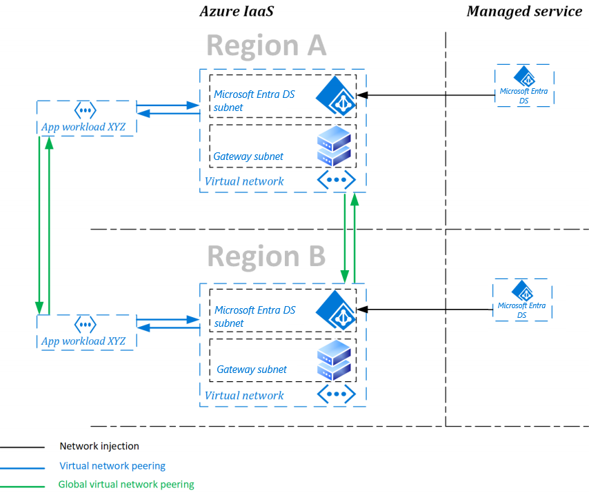

# Replica sets concepts and features for Azure Active Directory Domain Services (preview)

When you create an Azure Active Directory Domain Services (Azure AD DS) managed domain, you define a unique namespace. This namespace is the domain name, such as *aaddscontoso.com*, and two domain controllers (DCs) are then deployed into your selected Azure region. This deployment of DCs is known as a replica set.

You can expand a managed domain to have more than one replica set per Azure AD tenant. This ability provides geographical disaster recover for a managed domain. You can add a replica set to any peered virtual network in any Azure region that supports Azure AD DS. Additional replica sets in different Azure regions provide geographical disaster recovery for legacy applications if an Azure region goes offline.

Replica sets are currently in preview.

> [!NOTE]
> Replica sets don't let you deploy multiple unique managed domains in a single Azure tenant.

## How replica sets work

The first replica set for a managed domain, such as *aaddscontoso.com*, creates the domain configuration. Additional replica sets share the same namespace and configuration. Configuration changes, or user and credentials updates, replicate to all replica sets in the managed domain.

You create each replica set in a virtual network. Each virtual network must be peered to every other virtual network that hosts a managed domain's replica set. This configuration creates a meshed network topology that supports directory replication. A virtual network can support multiple replica sets provided each replica set is in a different virtual subnet.

Users, groups, group memberships, and password hashes are replicated using normal intrastate replication to provide the quickest convergence possible.

The following diagram shows a managed domain with two replica sets. The first replica set created with the domain namespace and a second replica set:

> [!NOTE]
> Replica sets ensure availability of authentication services in regions where a replica set is configured. For an application to have geographical redundancy if there's a regional outage, the application platform that relies on the managed domain must also reside in the other region.
>
> Resiliency of other services required for the application to function, such as Azure VMs or Azure App Services, isn't provided by replica sets. Availability design of other application components needs to consider resiliency features for services that make up the application.

The following example shows a managed domain with three replica sets to further provide resiliency and ensure availability of authentication services. In both examples, application workloads exist in the same region as the managed domain replica set:

## Deployment considerations

The default SKU for a managed domain is the *Enterprise* SKU, which supports multiple replica sets. To create additional replica sets if you changed to the *Standard* SKU, [upgrade the managed domain](change-sku.md) to *Enterprise* or *Premium*.

The maximum number of replica sets supported during preview is four, including the first replica created when you created the managed domain.

If you use an existing Azure AD tenant that has secure LDAP enabled, check when the TLS certificate expires before you add a replica set. If the certificate expires in the next six months, it's recommended to renew and upload the replacement using the Azure portal.

Azure bills each replica set based on the domain configuration SKU. For example, if you have a managed domain that uses the *Enterprise* SKU and you have three replica sets, Azure bills your subscription per hour for each of the three replica sets.

## Frequently asked questions

### Can I use my production managed domain with this preview?

We strongly encourage you to use a test tenant while replica sets are in preview. There's nothing to prevent you from using a production environment, though refer to the [Azure Active Directory Preview SLA](https://azure.microsoft.com/support/legal/preview-supplemental-terms/).

### Can I create a replica set in subscription different from my managed domain?

No. Replica sets must be in the same subscription as the managed domain.

### How many replica sets can I create?

The preview is limited to a maximum of four replica sets - the initial replica set for the managed domain, plus three replicas.

### How does user and group information get synchronized to my replica sets?

All replica sets are connected to each other using a mesh virtual network peering. One replica set receives user and group updates from Azure AD. Those changes are then replicated to the other replica sets using normal Active Directory replication over the peered network.

Just like with on-premises Active Directory Domain Services, an extended disconnected state can cause disruption in replication. As peered virtual networks aren't transitive, the design requirements for replica sets requires a fully meshed network topology.

### How do I make changes in my managed domain after I have replica sets?

Changes within the managed domain work just like they previously did. You [create and use a management VM with the RSAT tools that is joined to the managed domain](tutorial-create-management-vm.md). You can join as many management VMs to the managed domain as you wish.

## Next steps

To get started with creating an Azure AD DS managed domain with replica sets, see [Create and configure an Azure AD DS managed domain][tutorial-create-advanced].

<!-- LINKS - INTERNAL -->
[tutorial-create-advanced]: tutorial-create-instance-advanced.md
