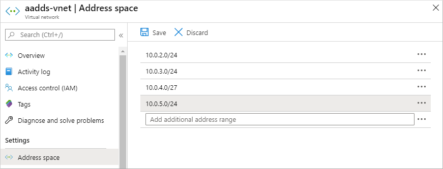
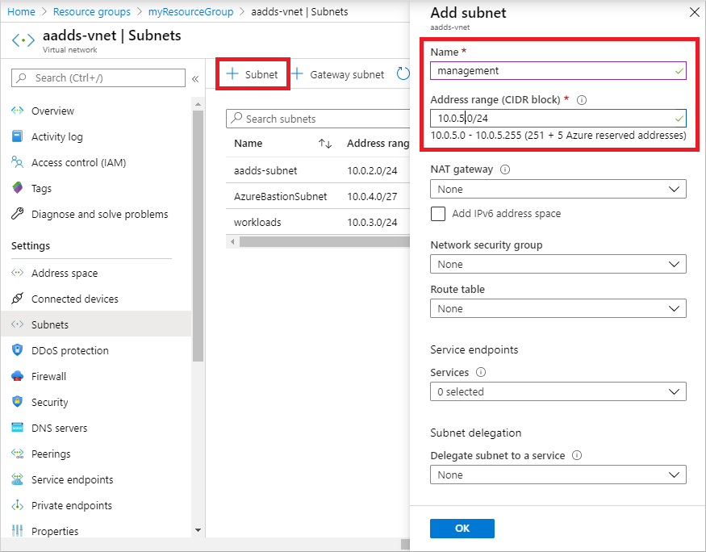
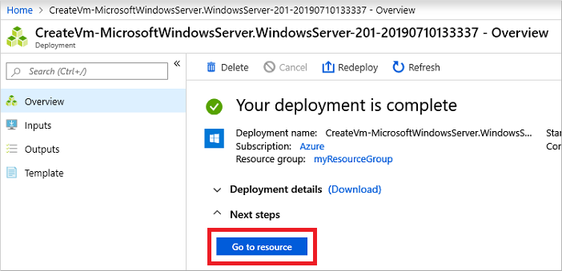
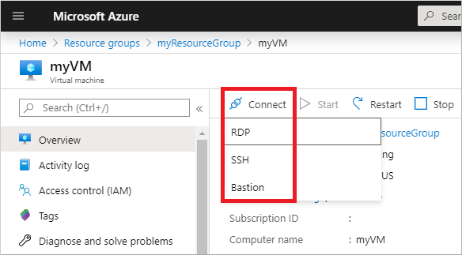
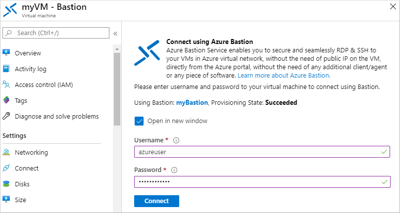
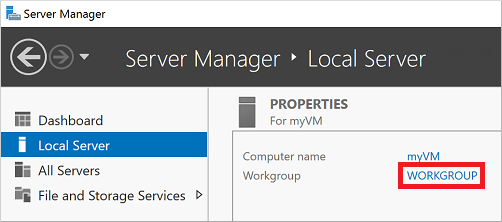
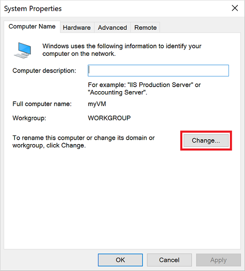
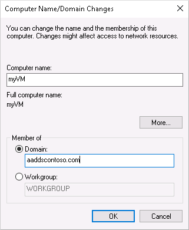
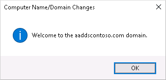

# Tutorial: Join a Windows Server virtual machine to a Microsoft Entra Domain Services managed domain

Microsoft Entra Domain Services provides managed domain services such as domain join, group policy, LDAP, Kerberos/NTLM authentication that is fully compatible with Windows Server Active Directory. With a Domain Services managed domain, you can provide domain join features and management to virtual machines (VMs) in Azure. This tutorial shows you how to create a Windows Server VM then join it to a managed domain.

In this tutorial, you learn how to:

> [!div class="checklist"]
> * Create a Windows Server VM
> * Connect the Windows Server VM to an Azure virtual network
> * Join the VM to the managed domain

If you don't have an Azure subscription, [create an account](https://azure.microsoft.com/free/?WT.mc_id=A261C142F) before you begin.

## Prerequisites

To complete this tutorial, you need the following resources:

* An active Azure subscription.
    * If you don't have an Azure subscription, [create an account](https://azure.microsoft.com/free/?WT.mc_id=A261C142F).
* A Microsoft Entra tenant associated with your subscription, either synchronized with an on-premises directory or a cloud-only directory.
    * If needed, [create a Microsoft Entra tenant][create-azure-ad-tenant] or [associate an Azure subscription with your account][associate-azure-ad-tenant].
* A Microsoft Entra Domain Services managed domain enabled and configured in your Microsoft Entra tenant.
    * If needed, [create and configure a Microsoft Entra Domain Services managed domain][create-azure-ad-ds-instance].
* A user account that's a part of the managed domain.
    * Make sure that Microsoft Entra Connect password hash synchronization or self-service password reset has been performed so the account is able to sign in to managed domain.
* An Azure Bastion host deployed in your Domain Services virtual network.
    * If needed, [create an Azure Bastion host][azure-bastion].

If you already have a VM that you want to domain-join, skip to the section to [join the VM to the managed domain](#join-the-vm-to-the-managed-domain).

## Sign in to the Microsoft Entra admin center

In this tutorial, you create a Windows Server VM to join to your managed domain using the Microsoft Entra admin center. To get started, first sign in to the [Microsoft Entra admin center](https://entra.microsoft.com).

## Create a Windows Server virtual machine

To see how to join a computer to a managed domain, let's create a Windows Server VM. This VM is connected to an Azure virtual network that provides connectivity to the managed domain. The process to join a managed domain is the same as joining a regular on-premises Active Directory Domain Services domain.

If you already have a VM that you want to domain-join, skip to the section to [join the VM to the managed domain](#join-the-vm-to-the-managed-domain).

1. From the Microsoft Entra admin center menu or from the **Home** page, select **Create a resource**.

1. From **Get started**, choose **Windows Server 2022 Datacenter**.

    

1. In the **Basics** window, configure the core settings for the virtual machine. Leave the defaults for *Availability options*, *Image*, and *Size*.

    | Parameter            | Suggested value   |
    |----------------------|-------------------|
    | Resource group       | Select or create a resource group, such as *myResourceGroup* |
    | Virtual machine name | Enter a name for the VM, such as *myVM* |
    | Region               | Choose the region to create your VM in, such as *East US* |
    | Username             | Enter a username for the local administrator account to create on the VM, such as *azureuser* |
    | Password             | Enter, and then confirm, a secure password for the local administrator to create on the VM. Don't specify a domain user account's credentials. [Windows LAPS](/windows-server/identity/laps/laps-overview) isn't supported. |

1. By default, VMs created in Azure are accessible from the Internet using RDP. When RDP is enabled, automated sign-in attacks are likely to occur, which may disable accounts with common names such as *admin* or *administrator* due to multiple failed successive sign-in attempts.

    RDP should only be enabled when required, and limited to a set of authorized IP ranges. This configuration helps improve the security of the VM and reduces the area for potential attack. Or, create and use an Azure Bastion host that allows access only through the Microsoft Entra admin center over TLS. In the next step of this tutorial, you use an Azure Bastion host to securely connect to the VM.

    Under **Public inbound ports**, select *None*.

1. When done, select **Next: Disks**.
1. From the drop-down menu for **OS disk type**, choose *Standard SSD*, then select **Next: Networking**.
1. Your VM must connect to an Azure virtual network subnet that can communicate with the subnet your managed domain is deployed into. We recommend that a managed domain is deployed into its own dedicated subnet. Don't deploy your VM in the same subnet as your managed domain.

    There are two main ways to deploy your VM and connect to an appropriate virtual network subnet:
    
    * Create a, or select an existing, subnet in the same the virtual network as your managed domain is deployed.
    * Select a subnet in an Azure virtual network that is connected to it using [Azure virtual network peering][vnet-peering].
    
    If you select a virtual network subnet that isn't connected to the subnet for your managed domain, you can't join the VM to the managed domain. For this tutorial, let's create a new subnet in the Azure virtual network.

    In the **Networking** pane, select the virtual network in which your managed domain is deployed, such as *aaads-vnet*
1. In this example, the existing *aaads-subnet* is shown that the managed domain is connected to. Don't connect your VM to this subnet. To create a subnet for the VM, select **Manage subnet configuration**.

    

1. In the left-hand menu of the virtual network window, select **Address space**. The virtual network is created with a single address space of *10.0.2.0/24*, which is used by the default subnet. Other subnets, such as for *workloads* or Azure Bastion may also already exist.

    Add an additional IP address range to the virtual network. The size of this address range and the actual IP address range to use depends on other network resources already deployed. The IP address range shouldn't overlap with any existing address ranges in your Azure or on-premises environment. Make sure that you size the IP address range large enough for the number of VMs you expect to deploy into the subnet.

    In the following example, an additional IP address range of *10.0.5.0/24* is added. When ready, select **Save**.

    

1. Next, in the left-hand menu of the virtual network window, select **Subnets**, then choose **+ Subnet** to add a subnet.

1. Select **+ Subnet**, then enter a name for the subnet, such as *management*. Provide an **Address range (CIDR block)**, such as *10.0.5.0/24*. Make sure that this IP address range doesn't overlap with any other existing Azure or on-premises address ranges. Leave the other options as their default values, then select **OK**.

    

1. It takes a few seconds to create the subnet. Once it's created, select the *X* to close the subnet window.
1. Back in the **Networking** pane to create a VM, choose the subnet you created from the drop-down menu, such as *management*. Again, make sure you choose the correct subnet and don't deploy your VM in the same subnet as your managed domain.
1. For **Public IP**, select *None* from the drop-down menu. As you use Azure Bastion in this tutorial to connect to the management, you don't need a public IP address assigned to the VM.
1. Leave the other options as their default values, then select **Management**.
1. Set **Boot diagnostics** to *Off*. Leave the other options as their default values, then select **Review + create**.
1. Review the VM settings, then select **Create**.

It takes a few minutes to create the VM. The Microsoft Entra admin center shows the status of the deployment. Once the VM is ready, select **Go to resource**.

## Connect to the Windows Server VM

To securely connect to your VMs, use an Azure Bastion host. With Azure Bastion, a managed host is deployed into your virtual network and provides web-based RDP or SSH connections to VMs. No public IP addresses are required for the VMs, and you don't need to open network security group rules for external remote traffic. You connect to VMs using the Microsoft Entra admin center from your web browser. If needed, [create an Azure Bastion host][azure-bastion].

To use a Bastion host to connect to your VM, complete the following steps:

1. In the **Overview** pane for your VM, select **Connect**, then **Bastion**.

    

1. Enter the credentials for your VM that you specified in the previous section, then select **Connect**.

   

If needed, allow your web browser to open pop-ups for the Bastion connection to be displayed. It takes a few seconds to make the connection to your VM.

## Join the VM to the managed domain

With the VM created and a web-based RDP connection established using Azure Bastion, now let's join the Windows Server virtual machine to the managed domain. This process is the same as a computer connecting to a regular on-premises Active Directory Domain Services domain.

1. If **Server Manager** doesn't open by default when you sign in to the VM, select the **Start** menu, then choose **Server Manager**.
1. In the left pane of the **Server Manager** window, select **Local Server**. Under **Properties** on the right pane, choose **Workgroup**.

    

1. In the **System Properties** window, select **Change** to join the managed domain.

    

1. In the **Domain** box, specify the name of your managed domain, such as *aaddscontoso.com*, then select **OK**.

    

1. Enter domain credentials to join the domain. Provide credentials for a user that's a part of the managed domain. The account must be part of the managed domain or Microsoft Entra tenant - accounts from external directories associated with your Microsoft Entra tenant can't correctly authenticate during the domain-join process.

    Account credentials can be specified in one of the following ways:

    * **UPN format** (recommended) - Enter the user principal name (UPN) suffix for the user account, as configured in Microsoft Entra ID. For example, the UPN suffix of the user *contosoadmin* would be `contosoadmin@aaddscontoso.onmicrosoft.com`. There are a couple of common use-cases where the UPN format can be used reliably to sign in to the domain rather than the *SAMAccountName* format:
        * If a user's UPN prefix is long, such as *deehasareallylongname*, the *SAMAccountName* may be autogenerated.
        * If multiple users have the same UPN prefix in your Microsoft Entra tenant, such as *dee*, their *SAMAccountName* format might be autogenerated.
    * **SAMAccountName format** - Enter the account name in the *SAMAccountName* format. For example, the *SAMAccountName* of user *contosoadmin* would be `AADDSCONTOSO\contosoadmin`.

1. It takes a few seconds to join to the managed domain. When complete, the following message welcomes you to the domain:

    

    Select **OK** to continue.

1. To complete the process to join to the managed domain, restart the VM.

> [!TIP]
> You can domain-join a VM using PowerShell with the [Add-Computer][add-computer] cmdlet. The following example joins the *AADDSCONTOSO* domain and then restarts the VM. When prompted, enter the credentials for a user that's a part of the managed domain:
>
> `Add-Computer -DomainName AADDSCONTOSO -Restart`
>
> To domain-join a VM without connecting to it and manually configuring the connection, you can use the [Set-AzVmAdDomainExtension][set-azvmaddomainextension] Azure PowerShell cmdlet.

Once the Windows Server VM has restarted, any policies applied in the managed domain are pushed to the VM. You can also now sign in to the Windows Server VM using appropriate domain credentials.

## Clean up resources

In the next tutorial, you use this Windows Server VM to install the management tools that let you administer the managed domain. If you don't want to continue in this tutorial series, review the following clean up steps to [delete the VM](#delete-the-vm). Otherwise, [continue to the next tutorial](#next-steps).

### Unjoin the VM from the managed domain

To remove the VM from the managed domain, follow through the steps again to [join the VM to a domain](#join-the-vm-to-the-managed-domain). Instead of joining the managed domain, choose to join a workgroup, such as the default *WORKGROUP*. After the VM has rebooted, the computer object is removed from the managed domain.

If you [delete the VM](#delete-the-vm) without unjoining from the domain, an orphaned computer object is left in Domain Services.

### Delete the VM

If you're not going use this Windows Server VM, delete the VM using the following steps:

1. From the left-hand menu, select **Resource groups**
1. Choose your resource group, such as *myResourceGroup*.
1. Choose your VM, such as *myVM*, then select **Delete**. Select **Yes** to confirm the resource deletion. It takes a few minutes to delete the VM.
1. When the VM is deleted, select the OS disk, network interface card, and any other resources with the *myVM-* prefix and delete them.

## Troubleshoot domain-join issues

The Windows Server VM should successfully join to the managed domain, the same way as a regular on-premises computer would join an Active Directory Domain Services domain. If the Windows Server VM can't join the managed domain, that indicates there's a connectivity or credentials-related issue. Review the following troubleshooting sections to successfully join the managed domain.

### Connectivity issues

If you don't receive a prompt that asks for credentials to join the domain, there's a connectivity problem. The VM can't reach the managed domain on the virtual network.

After trying each of these troubleshooting steps, try to join the Windows Server VM to the managed domain again.

* Verify the VM is connected to the same virtual network that Domain Services is enabled in, or has a peered network connection.
* Try to ping the DNS domain name of the managed domain, such as `ping aaddscontoso.com`.
    * If the ping request fails, try to ping the IP addresses for the managed domain, such as `ping 10.0.0.4`. The IP address for your environment is displayed on the *Properties* page when you select the managed domain from your list of Azure resources.
    * If you can ping the IP address but not the domain, DNS may be incorrectly configured. Confirm that the IP addresses of the managed domain are configured as DNS servers for the virtual network.
* Try to flush the DNS resolver cache on the virtual machine using the `ipconfig /flushdns` command.

### Credentials-related issues

If you receive a prompt that asks for credentials to join the domain, but then an error after you enter those credentials, the VM is able to connect to the managed domain. The credentials you provided don't then let the VM join the managed domain.

After trying each of these troubleshooting steps, try to join the Windows Server VM to the managed domain again.

* Make sure that the user account you specify belongs to the managed domain.
* Confirm that the account is part of the managed domain or Microsoft Entra tenant. Accounts from external directories associated with your Microsoft Entra tenant can't correctly authenticate during the domain-join process.
* Try using the UPN format to specify credentials, such as `contosoadmin@aaddscontoso.onmicrosoft.com`. If there are many users with the same UPN prefix in your tenant or if your UPN prefix is overly long, the *SAMAccountName* for your account may be autogenerated. In these cases, the *SAMAccountName* format for your account may be different from what you expect or use in your on-premises domain.
* Check that you have [enabled password synchronization][password-sync] to your managed domain. Without this configuration step, the required password hashes won't be present in the managed domain to correctly authenticate your sign-in attempt.
* Wait for password synchronization to be completed. When a user account's password is changed, an automatic background synchronization from Microsoft Entra ID updates the password in Domain Services. It takes some time for the password to be available for domain-join use.

## Next steps

In this tutorial, you learned how to:

> [!div class="checklist"]
> * Create a Windows Server VM
> * Connect to the Windows Server VM to an Azure virtual network
> * Join the VM to the managed domain

To administer your managed domain, configure a management VM using the Active Directory Administrative Center (ADAC).

> [!div class="nextstepaction"]
> [Install administration tools on a management VM](tutorial-create-management-vm.md)

<!-- INTERNAL LINKS -->
[create-azure-ad-tenant]: /azure/active-directory/fundamentals/sign-up-organization
[associate-azure-ad-tenant]: /azure/active-directory/fundamentals/how-subscriptions-associated-directory
[create-azure-ad-ds-instance]: tutorial-create-instance.md
[vnet-peering]: /azure/virtual-network/virtual-network-peering-overview
[password-sync]: ./tutorial-create-instance.md
[add-computer]: /powershell/module/microsoft.powershell.management/add-computer
[azure-bastion]: /azure/bastion/tutorial-create-host-portal
[set-azvmaddomainextension]: /powershell/module/az.compute/set-azvmaddomainextension
