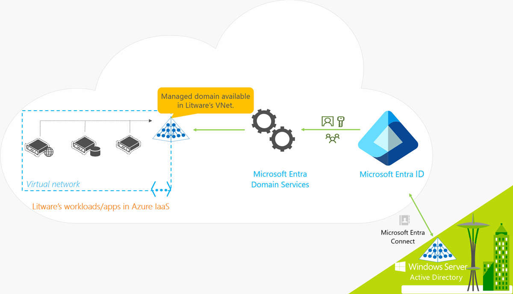
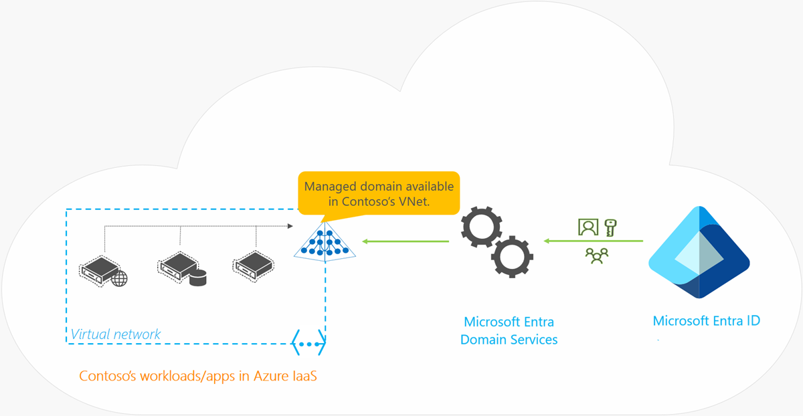

# What is Azure Active Directory Domain Services?

Azure Active Directory Domain Services (Azure AD DS) provides managed domain services such as domain join, group policy, LDAP, and Kerberos / NTLM authentication that are fully compatible with Windows Server Active Directory. You use these domain services without the need to deploy, manage, and patch domain controllers in the cloud. Azure AD DS integrates with your existing Azure AD tenant, which makes it possible for users to sign in using their existing credentials. You can also use existing groups and user accounts to secure access to resources, which provides a smoother lift-and-shift of on-premises resources to Azure.

Azure AD DS works with Azure AD tenants that are cloud-only or synchronized with an on-premises Active Directory Domain Services (AD DS) environment.

>[!VIDEO https://www.youtube.com/embed/T1Nd9APNceQ]

When you migrate existing workloads to the cloud, directory-aware applications may use LDAP for read or write access to the on-premises AD DS directory. Applications that run on Windows Server are typically deployed on domain-joined machines so they can be managed securely using Group Policy. To authenticate end users, the applications may also rely on Windows integrated authentication, such as Kerberos or NTLM authentication.

IT administrators often use one of the following solutions to provide an identity services to applications that run in Azure:

* Configure a site-to-site VPN connection between workloads that run in Azure and the on-premises AD DS environment.
* Create replica domain controllers using Azure virtual machines (VMs) to extend the AD DS domain / forest.
* Deploy a standalone AD DS environment in Azure using domain controllers that run on Azure VMs.

With these approaches, VPN connections to the on-premises directory make applications vulnerable to transient network glitches or outages. If you deploy domain controllers using VMs in Azure, the IT team VMs must manage, secure, patch, monitor, backup, and troubleshoot them. Azure AD DS removes the need to create VPN connections back to an on-premises AD DS environment or run and manage VMs in Azure to provide identity services. As a managed service, Azure AD DS reduces the complexity to create an integrated identity solution for both hybrid and cloud-only environments.

## How does Azure AD DS work?

To provide identity services, Azure creates an AD DS managed domain available on a virtual network of your choice. Behind the scenes, and without the need for your to manage, secure, or update, redundancy is provided through a pair of Windows Server domain controllers. The Azure AD DS managed domain is configured to synchronize with Azure AD to provide access to a central set of users, groups, and credentials. Applications, services, and VMs in Azure that connect to this virtual network can then use common AD DS features such as domain join, group policy, LDAP, and Kerberos / NTLM authentication. In a hybrid environment with an on-premises AD DS environment, [Azure AD Connect][azure-ad-connect] synchronizes identity information with Azure AD.

To see Azure AD DS in action, let's look at a couple of examples:

* [Azure AD DS for hybrid organizations](#azure-ad-ds-for-hybrid-organizations)
* [Azure AD DS for cloud-only organizations](#azure-ad-ds-for-cloud-only-organizations)

### Azure AD DS for hybrid organizations

Many organizations run a hybrid infrastructure that includes both cloud and on-premises application workloads. Legacy applications migrated to Azure as part of a lift and shift strategy may still use traditional LDAP connections to provide identity information. To support this hybrid infrastructure, identity information from an on-premises Active Directory Domain Services (AD DS) environment can be synchronized to an Azure AD tenant. Azure AD DS can then provide these legacy applications in Azure with an identity source, without the need to configure and manage application connectivity back to on-premises directory services.

Let's look at an example for Litware Corporation, a hybrid organization that runs both on-premises and Azure resources:

* Applications and server workloads that require domain services are deployed in a virtual network in Azure.
    * This may include legacy applications migrated to Azure as part of a lift and shift strategy.
* To synchronize identity information from their on-premises directory to their Azure AD tenant, Litware Corporation deploys [Azure AD Connect][azure-ad-connect].
    * Identity information that is synchronized includes user accounts and group memberships.
* Litware's IT team enables Azure AD DS for their Azure AD tenant in this, or a peered, virtual network.
* Applications and VMs deployed in the Azure virtual network can then use Azure AD DS features like domain join, LDAP read, LDAP bind, NTLM and Kerberos authentication, and Group Policy.

Some key aspects of a hybrid environment that uses Azure AD DS are as follows:

* The Azure AD DS managed domain is a stand-alone domain. It isn't an extension of Litware's on-premises domain.
* Litware's IT team doesn't need to manage, patch, or monitor domain controllers for this Azure AD DS managed domain.
* You don't need to manage AD replication to the Azure AD DS managed domain. User accounts, group memberships, and credentials from Litware's on-premises directory are synchronized to Azure AD via Azure AD Connect. These user accounts, group memberships, and credentials are automatically available within the Azure AD DS managed domain.

### Azure AD DS for cloud-only organizations

A cloud-only Azure AD tenant doesn't have an on-premises identity source. User accounts and group memberships, for example, are created and managed in Azure AD.

Now let's look at an example for Contoso, a cloud-only organization that only uses Azure AD for identity. All user identities, their credentials, and group memberships are created and managed in Azure AD. There is no additional configuration of Azure AD Connect to synchronize any identity information from an on-premises directory.

* Applications and server workloads that require domain services are deployed in a virtual network in Azure.
* Contoso's IT team enables Azure AD DS for their Azure AD tenant in this, or a peered, virtual network.
* Applications and VMs deployed in the Azure virtual network can then use Azure AD DS features like domain join, LDAP read, LDAP bind, NTLM and Kerberos authentication, and Group Policy.

Some key aspects of a cloud-only environment that uses Azure AD DS are as follows:

* Contoso's IT team doesn't need to manage, patch, or monitor domain controllers for this Azure AD DS managed domain.
* You don't need to manage Azure AD replication to the Azure AD DS managed domain. User accounts, group memberships, and credentials are automatically available within the Azure AD DS managed domain.

## Azure AD DS features

* **Simple deployment experience:** Azure AD DS is enabled for your Azure AD tenant using a single wizard in the Azure portal.
* **Integrated with Azure AD:** User accounts, group memberships, and credentials are automatically available from your Azure AD tenant. New users, groups, or changes to attributes from your Azure AD tenant or your on-premises AD DS environment are automatically synchronized to Azure AD DS.
* **Use your corporate credentials/passwords:** Passwords for users in your Azure AD tenant work with Azure AD DS. Users can use their corporate credentials to domain-join machines, sign in interactively or over remote desktop, and authenticate against the Azure AD DS managed domain.
* **Support for domain-join:** Windows client and Server operating systems can domain-join Azure AD DS managed domains, as with an on-premises AD DS environment.
* **NTLM and Kerberos authentication:** With support for NTLM and Kerberos authentication, you can deploy applications that rely on Windows integrated authentication.
* **LDAP bind & LDAP read support:** You can use applications that rely on LDAP binds to authenticate users in an Azure AD DS managed domain. Applications that use LDAP read operations to query user and computer attributes can also work against Azure AD DS managed domains.
* **Secure LDAP (LDAPS):** Secure LDAP access is available within the virtual network by default. You can also enable secure LDAP access over the internet.
* **Group Policy:** You can use a single built-in GPO each for the users and computers containers to enforce compliance with required security policies. You can also create your own custom GPOs and assign them to custom organizational units.
* **Create custom Organizational Units (OUs):** Add or remove resources such as service accounts, computers, or groups in custom OUs.
* **Create domains with custom names:** You can create domains with custom names, such as *contoso100.com*. Verified or unverified domain names can be used. You can also create a domain with the built-in **.onmicrosoft.com* domain suffix.
* **Manage DNS:** DNS for your Azure AD DS managed domain is configured using familiar tools such as the *DNS Administration* MMC snap-in.
* **High availability:** Azure AD DS includes multiple domain controllers, which offers high availability for your managed domain. This high availability guarantees service uptime and resilience to failures. Built-in health monitoring automatically fixes problems and can deploy new instances to replace failed instances and maintain uptime and availability.
* **AD Account lockout protection:** Users accounts are locked out for 30 minutes if five invalid passwords are used within 2 minutes. Accounts are automatically unlocked after 30 minutes.
* **Use familiar management tools:** You can use familiar Windows Server Active Directory management tools such as the Active Directory Administrative Center or Active Directory PowerShell to administer managed domains.
* **One domain instance per Azure AD directory:** You can create a single Azure AD DS managed domain for each Azure AD tenant.
* **Available in many Azure regions:** For the latest list of the Azure regions that support Azure AD DS, see [Azure services by region](https://azure.microsoft.com/regions/#services/).

## Next steps

To learn more about Azure AD DS compares with other identity solutions and how synchronization works, see the following articles:

* [Compare Azure AD DS with Azure AD, Active Directory Domain Services on Azure VMs, and Active Directory Domain Services on-premises][compare]
* [Learn how Azure AD Domain Services synchronizes with your Azure AD directory][synchronization]

To get started, [create an Azure AD DS managed domain using the Azure portal][tutorial-create]

<!-- INTERNAL LINKS -->
[compare]: comparison.md
[synchronization]: synchronization.md
[tutorial-create]: tutorial-create-instance.md
[azure-ad-connect]: ../active-directory/hybrid/whatis-hybrid-identity.md
