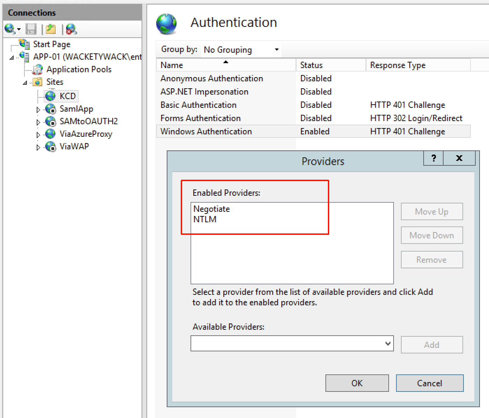
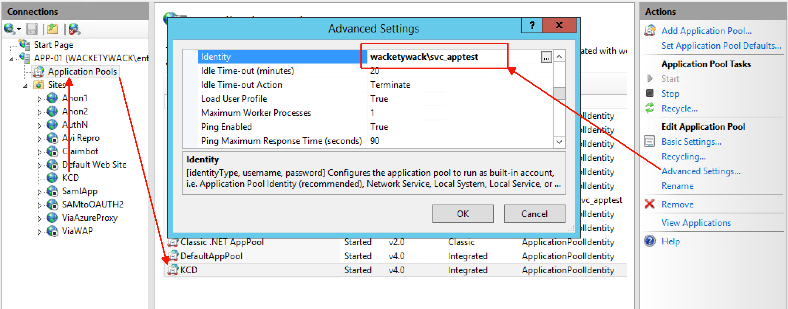
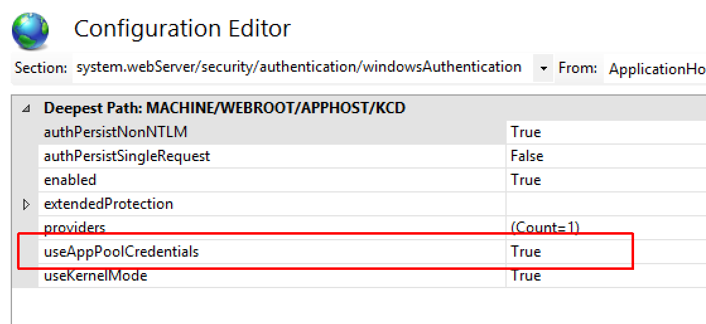

# Troubleshoot Kerberos constrained delegation configurations for Application Proxy

The methods available for achieving SSO to published applications can vary from one application to another. One option that Azure Active Directory (Azure AD) Application Proxy offers by default is Kerberos constrained delegation (KCD). You can configure a connector, for your users, to run constrained Kerberos authentication to back-end applications.

The procedure for enabling KCD is straightforward. It requires no more than a general understanding of the various components and authentication flow that support SSO. But sometimes, KCD SSO doesn’t function as expected. You need good sources of information to troubleshoot these scenarios.

This article provides a single point of reference that helps troubleshoot and self-remediate some of the most common issues. It also covers diagnosis of more complex implementation problems.

This article makes the following assumptions:

-   Deployment of Azure AD Application Proxy per [Get started with Application Proxy](application-proxy-add-on-premises-application.md) and general access to non-KCD applications work as expected.

-   The published target application is based on Internet Information Services (IIS) and the Microsoft implementation of Kerberos.

-   The server and application hosts reside in a single Azure Active Directory domain. For detailed information on cross-domain and forest scenarios, see the [KCD white paper](https://aka.ms/KCDPaper).

-   The subject application is published in an Azure tenant with pre-authentication enabled. Users are expected to authenticate to Azure via forms-based authentication. Rich client authentication scenarios aren't covered by this article. They might be added at some point in the future.

## Prerequisites

Azure AD Application Proxy can be deployed into many types of infrastructures or environments. The architectures vary from organization to organization. The most common causes of KCD-related issues aren't the environments. Simple misconfigurations or general mistakes cause most issues.

For this reason, it's best to make sure you've met all the prerequisites in [Using KCD SSO with the Application Proxy](application-proxy-configure-single-sign-on-with-kcd.md) before you start troubleshooting. Note the section on configuring Kerberos constrained delegation on 2012R2. This process employs a different approach to configuring KCD on previous versions of Windows. Also, be mindful of these considerations:

-   It's not uncommon for a domain member server to open a secure channel dialog with a specific domain controller (DC). Then the server might move to another dialog at any given time. So connector hosts aren't restricted to communication with only specific local site DCs.

-   Cross-domain scenarios rely on referrals that direct a connector host to DCs that might be outside of the local network perimeter. In these cases, it's equally important to also send traffic onward to DCs that represent other respective domains. If not, delegation fails.

-   Where possible, avoid placing any active IPS or IDS devices between connector hosts and DCs. These devices are sometimes overintrusive and interfere with core RPC traffic.

Test delegation in simple scenarios. The more variables you introduce, the more you might have to contend with. To save time, limit your testing to a single connector. Add additional connectors after the issue has been resolved.

Some environmental factors might also contribute to an issue. To avoid these factors, minimize architecture as much as possible during testing. For example, misconfigured internal firewall ACLs are common. If possible, send all traffic from a connector straight through to the DCs and back-end application.

The best place to position connectors is as close as possible to their targets. A firewall that sits inline when testing adds unnecessary complexity and can prolong your investigations.

What shows a KCD problem? There are several common indications that KCD SSO is failing. The first signs of an issue appear in the browser.

   

   

Both of these images show the same symptom: SSO failure. User access to the application is denied.

## Troubleshooting

How you troubleshoot depends on the issue and the symptoms you observe. Before you go any farther, explore the following articles. They provide useful troubleshooting information:

-   [Troubleshoot Application Proxy problems and error messages](application-proxy-troubleshoot.md)

-   [Kerberos errors and symptoms](application-proxy-troubleshoot.md#kerberos-errors)

-   [Working with SSO when on-premises and cloud identities aren't identical](application-proxy-configure-single-sign-on-with-kcd.md#working-with-different-on-premises-and-cloud-identities)

If you got to this point, then your main issue exists. To start, separate the flow into the following three stages that you can troubleshoot.

### Client pre-authentication 
The external user authenticating to Azure via a browser. The ability to pre-authenticate to Azure is necessary for KCD SSO to function. Test and address this ability if there are any issues. The pre-authentication stage isn't related to KCD or the published application. It's easy to correct any discrepancies by sanity checking that the subject account exists in Azure. Also check that it's not disabled or blocked. The error response in the browser is descriptive enough to explain the cause. If you're uncertain, check other Microsoft troubleshooting articles to verify.

### Delegation service 
The Azure Proxy connector that gets a Kerberos service ticket for users from a Kerberos Key Distribution Center (KCD).

The external communications between the client and the Azure front end have no bearing on KCD. These communications only make sure that KCD works. The Azure Proxy service is provided a valid user ID that is used to get a Kerberos ticket. Without this ID, KCD isn't possible and fails.

As mentioned previously, the browser error messages provides some good clues about why things fail. Make sure to note down the activity ID and timestamp in the response. This information helps you correlate the behavior to actual events in the Azure Proxy event log.

   

The corresponding entries seen in the event log show as events 13019 or 12027. Find the connector event logs in **Applications and Services Logs** &gt; **Microsoft** &gt; **AadApplicationProxy** &gt; **Connector** &gt; **Admin**.

   

   

1.   Use an **A** record in your internal DNS for the application’s address, not a **CName**.

2.   Reconfirm that the connector host has been granted the right to delegate to the designated target account’s SPN. Reconfirm that **Use any authentication protocol** is selected. For more information, see the [SSO configuration article](application-proxy-configure-single-sign-on-with-kcd.md).

3.   Verify that there's only one instance of the SPN in existence in Azure AD. Issue `setspn -x` from a command prompt on any domain member host.

4.   Check that a domain policy is enforced that limits the [maximum size of issued Kerberos tokens](https://blogs.technet.microsoft.com/askds/2012/09/12/maxtokensize-and-windows-8-and-windows-server-2012/). This policy stops the connector from getting a token if it's found to be excessive.

A network trace that captures the exchanges between the connector host and a domain KDC is the next best step to get more low-level detail on the issues. For more information, see the [deep dive Troubleshoot paper](https://aka.ms/proxytshootpaper).

If ticketing looks good, you see an event in the logs stating that authentication failed because the application returned a 401. This event indicates that the target application rejected your ticket. Go to the next stage.

### Target application 
The consumer of the Kerberos ticket provided by the connector. At this stage, expect the connector to have sent a Kerberos service ticket to the back end. This ticket is a header in the first application request.

1.   By using the application’s internal URL defined in the portal, validate that the application is accessible directly from the browser on the connector host. Then you can sign in successfully. Details can be found on the connector **Troubleshoot** page.

2.   Still on the connector host, confirm that the authentication between the browser and the application uses Kerberos. Take one of the following actions:

3.  Run DevTools (**F12**) in Internet Explorer, or use [Fiddler](https://blogs.msdn.microsoft.com/crminthefield/2012/10/10/using-fiddler-to-check-for-kerberos-auth/) from the connector host. Go to the application by using the internal URL. Inspect the offered WWW authorization headers returned in the response from the application to make sure that either negotiate or Kerberos is present. 

    - The next Kerberos blob that is returned in the response from the browser to the application starts with **YII**. These letters tell you that Kerberos is running. Microsoft NT LAN Manager (NTLM), on the other hand, always starts with **TlRMTVNTUAAB**, which reads NTLM Security Support Provider (NTLMSSP) when decoded from Base64. If you see **TlRMTVNTUAAB** at the start of the blob, Kerberos is not available. If you don’t see **TlRMTVNTUAAB**, Kerberos is likely available.
   
       > [!NOTE]
       > If you use Fiddler, this method requires that you temporarily disable extended protection on the application’s configuration in IIS.
      
      
   
    - The blob in this figure doesn't start with **TIRMTVNTUAAB**. So in this example, Kerberos is available, and the Kerberos blob doesn’t start with **YII**.

4.  Temporarily remove NTLM from the providers list on the IIS site. Access the app directly from Internet Explorer on the connector host. NTLM is no longer in the providers list. You can access the application by using Kerberos only. If access fails, there might be a problem with the application’s configuration. Kerberos authentication isn't functioning.

    - If Kerberos isn't available, check the application’s authentication settings in IIS. Make sure **Negotiate** is listed at the top, with NTLM just beneath it. If you see **Not Negotiate**, **Kerberos or Negotiate**, or **PKU2U**, continue only if Kerberos is functional.

       
   
    - With Kerberos and NTLM in place, temporarily disable pre-authentication for the application in the portal. Try to access it from the internet by using the external URL. You're prompted to authenticate. You're able to do so with the same account used in the previous step. If not, there's a problem with the back-end application, not KCD.

    - Re-enable pre-authentication in the portal. Authenticate through Azure by attempting to connect to the application via its external URL. If SSO fails, you see a forbidden error message in the browser and event 13022 in the log:

       *Microsoft AAD Application Proxy Connector cannot authenticate the user because the backend server responds to Kerberos authentication attempts with an HTTP 401 error.*

       
   
    - Check the IIS application. Make sure that the configured application pool and the SPN are configured to use the same account in Azure AD. Navigate in IIS as shown in the following illustration:
      
       
      
       After you know the identity, make sure this account is configured with the SPN in question. An example is `setspn –q http/spn.wacketywack.com`. Enter the following text in a command prompt:
      
       
      
    - Check the SPN defined against the application’s settings in the portal. Make sure that the same SPN configured against the target Azure AD account is used by the application’s app pool.

       
   
    - Go into IIS and select the **Configuration Editor** option for the application. Navigate to **system.webServer/security/authentication/windowsAuthentication**. Make sure the value **UseAppPoolCredentials** is **True**.

       

       Change this value to **True**. Remove all cached Kerberos tickets from the back-end server by running the following command:

       ```powershell
       Get-WmiObject Win32_LogonSession | Where-Object {$_.AuthenticationPackage -ne 'NTLM'} | ForEach-Object {klist.exe purge -li ([Convert]::ToString($_.LogonId, 16))}
       ``` 

For more information, see [Purge the Kerberos client ticket cache for all sessions](https://gallery.technet.microsoft.com/scriptcenter/Purge-the-Kerberos-client-b56987bf).


If you leave Kernel mode enabled, it improves the performance of Kerberos operations. But it also causes the ticket for the requested service to be decrypted by using the machine account. This account is also called the Local system. Set this value to **True** to break KCD when the application is hosted across more than one server in a farm.

-   As an additional check, disable **Extended** protection too. In some scenarios, **Extended** protection broke KCD when it was enabled in specific configurations. In those cases, an application was published as a subfolder of the default website. This application is configured for anonymous authentication only. All the dialogs are grayed out, which suggests child objects wouldn't inherit any active settings. We recommend that you test, but don’t forget to restore this value to **enabled**, where possible.

    This additional check puts you on track to use your published application. You can spin up additional connectors that are also configured to delegate. For more information, read the more in-depth technical walk-through, [Troubleshooting the Azure AD Application Proxy](https://aka.ms/proxytshootpaper).

If you still can't make progress, Microsoft support can assist you. Create a support ticket directly within the portal. An engineer will contact you.

## Other scenarios

- Azure Application Proxy requests a Kerberos ticket before sending its request to an application. Some third-party applications don't like this method of authenticating. These applications expect the more conventional negotiations to take place. The first request is anonymous, which allows the application to respond with the authentication types that it supports through a 401.

- Multi-hop authentication is commonly used in scenarios where an application is tiered, with a back end and front end, where both require authentication, such as SQL Server Reporting Services. To configure the multihop scenario, see the support article [Kerberos Constrained Delegation May Require Protocol Transition in Multi-hop Scenarios](https://support.microsoft.com/help/2005838/kerberos-constrained-delegation-may-require-protocol-transition-in-mul).

## Next steps
[Configure KCD on a managed domain](../../active-directory-domain-services/deploy-kcd.md).
