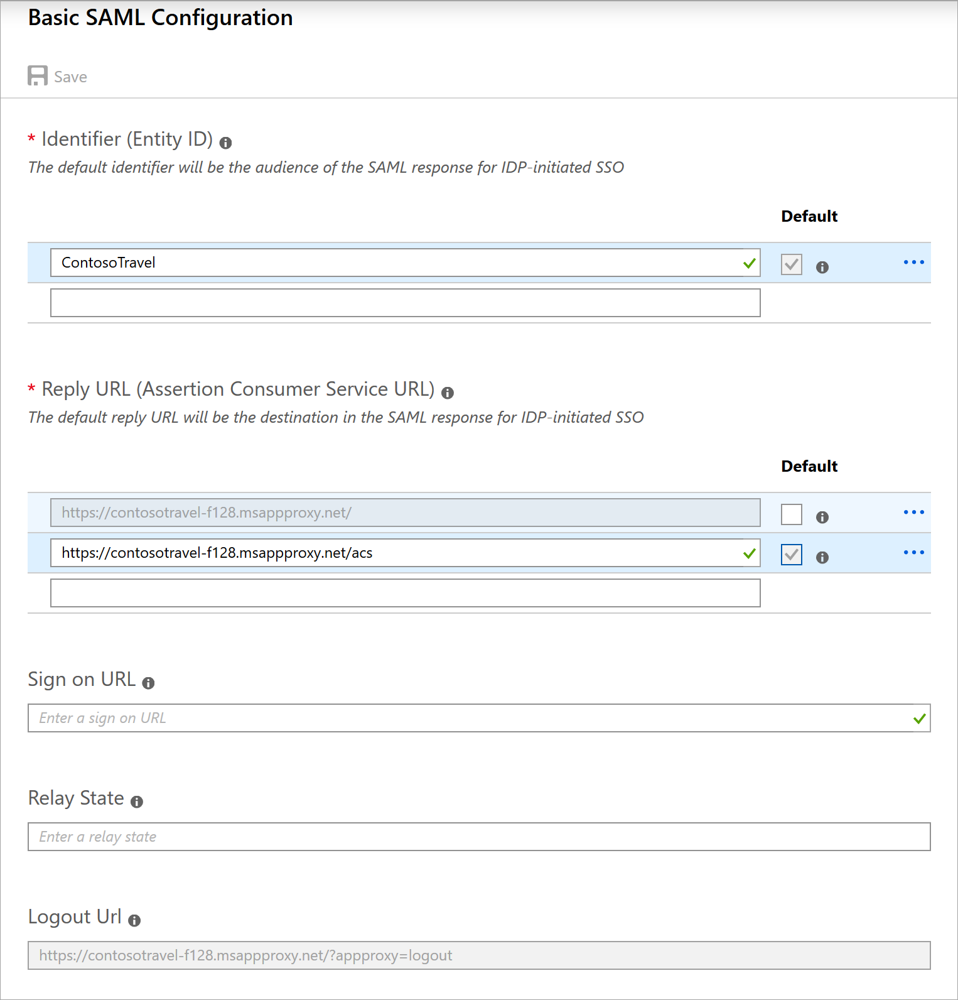

# SAML single sign-on for on-premises applications with Application Proxy (Preview)

You can provide single sign-on (SSO) to on-premises applications that are secured with SAML authentication and provide remote access to these applications through Application Proxy. With SAML single sign-on, Azure Active Directory (Azure AD) authenticates to the application by using the user's Azure AD account. Azure AD communicates the sign-on information to the application through a connection protocol. You can also map users to specific application roles based on rules you define in your SAML claims. By enabling Application Proxy in addition to SAML SSO your users will have external access to the application and a seamless SSO experience.

The applications must be able to consume SAML tokens issued by **Azure Active Directory**. 
This configuration does not apply to applications using an on-premises identity provider. For these scenarios, we recommend reviewing [Resources for migrating applications to Azure AD](migration-resources.md).

SAML SSO with Application Proxy also works with the SAML token encryption feature. For more info, see [Configure Azure AD SAML token encryption](howto-saml-token-encryption.md).

## Publish the on-premises application with Application Proxy

Before you can provide SSO for on-premises applications, make sure you have enabled Application Proxy and you have a connector installed. See [Add an on-premises application for remote access through Application Proxy in Azure AD](application-proxy-add-on-premises-application.md) to learn how.

Keep in mind the following when you're going through the tutorial:

* Publish your application according to the instructions in the tutorial. Make sure to select **Azure Active Directory** as the **Pre Authentication** method for your application (step 4 in [Add an on-premises app to Azure AD](application-proxy-add-on-premises-application.md#add-an-on-premises-app-to-azure-ad
)).
* Copy the **External URL** for the application.
* As a best practice, use custom domains whenever possible for an optimized user experience. Learn more about [Working with custom domains in Azure AD Application Proxy](application-proxy-configure-custom-domain.md).
* Add at least one user to the application and make sure the test account has access to the on-premises application. Using the test account test if you can reach the application by visiting the **External URL** to validate Application Proxy is set up correctly. For troubleshooting information, see [Troubleshoot Application Proxy problems and error messages](application-proxy-troubleshoot.md).

## Set up SAML SSO

1. In the Azure portal, select **Azure Active Directory > Enterprise applications** and select the application from the list.
1. From the app's **Overview** page, select **Single sign-on**.
1. Select **SAML** as the single sign-on method.
1. In the **Set up Single Sign-On with SAML** page, edit the **Basic SAML Configuration** data, and follow the steps in [Enter basic SAML configuration](configure-single-sign-on-non-gallery-applications.md#saml-based-single-sign-on) to configure SAML-based authentication for the application.

   * Make sure the **Reply URL** matches or is a path under the **External URL** for the on-premises application that you published through Application Proxy. If your application requires a different **Reply URL** for the SAML configuration, add this as an **additional** URL in the list and mark the checkbox next to it to designate it as the primary **Reply URL** to send IDP-initiated SAML responses to.
   * For an SP-initiated flow ensure that the application also specifies the correct **Reply URL** or Assertion Consumer Service URL to use for receiving the authentication token.

     

    > [!NOTE]
    > If the backend application expects the **Reply URL** to be the internal URL, you'll need to install the My Apps secure sign-in extension on users' devices. This extension will automatically redirect to the appropriate Application Proxy Service. To install the extension, see [My Apps secure sign-in extension](../user-help/my-apps-portal-end-user-access.md#download-and-install-the-my-apps-secure-sign-in-extension).

## Test your app

When you've completed all these steps, your app should be up and running. To test the app:

1. Open a browser and navigate to the external URL that you created when you published the app. 
1. Sign in with the test account that you assigned to the app. You should be able to load the application and have SSO into the application.

## Next steps

- [How does Azure AD Application Proxy provide single sign-on?](application-proxy-single-sign-on.md)
- [Troubleshoot Application Proxy](application-proxy-troubleshoot.md)
