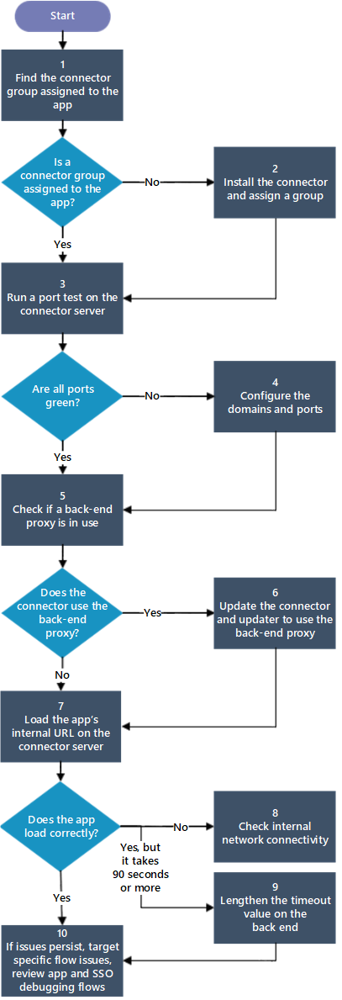

# Debug Application Proxy connector issues 

Use this flowchart to debug issues with Azure Active Directory (Azure AD) Application Proxy connectors. 

## Before you begin

This article assumes you have installed the Application Proxy connector and are having an issue. 

For more information about about Application Proxy and using its connectors, see:

- [Remote access to on-premises applications through Application Proxy](application-proxy.md)
- [Application Proxy connectors](application-proxy-connectors.md)
- [Install and register a connector](application-proxy-add-on-premises-application.md) 

## Flowchart for connector issues

This flowchart walks you through the steps for debugging a connector issue. For details about each step, see the table following the flowchart.

| Action link | Description | 
| ------ | ----------- |
| Find the connector group assigned to the app | You probably have a connector installed on multiple servers, in which case the connectors should be [assigned to connector groups](application-proxy-connector-groups.md#assign-applications-to-your-connector-groups). To learn more about connector groups, see [Publish applications on separate networks and locations using connector groups](application-proxy-connector-groups.md). |
| Install the connector and assign a group | If you don't have a connector installed, [Install and register a connector](application-proxy-add-on-premises-application.md#install-and-register-a-connector).  If the connector is not assigned to a group, [Assign the connector to a group](application-proxy-connector-groups.md#create-connector-groups).  [Assign the application to a connector group](application-proxy-connector-groups.md#assign-applications-to-your-connector-groups).|
| Run a port test on the connector server | |
| Configure the domains and ports | [Make sure that your domains and ports are configured correctly](application-proxy-add-on-premises-application.md#prepare-your-on-premises-environment) For the connector to work properly, there are ports that must be open, and URLs that your server needs to access. |
| Load the app's internal URL on the connector server | On the connector server, load the app's internal URL |
| There's a problem with internal connectivity | |
| Lengthen the time-out value on the back end | |
| Check if a back-end proxy is in use | |
| Update the connector and updater to use the back-end proxy | |
| Target specific flow issues, review SSO and KCD debugging flows | |

## Next steps

* [Publish applications on separate networks and locations using connector groups](application-proxy-connector-groups.md)
* [Work with existing on-premises proxy servers](application-proxy-configure-connectors-with-proxy-servers.md)
* [Troubleshoot Application Proxy and connector errors](application-proxy-troubleshoot.md)
* [How to silently install the Azure AD Application Proxy Connector](application-proxy-register-connector-powershell.md)
