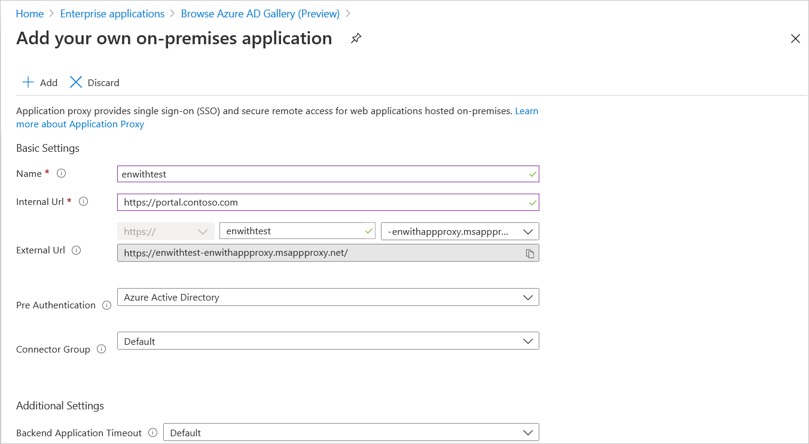
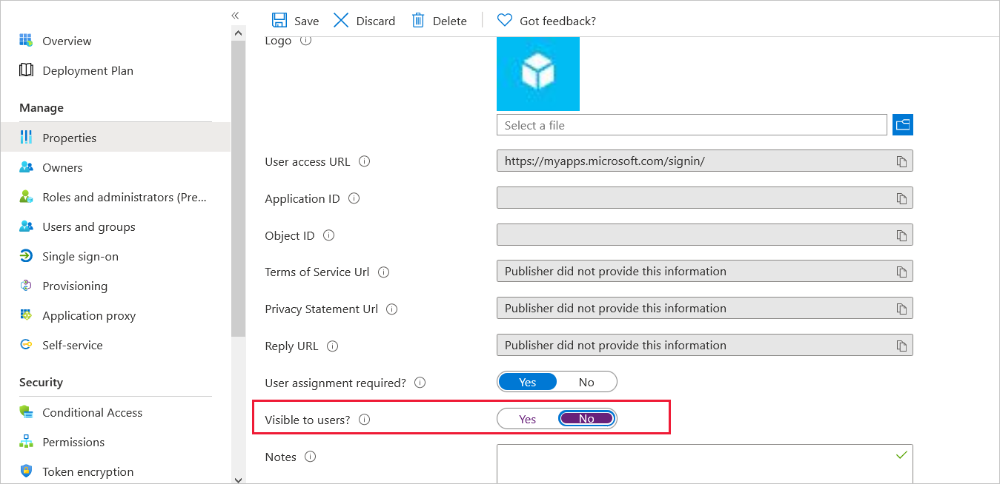

# Integrate with SharePoint (SAML)

This step-by-step guide explains how to secure the access to the [Azure Active Directory integrated on-premises Sharepoint (SAML)](https://docs.microsoft.com/azure/active-directory/saas-apps/sharepoint-on-premises-tutorial) using Azure AD Application Proxy, where users in your organization (Azure AD, B2B) connect to Sharepoint through the Internet.

> [!NOTE] 
> If you're new to Azure AD Application Proxy and want to learn more, see [Remote access to on-premises applications through Azure AD Application Proxy](https://docs.microsoft.com/azure/active-directory/manage-apps/application-proxy).

There are three primary advantages of this setup:

- Azure AD Application Proxy ensures that authenticated traffic can reach your internal network and the Sharepoint server.
- Your users can access the Sharepoint sites as usual without using VPN.
- You can control the access by user assignment on Azure AD Application Proxy level and you can increase the security with Azure AD features like Conditional Access and Multi-Factor Authentication (MFA).

This process requires two Enterprise Applications. One is a SharePoint on-premises instance that you publish from the gallery to your list of managed SaaS apps. The second is an on-premises application (non-gallery application) you'll use to publish the first Enterprise Gallery Application.

## Prerequisites

To complete this configuration, you need the following resources:
 - A SharePoint 2013 farm or newer. The Sharepoint farm must be [integrated with Azure AD](https://docs.microsoft.com/azure/active-directory/saas-apps/sharepoint-on-premises-tutorial).
 - An Azure AD tenant with a plan that includes Application Proxy. Learn more about [Azure AD plans and pricing](https://azure.microsoft.com/pricing/details/active-directory/).
 - A [custom, verified domain](https://docs.microsoft.com/azure/active-directory/fundamentals/add-custom-domain) in the Azure AD tenant. The verified domain must match the SharePoint URL suffix.
 - An SSL certificate is required. See the details in [custom domain publishing](https://docs.microsoft.com/azure/active-directory/manage-apps/application-proxy-configure-custom-domain).
 - On-premises Active Directory users must be synchronized with Azure AD Connect, and must be configure to [sign in to Azure](https://docs.microsoft.com/azure/active-directory/hybrid/plan-connect-user-signin). 
 - For cloud-only and B2B guest users, you need to [grant access to a guest account to SharePoint on-premises in the Azure portal](https://docs.microsoft.com/azure/active-directory/saas-apps/sharepoint-on-premises-tutorial#grant-access-to-a-guest-account-to-sharepoint-on-premises-in-the-azure-portal).
 - An Application Proxy connector installed and running on a machine within the corporate domain.

## Step 1: Integrate SharePoint on-premises with Azure AD 

1. Configure the SharePoint on-premises app. For more information, see [Tutorial: Azure Active Directory single sign-on integration with SharePoint on-premises](https://docs.microsoft.com/azure/active-directory/saas-apps/sharepoint-on-premises-tutorial).
2. Validate the configuration before moving to the next step. To validate, try to access the SharePoint on-premises from the internal network and confirm it's accessible internally. 

## Step 2: Publish the Sharepoint on-premises application with Application Proxy

In this step, you create an application in your Azure AD tenant that uses Application Proxy. You set the external URL and specify the internal URL, both of which are used later in SharePoint.

> [!NOTE] 
> The Internal and External URLs must match the **Sign on URL** in the SAML Based Application configuration in Step 1.

   

 1. Create a new Azure AD Application Proxy application with custom domain. For step-by-step instructions, see [Custom domains in Azure AD Application Proxy](https://docs.microsoft.com/azure/active-directory/manage-apps/application-proxy-configure-custom-domain).

    - Internal URL: https://portal.contoso.com/
    - External URL: https://portal.contoso.com/
    - Pre-Authentication: Azure Active Directory
    - Translate URLs in Headers: No
    - Translate URLs in Application Body: No

    

2. Assign the [same groups](https://docs.microsoft.com/azure/active-directory/saas-apps/sharepoint-on-premises-tutorial#create-an-azure-ad-security-group-in-the-azure-portal) you assigned to the on-premises SharePoint Gallery Application.

3. Finally, go to the **Properties** section and set **Visible to users?** to **No**. This option ensures that only the icon of the first application appears on the My Apps Portal (https://myapplications.microsoft.com).

   
 
## Step 3: Test your application

Using a browser from a computer on an external network, navigate to the URL (https://portal.contoso.com/) that you configured during the publish step. Make sure you can sign in with the test account that you set up.

