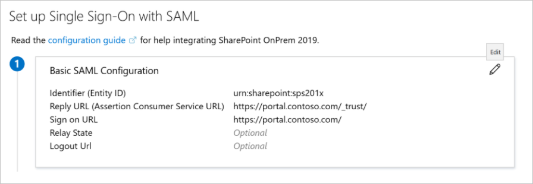

# Integrate with SharePoint (SAML)

This step-by-step guide explains how to integrate a SharePoint on-premises farm with Azure Active Directory (Azure AD) Application Proxy for SAML. You can allow your Azure AD users to access your SharePoint on-premises instance from an external network. 

This process requires two Enterprise Applications. One is a SharePoint on-premises instance that you publish from the gallery to your list of managed SaaS apps. The second is an on-premises application (non-gallery application) you'll use to publish the first Enterprise Gallery Application.

There are three primary advantages for this process: 

 - If the on-premises SharePoint instance is using Azure AD as single-sign on (SSO), you can extend the access and allow remote users to access SharePoint securely without VPN.
 - You can apply Azure AD security features like Conditional Access and multi-factor authorization (MFA) for external access.
 - You can grant B2B users in Azure AD access to your on-premises SharePoint instance. 

## Prerequisites

To complete this configuration, you need the following resources:
 - A SharePoint 2013 farm or newer. The Sharepoint farm must be [integrated with Azure AD](https://docs.microsoft.com/azure/active-directory/saas-apps/sharepoint-on-premises-tutorial).
 - An Azure AD tenant with a plan that includes Application Proxy. Learn more about [Azure AD plans and pricing](https://azure.microsoft.com/pricing/details/active-directory/).
 - A [custom, verified domain](https://docs.microsoft.com/azure/active-directory/fundamentals/add-custom-domain) in the Azure AD tenant. The verified domain must match the SharePoint URL suffix.
 - An SSL certificate is required. See the details in [custom domain publishing](https://docs.microsoft.com/azure/active-directory/manage-apps/application-proxy-configure-custom-domain).
 - On-premises Active Directory synchronized with Azure AD Connect, through which users can [sign in to Azure](https://docs.microsoft.com/azure/active-directory/hybrid/plan-connect-user-signin). 
 - For B2B guest users, you need to [grant access to a guest account to SharePoint on-premises in the Azure portal](https://docs.microsoft.com/azure/active-directory/saas-apps/sharepoint-on-premises-tutorial#grant-access-to-a-guest-account-to-sharepoint-on-premises-in-the-azure-portal).
 - An Application Proxy connector installed and running on a machine within the corporate domain.

## Step 1: Integrate SharePoint on-premises with Azure AD 

1. Configure the SharePoint on-premises app. For more information, see [Tutorial: Azure Active Directory single sign-on integration with SharePoint on-premises](https://docs.microsoft.com/azure/active-directory/saas-apps/sharepoint-on-premises-tutorial).
2. Validate the configuration before moving to the next step. To validate, try to access the SharePoint on-premises from the internal network and confirm it's accessible internally. 

## Step 2: Publish the Sharepoint on-premises application with Application Proxy

Find the following values that you configured when you [integrated with Azure AD](https://docs.microsoft.com/azure/active-directory/saas-apps/sharepoint-on-premises-tutorial).

 - Internal URL: https://\<TheRootOfYourSharePointSiteURL>/ 
 - External URL: https://\<TheRootOfYourSharePointSiteURL>/

> [!NOTE]
> The values match the Sign on URL under the SAML Based Application configuration in Step 1.

   

In this step, you create an application in your Azure AD tenant that uses Application Proxy. You set the external URL and specify the internal URL, both of which are used later in SharePoint.

 1. Create a new Azure AD Application Proxy application with custom domain. For step-by-step instructions, see [Custom domains in Azure AD Application Proxy](https://docs.microsoft.com/azure/active-directory/manage-apps/application-proxy-configure-custom-domain).

    - Internal URL: https://portal.contoso.com/
    - External URL: https://portal.contoso.com/
    - Pre-Authentication: Azure Active Directory
    - Translate URLs in Headers: No
    - Translate URLs in Application Body: No

    

2. Assign the [same groups](https://docs.microsoft.com/azure/active-directory/saas-apps/sharepoint-on-premises-tutorial#create-an-azure-ad-security-group-in-the-azure-portal) that you assigned to the on-premises SharePoint Gallery Application.

3. Optionally, you can prevent the visibility of two applications for the on-premises SharePoint instance. For **myapplications.microsoft.com**, go to the **Properties** section and set **Visible to users?** to **No** for one of your applications. 

   
 
## Step 3: Test your application

Using a browser from a computer on an external network, navigate to the URL (https://portal.contoso.com/) that you configured during the publish step. Make sure you can sign in with the test account that you set up.

