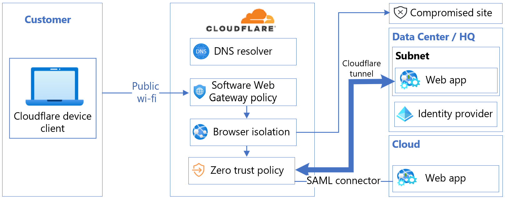
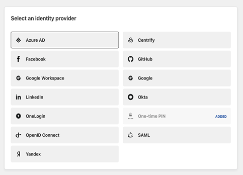
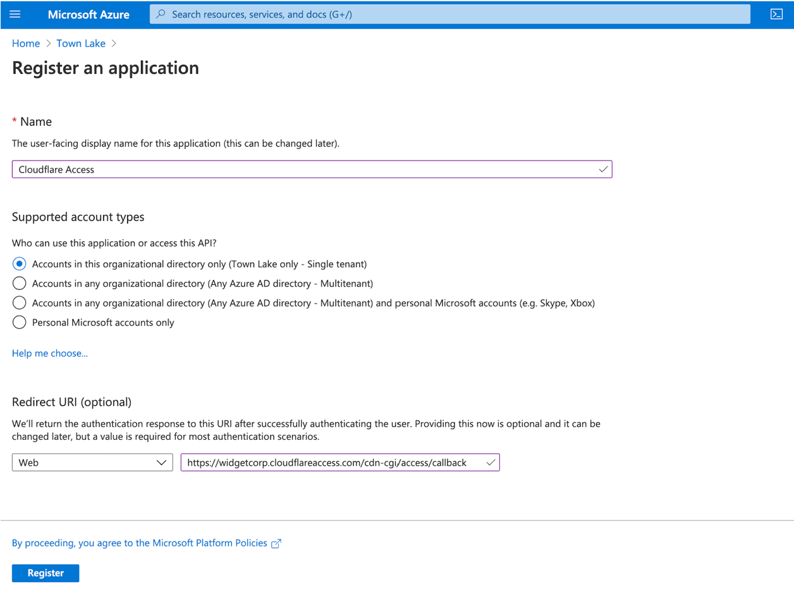
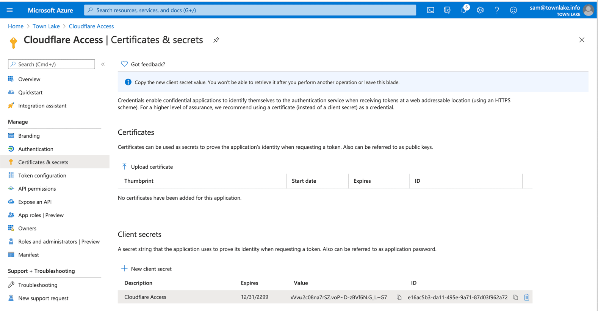

# Tutorial: Configure Cloudflare with Azure Active Directory for secure hybrid access

In this tutorial, learn how to integrate Azure Active Directory
(Azure AD) with Cloudflare Zero Trust. Using this solution, you can build rules based on user identity and group membership. Users can authenticate with their Azure AD credentials and connect to Zero Trust protected applications.

## Prerequisites

To get started, you need:

- An Azure AD subscription

  - If you don't have one, you can get an [Azure free account](https://azure.microsoft.com/free/).

- An Azure AD tenant linked to your Azure AD subscription

  - See, [Quickstart: Create a new tenant in Azure Active Directory](https://docs.microsoft.com/azure/active-directory/fundamentals/active-directory-access-create-new-tenant).

- A Cloudflare Zero Trust account

  - If you don't have one, go to [Get started with Cloudflare's Zero Trust
  platform](https://dash.cloudflare.com/sign-up/teams)

## Integrate organization identity providers with Cloudflare Access

Cloudflare Zero Trust Access helps enforce default-deny, Zero Trust
rules that limit access to corporate applications, private IP spaces,
and hostnames. This feature connects users faster and safer than a virtual private network (VPN).

Organizations can use multiple Identity Providers (IdPs) simultaneously, reducing friction when working with partners
or contractors.

To add an IdP as a sign-in method, configure [Cloudflare Zero Trust
dashboard](https://dash.teams.cloudflare.com/) and Azure
AD.

The following architecture diagram shows the implementation.

## Integrate a Cloudflare Zero Trust account with Azure AD

To integrate Cloudflare Zero Trust account with an instance of Azure AD:

1. On the [Cloudflare Zero Trust
    dashboard](https://dash.teams.cloudflare.com/),
    navigate to **Settings > Authentication**.

2. For **Login methods**, select **Add new**.

   

3. Under **Select an identity provider**, select **Azure AD.**

   

4. The **Add Azure ID** dialog appears. Enter credentials from your Azure AD instance and make necessary selections.

   

5. Select **Save**.

## Register Cloudflare with Azure AD

Use the instructions in the following three sections to register Cloudflare with Azure AD.

1. Sign in to the [Azure portal](https://portal.azure.com/).

2. Under **Azure Services**, select **Azure Active Directory**.

   :::image type="content" source="media/cloudflare-azure-ad-integration/azure-ad-portal.png" alt-text="Screenshot shows selecting Azure AD services." lightbox="media/cloudflare-azure-ad-integration/azure-ad-portal.png":::

3. In the left menu, under **Manage**, select **App registrations**.

4. Select the **+ New registration tab**.

   :::image type="content" source="media/cloudflare-azure-ad-integration/app-registration.png" alt-text="Screenshot shows new registration for app." lightbox="media/cloudflare-azure-ad-integration/app-registration.png":::

5. Name your application and enter your [team
    domain](https://developers.cloudflare.com/cloudflare-one/glossary#team-domain), with **callback** at the end of the path: /cdn-cgi/access/callback.
    For example, `https://<your-team-name>.cloudflareaccess.com/cdn-cgi/access/callback`

6. Select **Register**.

   

### Certificates & secrets

1. On the **Cloudflare Access** screen, under **Essentials**, copy and save the Application (client) ID and the Directory (tenant) ID.

   :::image type="content" source="media/cloudflare-azure-ad-integration/cloudflare-access.png" alt-text="Screenshot shows cloudflare access screen." lightbox="media/cloudflare-azure-ad-integration/cloudflare-access.png":::

2. In the left menu, under **Manage**, select **Certificates &
    secrets**.

   

3. Under **Client secrets**, select **+ New client secret**.

4. In **Description**, name the client secret.

5. Under **Expires**, select an expiration.

6. Select **Add**.

7. Under **Client secrets**, from the **Value** field, copy the value. Consider the value an application password. This example's value is visible, Azure values appear in the Cloudflare Access configuration.

   

### Permissions

1. In the left menu, select **API permissions**.

2. Select **+** **Add a permission**.

   :::image type="content" source="media/cloudflare-azure-ad-integration/api-permissions.png" alt-text="Screenshot shows Azure AD API permissions." lightbox="media/cloudflare-azure-ad-integration/api-permissions.png":::

3. Under **Select an API**, select **Microsoft Graph**.

    

4. Select **Delegated permissions** for the following permissions:

- `Email`

- `openid`

- `profile`

- `offline_access`

- `user.read`

- `directory.read.all`

- `group.read.all`

   :::image type="content" source="media/cloudflare-azure-ad-integration/request-api-permissions.png" alt-text="Screenshot shows Azure AD request API permissions screen." lightbox="media/cloudflare-azure-ad-integration/request-api-permissions.png":::

5. Under **Manage**, select **+** **Add permissions**.

6. Select **Grant Admin Consent for ...**.

   :::image type="content" source="media/cloudflare-azure-ad-integration/grant-admin-consent.png" alt-text="Screenshot shows configured API permissions with granting admin consent." lightbox="media/cloudflare-azure-ad-integration/grant-admin-consent.png":::

7. On the [Cloudflare Zero Trust dashboard](https://dash.teams.cloudflare.com/),
    navigate to **Settings> Authentication**.

8. Under **Login methods**, select **Add new**.

9. Select **Azure AD**.

10. Enter the Application ID, Application secret, and Directory ID values.

    >[!NOTE]
    >For Azure AD groups, in **Edit your Azure AD identity provider**, for **Support Groups** select **On**.

11. Select **Save**.

## Test the integration

1. To test the integration on the Cloudflare Zero Trust dashboard,
    navigate to **Settings** > **Authentication**.

2. Under **Login methods**, for Azure AD select **Test**.

   

3. Enter Azure AD credentials.

4. The **Your connection works** message appears.

   

## Next steps

- [Integrate single sign-on (SSO) with Cloudflare](https://developers.cloudflare.com/cloudflare-one/identity/idp-integration/)

- [Cloudflare integration with Azure AD B2C](https://docs.microsoft.com/azure/active-directory-b2c/partner-cloudflare)
