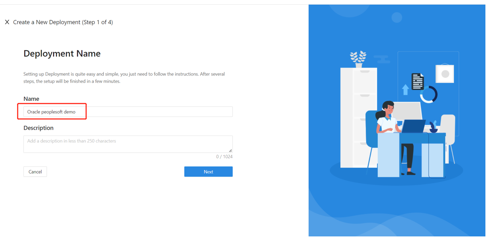
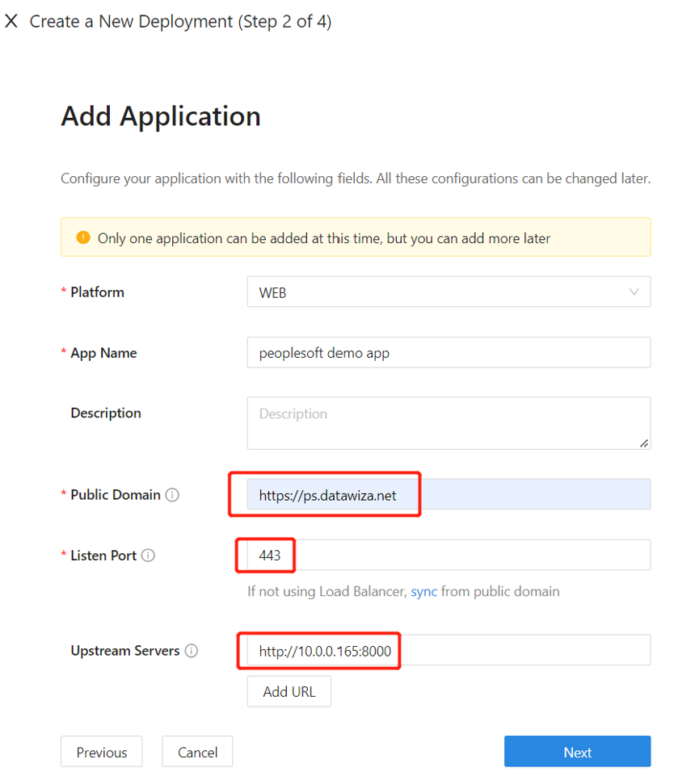
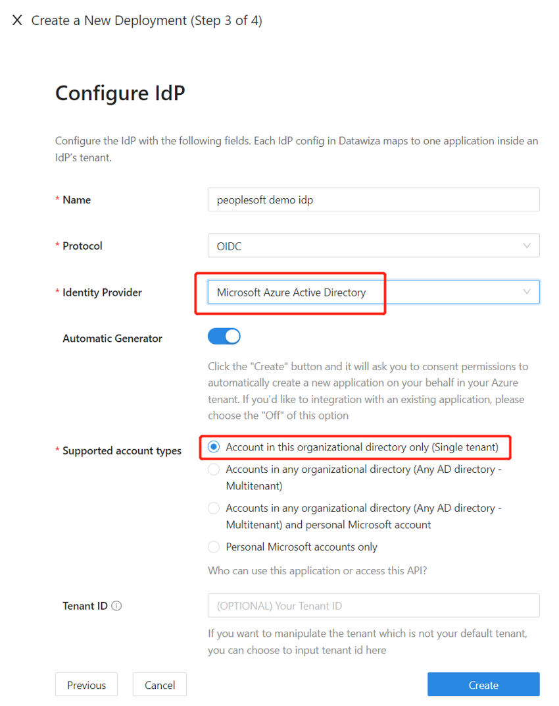
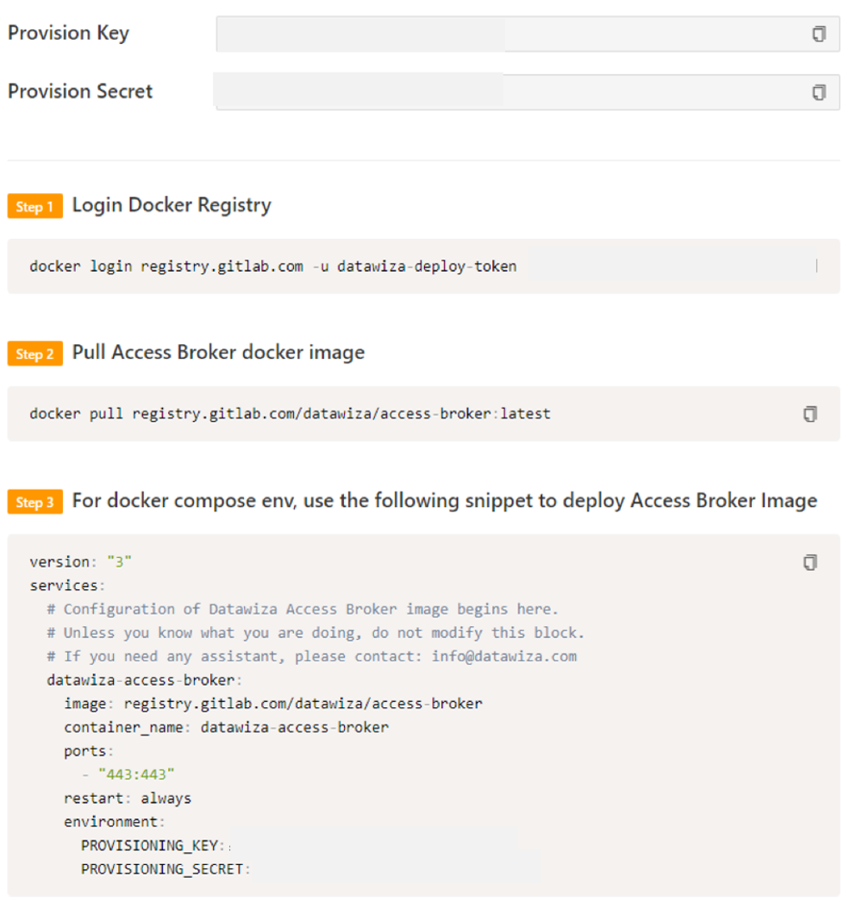
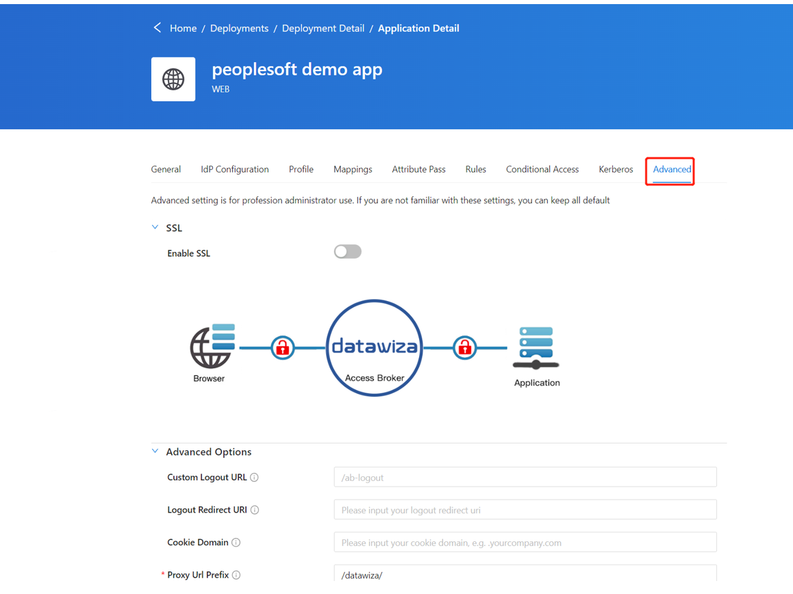
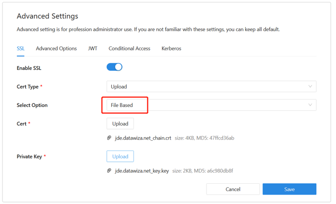
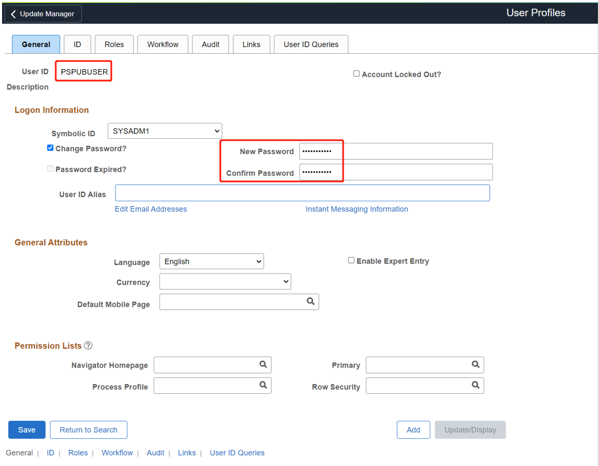
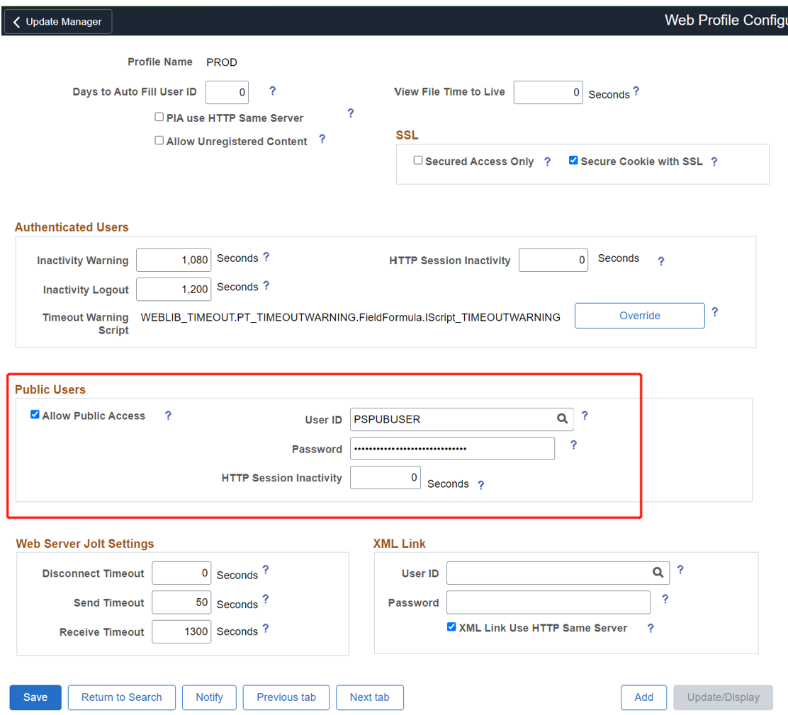

# Tutorial: Configure Datawiza to enable Azure Active Directory Multi-Factor Authentication and single sign-on to Oracle PeopleSoft

In this tutorial learn how to enable Azure Active Directory (Azure AD) single sign-on (SSO) and Azure AD Multi-Factor Authentication (MFA) for an
Oracle PeopleSoft application using Datawiza Access Proxy (DAP).

Learn more: [Datawiza Access Proxy](https://www.datawiza.com/)

Benefits of integrating applications with Azure AD using DAP:

* [Embrace proactive security with Zero Trust](https://www.microsoft.com/security/business/zero-trust) - a security model that adapts to modern environments and embraces hybrid workplace, while it protects people, devices, apps, and data
* [Azure Active Directory single sign-on](https://azure.microsoft.com/solutions/active-directory-sso/#overview) - secure and seamless access for users and apps, from any location, using a device
* [How it works: Azure AD Multi-Factor Authentication](../authentication/concept-mfa-howitworks.md) - users are prompted during sign-in for additional forms of identification, such as a code on their cellphone or a fingerprint scan
* [What is Conditional Access?](../conditional-access/overview.md) - policies are if-then statements, if a user wants to access a resource, then they must complete an action
* [Easy authentication and authorization in Azure AD with no-code Datawiza](https://www.microsoft.com/security/blog/2022/05/17/easy-authentication-and-authorization-in-azure-active-directory-with-no-code-datawiza/) - use web applications such as: Oracle JDE, Oracle E-Business Suite, Oracle Sibel, and home-grown apps
* Use the [Datawiza Cloud Management Console](https://console.datawiza.com) (DCMC) - manage access to applications in public clouds and on-premises

## Scenario description

This scenario focuses on Oracle PeopleSoft application integration using HTTP authorization headers to manage access to protected content.

In legacy applications, due to the absence of modern protocol support, a direct integration with Azure AD SSO is difficult. Datawiza Access Proxy (DAP) bridges the gap between the legacy application and the modern ID control plane, through protocol transitioning. DAP lowers integration overhead, saves engineering time, and improves application security.

## Scenario architecture

The scenario solution has the following components:

* **Azure AD** - identity and access management service that helps users sign in and access external and internal resources
* **Datawiza Access Proxy (DAP)** - container-based reverse-proxy that implements OpenID Connect (OIDC), OAuth, or Security Assertion Markup Language (SAML) for user sign-in flow. It passes identity transparently to applications through HTTP headers.
* **Datawiza Cloud Management Console (DCMC)** - administrators manage DAP with UI and RESTful APIs to configure DAP and access control policies
* **Oracle PeopleSoft application** - legacy application to be protected by Azure AD and DAP

Learn more: [Datawiza and Azure AD authentication architecture](./datawiza-with-azure-ad.md#datawiza-with-azure-ad-authentication-architecture)

## Prerequisites

Ensure the following prerequisites are met.

* An Azure subscription
  * If you don't have one, you can get an [Azure free account](https://azure.microsoft.com/free)
* An Azure AD tenant linked to the Azure subscription
  * See, [Quickstart: Create a new tenant in Azure Active Directory](../fundamentals/active-directory-access-create-new-tenant.md)
* Docker and Docker Compose
  * Go to docs.docker.com to [Get Docker](https://docs.docker.com/get-docker) and [Install Docker Compose](https://docs.docker.com/compose/install)
* User identities synchronized from an on-premises directory to Azure AD, or created in Azure AD and flowed back to an on-premises directory
  * See, [Azure AD Connect sync: Understand and customize synchronization](../hybrid/how-to-connect-sync-whatis.md)
* An account with Azure AD and the Application Administrator role
  * See, [Azure AD built-in roles, all roles](../roles/permissions-reference.md#all-roles)
* An Oracle PeopleSoft environment
* (Optional) An SSL web certificate to publish services over HTTPS. You can use default Datawiza self-signed certs for testing.

## Getting started with DAP

To integrate Oracle PeopleSoft with Azure AD:

1. Sign in to [Datawiza Cloud Management Console](https://console.datawiza.com/) (DCMC).
2. The Welcome page appears.
3. Select the orange **Getting started** button.
  
   

4. In the **Name** and **Description** fields, enter information.

   

5. Select **Next**.
6. The Add Application dialog appears.
7. For **Platform**, select **Web**.
8. For **App Name**, enter a unique application name.
9. For **Public Domain**, for example use `https://ps-external.example.com`. For testing, you can use localhost DNS. If you aren't deploying DAP behind a load balancer, use the Public Domain port.
10. For **Listen Port**, select the port that DAP listens on.
11. For **Upstream Servers**, select the Oracle PeopleSoft implementation URL and port to be protected. 

   
   
7. Select **Next**.
8. On the **Configure IdP** dialog, enter information.

   >[!Note]
   >DCMC has one-click integration to help complete Azure AD configuration. DCMC calls the Microsoft Graph API to create an application registration on your behalf in your Azure AD tenant. Learn more at docs.datawiza.com in [One Click Integration with Azure AD](https://docs.datawiza.com/tutorial/web-app-azure-one-click.html#preview)

9. Select **Create**.

   

10. The DAP deployment page appears.
11. Make a note of the deployment Docker Compose file. The file includes the DAP image, the Provisioning Key and Provision Secret, which pulls the latest configuration and policies from DCMC.

   

## SSO and HTTP headers

DAP gets user attributes from the identity provider (IdP) and passes them to the upstream application with a header or cookie.

The Oracle PeopleSoft application needs to recognize the user. Using a name, it instructs DAP to pass the values from the IdP to the application through the HTTP header.

1. In Oracle PeopleSoft, from the left navigation, select **Applications**.
2. Select the **Attribute Pass** subtab.
3. For **Field**, select **email**.
4. For **Expected**, select **PS_SSO_UID**.
5. For **Type**, select **Header**.

   

   >[!Note]
   >This configuration uses Azure AD user principal name as the sign-in username for Oracle PeopleSoft. To use another user identity, go to the **Mappings** tab.

   

## SSL Configuration

1. Select the **Advanced tab**.

   

2. Select **Enable SSL**.
3. From the **Cert Type** dropdown, select a type.

   

4. For testing, there is a self-signed certificate.

   

   >[!Note]
   >You can upload a certificate from a file.

   

5. Select **Save**.

## Enable Azure AD Multi-Factor Authentication

To provide more security for sign-ins, you can enforce Azure AD Multi-Factor Authentication (MFA). 

Learn more: [Tutorial: Secure user sign-in events with Azure AD MFA](../authentication/tutorial-enable-azure-mfa.md)

1. Sign in to the Azure portal as a Global Administrator.
2. Select **Azure Active Directory** > **Manage** > **Properties**.
3. Under **Properties**, select **Manage security defaults**.
4. Under **Enable Security defaults**, select **Yes**
5. Select **Save**.

## Enable SSO in the Oracle PeopleSoft console

To enable SSO in the Oracle PeopleSoft environment:

1. Sign in to the PeopleSoft Consol `http://{your-peoplesoft-fqdn}:8000/psp/ps/?cmd=start` using Admin credentials, for example, PS/PS.

   

2. Add a default public access user to PeopleSoft.
3. From the main menu, navigate to **PeopleTools > Security > User Profiles > User Profiles > Add a New Value**.
4. Select **Add a new value**.
5. Create user **PSPUBUSER**.
6. Enter the password.

    

7. Select the **ID** tab.
8. For **ID Type**, select **None**.

    

3. Navigate to **PeopleTools > Web Profile > Web Profile Configuration > Search > PROD > Security**.
4. Under **Public Users**, select the **Allow Public Access** box.
5. For **User ID**, enter **PSPUBUSER**.
6. Enter the password.

    

7. Select **Save**.
8. To enable SSO, navigate to **PeopleTools > Security > Security Objects > Signon PeopleCode**.
9. Select the **Sign on PeopleCode** page.
10. Enable **OAMSSO_AUTHENTICATION**.
11. Select **Save**.
12. To configure PeopleCode using the PeopleTools application designer, navigate to **File > Open > Definition: Record > Name: `FUNCLIB_LDAP`**.
13. Open **FUNCLIB_LDAP**.

    

14. Select the record.
15. Select **LDAPAUTH > View PeopleCode**.
16. Search for the `getWWWAuthConfig()` function `Change &defaultUserId = ""; to &defaultUserId = PSPUBUSER`.
17. Confirm the user Header is `PS_SSO_UID` for `OAMSSO_AUTHENTICATION` function. 
18. Save the record definition.

    

## Test an Oracle PeopleSoft application

To test an Oracle PeopleSoft application, validate application headers, policy, and overall testing. If needed, use header and policy simulation to validate header fields and policy execution.

To confirm Oracle PeopleSoft application access occurs correctly, a prompt appears to use an Azure AD account for sign-in. Credentials are checked and the Oracle PeopleSoft appears.

## Next steps

- Video: [Enable SSO and MFA for Oracle JD Edwards with Azure AD via Datawiza](https://www.youtube.com/watch?v=_gUGWHT5m90)
- [Tutorial: Configure Secure Hybrid Access with Azure AD and Datawiza](./datawiza-with-azure-ad.md)
- [Tutorial: Configure Azure AD B2C with Datawiza to provide secure hybrid access](../../active-directory-b2c/partner-datawiza.md)
- Go to docs.datawiza.com for Datawiza [User Guides](https://docs.datawiza.com/)
