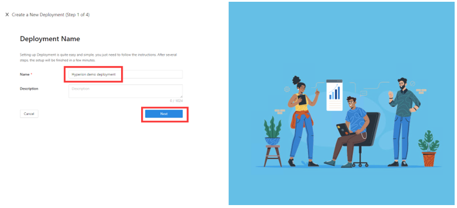
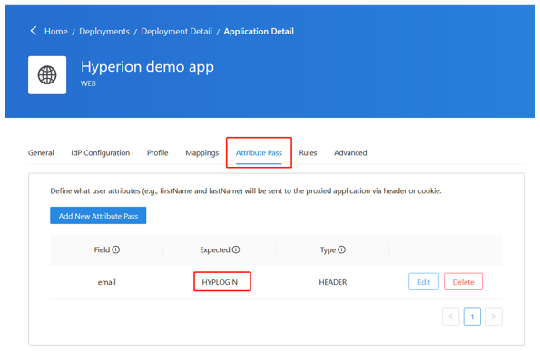
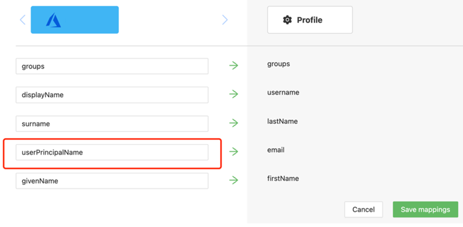
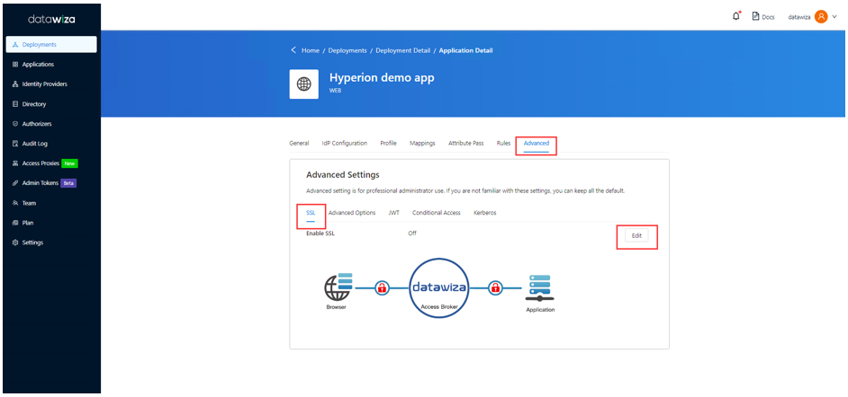
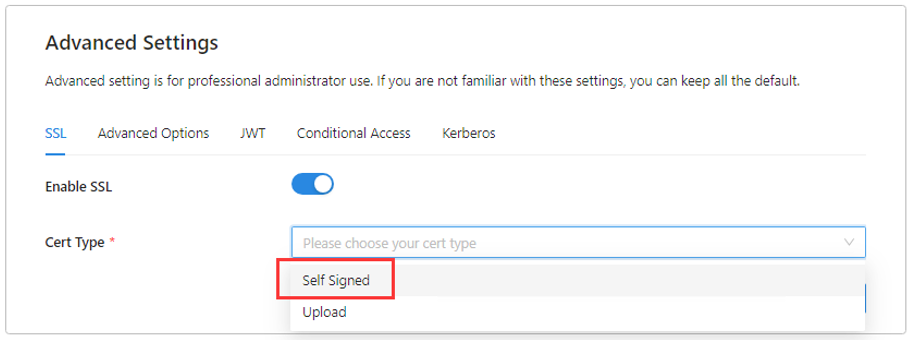
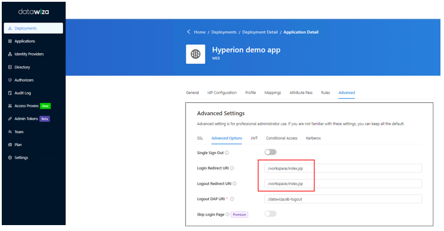
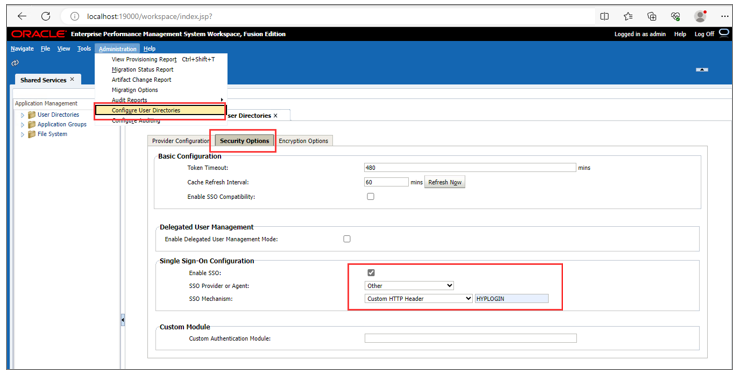
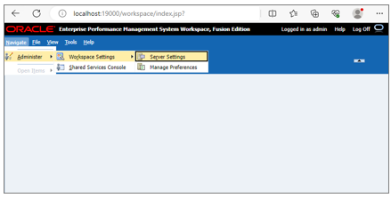

# Tutorial: Configure Datawiza to enable Microsoft Entra multifactor authentication and single sign-on to Oracle Hyperion EPM

Use this tutorial to enable Microsoft Entra multifactor authentication and single sign-on (SSO) for Oracle Hyperion Enterprise Performance Management (EPM) using Datawiza Access Proxy (DAP).

Learn more on [datawiza.com](https://www.datawiza.com/).

Benefits of integrating applications with Microsoft Entra ID by using DAP:

* [Embrace proactive security with Zero Trust](https://www.microsoft.com/security/business/zero-trust) - a security model that adapts to modern environments and embraces hybrid workplace, while it protects people, devices, apps, and data
* [Microsoft Entra single sign-on](https://azure.microsoft.com/solutions/active-directory-sso/#overview) - secure and seamless access for users and apps, from any location, using a device
* [How it works: Microsoft Entra multifactor authentication](../authentication/concept-mfa-howitworks.md) - users are prompted during sign-in for forms of identification, such as a code on their cellphone, or a fingerprint scan
* [What is Conditional Access?](../conditional-access/overview.md) - policies are if-then statements, if a user wants to access a resource, then they must complete an action
* [Easy authentication and authorization in Microsoft Entra ID with no-code Datawiza](https://www.microsoft.com/security/blog/2022/05/17/easy-authentication-and-authorization-in-azure-active-directory-with-no-code-datawiza/) - use web applications such as: [Oracle JDE](./datawiza-sso-oracle-jde.md), [Oracle E-Business Suite](./datawiza-sso-oracle-peoplesoft.md), [Oracle Siebel](https://www.datawiza.com/enable-sso-mfa-for-oracle-siebel-crm-in-minutes/), and home-grown apps
* Use the [Datawiza Cloud Management Console](https://console.datawiza.com) (DCMC) - manage access to applications in public clouds and on-premises

## Scenario description

This scenario focuses on Oracle Hyperion EPM integration using HTTP authorization headers to manage access to protected content.

Due to the absence of modern protocol support in legacy applications, a direct integration with Microsoft Entra ID SSO is challenging. Datawiza Access Proxy (DAP) bridges the gap between the legacy application and the modern identity control plane, through protocol transitioning. DAP lowers integration overhead, saves engineering time, and improves application security.

## Scenario architecture

The solution has the following components:

* **Microsoft Entra ID** - identity and access management service that helps users sign in and access external and internal resources
* **Datawiza Access Proxy (DAP)** - container-based reverse-proxy that implements OpenID Connect (OIDC), OAuth, or Security Assertion Markup Language (SAML) for user sign-in flow. It passes identity transparently to applications through HTTP headers.
* **Datawiza Cloud Management Console (DCMC)** - administrators manage DAP with UI and RESTful APIs to configure DAP and access control policies
* **Oracle Hyperion EPM** - legacy application to be protected by Microsoft Entra ID and DAP

Learn about the service provider-initiated flow in [Datawiza with Microsoft Entra authentication architecture.](datawiza-configure-sha.md#datawiza-with-microsoft-entra-authentication-architecture)

## Prerequisites

Ensure the following prerequisites are met:

* An Azure subscription
  * If you don't have one, you can get an [Azure free account](https://azure.microsoft.com/free)
* A Microsoft Entra ID tenant linked to the Azure subscription
  * See, [Quickstart: Create a new tenant in Microsoft Entra ID](../../fundamentals/create-new-tenant.md)
* Docker and Docker Compose
  * Go to docs.docker.com to [Get Docker](https://docs.docker.com/get-docker) and [Install Docker Compose](https://docs.docker.com/compose/install)
* User identities synchronized from an on-premises directory to Microsoft Entra ID, or created in Microsoft Entra ID and flowed back to an on-premises directory
  * See, [Microsoft Entra Connect Sync: Understand and customize synchronization](../hybrid/connect/how-to-connect-sync-whatis.md)
* An account with Microsoft Entra ID and the Application Administrator role
  * See, [Microsoft Entra built-in roles, all roles](../role-based-access-control/permissions-reference.md)
* An Oracle Hyperion EMP environment
  * (Optional) An SSL web certificate to publish services over HTTPS. You can use default Datawiza self-signed certs for testing.
## Getting started with DAP

To integrate Oracle Hyperion EMP with Microsoft Entra ID:

1. Sign in to [Datawiza Cloud Management Console](https://console.datawiza.com/) (DCMC).
2. The Welcome page appears.
3. Select the orange **Getting started** button. 

   

4. Under **Deployment Name** in the **Name** and **Description** fields, enter information.

   

5. Select **Next**.
6. The **Add Application** dialog appears. 
7. For **Platform**, select **Web**.
8. For **App Name**, enter a unique application name.
9. For **Public Domain**, for example use `https://hyperion.example.com`. For testing, you can use localhost DNS. If you aren't deploying DAP behind a load balancer, use the Public Domain port.
10. For **Listen Port**, select the port that DAP listens on.
11. For **Upstream Servers**, select the Oracle Hyperion implementation URL and port to be protected. 
12. Select **Next**.
13. On **Add Application**, enter information. Note the example entries for **Public Domain**, **Listen Port**, and **Upstream Servers**.
14. Select **Next**.
15. On the **Configure IdP** dialog, enter relevant information. 

   >[!NOTE]
   >Use Datawiza Cloud Management Console (DCMC) [One Click Integration](https://docs.datawiza.com/tutorial/web-app-azure-one-click.html) to help complete configuration. DCMC calls the Microsoft Graph API to create an application registration on your behalf, in your Microsoft Entra ID tenant.

16. Select **Create**.
17. The DAP deployment page appears.
18. Make a note of the deployment Docker Compose file. The file includes the DAP image, also the Provisioning Key and Provisioning Secret, which pull the latest configuration and policies from DCMC.

    

19. Select **Done**.

## SSO and HTTP headers

DAP gets user attributes from the identity provider (IdP) and passes them to the upstream application with a header or cookie.

The following instructions enable Oracle Hyperion EPM application to recognize the user. Using a name, it instructs DAP to pass the values from the IdP to the application through the HTTP header.

1. In the left navigation, select **Applications**.
2. Locate the application you created.
3. Select the **Attribute Pass** subtab. 
4. For **Field**, select **email**.
5. For **Expected**, select **HYPLOGIN**.
6. For **Type**, select **Header**.

   

   >[!NOTE]
   >This configuration uses the Microsoft Entra ID user principal name for the sign in username, which is used by Oracle Hyperion. For another user identity, go to the **Mappings** tab.

   

## SSL configuration

Use the following instructions for SSL configuration.

1. Select the **Advanced** tab.

   

2. On the **SSL** tab, select **Enable SSL**.
3. From the **Cert Type** dropdown, select the type. For testing, there's a self-signed certificate.

   

   >[!NOTE]
   >You can upload a certificate from a file.

   

4. Select **Save**.

## Login and Logout Redirect URI

Use the following instructions to indicate Login Redirect URI and Logout Redirect URI.

1. Select the **Advanced Options** tab.
2. For **Login Redirect URI** and **Logout Redirect URI**, enter `/workspace/index.jsp`.

   

3. Select **Save**.

## Enable Microsoft Entra multifactor authentication

To provide more security for sign-ins, you can enforce Microsoft Entra multifactor authentication. 

Learn more in the [Tutorial: Secure user sign-in events with Microsoft Entra multifactor authentication](../authentication/tutorial-enable-azure-mfa.md)

1. Sign in to the [Azure portal](https://portal.azure.com) as a [Global Administrator role.](../role-based-access-control/permissions-reference.md)
2. Select **Microsoft Entra ID** > **Manage** > **Properties**.
3. Under **Properties** select **Manage security defaults**.
4. Under **Enable Security Defaults**, select **Yes**.
5. Select **Save**.

## Enable SSO in the Oracle Hyperion Shared Services Console

Use the following instructions to enable SSO in the Oracle Hyperion environment.

1. Sign in to the Hyperion Shared Service Console with administrator permissions. For example, `http://{your-hyperion-fqdn}:19000/workspace/index.jsp`.
2. Select **Navigate**, then **Shared Services Console**.

   

3. Select **Administration** and then **Configure User Directories**.
4. Select the **Security Options** tab.
5. In **Single Sign-On Configuration**, select the **Enable SSO** checkbox.
6. From the **SSO Provider or Agent** dropdown, select **Other**.
7. From the **SSO Mechanism** dropdown, select **Custom HTTP Header**.
8. In the following field, enter **HYPLOGIN**, the header name the security agent passes to EMP.
9. Select **OK**.

   

## Update Post Log off URL settings in EMP Workspace

1. Select **Navigate**.
2. In **Administer**, select **Workspace Settings** then **Server Settings**.

   

3. On the **Workspace Server Settings** dialog, for **Post Logoff URL**, select the URL users see when they sign out of EPM,`/datawiza/ab-logout`.
4. Select **OK**.

   

## Test an Oracle Hyperion EMP application

To confirm Oracle Hyperion application access, a prompt appears to use a Microsoft Entra ID account for sign-in. Credentials are checked and the Oracle Hyperion EPM home page appears.

## Next steps

* [Tutorial: Configure Secure Hybrid Access with Microsoft Entra ID and Datawiza](./datawiza-configure-sha.md)
* [Tutorial: Configure Azure AD B2C with Datawiza to provide secure hybrid access](/azure/active-directory-b2c/partner-datawiza)
* Go to Datawiza for [Add SSO and MFA to Oracle Hyperion EPM in minutes](https://www.datawiza.com/sso-and-mfa-for-oracle-hyperion-epm/)
* Go to docs.datawiza.com for Datawiza [User Guides](https://docs.datawiza.com/)
