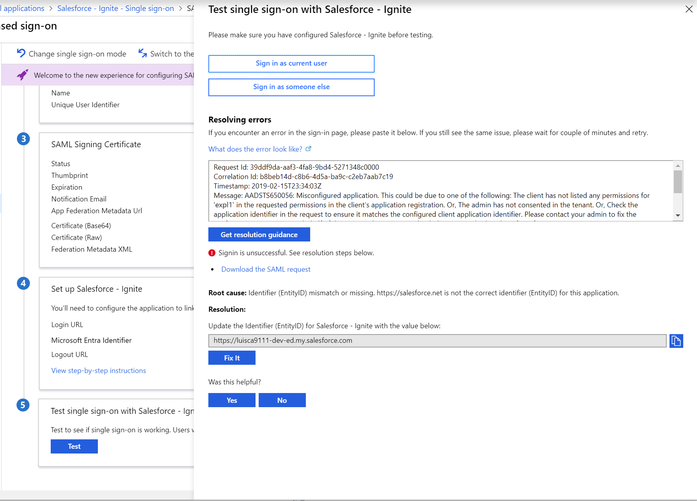
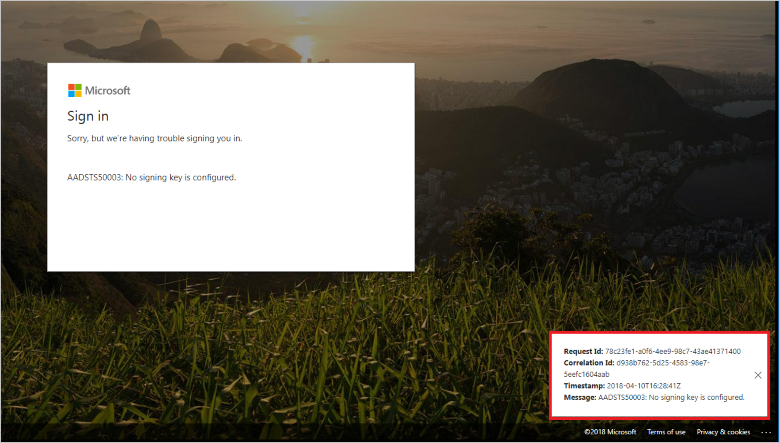

# Debug SAML-based single sign-on to applications

Learn how to find and fix [single sign-on](what-is-single-sign-on.md) issues for applications in Azure Active Directory (Azure AD) that use SAML-based single sign-on.

## Before you begin

We recommend installing the [My Apps Secure Sign-in Extension](https://support.microsoft.com/account-billing/troubleshoot-problems-with-the-my-apps-portal-d228da80-fcb7-479c-b960-a1e2535cbdff#im-having-trouble-installing-the-my-apps-secure-sign-in-extension). This browser extension makes it easy to gather the SAML request and SAML response information that you need to resolving issues with single sign-on. In case you cannot install the extension, this article shows you how to resolve issues both with and without the extension installed.

To download and install the My Apps Secure Sign-in Extension, use one of the following links.

- [Chrome](https://go.microsoft.com/fwlink/?linkid=866367)
- [Microsoft Edge](https://microsoftedge.microsoft.com/addons/detail/my-apps-secure-signin-ex/gaaceiggkkiffbfdpmfapegoiohkiipl)

## Test SAML-based single sign-on

To test SAML-based single sign-on between Azure AD and a target application:

1. Sign in to the [Azure portal](https://portal.azure.com) as a global administrator or other administrator that is authorized to manage applications.
1. In the left blade, select **Azure Active Directory**, and then select **Enterprise applications**.
1. From the list of enterprise applications, select the application for which you want to test single sign-on, and then from the options on the left select **Single sign-on**.
1. To open the SAML-based single sign-on testing experience, go to **Test single sign-on** (step 5). If the **Test** button is greyed out, you need to fill out and save the required attributes first in the **Basic SAML Configuration** section.
1. In the **Test single sign-on** blade, use your corporate credentials to sign in to the target application. You can sign in as the current user or as a different user. If you sign in as a different user, a prompt will ask you to authenticate.

    

If you are successfully signed in, the test has passed. In this case, Azure AD issued a SAML response token to the application. The application used the SAML token to successfully sign you in.

If you have an error on the company sign-in page or the application's page, use one of the next sections to resolve the error.

## Resolve a sign-in error on your company sign-in page

When you try to sign in, you might see an error on your company sign-in page that's similar to the following example.

To debug this error, you need the error message and the SAML request. The My Apps Secure Sign-in Extension automatically gathers this information and displays resolution guidance on Azure AD.

### To resolve the sign-in error with the My Apps Secure Sign-in Extension installed

1. When an error occurs, the extension redirects you back to the Azure AD **Test single sign-on** blade.
1. On the **Test single sign-on** blade, select **Download the SAML request**.
1. You should see specific resolution guidance based on the error and the values in the SAML request.
1. You will see a **Fix it** button to automatically update the configuration in Azure AD to resolve the issue. If you don't see this button, then the sign-in issue is not due to a misconfiguration on Azure AD.

If no resolution is provided for the sign-in error, we suggest that you use the feedback textbox to inform us.

### To resolve the error without installing the My Apps Secure Sign-in Extension

1. Copy the error message at the bottom right corner of the page. The error message includes:
    - A CorrelationID and Timestamp. These values are important when you create a support case with Microsoft because they help the engineers to identify your problem and provide an accurate resolution to your issue.
    - A statement identifying the root cause of the problem.
1. Go back to Azure AD and find the **Test single sign-on** blade.
1. In the text box above **Get resolution guidance**, paste the error message.
1. Click **Get resolution guidance** to display steps for resolving the issue. The guidance might require information from the SAML request or SAML response. If you're not using the  My Apps Secure Sign-in Extension, you might need a tool such as [Fiddler](https://www.telerik.com/fiddler) to retrieve the SAML request and response.
1. Verify that the destination in the SAML request corresponds to the SAML Single Sign-On Service URL obtained from Azure AD.
1. Verify the issuer in the SAML request is the same identifier you have configured for the application in Azure AD. Azure AD uses the issuer to find an application in your directory.
1. Verify AssertionConsumerServiceURL is where the application expects to receive the SAML token from Azure AD. You can configure this value in Azure AD, but it's not mandatory if it's part of the SAML request.

## Resolve a sign-in error on the application page

You might sign in successfully and then see an error on the application's page. This occurs when Azure AD issued a token to the application, but the application does not accept the response.

To resolve the error, follow these steps, or watch this [short video about how to use Azure AD to troubleshoot SAML SSO](https://www.youtube.com/watch?v=poQCJK0WPUk&list=PLLasX02E8BPBm1xNMRdvP6GtA6otQUqp0&index=8):

1. If the application is in the Azure AD Gallery, verify that you've followed all the steps for integrating the application with Azure AD. To find the integration instructions for your application, see the [list of SaaS application integration tutorials](../saas-apps/tutorial-list.md).
1. Retrieve the SAML response.
    - If the My Apps Secure Sign-in extension is installed, from the **Test single sign-on** blade, click **download the SAML response**.
    - If the extension is not installed, use a tool such as [Fiddler](https://www.telerik.com/fiddler) to retrieve the SAML response.
1. Notice these elements in the SAML response token:
   - User unique identifier of NameID value and format
   - Claims issued in the token
   - Certificate used to sign the token.

     For more information on the SAML response, see [Single Sign-on SAML protocol](../develop/single-sign-on-saml-protocol.md?toc=/azure/active-directory/azuread-dev/toc.json&bc=/azure/active-directory/azuread-dev/breadcrumb/toc.json).

1. Now that you have reviewed the SAML response, see [Error on an application's page after signing in](application-sign-in-problem-application-error.md) for guidance on how to resolve the problem.
1. If you're still not able to sign in successfully, you can ask the application vendor what is missing from the SAML response.

## Next steps

Now that single sign-on is working to your application, you could [Automate user provisioning and de-provisioning to SaaS applications](../app-provisioning/user-provisioning.md) or [get started with Conditional Access](../conditional-access/app-based-conditional-access.md).
