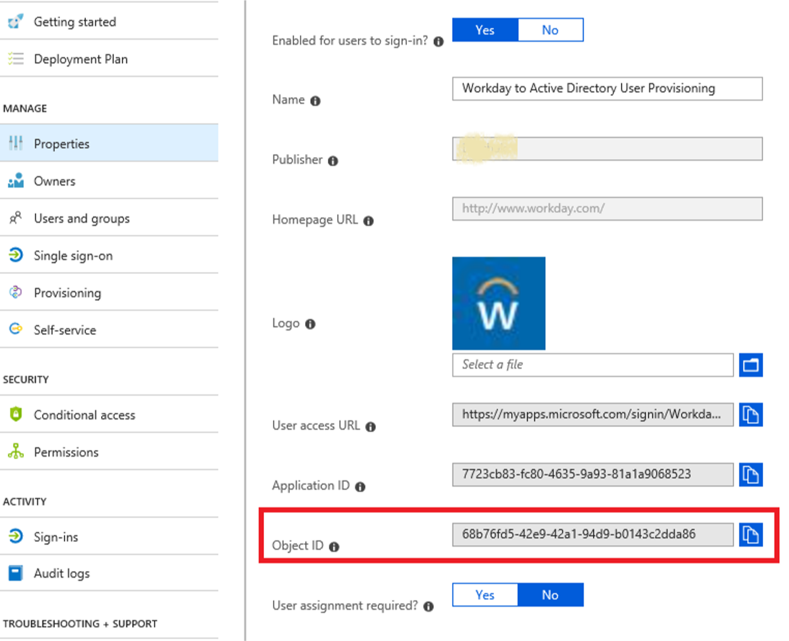
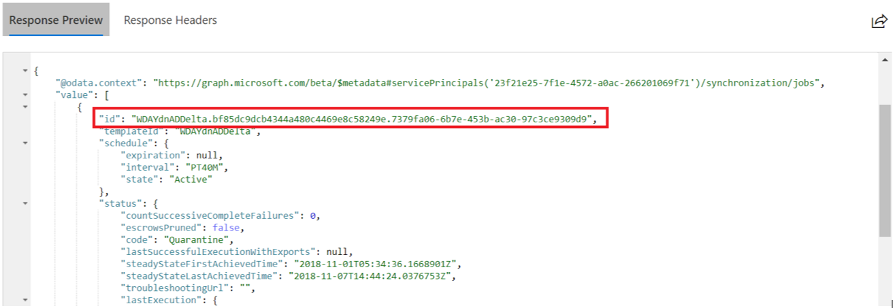

# Exporting and importing provisioning configuration with Graph APIs

You can use Microsoft Graph API and Graph Explorer to export your User Provisioning attribute mappings and schema to a JSON file and import it back into Azure AD. You can also use the steps captured here to create a backup of your provisioning configuration. 

## Step 1: Retrieve your Provisioning App Service Principal ID (Object ID)

1. Launch the [Azure portal](https://portal.azure.com), and navigate to the Properties section of your  provisioning application. For e.g. if you want to export your *Workday to AD User Provisioning application* mapping navigate to the Properties section of that app. 
1. In the Properties section of your provisioning app, copy the GUID value associated with the *Object ID* field. This value is also called the **ServicePrincipalId** of your App and it will be used in Graph Explorer operations.

   

## Step 2: Sign into Microsoft Graph Explorer

1. Launch [Microsoft Graph Explorer](https://developer.microsoft.com/graph/graph-explorer)
1. Click on the "Sign-In with Microsoft" button and sign-in using Azure AD Global Admin or App Admin credentials.

    

1. Upon successful sign-in, you will see the user account details in the left-hand pane.

## Step 3: Retrieve the Provisioning Job ID of the Provisioning App

In the Microsoft Graph Explorer, run the following GET query replacing [servicePrincipalId]  with the **ServicePrincipalId** extracted from the [Step 1](#step-1-retrieve-your-provisioning-app-service-principal-id-object-id).

```http
   GET https://graph.microsoft.com/beta/servicePrincipals/[servicePrincipalId]/synchronization/jobs
```

You will get a response as shown below. Copy the "id attribute" present in the response. This value is the **ProvisioningJobId** and will be used to retrieve the underlying schema metadata.

   [](./media/export-import-provisioning-mappings/wd_export_03.png#lightbox)

## Step 4: Download the Provisioning Schema

In the Microsoft Graph Explorer, run the following GET query, replacing [servicePrincipalId] and [ProvisioningJobId] with the ServicePrincipalId and the ProvisioningJobId retrieved in the previous steps.

```http
   GET https://graph.microsoft.com/beta/servicePrincipals/[servicePrincipalId]/synchronization/jobs/[ProvisioningJobId]/schema
```

Copy the JSON object from the response and save it to a file to create a backup of the schema.

## Step 5: Import the Provisioning Schema

> [!CAUTION]
> Perform this step only if you need to modify the schema for configuration that cannot be changed using the Azure portal or if you need to restore the configuration from a previously backed up file with valid and working schema.

In the Microsoft Graph Explorer, configure the following PUT query, replacing [servicePrincipalId] and [ProvisioningJobId] with the ServicePrincipalId and the ProvisioningJobId retrieved in the previous steps.

```http
    PUT https://graph.microsoft.com/beta/servicePrincipals/[servicePrincipalId]/synchronization/jobs/[ProvisioningJobId]/schema
```

In the "Request Body" tab, copy the contents of the JSON schema file.

   [](./media/export-import-provisioning-mappings/wd_export_04.png#lightbox)

In the "Request Headers" tab, add the Content-Type header attribute with value “application/json”

   [](./media/export-import-provisioning-mappings/wd_export_05.png#lightbox)

Click on the "Run Query" button to import the new schema.
