# Tutorial: Configure F5 BIG-IP SSL-VPN for Azure AD SSO

In this tutorial, learn how to integrate F5 BIG-IP based secure socket layer virtual private network (SSL-VPN) with Azure Active Directory (AD) for secure hybrid access (SHA).

Enabling a BIG-IP SSL-VPN for Azure AD single sign-on (SSO) provides many benefits, including:

- Improved Zero trust governance through Azure AD pre-authentication and Conditional Access.
  - [What is Conditional Access?](../conditional-access/overview.md)
- [Passwordless authentication](https://www.microsoft.com/security/business/identity/passwordless) to the VPN service
- Manage identities and access from a single control plane, the [Azure portal](https://azure.microsoft.com/features/azure-portal/)

To learn about more benefits, see 

* [Integrate F5 BIG-IP with Azure Active Directory](./f5-aad-integration.md)
* [What is single sign-on in Azure Active Directory?](/azure/active-directory/active-directory-appssoaccess-whatis)

>[!NOTE]
>Classic VPNs remain network orientated, often providing little to no fine-grained access to corporate applications. We encourage a more identity-centric approach to achieve Zero Trust. Learn more: [Five steps for integrating all your apps with Azure AD](../fundamentals/five-steps-to-full-application-integration-with-azure-ad.md).

## Scenario description

In this scenario, the BIG-IP APM instance of the SSL-VPN service is configured as a SAML service provider (SP) and Azure AD is the trusted SAML IDP. SSO from Azure AD is provided through claims-based authentication to the BIG-IP APM, a seamless VPN access experience.

  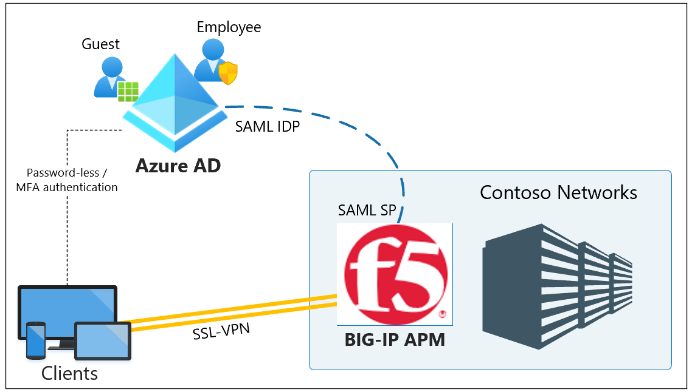

>[!NOTE]
>Replace example strings or values in this guide with those in your environment.

## Prerequisites

Prior experience or knowledge of F5 BIG-IP isn't necessary, however, you'll need:

- An Azure AD subscription
  -  If you don't have one, you can get an [Azure free account](https://azure.microsoft.com/trial/get-started-active-directory/) or above
- User identities [synchronized from their on-premises directory](../hybrid/how-to-connect-sync-whatis.md) to Azure AD.
- An account with Azure AD application admin [permissions](../roles/permissions-reference.md#application-administrator)
- BIG-IP infrastructure with client traffic routing to and from the BIG-IP 
  - Or [deploy a BIG-IP Virtual Edition into Azure](f5-bigip-deployment-guide.md)
- A record for the BIG-IP published VPN service in public DNS
  - Or a test client localhost file while testing
- The BIG-IP provisioned with the needed SSL certificates for publishing services over HTTPS

To improve the tutorial experience, you can learn industry-standard terminology on the F5 BIG-IP [Glossary](https://www.f5.com/services/resources/glossary).

>[!NOTE]
>Some instructions might vary slightly from the Azure portal. 

## Add F5 BIG-IP from the Azure AD gallery

Set up a SAML federation trust between the BIG-IP to allow the Azure AD BIG-IP to hand off the pre-authentication and [Conditional Access](../conditional-access/overview.md) to Azure AD, before it grants access to the published VPN service.

1. Sign in to the Azure AD portal with application admin rights.
2. From the left navigation pane, select the **Azure Active Directory service**.
3. Go to **Enterprise Applications** and from the top ribbon select **New application**.
4. In the gallery, search for F5 and select **F5 BIG-IP APM Azure AD integration**.
5. Enter a name for the application.
6. Select **Add** then **Create**. 
7. The name, as an icon, appears in the Azure portal and Office 365 portal. 

## Configure Azure AD SSO

1. With F5 application properties, go to **Manage** > **Single sign-on**.
2. On the **Select a single sign-on method** page, select **SAML**. 
3. Select **No, I’ll save later**.
4. On the **Setup single sign-on with SAML** menu, select the pen icon for **Basic SAML Configuration**.
5. Replace the **Identifier URL** with your BIG-IP published service URL. For example, `https://ssl-vpn.contoso.com`.
6. Replace the **Reply URL**, and the SAML endpoint path. For example, `https://ssl-vpn.contoso.com/saml/sp/profile/post/acs`.

>[!NOTE]
>In this configuration, the application operates in an IdP-initiated mode: Azure AD issues a SAML assertion before redirecting to the BIG-IP SAML service. 

7. For apps that don’t support IdP-initiated mode, for the BIG-IP SAML service, specify the **Sign-on URL**, for example, `https://ssl-vpn.contoso.com`.
8. For the Logout URL, enter the BIG-IP APM Single logout (SLO) endpoint pre-pended by the host header of the service being published. For example, `https://ssl-vpn.contoso.com/saml/sp/profile/redirect/slr`

>[!NOTE]
>An SLO URL ensures a user session terminates, at BIG-IP and Azure AD, after the user signs out. BIG-IP APM has an option to terminate all sessions when calling an application URL. Learn more on the F5 article, [K12056: Overview of the Logout URI Include option](https://support.f5.com/csp/article/K12056).

  .

>[!NOTE]
>From TMOS v16, the SAML SLO endpoint has changed to /saml/sp/profile/redirect/slo.

9. Select **Save**
10. Skip the SSO test prompt.
11. In **User Attributes & Claims** properties, observe the details. 

  

You can add other claims to your BIG-IP published service. Claims defined in addition to the default set are issued if they're in Azure AD. Define directory [roles or group](../hybrid/how-to-connect-fed-group-claims.md) memberships against a user object in Azure AD, before they can be issued as a claim.

  

SAML signing certificates created by Azure AD have a lifespan of three years.

### Azure AD authorization

By default, Azure AD issues tokens to users with granted access to a service.

1. In the application configuration view, select **Users and groups**.
2. Select **+ Add user**.
3. In the **Add Assignment** menu, select **Users and groups**.
4. In the **Users and groups** dialog, add the user groups authorized to access the VPN
5. Select **Select** > **Assign**.

  

You can set up BIG-IP APM to publish the SSL-VPN service. Configure it with corresponding properties to complete the trust for SAML pre-authentication.

## BIG-IP APM configuration

### SAML federation

To complete federating the VPN service with Azure AD, create the BIG-IP SAML service provider and corresponding SAML IDP objects.

1. Go to **Access** > **Federation** > **SAML Service Provider** > **Local SP Services**.
2. Select **Create**.

  

3. Enter a **Name** and the **Entity ID** defined in Azure AD.
4. Enter the Host FQDN to connect to the application.

  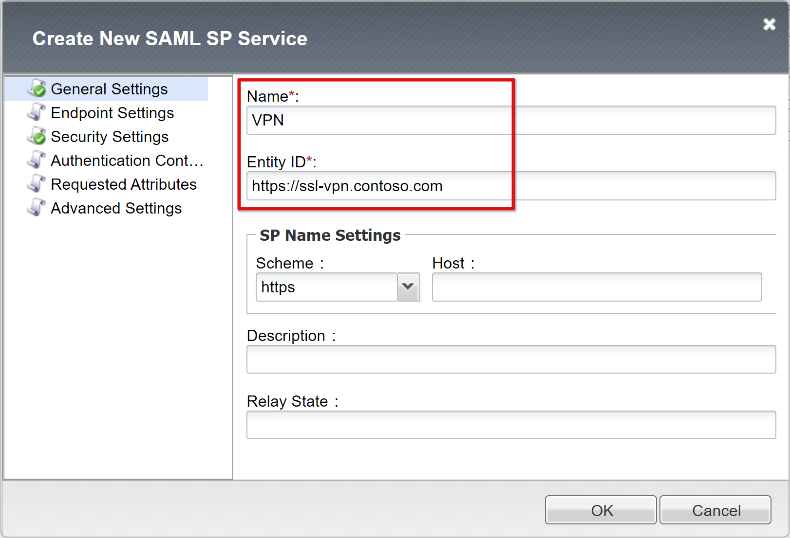

>[!NOTE]
>If the entity ID isn't an exact match of the hostname of the published URL, configure SP **Name** settings, or perform this action if it isn’t in hostname URL format. If entity ID is `urn:ssl-vpn:contosoonline`, provide the external scheme and hostname of the application being published.

5. Scroll down to select the new **SAML SP object**.
6. Select **Bind/UnBind IDP Connectors**.

  

7. Select **Create New IDP Connector**.
8. From the drop-down menu, select **From Metadata**

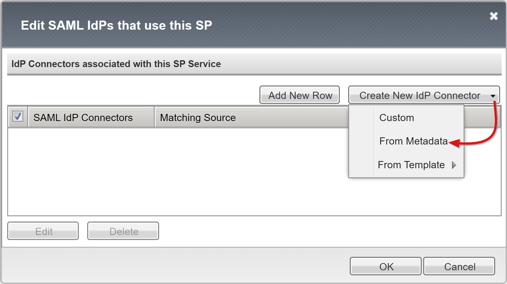

9. Browse to the federation metadata XML file you downloaded. 
10. For the APM object,provide an **Identity Provider Name** that represents the external SAML IdP.
11. To select the new Azure AD external IdP connector, select **Add New Row**.

  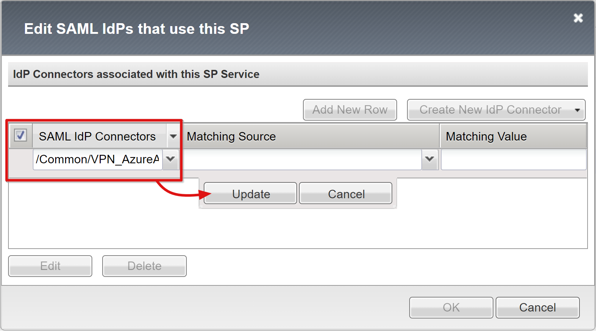

12. Select **Update**.
13. Select **OK**.

  

### Webtop configuration

Enable the SSL-VPN to be offered to users via the BIG-IP web portal.

1. Go to **Access** > **Webtops** > **Webtop Lists**.
2. Select **Create**.
3. Enter a portal name. 
4. Set the type to **Full**, for example, `Contoso_webtop`.
5. Complete the remaining preferences.
6. Select **Finished**.

  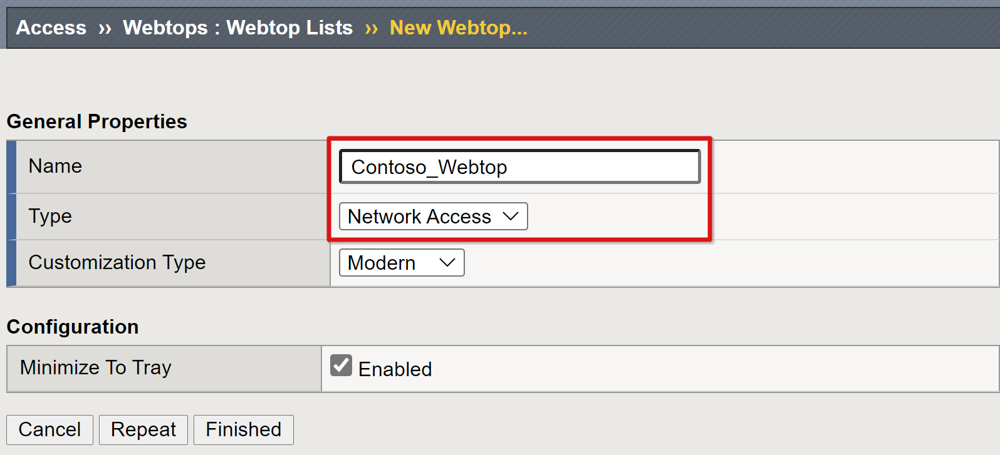

### VPN configuration

VPN elements control aspects of the overall service.

1. Go to **Access** > **Connectivity/VPN** > **Network Access (VPN)** > **IPV4 Lease Pools**
2. Select **Create**.
3. Enter a name for the IP address pool allocated to VPN clients. For example, Contoso_vpn_pool.
4. Set type to **IP Address Range**.
5. Enter a start and end IP.
6. Select **Add**.
7. Select **Finished**.

  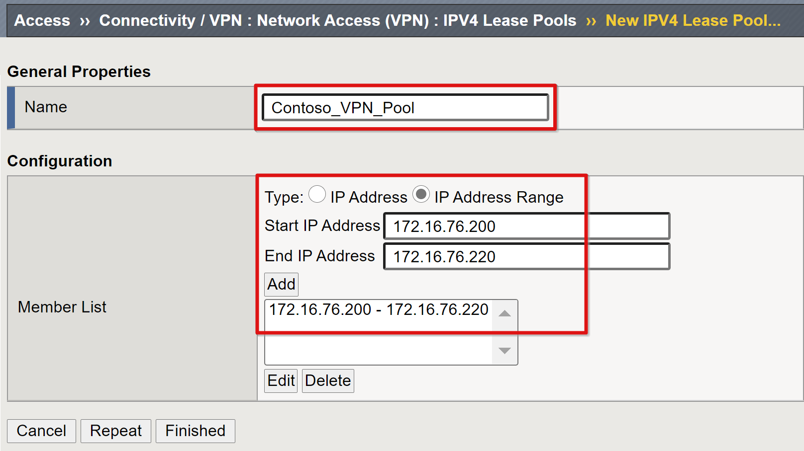

A Network access list provisions the service with IP and DNS settings from the VPN pool, user routing permissions, and can launch applications.

1. Go to **Access** > **Connectivity/VPN: Network Access (VPN)** > **Network Access Lists**.
2. Select **Create**.
3. Provide a name for the VPN access list and caption, for example, Contoso-VPN.
4. Select **Finished**.

  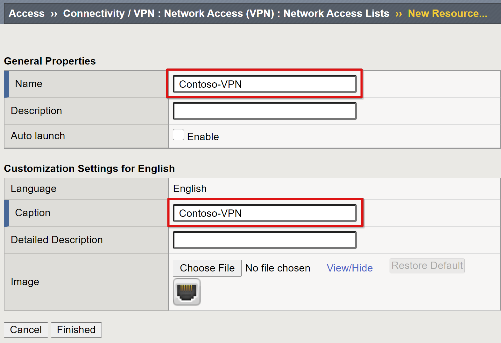

5. From the top ribbon, select **Network Settings**.
6. For **Supported IP version**: IPV4.
7. For **IPV4 Lease Pool**, select the VPN pool created, for example, Contoso_vpn_pool

  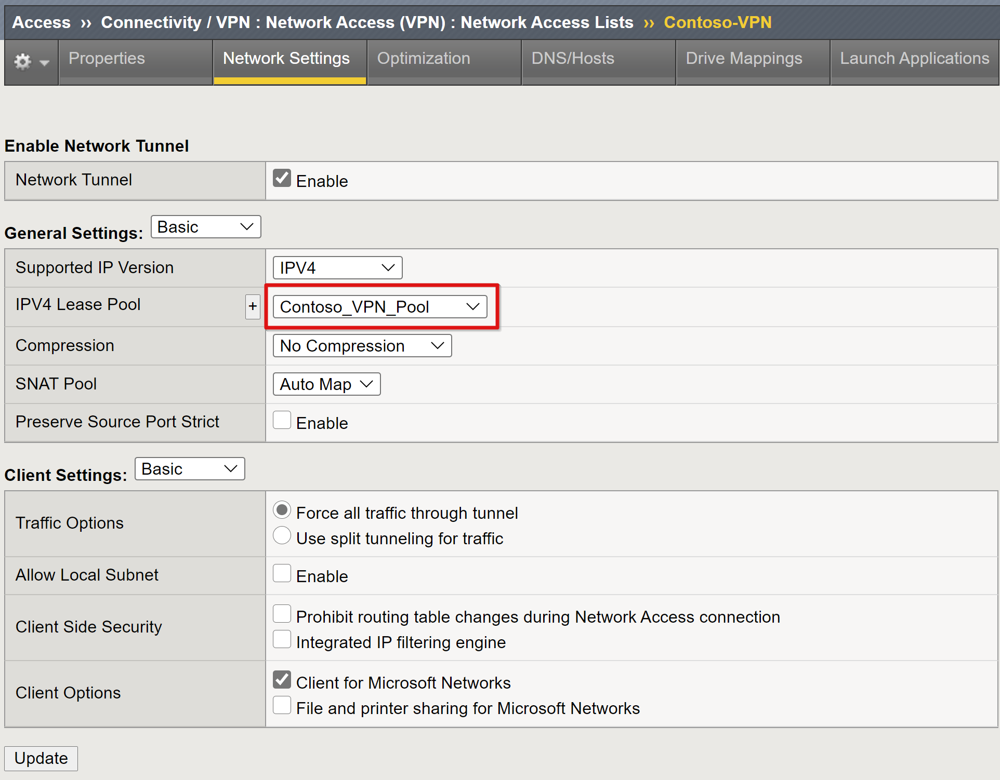

>[!NOTE]
>Use the Client Settings options to enforce restrictions for how client traffic is routed in an established VPN.

8. Select **Finished**.
9. Go to the **DNS/Hosts** tab.
10. For **IPV4 Primary Name Server**: Your environment DNS IP
11. For **DNS Default Domain Suffix**: The domain suffix for this VPN connection. For example, contoso.com

  

>[!NOTE]
>See the F5 article, [Configuring Network Access Resources](https://techdocs.f5.com/kb/en-us/products/big-ip_apm/manuals/product/apm-network-access-11-5-0/2.html) for other settings.

A BIG-IP connection profile is required to configure VPN client-type settings the VPN service needs to support. For example, Windows, OSX, and Android.

1. Go to **Access** > **Connectivity/VPN** > **Connectivity** > **Profiles**
2. Select **Add**.
3. Enter a profile name.
4. Set the parent profile to **/Common/connectivity**, for example, Contoso_VPN_Profile.

  

For more information on client support, see the F5 article, [F5 Access and BIG-IP Edge Client](https://techdocs.f5.com/kb/en-us/bigip-edge-apps.html).

## Access profile configuration

An access policy enables the service for SAML authentication.

1. Go to **Access** > **Profiles/Policies** > **Access Profiles (Per-Session Policies)**.
2. Select **Create**.
3. Enter a profile name and for the profile type.
4. Select **All**, for example, Contoso_network_access.
5. Scroll down and add at least one language to the **Accepted Languages** list
6. Select **Finished**.

  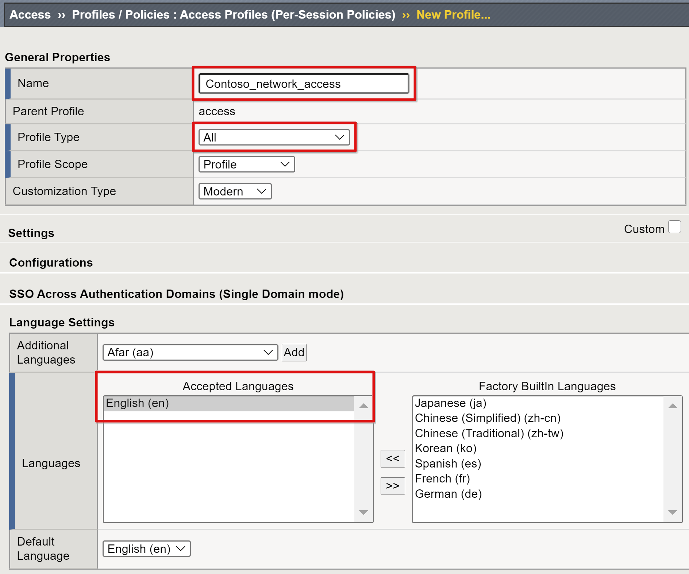

7. In the new access profile, on the Per-Session Policy field, select **Edit**. 
8. The visual policy editor opens in a new tab.

  

9. Select the **+** sign.
10. In the menu, select **Authentication** > **SAML Auth**.
11. Select **Add Item**.
12. In the SAML authentication SP configuration, select the VPN SAML SP object you created
13. Select **Save**.

  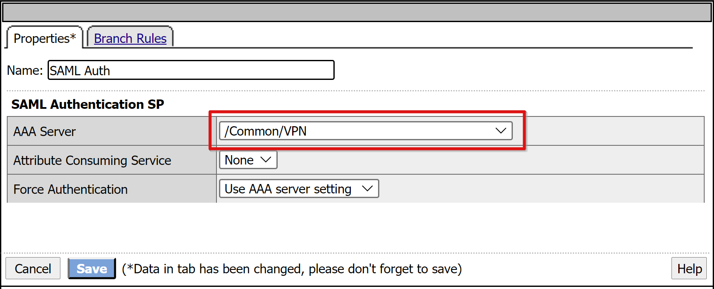

14. For the Successful branch of SAML auth, select **+** .
15. From the Assignment tab, select **Advanced Resource Assign**.
16. Select **Add Item**.

  

17. In the pop-up, select **New Entry**
18. Select **Add/Delete**.
19. In the window, select **Network Access**.
20. Select the Network Access profile you created.

  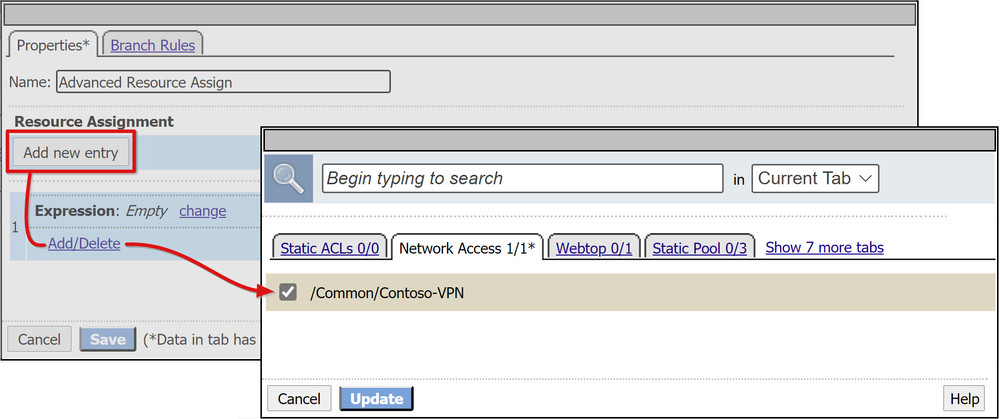

21. Go to the **Webtop** tab.
22. Add the Webtop object you created.

  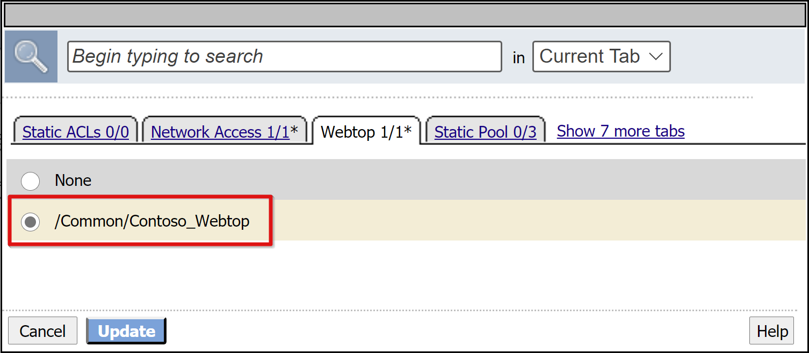

23. Select **Update**.
24. Select**Save**.
25. To change the Successful branch, select the link in the upper **Deny** box.
26. The Allow label appears.
27. **Save**.

  

28. Select **Apply Access Policy**
29. Close the visual policy editor tab.

  

## Publish the VPN service

The APM requires a front-end virtual server to listen for clients connecting to the VPN.

1. Select **Local Traffic** > **Virtual Servers** > **Virtual Server List**.
2. Select **Create**.
3. For the VPN virtual server, enter a **Name**, for example, VPN_Listener.
4. Select an unused **IP Destination Address** with routing to receive client traffic.
5. Set the Service Port to **443 HTTPS**.
6. Ensure the state is **Enabled**.

  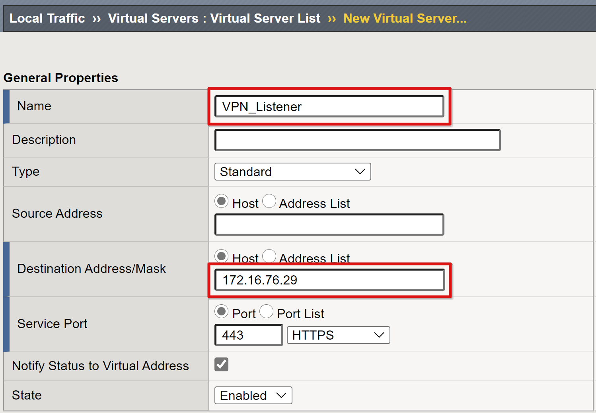

7. Set the **HTTP Profile** to **http**.
8. Add the SSL Profile (Client) for the public SSL certificate you created.

  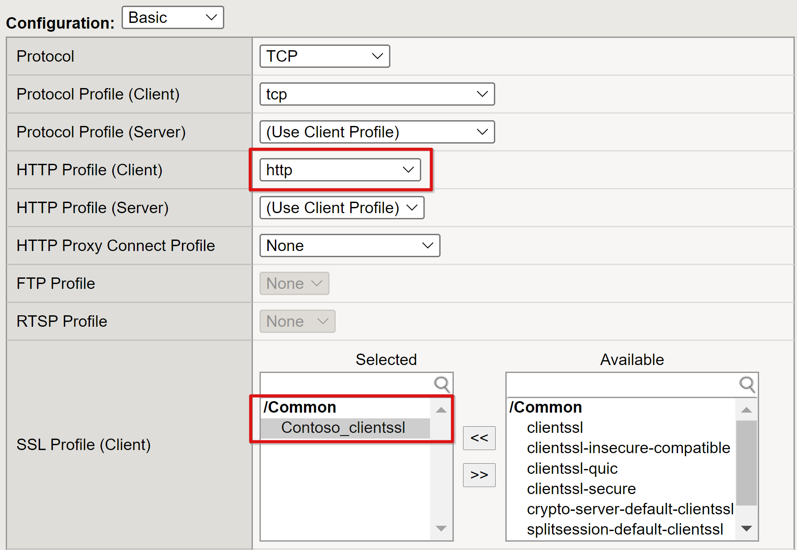

9. To use the created VPN objects, under Access Policy, set the **Access Profile** and **Connectivity Profile**.

  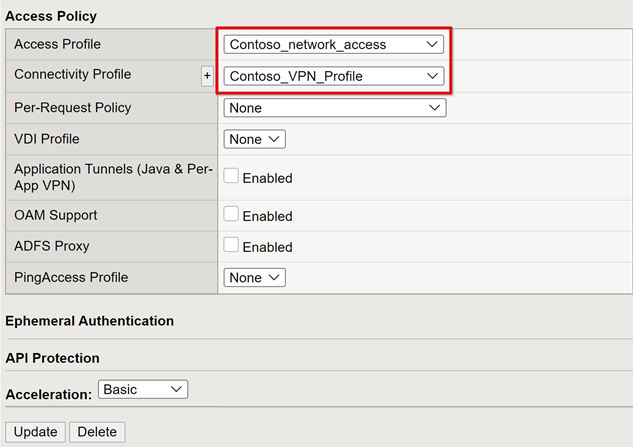

7. Select **Finished**.

Your SSL-VPN service is published and accessible via SHA, either with its URL or through Microsoft application portals.

## Next steps

1. Open a browser on a remote Windows client. 
2. Browse to the **BIG-IP VPN service** URL. 
3. The BIG-IP webtop portal and VPN launcher appear.

  

>[!NOTE]
>Select the VPN tile to install the BIG-IP Edge client and establish a VPN connection configured for SHA. The F5 VPN application is visible as a target resource in Azure AD Conditional Access. See [conditional access policies](../conditional-access/concept-conditional-access-policies.md) to enable users for Azure AD [password-less authentication](https://www.microsoft.com/security/business/identity/passwordless).

## Resources

- [The end of passwords, go passwordless](https://www.microsoft.com/security/business/identity/passwordless)
- [Five steps to full application integration with Azure AD](../fundamentals/five-steps-to-full-application-integration-with-azure-ad.md)
- [Microsoft Zero Trust framework to enable remote work](https://www.microsoft.com/security/blog/2020/04/02/announcing-microsoft-zero-trust-assessment-tool/)
