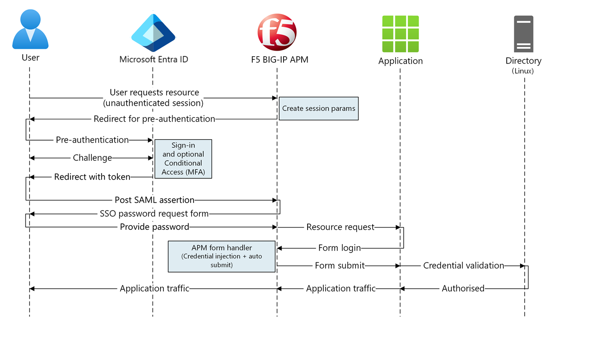
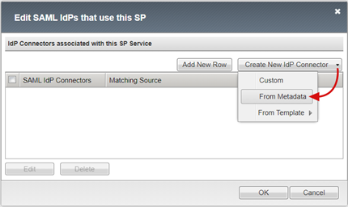
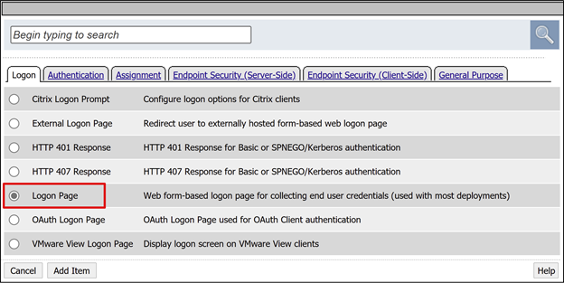
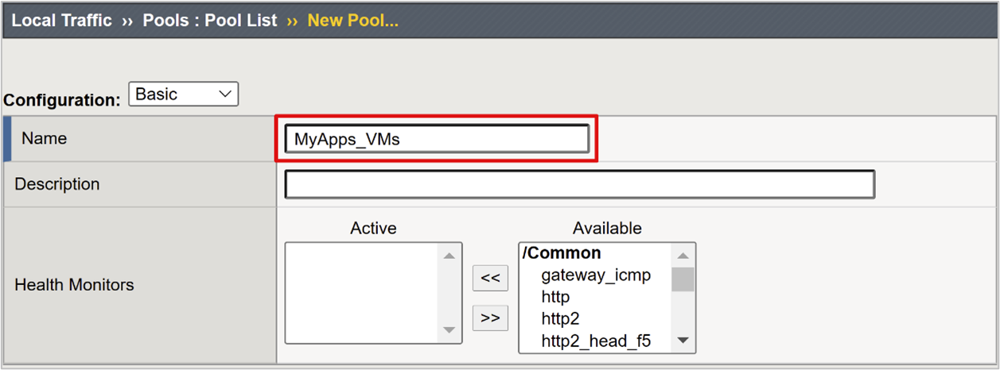
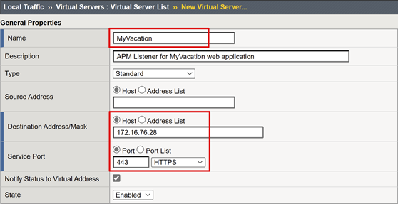
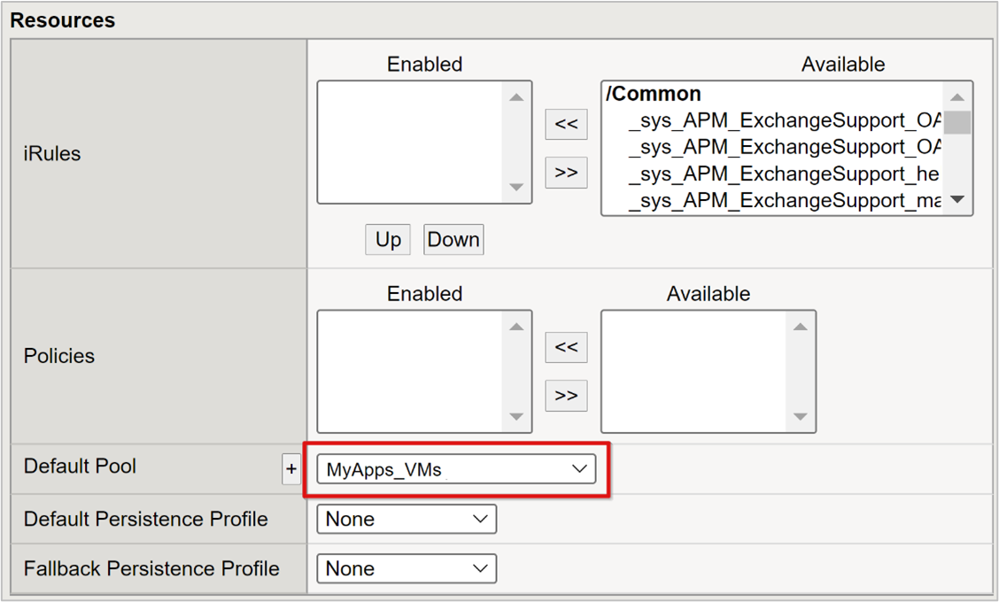

# Configure F5 BIG-IP Access Policy Manager for form-based SSO

Learn to configure F5 BIG-IP Access Policy Manager (APM) and Azure Active Directory (Azure AD) for secure hybrid access (SHA) to form-based applications. BIG-IP published services for Azure AD single sign-on (SSO) has benefits:

* Improved Zero Trust governance through Azure AD preauthentication and Conditional Access 
  * See, [What is Conditional Access?](../conditional-access/overview.md)
  * See, [Zero Trust security](../../security/fundamentals/zero-trust.md)
* Full SSO between Azure AD and BIG-IP published services
* Managed identities and access from one control plane
  * See, the [Azure portal](https://azure.microsoft.com/features/azure-portal)

Learn more:

* [Integrate F5 BIG-IP with Azure AD](./f5-aad-integration.md)
* [Enable SSO for an enterprise application](add-application-portal-setup-sso.md)

## Scenario description

For the scenario, there's an internal legacy application configured for form-based authentication (FBA). Ideally, Azure AD manages application access, because legacy lacks modern authentication protocols. Modernization takes time and effort, introducing the risk of downtime. Instead, deploy a BIG-IP between the public internet and the internal application. This configuraion gates inbound access to the application.

Wotj a BIG-IP in front of the application, you can overlay the service with Azure AD preauthentication and header-based SSO. The overlay improves application security posture.

## Scenario architecture

The SHA solution has the following components:

* **Application** - BIG-IP published service protected by SHA. 
  * The application validates user credentials against Active Directory
  * Use any directory, including Active Directory Lightweight Directory Services, open source, and so on
* **Azure AD** - Security Assertion Markup Language (SAML) identity provider (IdP) that verifies user credentials, Conditional Access, and SSO to the BIG-IP. 
  * With SSO, Azure AD provides attributes to the BIG-IP, including user identifiers
* **BIG-IP** - reverse-proxy and SAML service provider (SP) to the application. 
  * BIG-IP delegating authentication to the SAML IdP then performs header-based SSO to the back-end application. 
  * SSO uses the cached user credentials against other forms-based authentication applications

SHA supports SP- and IdP-initiated flows. The following diagram illustrates the SP-initiated flow.

   

1. User connects to application endpoint (BIG-IP).
2. BIG-IP APM access policy redirects user to Azure AD (SAML IdP).
3. Azure AD preauthenticates user and applies enforced Conditional Access policies.
4. User is redirected to BIG-IP (SAML SP) and SSO occurs using issued SAML token. 
5. BIG-IP prompts the user for an application password and stores it in the cache.
6. BIG-IP sends a request to the application and receives a sign on form.
7. The APM scripting fills in the username and password, then submits the form.
8. The web server serves application payload and sends it to the client. 

## Prerequisites

You need the following components:

* An Azure subscription
  * If you don't have one, get an [Azure free account](https://azure.microsoft.com/free/)
* For the account, have Azure AD Application Administrator permissions
* A BIG-IP or deploy a BIG-IP Virtual Edition (VE) in Azure
  * See, [Deploy F5 BIG-IP Virtual Edition VM in Azure](./f5-bigip-deployment-guide.md)
* Any of the following F5 BIG-IP license SKUs:
  * F5 BIG-IP® Best bundle
  * F5 BIG-IP Access Policy Manager™ (APM) standalone license
  * F5 BIG-IP Access Policy Manager™ (APM) add-on license on a BIG-IP F5 BIG-IP® Local Traffic Manager™ (LTM)
  * 90-day BIG-IP full feature trial. See, [Free Trials](https://www.f5.com/trial/big-ip-trial.php).
* User identities synchronized from an on-premises directory to Azure AD
  * See, [Azure AD Connect sync: Understand and customize synchronization](../hybrid/how-to-connect-sync-whatis.md)
* An SSL certificate to publish services over HTTPS, or use default certificates while testing
  * See, [SSL profile](./f5-bigip-deployment-guide.md#ssl-profile)
* A form-based authentication application, or set up an IIS FBA app for testing
  * See, [Forms-based authentication](/troubleshoot/aspnet/forms-based-authentication)

## BIG-IP configuration

The configuration in this article is a flexible SHA implemention: manual creation of BIG-IP configuration objects. Use this approach for scenarios the Guided Configuration templates don't cover.

   >[!NOTE]
   >Replace example strings or values with those from your environment.

## Register F5 BIG-IP in Azure AD

BIG-IP registration is the first step for SSO between entities. The app you create from the F5 BIG-IP gallery template is the relying party, representing the SAML SP for the BIG-IP published application.

1. Sign in to the [Azure portal](https://portal.azure.com) with Application Administrator permissions.
2. In the left pane, select the **Azure Active Directory** service.
3. In the left menu, select **Enterprise applications**. 
4. The **All applications** pane opens
5. The list of applications in your Azure AD tenant appears.
6. On the **Enterprise applications** pane, select **New application**.
7. The **Browse Azure AD Gallery** pane opens
8. Tiles appear for cloud platforms, on-premises applications, and featured applications. **Featured applications** icons indicate support of federated SSO and provisioning. 
10. In the Azure gallery, search for **F5**.
11. Select **F5 BIG-IP APM Azure AD integration**.
12. Enter a **Name** the new application uses to recognize the application instance. 
13. Select **Add**.
14. Select **Create**.

### Enable SSO to F5 BIG-IP

Configure the BIG-IP registration to fulfill SAML tokens that BIG-IP APM requests.

1. In left menu, in the **Manage** section, select **Single sign-on*.
2. The **Single sign-on** pane appears.
3. On the **Select a single sign-on method** page, select **SAML**.
4. Select **No, I'll save later**.
5. On the **Set up single sign-on with SAML** pane, select the **pen** icon. 
6. For **Identifier**, replace the value with the BIG-IP published application URL.
7. For **Reply URL**, replace the value, but retain the path for the application SAML SP endpoint. With this configuration, SAML flow operates in IdP-initiated mode. Azure AD issues a SAML assertion, then the user is redirected to the BIG-IP endpoint. 
9. For SP-initiated mode, for **Sign on URL**, enter the application URL.
10. For **Logout Url**, enter the BIG-IP APM single logout (SLO) endpoint prepended by the service host header. Then, BIG-IP APM user sessions end when they sign out of Azure AD. 

   

   > [!NOTE]
   > From Traffic Management Operating System (TMOS) v16 onward, the SAML SLO endpoint is `/saml/sp/profile/redirect/slo`.

11. Select **Save**.
12. Close the SAML configuration pane.
13. Skip the SSO test prompt.
14. Make a note of the **User Attributes & Claims** section properties. Azure AD issues the properties for BIG-IP APM authentication, and SSO to the back-end application.
15. On the **SAML Signing Certificate** pane, select **Download**.
16. The **Federation Metadata XML** file is saved to your computer.

   

   > [!NOTE]
   > Azure AD SAML signing certificates have a lifespan of three years. 

Learn more: [Tutorial: Manage certificates for federated single sign-on](tutorial-manage-certificates-for-federated-single-sign-on.md)

### Assign users and groups

Azure AD issues tokens for users granted access to an application. To grant specific users and groups application access:

1. On the **F5 BIG-IP application's overview** pane, select **Assign Users and groups**.
2. Select **+ Add user/group**.
3. Select the users and groups you want.
4. Select **Assign**.   

## BIG-IP advanced configuration

Use the following instructions to configure BIG-IP.

### Configure SAML service provider settings

SAML SP settings define the SAML SP properties that the APM will use for overlaying the legacy application with SAML pre-authentication. To configure them:

1. Select **Access** > **Federation** > **SAML Service Provider**.
2. Select **Local SP Services**.
3. Select **Create**.

   

4. On the **Create New SAML SP Service** pane, for **Name** and **Entity ID**, enter the defined name and entity ID.

   

   > [!NOTE]
   > **SP Name Settings** values are required if the entity ID doesn't match the hostname portion of the published URL. Or, values are required if the entity ID isn't in regular hostname-based URL format. 

5. If the entity ID is `urn:myvacation:contosoonline`, enter the application external scheme and hostname.

### Configure an external IdP connector

A SAML IdP connector defines settings for the BIG-IP APM to trust Azure AD as its SAML IdP. The settings connect the SAML service provider to a SAML IdP, which establishes the federation trust between the APM and Azure AD. 

To configure the connector:

1. Select the new SAML service provider object.
2. Select **Bind/UnbBind IdP Connectors**.

   

3. In the **Create New IdP Connector** list, select **From Metadata**.

   
  
4. On the **Create New SAML IdP Connector** pane, browse for the Federation Metadata XML file you downloaded.
5. Enter an **Identity Provider Name** for the APM object that represents the external SAML IdP. For example, MyVacation\_AzureAD.

   

6. Select **Add New Row**.
7. Select the new **SAML IdP Connector**.
8. Select **Update**.
  
   

9. Select **OK**.

   

### Configure forms-based SSO

Create an APM SSO object for FBA SSO to back-end applications. 

Perform FBA SSO in client-initiated mode or BIG-IP-initiated mode. Both methods emulate a user sign on by injecting credentials into the username and password tags. The form is then auto-submitted. Users provide password to access an FBA application. The password is cached and reused for other FBA applications.

1. Select **Access** > **Single Sign-on**.
2. Select **Forms Based**.
3. Select **Create**.
4. For **Name**, enter a descriptive name. For example, Contoso\FBA\sso.
5. For **Use SSO Template**, select **None**.
6. For **Username Source**, enter the username source to pre-fill the password collection form. The default `session.sso.token.last.username` works well, because it has the signed-in user Azure AD UPN.
7. For **Password Source**, keep the default `session.sso.token.last.password`, the APM variable BIG-IP uses to cache user passwords. 

   

8. For **Start URI**, enter the FBA application logon URI. If the request URI matches this URI value, the APM form-based authentication executes SSO
9. For **Form Action**, leave it blank. Then, the original request URL is used for SSO.
10. For **Form Parameter for Username**, enter the logon form username field element. Use the browser dev tools to determine the element.
11. For **Form Parameter for Password**, enter the logon form password field element. Use the browser dev tools to determine the element.

   

   

To learn more, go to techdocs.f5.com for [Manual Chapter: Single Sign-On Methods](https://techdocs.f5.com/en-us/bigip-14-1-0/big-ip-access-policy-manager-single-sign-on-concepts-configuration-14-1-0/single-sign-on-methods.html#GUID-F8588DF4-F395-4E44-881B-8D16EED91449)

### Configure an Access profile

An access profile binds APM elements that manage access to BIG-IP virtual servers, including access policies, SSO configuration, and UI settings.

1. Select **Access** > **Profiles / Policies**.
2. Select **Access Profiles (Per-Session Policies)**.
3. Select **Create**.
4. Enter a **Name**.
5. For **Profile Type**, select **All**.
6. For **SSO Configuration**, select the FBA SSO configuration object you created.
7. For **Accepted Language**, select at least one language. 

   

8. In the **Per-Session Policy** column, for the profile, select **Edit**.
9. The APM Visual Policy Editor starts.

   

10. Under **fallback**, select the **+** sign.

   

11. In the pop-up, select **Authentication**.
12. Select **SAML Auth**.
13. Select **Add Item**.

   

14. On **SAML authentication SP**, change the **Name** to **Azure AD Auth**
15. In the **AAA Server** dropdown, enter the SAML service provider object you created.

   

16. On the **Successful** branch, select the **+** sign.
17. In the pop-up, select **Authentication**.
18. Select **Logon Page**
19. Select **Add Item**.

   

20. For **usesrname**, in the **Read Only** column, select **Yes**.

   

21. For the logon page fallback, select the **+** sign. This action adds an SSO credential mapping object.

22. In the pop-up, select the **Assignment** tab.
23. Select **SSO Credential Mapping**.
24. Select **Add Item**.

    

25. On **Variable Assign: SSO Credential Mapping**, keep the default settings.
26. Select **Save**.

    

27. In the upper **Deny** box, select the link.
28. The **Successful** branch changes to **Allow**
29. Select **Save**.

#### (Optional) configure attribute mappings

You can add a LogonID_Mapping configuration. Then, the BIG-IP active sessions list has the signed-in user UPN, not a session number. Use this information for analyzing logs or troubleshooting.

1. For the **SAML Auth Successful** branch, select the **+** sign.
2. In the pop-up, select **Assignment**.
3. Select **Variable Assign**.
4. Select **Add Item**.

   

1. On the **Properties** tab, enter a **Name**. For example, LogonID_Mapping.
2. Under **Variable Assign**, select **Add new entry**
3. Select **change**.

   

4. For **Custom Variable**, use `session.logon.last.username`.
5. For Session Variable, user `session.saml.last.identity`.
6. Select **Finished**.
7. Select **Save**.
8. Select **Apply Access Policy**.
9. Close the Visual Policy Editor.

   

### Configure a back-end pool

For the BIG-IP to know where to forward client traffic, you need to create a BIG-IP node object that represents the back-end server that hosts your application. Then, place that node in a BIG-IP server pool.

1. Select **Local Traffic** > **Pools** > **Pool List** > **Create** and provide a name for a server pool object. For example, enter **MyApps_VMs**.

   

1. Add a pool member object with the following resource details:

   | Property | Description |
   |:-----|:-------|
   | Node Name: | Optional display name for the server that hosts the back-end web application |
   | Address: | IP address of the server that hosts the application |
   | Service Port: | HTTP/S port that the application is listening on |
   | | |

   

>[!NOTE]
>Health monitors require [additional configuration](https://support.f5.com/csp/article/K13397) that this article doesn't cover.  

### Configure a virtual server

A *virtual server* is a BIG-IP data-plane object that's represented by a virtual IP address that listens for client requests to the application. Any received traffic is processed and evaluated against the APM access profile that's associated with the virtual server. The traffic is then directed according to the policy results and settings.

To configure a virtual server:

1. Select **Local Traffic** > **Virtual Servers** > **Virtual Server List** > **Create**.

3. Provide the virtual server with a Name value and an IPv4/IPv6 address that isn't already allocated to an existing BIG-IP object or device on the connected network. The IP address will be dedicated to receiving client traffic for the published back-end application. Then set Service Port to 443.

     
 
3. Set **HTTP Profile (Client)** to **http**.

1. Enable a virtual server for Transport Layer Security to allow services to be published over HTTPS. For **SSL Profile (Client)**, select the profile that you created as part of the prerequisites. (Or leave the default if you're testing.)

   

1. Change the **Source Address Translation** to **Auto Map**.

   

1. Under **Access Policy**, in the **Access Profile** box, enter the name you created earlier. This action binds the Azure AD SAML pre-authentication profile and FBA SSO policy to the virtual server.

   

1. Set **Default Pool** to use the back-end pool objects that you created in the previous section. Then select **Finished**.

   

### Configure Session management settings

BIG-IP's session management settings define the conditions under which user sessions are terminated or allowed to continue, limits for users and IP addresses, and error pages. You can create your own policy here. Go to Access Policy > Access Profiles > Access Profile and select your application from the list.

If you've defined a Single Logout URI value in Azure AD, it will ensure that an IdP-initiated sign-out from the MyApps portal also ends the session between the client and the BIG-IP APM. The imported application's federation metadata XML file provides the APM with the Azure AD SAML logout endpoint for SP-initiated sign-outs. But for this to be truly effective, the APM needs to know exactly when a user signs out.

Consider a scenario where a BIG-IP web portal is not used. The user has no way of instructing the APM to sign out. Even if the user signs out of the application itself, BIG-IP is technically oblivious to this, so the application session could easily be reinstated through SSO. For this reason, SP-initiated sign-out needs careful consideration to ensure that sessions are securely terminated when they're no longer required.

One way to achieve this is by adding an SLO function to your application's sign-out button. This function can redirect your client to the Azure AD SAML sign-out endpoint. You can find this SAML sign-out endpoint at App Registrations > Endpoints.

If you can't change the app, consider having BIG-IP listen for the app's sign-out call. When it detects the request, it should trigger SLO.

For more information about using BIG-IP iRules to achieve this, see the following F5 articles: 
* [K42052145: Configuring automatic session termination (logout) based on a URI-referenced file name](https://support.f5.com/csp/article/K42052145)
* [K12056: Overview of the Logout URI Include option](https://support.f5.com/csp/article/K12056)

## Summary

Your application should now be published and accessible via secure hybrid access, either directly via the app's URL or through the Microsoft application portals.

The application should also be visible as a target resource in Azure AD CA. For more information, see [Building a Conditional Access policy](../conditional-access/concept-conditional-access-policies.md).

For increased security, organizations that use this pattern could also consider blocking all direct access to the application, which then forces a strict path through the BIG-IP.

## Next steps

From a browser, connect to the application's external URL or select the application's icon in the MyApps portal. After you authenticate to Azure AD, you’re redirected to the BIG-IP endpoint for the application and prompted for a password. Notice that the APM pre-fills the username with the UPN from Azure AD. The username that's pre-populated by the APM is read only to ensure session consistency between Azure AD and the back-end application. You can hide this field from view with an additional configuration, if necessary.

After the information is submitted, users should be automatically signed in to the application.

## Troubleshoot

Failure to access the secure hybrid access-protected application can result from any of several factors, including a misconfiguration. When you troubleshoot this issue, be aware of the following:

- FBA SSO is performed by the BIG-IP as it parses the logon form at the specified URI and looks for the username and password element tags that are defined in your configuration.

- Element tags need to be consistent, or SSO will fail. More complex forms that are generated dynamically might require you to analyze them closer by using dev tools to understand the makeup of the logon form.

- A client-initiated approach might be better suited for logon pages that contain multiple forms, because it lets you specify a form name and even customize the JavaScript form handler logic.

- Both FBA SSO methods optimize the user experience and security by hiding all form interactions. In some cases, though, it might be useful to validate whether the credentials are actually being injected. You can do this in client-initiated mode by disabling the form auto submit setting in your SSO profile and then using dev tools to disable the two style properties that prevent the logon page from being displayed.

  

BIG-IP logs are a great source of information for isolating all sorts of authentication and SSO issues. When you troubleshoot an issue, you should increase the log verbosity level by doing the following:

1. Go to **Access Policy** > **Overview** > **Event Logs** > **Settings**.

1. Select the row for your published application, and then select **Edit** > **Access System Logs**.

1. In the SSO list, select **Debug**, and then select **OK**. Reproduce your issue before you look at the logs, but remember to switch this setting back when you're finished.

If you see a BIG-IP branded error immediately after successful Azure AD pre-authentication, it's possible that the issue relates to SSO from Azure AD to the BIG-IP.

Go to **Access** > **Overview** > **Access reports**, and then run the report for the last hour to see whether the logs provide any clues. The **View session variables** link for your session will also help you understand whether the APM is receiving the expected claims from Azure AD.

If you don't see a BIG-IP error page, the issue is probably more related to the back-end request or SSO from the BIG-IP to the
application. If this is the case, select **Access Policy** > **Overview** > **Active Sessions**, and then select the link for your active session.

The **View Variables** link in this location might also help determine the root cause, particularly if the APM fails to obtain the right user identifier and password.

For more information, see the F5 BIG-IP [Session Variables reference](https://techdocs.f5.com/en-us/bigip-15-0-0/big-ip-access-policy-manager-visual-policy-editor/session-variables.html).

## Additional resources

* [Active Directory Authentication](https://techdocs.f5.com/kb/en-us/products/big-ip_apm/manuals/product/apm-authentication-single-sign-on-11-5-0/2.html) (F5 article about BIG-IP advanced configuration)

* [Forget passwords, go passwordless](https://www.microsoft.com/security/business/identity/passwordless)

* [What is Conditional Access?](../conditional-access/overview.md)

* [Zero Trust framework to enable remote work](https://www.microsoft.com/security/blog/2020/04/02/announcing-microsoft-zero-trust-assessment-tool/)
