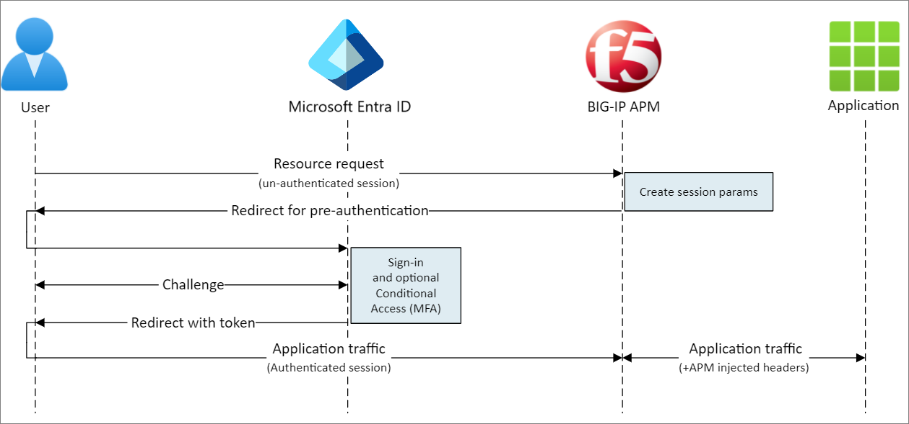
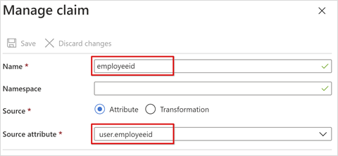
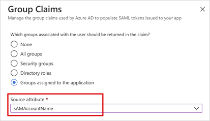
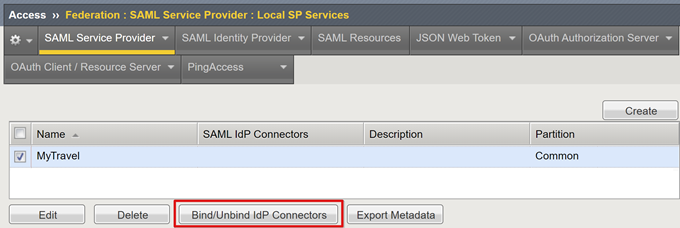
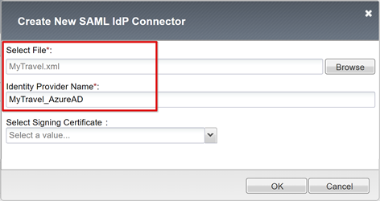
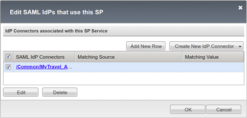
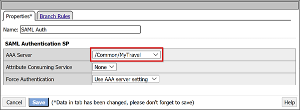
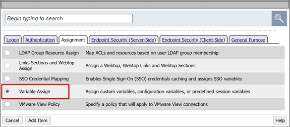
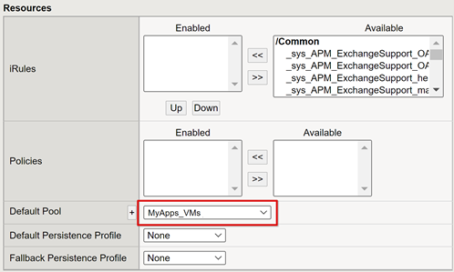

# Tutorial: Configure F5 BIG-IP Access Policy Manager for header-based single sign-on

Learn to implement secure hybrid access (SHA) with single sign-on (SSO) to header-based applications using F5 BIG-IP advanced configuration. BIG-IP published applications and Azure AD configuration benefits:

* Improved Zero Trust governance through Azure AD preauthentication and Conditional Access 
  * See, [What is Conditional Access?](../conditional-access/overview.md)
  * See, [Zero Trust security](../../security/fundamentals/zero-trust.md)
* Full SSO between Azure AD and BIG-IP published services
* Manage identities and access from on control plane
  * See, the [Azure portal](https://azure.microsoft.com/features/azure-portal)

Learn more:

* [Integrate F5 BIG-IP with Azure Active Directory](./f5-aad-integration.md)
* [Enable single sign-on for an enterprise application](add-application-portal-setup-sso.md)

## Scenario description

For this scenario, there's a legacy application using HTTP authorization headers to control access to protected content. Ideally, application access is managed by Azure AD, however legacy lacks a modern authentication protocol. Modernization takes effort and time, while introducing downtime costs and risks. Instead, deploy a BIG-IP between the public internet and the internal application to gate inbound access to the application.

A BIG-IP in front of the application enables overlay of the service with Azure AD preauthentication and header-based SSO. The configuration improves the application security posture.

## Scenario architecture

The secure hybrid access solution for this scenario is made up of:

* **Application** - BIG-IP published service to be protected by Azure AD SHA
* **Azure AD** - Security Assertion Markup Language (SAML) identity provider (IdP) that verifies user credentials, Conditional Access, and SSO to the BIG-IP. 
  * With SSO, Azure AD provides the BIG-IP required session attributes, including user identifiers
* **BIG-IP** - reverse-proxy and SAML service provider (SP) to the application, delegating authentication to the SAML IdP, before header-based SSO to the back-end application

The folllowing diagram illustrates the user flow with Azure AD, BIG-IP, APM and an application.

   

1. User connects to application SAML SP endpoint (BIG-IP).
2. BIG-IP APM access policy redirects user to Azure AD (SAML IdP).
3. Azure AD preauthenticates user and applies ConditionalAccess policies.
4. User is redirected to BIG-IP (SAML SP) and SSO occurs using issued SAML token. 
5. BIG-IP injects Azure AD attributes as headers in request to the application. 
6. Application authorizes request and returns payload.

## Prerequisites

For the scenario you need:

* An Azure subscription
  * If you don't have one, get an [Azure free account](https://azure.microsoft.com/free/)
* For the account, have Azure AD Application Admin permissions
* A BIG-IP or deploy a BIG-IP Virtual Edition (VE) in Azure
  * See, [Deploy F5 BIG-IP Virtual Edition VM in Azure](./f5-bigip-deployment-guide.md)
* Any of the following F5 BIG-IP license SKUs:
  * F5 BIG-IP® Best bundle
  * F5 BIG-IP Access Policy Manager™ (APM) standalone license
  * F5 BIG-IP Access Policy Manager™ (APM) add-on license on a BIG-IP F5 BIG-IP® Local Traffic Manager™ (LTM)
  * 90-day BIG-IP full feature trial. See, [Free Trials](https://www.f5.com/trial/big-ip-trial.php).
* User identities synchronized from an on-premises directory to Azure AD
  * [Azure AD Connect sync: Understand and customize synchronization](../hybrid/how-to-connect-sync-whatis.md)
* An SSL certificate to publish services over HTTPS, or use default certificates while testing
  * See, [SSL profile](./f5-bigip-deployment-guide.md#ssl-profile)
* A header-based application or an IIS header app for testing
  * See, [Set up a simple IIS header app](/previous-versions/iis/6.0-sdk/ms525396(v=vs.90))

## BIG-IP configuration method

The following instructions are an advanced configuration method, a flexible way to implement SHA. Manually create BIG-IP configuration objects. Use this mehtod for scenarios not included in the Guided Configuration templates. 

   >[!NOTE]
   > Replace example strings or values with those from your environment.

## Add F5 BIG-IP from the Azure AD gallery

To implement SHA, the first step is to set up a SAML federation trust between BIG-IP APM and Azure AD. The trust establishes the integration for BIG-IP to hand off pre-authentication and Conditional Access to Azure AD, before granting access to the published service.

Learn more: [What is Conditional Access?](../conditional-access/overview.md)

1. With an account that has Application Administrator permissions, sign in to the [Azure portal](https://azure.microsoft.com/features/azure-portal).
2. In the left navigation pane, select the **Azure Active Directory** service.
3. Go to **Enterprise Applications**.
4. On the top ribbon, select **+ New application**.
5. In the gallery, search for **F5**.
6. Select **F5 BIG-IP APM Azure AD integration**.
7. Enter an application **Name**.
8. Select **Add/Create**. 
9. The name reflects the service.

## Configure Azure AD SSO 

1. The new **F5** application properties appear
2. Select **Manage** > **Single sign-on**
3. On the **Select a single sign-on method** page, select **SAML**.
4. Skip the prompt to save the single sign-on settings.
5. Select **No, I'll save later**.
6. On **Set up single sign-on with SAML**, for **Basic SAML Configuration**, select the **pen** icon.
7. Replace the **Identifier** URL with the BIG-IP published service URL. For example, `https://mytravel.contoso.com`
8. Repeat for **Reply URL** and include the APM SAML endpoint path. For example, `https://mytravel.contoso.com/saml/sp/profile/post/acs`

   >[!NOTE]
   >In this configuration, the SAML flow operates in IdP mode: Azure AD issues the user a SAML assertion before being redirected to the BIG-IP service endpoint for the application. The BIG-IP APM supports IdP and SP modes.

9. For **Logout URI** enter the BIG-IP APM Single Logout (SLO) endpoint, pre-pended by the service host header. The SLO URI ensures user BIG-IP APM sessions end after Azure AD sign-out. For example, `https://mytravel.contoso.com/saml/sp/profile/redirect/slr`

    

    >[!Note]
    >From Traffic Management operating system (TMOS) v16 onward, the SAML SLO endpoint changed to `/saml/sp/profile/redirect/slo`.

10. Select **Save**.
11. Exiting SAML configuration.
12. Skip the SSO test prompt.
13. To edit the **User Attributes & Claims > + Add new claim**, select the **pen** icon.
14. For **Name** select **Employeeid**.
15. For **Source attribute** select **user.employeeid**.
16. Select **Save**

   

17. Select **+ Add a group claim**
18. Select **Groups assigned to the application** > **Source Attribute** > **sAMAccountName**.

   

19. Select **Save** the configuration.
20. Close the view.
21. Observe the **User Attributes & Claims** section properties. Azure AD issues users properties for BIG-IP APM authentication and SSO to the back-end application.

   

> [!NOTE]
> Add other claims the BIG-IP published application expects as headers. More defined claims are issued if they're in Azure AD. Define directory memberships and user objects in Azure AD before claims can be issued. See, [Configure group claims for applications by using Azure AD](../hybrid/how-to-connect-fed-group-claims.md)

22. In the **SAML Signing Certificate** section, select **Download**. 
23. The **Federation Metadata XML** file is saved on your computer.

   

SAML signing certificates created by Azure AD have a lifespan of three years.

### Azure AD authorization

By default, Azure AD issues tokens to users granted access to an application.

1. In the application's configuration view, select **Users and groups**.
2. Select **+ Add user** and in **Add Assignment**, select **Users and groups**.
3. In the **Users and groups** dialog, add the user groups authorized to access the header-based application. 
4. Select **Select**.
5. Select **Assign**.

This completes the Azure AD SAML federation trust. Next, set up BIG-IP APM to publish the web application, configured with properties to complete SAML preauthentication trust.

## Advanced configuration

Use the following sections to configure SAML, header SSO, access profile, and more.

### SAML configuration

Create the BIG-IP SAML service provider and corresponding SAML IdP objects to federate the published application, with Azure AD.

1. Select **Access** > **Federation** > **SAML Service Provider** > **Local SP Services** > **Create**.

   

2. Enter a **Name**.
3. Enter the **Entity ID** defined in Azure AD.

   

4. For **SP Name Settings**, make selections if the Entity ID doesn't match the hostname of the published URL, or make selections if it isn't in regular hostname-based URL format. Provide the external scheme and application hostname if entity ID is `urn:mytravel:contosoonline`.
5. Scroll down to select the new SAML SP object.
6. Select **Bind/UnBind IdP Connectors**.

   

7. Select **Create New IdP Connector**. 
8. From the drop-down, select **From Metadata**.

   

9. Browse to the federation metadata XML file you downloaded.
10. Enter an **Identity Provider Name** for the APM object for the external SAML IdP. For example, `MyTravel_AzureAD`

   

11. Select **Add New Row**.
12. Select the new **SAML IdP Connector**.
13. Select **Update**.

   

14. Select **OK**.

   

### Header SSO configuration

Create an APM SSO object.

1. Select **Access** > **Profiles/Policies** > **Per-Request Policies** > **Create**.
2. Enter a **Name**.
3. Add at least one **Accepted Language**.
4. Select **Finished.** 

   

3. For the new per-request policy, select **Edit**.

    

4. The visual policy editor starts.
5. Under **fallback**, select the **+** symbol.

    

5. On the **General Purpose** tab, select **HTTP Headers** > **Add Item**.

    

6. Select **Add new entry**. 
7. Create three HTTP and Header modify entries.
8. For **Header Name**, enter **upn**.
9. For **Header Value**, enter **%{session.saml.last.identity}**.
10. For **Header Name**, enter **employeeid**.
11. Fpr **Header Value**, enter **%{session.saml.last.attr.name.employeeid}**
12. Fpr **Header Name**, enter **group\_authz**.
13. For **Header Value**, enter **%{session.saml.last.attr.name.`http://schemas.microsoft.com/ws/2008/06/identity/claims/groups`}**

   >[!Note]
   >APM session variables in curly brackets are case sensitive. We recommend you define attributes in lowercase.

   

14. Select **Save**
15. Close the visual policy editor.

   

### Access profile configuration

An access profile binds many APM elements managing access to BIG-IP virtual servers, including access policies, SSO configuration, and UI settings.

1. Select **Access** > **Profiles / Policies** > **Access Profiles (Per-Session Policies)** > **Create**.
2. For **Name**, enter **MyTravel**.
3. For **Profile Type**, select **All**.
4. For **Accepted Language**, select at least one language.
5. select **Finished**.

   

6. For the per-session profile you created, select **Edit**.

    

7. The visual policy editor starts.
8. Under fallback, select the **+** symbol.

   

9. Select **Authentication** > **SAML Auth** > **Add Item**.

   

10. For the **SAML authentication SP** configuration, from the **AAA Server** dropdown, select the SAML SP object you created.
11. Select **Save**.

   

### Attribute mapping

The following instructions are optional. With a LogonID_Mapping configuration, the BIG-IP active sessions list has the signed-in user UPN, not a session number. Use this data when analyzing logs or troubleshooting.

1. For the SAML Auth **Successful** branch, select the **+** symbol.

    

2. In the pop-up select **Assignment** > **Variable Assign** > **Add Item**.

   

3. Enter a **Name**
4. In the **Variable Assign** section, select **Add new entry** > **change**. For example, LogonID_Mapping.

   

4. For **Custom Variable**, set **session.saml.last.identity**.
5. For **Session Variable**, set **session.logon.last.username**.
6. Select **Finished**.
7. Select**Save**.
8. On the Access Policy **Successful** branch, select the **Deny** terminal.
9. Select **Allow**.
10. Select **Save**.
11. Select **Apply Access Policy**.
12. Close the visual policy editor.

### Back-end pool configuration

For the BIG-IP to know where to forward client traffic, you need to create an APM node object representing the backend server hosting your application, and place that node in an APM pool.

1. Select **Local Traffic > Pools > Pool List > Create** and provide a name for a server pool object. For example, MyApps_VMs

      

2. Add a pool member object with the following:

    | Property | Description |
    |:--------|:----------|
    | Node Name | Optional display name for the server hosting the backend web application |
    | Address | IP address of the server hosting the application|
    | Service Port | The HTTP/S port the application is listening on |

    

>[!NOTE]
>Health monitors require additional
[configuration](https://support.f5.com/csp/article/K13397) not covered in this tutorial.

## Virtual server configuration

A virtual server is a BIG-IP data plane object represented by a virtual IP address listening for clients requests to the application. Any received traffic is processed and evaluated against the APM access profile associated with the virtual server, before being directed according to the policy results and settings.

1. Select **Local Traffic** > **Virtual Servers** > **Virtual Server List** > **Create**

2. Provide the virtual server with a **Name,** an unused IP IPv4/IPv6 that can be assigned to the BIG-IP to receive client traffic, and set the **Service Port** to 443

   

3. **HTTP Profile**: Set to http

4. **SSL Profile (Client)**: Enables Transport Layer Security    (TLS), enabling services to be published over HTTPS. Select the client SSL profile you created as part of the pre-requisites or leave the default if testing

   

5. Change the **Source Address Translation** option to **Auto Map**

   

6. Under **Access Policy**, set the **Access Profile** created earlier. This binds the Azure AD SAML pre-authentication profile and headers SSO policy to the virtual server.

   

7. Finally, set the **Default Pool** to use the backend pool objects created in the previous section, then select **Finished**.

   

## Session management

A BIG-IPs session management setting is used to define the conditions under which user sessions are terminated or allowed to continue, limits for users and IP addresses, and error pages. You can create your own policy by heading to **Access Policy** > **Access Profiles** and selecting your application from the list.

Regarding SLO functionality, having defined a SLO URI in Azure AD will ensure an IdP initiated sign out from the MyApps portal also terminates the session between the client and the BIG-IP APM. Having imported the application's federation metadata.xml then provides the APM with the Azure AD SAML log-out endpoint for SP initiated sign-outs. But for this to be truly effective, the APM needs to know exactly when a user signs-out.

Consider a scenario where a BIG-IP web portal isn't used, the user has no way of instructing the APM to sign out. Even if the user signs-out of the application itself, the BIG-IP is technically oblivious to this, so the application session could easily be reinstated through SSO. For this reason SP initiated sign-out needs careful consideration to ensure sessions are securely terminated when no longer required.

One way of achieving this would be to add an SLO function to your
applications sign out button, so that it can redirect your client to the Azure AD SAML sign-out endpoint. The SAML sign-out endpoint for your tenant can be found in **App Registrations** > **Endpoints**.

If making a change to the app is a no go then consider having the BIG-IP listen for the apps sign-out call, and upon detecting the request have it trigger SLO. More details on using BIG-IP iRules to achieve this are available in [article K42052145](https://support.f5.com/csp/article/K42052145) and
[article K12056](https://support.f5.com/csp/article/K12056).

## Summary

This last step provides break down of all applied settings before they are committed. Select **Deploy** to commit all settings and verify that the application has appeared in your tenant.

Your application is now published and accessible via SHA, either directly via its URL or through Microsoft's application portals.

## Next steps

As a user, launch a browser and connect to the application's external URL or select the application's icon in the Microsoft MyApps portal. After authenticating to Azure AD, you'll be redirected to the BIG-IP virtual server for the application and automatically signed in through SSO.
The output of the injected headers displayed by our headers-based application is shown.

For increased security, organizations using this pattern could also consider blocking all direct access to the application, in that way forcing a strict path through the BIG-IP.

## Troubleshooting

Failure to access the SHA protected application could be down to any number of potential factors, including a
misconfiguration.

- BIG-IP logs are a great source of information for isolating all sorts of authentication & SSO issues. When troubleshooting you should increase the log verbosity level by heading to **Access Policy** > **Overview** > **Event Logs** > **Settings**. Select the row for your published application then **Edit** > **Access System Logs**. Select **Debug**
from the SSO list then **OK**. You can now reproduce your issue before looking at the logs but remember to switch this back when finished.

- If you see a BIG-IP branded error after being redirected following Azure AD pre-authentication, it's likely the issue relates to SSO from Azure AD to the BIG-IP. Navigate to **Access** > **Overview** > **Access reports** and run the report for the last hour to see logs provide any
clues. The **View session variables** link for your session will also help understand if the APM is receiving the expected claims from Azure AD.

- If you don't see a BIG-IP error page, then the issue is probably more related to SSO from the BIG-IP to the backend application. In which case you should head to **Access Policy** > **Overview** > **Active Sessions** and select the link for your active session. The **View Variables** link in this location may also help root cause SSO issues, particularly if the BIG-IP APM fails to obtain the right user and domain identifiers.

See [BIG-IP APM variable assign
examples](https://devcentral.f5.com/s/articles/apm-variable-assign-examples-1107)
and [F5 BIG-IP session variables
reference](https://techdocs.f5.com/en-us/bigip-15-0-0/big-ip-access-policy-manager-visual-policy-editor/session-variables.html) for more info.

## Additional resources

For more information refer to these articles:

- [The end of passwords, go password-less](https://www.microsoft.com/security/business/identity/passwordless)

- [What is Conditional Access?](../conditional-access/overview.md)

- [Microsoft Zero Trust framework to enable remote
  work](https://www.microsoft.com/security/blog/2020/04/02/announcing-microsoft-zero-trust-assessment-tool/)
