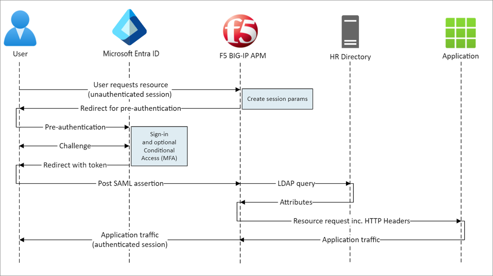
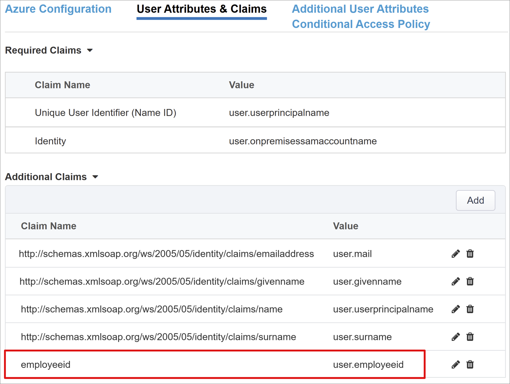
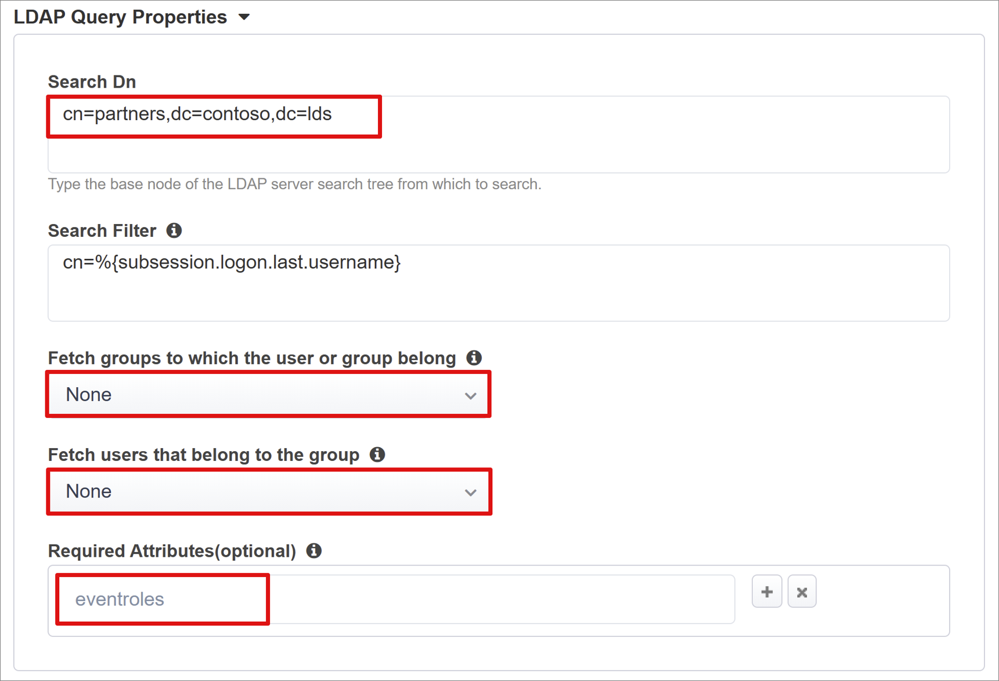
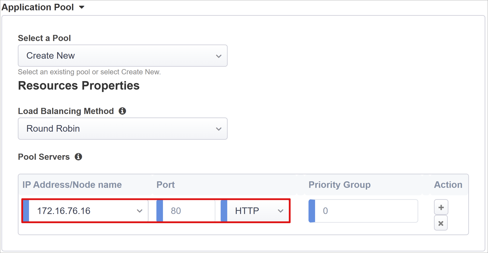

# Tutorial: Configure F5 BIG-IP Easy Button for header-based and LDAP SSO

In this article, you'll learn to implement Secure Hybrid Access (SHA) with single sign-on (SSO) to header-based applications that also require session augmentation through Lightweight Directory Access Protocol (LDAP) sourced attributes using F5’s BIG-IP Easy Button guided configuration.

Enabling BIG-IP published services for Azure Active Directory (Azure AD) SSO provides many benefits, including:

* Improved Zero Trust governance through Azure AD pre-authentication and authorization

* Full SSO between Azure AD and BIG-IP published services

* Manage identities and access from a single control plane, [The Azure portal](https://portal.azure.com/)

To learn about all of the benefits, see the article on [F5 BIG-IP and Azure AD integration](./f5-aad-integration.md) and [what is application access and single sign-on with Azure AD](/azure/active-directory/active-directory-appssoaccess-whatis).

## Scenario description

For this scenario, we have a legacy application using HTTP authorization headers to control access to protected content.

Being legacy, the application lacks any form of modern protocols to support a direct integration with Azure AD. Modernizing the app is also costly, requires careful planning, and introduces risk of potential impact. 

One option would be to consider [Azure AD Application Proxy](https://docs.microsoft.com/en-us/azure/active-directory/app-proxy/application-proxy), to gate remote access to the application.

Another approach is to use an F5 BIG-IP Application Delivery Controller, as it too provides the protocol transitioning required to bridge legacy applications to the modern ID control plane.

Having a BIG-IP in front of the application enables us to overlay the service with Azure AD pre-authentication and header-based SSO, significantly improving the overall security posture of the application for both remote and local access.

## Scenario architecture

The secure hybrid access solution for this scenario is made up of:

**Application:** BIG-IP published service to be protected by Azure AD SHA.

**Azure AD:** Security Assertion Markup Language (SAML) Identity Provider (IdP) responsible for verification of user credentials, Conditional Access (CA), and SSO to the BIG-IP APM. Through SSO, Azure AD provides the BIG-IP with any required session attributes.

**HR system:** Legacy employee database acting as source of truth for fine grained application permissions.

**BIG-IP:** Reverse proxy and SAML service provider (SP) to the application, delegating authentication to the SAML IdP before performing header-based SSO to the backend application.

SHA for this scenario supports both SP and IdP initiated flows. The following image illustrates the SP initiated flow.



| Steps| Description |
| -------- |-------|
| 1| User connects to application’s SAML SP endpoint (BIG-IP APM) |
| 2| APM access policy redirects user to SAML IdP (Azure AD) for pre-authentication |
| 3| Azure AD authenticates user and applies any enforced CA policies |
| 4| User is redirected back to BIG-IP with issued token and claims |
| 5| BIG-IP authenticates user and requests more attributes from HR system |
| 6| BIG-IP injects Azure AD and HR system attributes as headers in request to the application |
| 7| Application authorizes access with enriched session permissions |

## Prerequisites
Prior BIG-IP experience isn't necessary, but you'll need:

- An Azure AD free subscription or above

- An existing BIG-IP or [deploy a BIG-IP Virtual Edition (VE) in
    Azure](./f5-bigip-deployment-guide.md)

- Any of the following F5 BIG-IP license SKUs

  - F5 BIG-IP® Best bundle

  - F5 BIG-IP Access Policy Manager™ (APM) standalone license

  - F5 BIG-IP Access Policy Manager™ (APM) add-on license on an
    existing BIG-IP F5 BIG-IP® Local Traffic Manager™ (LTM)

  - 90-day BIG-IP full feature [trial
    license](https://www.f5.com/trial/big-ip-trial.php).

- User identities [synchronized](../hybrid/how-to-connect-sync-whatis.md) from an on-premises directory to Azure AD

- An account with Azure AD application admin [permissions](/azure/active-directory/users-groups-roles/directory-assign-admin-roles#application-administrator)

- A [SSL certificate](./f5-bigip-deployment-guide.md#ssl-profile) for publishing services over HTTPS, or use default certificates while testing

- An existing header-based application or [setup a simple IIS header app](/previous-versions/iis/6.0-sdk/ms525396(v=vs.90)) for testing

- A user directory that supports LDAP, including Windows Active Directory Lightweight Directory Services (AD LDS), OpenLDAP etc.

## BIG-IP configuration methods

There are many methods to deploy BIG-IP for this scenario including a template-driven Guided Configuration wizard, or the manual advanced configuration. This tutorial covers the Easy Button templates offered by the Guided Configuration 16.1 and upwards.

With the **Easy Button**, admins no longer go back and forth between Azure AD and a BIG-IP to enable services for secure hybrid access. The end-to-end deployment and policy management is handled directly between the APM’s Guided Configuration wizard and Microsoft Graph. This rich integration between BIG-IP APM and Azure AD ensures applications can quickly, easily support identity federation, SSO, and Azure AD Conditional Access, reducing administrative overhead.

For scenarios where the Guided Configuration lacks the flexibility to achieve a particular set of requirements, see the [Advanced deployment](#advanced-deployment) at the end of this tutorial.

>[!NOTE]
>All example strings or values referenced throughout this guide should be replaced with those for your actual environment.

## Register Easy Button

Before a client or service can access Microsoft Graph, it must be trusted by the Microsoft identity platform. 

The Easy Button client must also be registered as a client in Azure AD, before it is allowed to establish a trust relationship between each SAML SP instance of a BIG-IP published applications, and the IdP.

1. Sign-in to the [Azure AD portal](https://portal.azure.com) using an account with Application Administrative rights

2. From the left navigation pane, select the **Azure Active Directory** service

3. Under Manage, select **App registrations > New registration**

4. Enter a display name for your application. For example, *F5 BIG-IP Easy Button*

5. Specify who can use the application > **Accounts in this organizational directory only**

6. Select **Register** to complete the initial app registration

7. Navigate to **API permissions** and authorize the following Microsoft Graph permissions:

   * Application.Read.All

   * Application.ReadWrite.All

    * Application.ReadWrite.OwnedBy

    * Directory.Read.All

    * Group.Read.All

     * IdentityRiskyUser.Read.All

     * Policy.Read.All

     * Policy.ReadWrite.ApplicationConfiguration

   * Policy.ReadWrite.ConditionalAccess

   * User.Read.All

8. Grant admin consent for your organization 

9. In the **Certificates & Secrets** blade, generate a new **client secret** and note it down 

10. From the **Overview** blade, note the **Client ID** and **Tenant ID**

## Configure Easy Button

Next, step through the Easy Button configurations to federate and publish the EBS application. Start by provisioning your BIG-IP with an X509 certificate that Azure AD can use to sign SAML tokens and claims issued for SHA enabled services.

1. From a browser, sign-in to the F5 BIG-IP management console
2. Navigate to **System > Certificate Management > Traffic Certificate Management  SSL Certificate List > Import**
3. Select **PKCS 12 (IIS)** and import your certificate along with its private key
   
    Once provisioned, the certificate can be used for every application published through Easy Button. You can also choose to upload a separate certificate for individual applications.

    

4. Navigate to **Access > Guided Configuration > Microsoft Integration** and select  **Azure AD Application**
   
   You can now access the Easy Button functionality that provides quick configuration steps to set up the APM as a SAML Service Provider (SP) and Azure AD as an Identity Provider (IdP) for your application.

    

5. Review the list of configuration steps and select **Next**

    

## Configuration steps

The **Easy Button** template will display the sequence of steps required to publish your application.


### Configuration Properties

These are general and service account properties. The **Configuration Properties tab** creates up a new application config and SSO object that will be managed through the BIG-IP’s Guided Configuration UI. The configuration can then be reused for publishing more applications through the Easy Button template.

Consider the **Azure Service Account Details** be the BIG-IP client application you registered in your Azure AD tenant earlier. This section allows the BIG-IP to programmatically register a SAML application directly in your tenant, along with the other properties you would normally configure manually, in the portal. Easy Button will do this for every BIG-IP APM service being published and enabled for secure hybrid access. 

Some of these are global settings that can be reused for publishing more applications, further reducing deployment time and effort.

1. Enter **Configuration Name**. A unique name that enables an admin to easily distinguish between Easy Button configurations for published applications 

2. Enable **Single Sign-On (SSO) & HTTP Headers**

3. Enter the **Tenant Id**, **Client ID**, and **Client Secret** from your registered application
4. Confirm the BIG-IP can successfully connect to your tenant, and then select **Next**


### Service Provider

The Service Provider settings define the SAML SP properties for the APM instance representing the application protected through secure hybrid access. 

1. Enter **Host**. This is the public FQDN of the application being secured. You’ll need a corresponding DNS record for clients to resolve this address, but using a localhost record is fine during testing

2. Enter **Entity ID**. This is the identifier Azure AD will use to identify the SAML SP requesting a token

     

    Next, under security settings, enter information for Azure AD to encrypt issued SAML assertions. Encrypting assertions between Azure AD and the BIG-IP APM provides additional assurance that the content tokens can't be intercepted, and personal or corporate data be compromised.

3. Check **Enable Encrypted Assertion (Optional)**. Enable to request Azure AD to encrypt SAML assertions

4. Select **Assertion Decryption Private Key**. The private key for the certificate that BIG-IP APM will use to decrypt Azure AD assertions

5. Select **Assertion Decryption Certificate**. This is the certificate that BIG-IP will upload to Azure AD for encrypting the issued SAML assertions. This can be the certificate you provisioned earlier

    

### Azure Active Directory

This section defines all properties that you would normally use to manually configure a new BIG-IP SAML application within your Azure AD tenant. 

The Easy Button wizard provides a set of pre-defined application templates for Oracle PeopleSoft, Oracle E-business Suite, Oracle JD Edwards, SAP ERP, but we’ll use the generic secure hybrid access template by selecting **F5 BIG-IP APM Azure AD Integration > Add**.


#### Azure Configuration

1. Enter **Display Name** of app that the BIG-IP creates in your Azure AD tenant, and the icon that the users will see on [MyApps portal](https://myapplications.microsoft.com/)

2. Do not enter anything in the **Sign On URL (optional)** to enable IdP initiated sign-on

    

3. Select **Signing key**. The IdP SAML signing certificate you provisioned earlier 

4. Select the same certificate for **Singing Certificate**

5. Enter the certificate’s password in **Passphrase**

6. Select **Signing Options**. It can be enabled optionally to ensure the BIG-IP only accepts tokens and claims that have been signed by your Azure AD tenant

    

7. **User and User Groups** are dynamically queried from your Azure AD tenant and used to authorize access to the application. **Add** a user or group that you can use later for testing, otherwise all access will be denied

    

#### User Attributes & Claims

When a user successfully authenticates, Azure AD issues a SAML token with a default set of claims and attributes uniquely identifying the user. The **User Attributes & Claims tab** shows the default claims to issue for the new application. It also lets you configure more claims.

For this example, you can include one more attribute:

1. Enter **Header Name** as *employeeid*

2. Enter **Source Attribute** as *user.employeeid*




#### Additional User Attributes

In the **Additional User Attributes tab**, you can enable session augmentation required by various distributed systems such as Oracle, SAP, and other JAVA based implementations requiring attributes stored in other directories. Attributes fetched from an LDAP source can then be injected as additional SSO headers to further control access based on roles, Partner IDs, etc.

1. Enable the **Advanced Settings** option

2. Check the **LDAP Attributes** check box
    
3. Choose **Create New** in Choose Authentication Server

4. Depending on your setup, select either **Use pool** or **Direct** Server Connection mode to provide the **Server Address** of the target LDAP service. If using a single LDAP server, choose *Direct*

5. Enter **Service Port** as 389, 636 (Secure), or any other port your LDAP service uses

6. Enter the **Base Search DN** to the exact distinguished name of the location containing the account the APM will authenticate with for LDAP service queries

    

7. Set the **Base Search DN** to the exact distinguished name of the location containing the user account objects that the APM will query via LDAP

8. Set both membership options to **None** and add the name of the user object attribute that must be returned from the LDAP directory. For our scenario, this is **eventroles** 

    

#### Conditional Access Policy

You can further protect the published application with policies returned from your Azure AD tenant. These policies are enforced after the first-factor authentication has been completed and uses signals from conditions like device platform, location, user or group membership, or application to determine access.

The **Available Policies** list, by default, displays a list of policies that target selected apps. 

The **Selected Policies** list, by default, displays all policies targeting All cloud apps. These policies cannot be deselected or moved to the Available Policies list. They are included by default but can be excluded if necessary. 

To select a policy to be applied to the application being published:

1. Select the desired policy in the **Available Policies** list

2. Select the right arrow and move it to the **Selected Policies** list

Selected policies should either have an **Include** or **Exclude** option checked. If both options are checked, the selected policy is not enforced. **Exclude** all policies while testing.  You can go back and enable them later.

  

>[!NOTE]
>The policy list is enumerated only once when first switching to this tab. A refresh button is available to manually force the wizard to query your tenant, but this button is displayed only when the application has been deployed.

### Virtual Server Properties

A virtual server is a BIG-IP data plane object represented by a virtual IP address listening for clients requests to the application. Any received traffic is processed and evaluated against the APM profile associated with the virtual server, before being directed according to the policy results and settings.

1. Enter **Destination Address**. This is any available IPv4/IPv6 address that the BIG-IP can use to receive client traffic

2. Enter **Service Port** as *443* for HTTPS

3. Check **Enable Redirect Port** and then enter **Redirect Port**. It redirects incoming HTTP client traffic to HTTPS

4. Select **Client SSL Profile** to enable the virtual server for HTTPS so that client connections are encrypted over TLS. Select the client SSL profile you created as part of the prerequisites or leave the default if testing

    

### Pool Properties

The **Application Pool tab** details the services behind a BIG-IP that are represented as a pool, containing one or more application servers.

1. Choose from **Select a Pool**. Create a new pool or select an existing one

2. Choose the **Load Balancing Method** as *Round Robin*

3. Update **Pool Servers**. Select an existing node or specify an IP and port for the server hosting the header-based application

    

Our backend application sits on HTTP port 80 but obviously switch to 443 if yours is HTTPS.

#### Single Sign-On & HTTP Headers

Enabling SSO allows users to access BIG-IP published services without having to enter credentials. The **Easy Button wizard** supports Kerberos, OAuth Bearer, and HTTP authorization headers for SSO, the latter of which we’ll enable to configure the following.

* **Header Operation:** Insert

* **Header Name:** upn

* **Header Value:** %{session.saml.last.identity}

* **Header Operation:** Insert

* **Header Name:** employeeid

* **Header Value:** %{session.saml.last.attr.name.employeeid}

 
* **Header Operation:** Insert

* **Header Name:** eventroles

* **Header Value:** %{session.ldap.last.attr.eventroles}


>[!NOTE]
>APM session variables defined within curly brackets are CASE sensitive. If you enter EventRoles when the Azure AD attribute name is being defined as eventroles, it will cause an attribute mapping failure.

### Session Management

The BIG-IPs session management settings are used to define the conditions under which user sessions are terminated or allowed to continue, limits for users and IP addresses, and error pages. Consult [F5 documentation](https://support.f5.com/csp/article/K18390492) for details on these settings.

What isn’t covered there however is Single Log-Out (SLO) functionality, which ensures all sessions between the IdP, the BIG-IP, and the client are terminated after a user has logged out.

When the Easy Button wizard deploys a SAML application to Azure AD, it also populates the Logout Url with the APM’s SLO endpoint. That way IdP initiated sign-outs from the MyApps portal also terminate the session between the BIG-IP and a client.

During deployment, the SAML applications federation metadata is also imported, providing the APM the SAML logout endpoint for Azure AD. This helps SP initiated sign-outs also terminate the session between a client and Azure AD. But for this to be truly effective, the APM needs to know exactly when a user signs-out.

Consider a scenario where the BIG-IP web portal isn’t used, the user has no way of instructing the APM to sign out. Even if the user signs-out of the application itself, the BIG-IP is technically oblivious to this, so the application session could easily be reinstated through SSO. For this reason, SP initiated sign-out needs careful consideration to ensure sessions are securely terminated when no longer required. One way of achieving this would be to add an SLO function to your applications sign out button, so that it can redirect your client to the Azure AD SAML sign-out endpoint. The SAML sign-out endpoint for your tenant can be found in **App Registrations > Endpoints**.

If making a change to the app is a no go, then consider having the BIG-IP listen for the apps sign-out call, and upon detecting the request have it trigger SLO. More details on using BIG-IP iRules to achieve this is available in the F5 knowledge article [Configuring automatic session termination (logout) based on a URI-referenced file name](https://support.f5.com/csp/article/K42052145) and [Overview of the Logout URI Include option](https://support.f5.com/csp/article/K12056).

## Summary

Select **Deploy** to commit all settings and verify that the application has appeared in your tenant. This last step provides break down of all applied settings before they’re committed.

Your application should now be published and accessible via SHA, either directly via its URL or through Microsoft’s application portals. For increased security, organizations using this pattern could also consider blocking all direct access to the application, thereby forcing a strict path through the BIG-IP.

## Next steps

From a browser, **connect** to the application’s external URL or select the **application’s icon** in the MyApps portal. After authenticating against Azure AD, you’ll be redirected to the BIG-IP virtual server for the application and automatically signed in through SSO.

This shows the output of the injected headers displayed by our headers-based application.


For increased security, organizations using this pattern could also consider blocking all direct access to the application, thereby forcing a strict path through the BIG-IP.

## Advanced deployment

There may be cases where the Guided Configuration templates lack the flexibility to achieve a particular set of requirements. Or even a need to fast track a proof of concept. For those scenarios, the BIG-IP offers the ability to disable the Guided Configuration’s strict management mode. That way the bulk of your configurations can be deployed through the wizard-based templates, and any tweaks or additional settings applied manually.

For those scenarios, go ahead and deploy using the Guided Configuration. Then navigate to **Access > Guided Configuration** and select the small padlock icon on the far right of the row for your applications’ configs. At that point, changes via the wizard UI are no longer possible, but all BIG-IP objects associated with the published instance of the application will be unlocked for direct management.

>[!NOTE]
>Re-enabling strict mode and deploying a configuration will overwrite any settings performed outside of the Guided Configuration UI, therefore we recommend the manual approach for production services.

## Troubleshooting

You can fail to access the secure hybrid access protected application due to any number of factors, including a misconfiguration.

BIG-IP logs are a great source of information for isolating all sorts of authentication & SSO issues. When troubleshooting you should increase the log verbosity level.

1. Navigate to **Access Policy > Overview > Event Logs > Settings**

2. Select the row for your published application then **Edit > Access System Logs**

3. Select **Debug** from the SSO list then **OK**

Reproduce your issue before looking at the logs but remember to switch this back when finished. If you see a BIG-IP branded error immediately after successful Azure AD pre-authentication, it’s possible the issue relates to SSO from Azure AD to the BIG-IP.

1. Navigate to **Access > Overview > Access reports**
2. Run the report for the last hour to see logs provide any clues. The **View session** variables link for your session will also help understand if the APM is receiving the expected claims from Azure AD

If you don’t see a BIG-IP error page, then the issue is probably more related to the backend request or SSO from the BIG-IP to the application.

1. In which case you should head to **Access Policy > Overview > Active Sessions** and select the link for your active session

2. The **View Variables** link in this location may also help root cause SSO issues, particularly if the BIG-IP APM fails to obtain the right attributes

3. The following command from a bash shell validates the APM service account used for LDAP queries and can successfully authenticate and query a user object:

 ```ldapsearch -xLLL -H 'ldap://192.168.0.58' -b "CN=partners,dc=contoso,dc=lds" -s sub -D "CN=f5-apm,CN=partners,DC=contoso,DC=lds" -w 'P@55w0rd!' "(cn=testuser)" ```

For more information, visit this F5 knowledge article [Configuring LDAP remote authentication for Active Directory](https://support.f5.com/csp/article/K11072). There’s also a great BIG-IP reference table to help diagnose LDAP-related issues in this F5 knowledge article on [LDAP Query](https://techdocs.f5.com/kb/en-us/products/big-ip_apm/manuals/product/apm-authentication-single-sign-on-11-5-0/5.html).

 
## Additional resources

* [The end of passwords, go password-less](https://www.microsoft.com/security/business/identity/passwordless)

* [What is Conditional Access?](../conditional-access/overview.md)

* [Microsoft Zero Trust framework to enable remote work](https://www.microsoft.com/security/blog/2020/04/02/announcing-microsoft-zero-trust-assessment-tool/)
